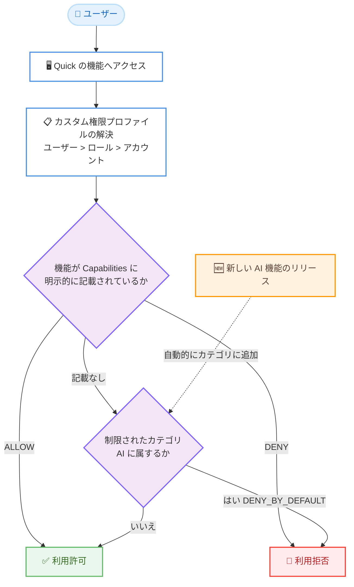

# Amazon Quick - カスタム権限のデフォルト拒否 (Deny by Default)

**リリース日**: 2026 年 8 月 12 日
**サービス**: Amazon Quick
**機能**: カスタム権限プロファイルにおけるデフォルト拒否 (Deny by Default)

📊 [このアップデートのインフォグラフィックを見る](https://takech9203.github.io/aws-news-summary/20260812-amazon-quick-deny-by-default-permissions.html)

## 概要

Amazon Quick のカスタム権限 (Custom Permissions) に、新しいガバナンス設定「デフォルト拒否 (Deny by Default)」が追加されました。この設定を有効にすると、新しい AI 機能がユーザーに届く前に自動的に制限されるようになります。管理者はカスタム権限プロファイルで AI 機能カテゴリを制限し、そのプロファイルをユーザー、ロール、またはアカウント全体に割り当てることで、Quick が今後リリースするあらゆる新しい AI 機能をリリース初日から自動的に拒否できます。

カテゴリを制限すると、そのカテゴリに既に存在する機能も制限されます。管理者は評価が完了した機能を明示的に許可することで、承認済みの機能のみをユーザーに提供できます。制限は設定したプロファイルにのみ適用され、既存の他のプロファイルには影響しません。

この機能は、金融サービスにおけるモデルリスク管理 (MRM) ポリシーや、ヘルスケアにおけるコンプライアンス評価など、新機能の採用前に明示的な承認プロセスを必要とする規制産業の組織を主な対象としています。設定は Amazon Quick の「Manage account」画面または AWS CLI から行えます。

**アップデート前の課題**

- 以前は、Amazon Quick が新しい AI 機能をリリースすると、リリースと同時にすべてのユーザーが利用可能になっていた
- 管理者はリリース後に事後対応として各機能を手動で制限する必要があり、リリースのたびに対応作業が発生していた
- 規制の厳しい環境では、管理者が評価を完了する前に未承認の AI 機能がユーザーに公開されるリスクがあった

**アップデート後の改善**

- 制限されたカテゴリに属する新しい AI 機能は、リリース当日から管理者の操作なしで自動的に拒否されるようになった
- 管理者は各機能を評価したうえで、準備が整った時点で明示的に許可する「承認ベース」の運用が可能になった
- カテゴリ単位の制御により、将来リリースされる未知の機能も含めて包括的なガバナンスを適用できるようになった

## アーキテクチャ図



デフォルト拒否が有効なプロファイルにおける機能評価フローを示しています。明示的に ALLOW された機能のみが利用可能となり、新しくリリースされた AI 機能は自動的に制限カテゴリに含まれるため、管理者の操作なしで拒否されます。

## サービスアップデートの詳細

### 主要機能

1. **カテゴリ単位のデフォルト拒否 (DENY_BY_DEFAULT)**
   - カスタム権限プロファイル内で機能カテゴリ (リリース時点では `AI` カテゴリ) に `DENY_BY_DEFAULT` を設定できる
   - 設定すると、そのカテゴリに属するすべての機能 (現在および将来の機能) が、明示的に許可されない限り拒否される
   - カテゴリの制限は、既存の機能にも適用される (制限前に利用可能だった機能も拒否対象になる)

2. **将来の新機能の自動制限**
   - Quick が制限カテゴリに新しい機能をリリースした場合、そのプロファイルが割り当てられたユーザーに対してリリース当日から自動的に拒否される
   - 機能へのアクセスのたびにカテゴリ所属に基づいて評価されるため、後から追加された機能も自動的にカバーされる
   - 管理者側でリリース時の対応作業は不要

3. **明示的な許可による段階的な開放**
   - 評価が完了した機能は、プロファイルの Capabilities に `ALLOW` として明示的に記載することで、その機能のみを許可できる
   - 同じカテゴリの他の機能は、個別に `ALLOW` を設定しない限り引き続き拒否される

4. **柔軟な割り当てスコープと優先順位**
   - プロファイルはユーザー、ロール、アカウントの 3 つのレベルで割り当て可能
   - 優先順位は「ユーザー > ロール > アカウント」で、最も具体的なレベルの設定が優先される
   - 制限は設定したプロファイルにのみ適用され、既存の他のプロファイルには継承されない

### 評価ルール

デフォルト拒否が有効な場合、機能へのアクセスは以下の順序で評価されます。

1. 機能が `DENY_BY_DEFAULT` の制限カテゴリに属し、Capabilities に記載されていない場合: **拒否** (本機能の主要な効果)
2. 機能が Capabilities に `ALLOW` として明示的に記載されている場合: **許可** (その機能のみカテゴリのデフォルトを上書き)
3. 機能が Capabilities に `DENY` として明示的に記載されている場合: **拒否**
4. 機能が記載されておらず、制限カテゴリにも属さない場合: **許可** (従来のデフォルト許可の動作は変更なし)

## 技術仕様

### 主要な概念

| 項目 | 詳細 |
|------|------|
| カスタム権限プロファイル | 制限する機能を定義する名前付き設定オブジェクト。ユーザー、ロール、アカウントレベルで割り当て可能 |
| 機能カテゴリ | デフォルト拒否の制御単位となる機能のグループ。リリース時点では `AI` カテゴリをサポート |
| `AI` カテゴリの対象 | チャットエージェント、フロー、スペース、ナレッジベース、アプリの AI 推論、Q 分析、Quick デスクトップの AI 機能など、すべての AI / LLM 搭載機能 |
| DefaultCategoryEffects | デフォルト拒否の動作をカテゴリごとに指定する API フィールド。省略時はデフォルト許可 |
| 優先順位 | ユーザー > ロール > アカウント (最も具体的なレベルが優先) |
| カテゴリのタグモデル | カテゴリはタグとしてモデル化され、1 つの機能が複数のカテゴリタグを持つ場合は最も制限の厳しい設定が適用される |

### 必要な IAM 権限

管理者には `quicksight:CreateCustomPermissions`、`quicksight:UpdateCustomPermissions`、`quicksight:DescribeCustomPermissions`、`quicksight:ListCustomPermissions`、`quicksight:DeleteCustomPermissions` に加え、アカウント / ロール / ユーザーレベルの割り当て操作 (`quicksight:UpdateAccountCustomPermission`、`quicksight:UpdateRoleCustomPermission`、`quicksight:UpdateUserCustomPermission` など) の権限が必要です。

**注意**: API 操作は Amazon QuickSight の命名規則を使用し、権限文字列には `quicksight:` プレフィックスが付きます。

### API変更履歴

| 日付 | サービス | 変更内容 |
|------|----------|----------|
| 2026/08/12 | [Amazon QuickSight](https://awsapichanges.com/archive/changes/144a68-quicksight.html) | 16 new 4 updated api methods - 同日の Quick ガバナンス関連アップデート (Microsoft Purview 連携の DLP 設定、承認ワークフロー、リミット管理の API 追加) |

デフォルト拒否自体は、既存の `CreateCustomPermissions` / `UpdateCustomPermissions` API に追加された `Governance` フィールド (`DefaultCategoryEffects`) で設定します。

### 設定例 (Governance フィールド)

```json
{
    "CustomPermissions": {
        "CustomPermissionsName": "RestrictAI-Finance",
        "Capabilities": {
            "Research": "ALLOW",
            "Topic": "ALLOW",
            "KnowledgeBase": "ALLOW",
            "Space": "ALLOW"
        },
        "Governance": {
            "DefaultCategoryEffects": {
                "AI": "DENY_BY_DEFAULT"
            }
        }
    }
}
```

## 設定方法

### 前提条件

1. Quick 管理者であり、上記の IAM 権限を保有していること
2. Quick アカウントが IAM Identity Center、Active Directory、または Quick マネージドユーザーで構成されていること
3. 本番適用前に、開発またはステージングアカウントでデフォルト拒否の動作を検証すること (公式ドキュメントで推奨)

### 手順

#### ステップ1: コンソールでカスタム権限設定を開く

1. Quick コンソールを開き、[Manage Quick] を選択する
2. 左側のナビゲーションで [Permissions] → [Custom permissions] を選択する
3. [Create profile] で新規プロファイルを作成するか、既存プロファイルのアクションメニューから [Edit] を選択する

#### ステップ2: カテゴリ制限を設定する

1. [Restrict capabilities] セクションで、制限したいカテゴリのトグル (例: [Restrict AI capabilities]) をオンにする
2. [Capabilities & features] セクションで、ユーザーに利用させたい機能を明示的に許可する
3. 右側のライブプレビューパネルで設定内容が意図どおりであることを確認し、[Create] または [Update] で保存する

トグルをオンにすると、そのカテゴリのデフォルト拒否が有効になり、明示的に許可されていない機能はすべて自動的に拒否されます。

#### ステップ3: AWS CLI で設定する場合

```bash
# AI カテゴリをデフォルト拒否とし、ChatAgent のみ明示的に許可するプロファイルを作成
aws quicksight create-custom-permissions \
  --aws-account-id 123456789012 \
  --custom-permissions-name "RestrictAI-Finance" \
  --capabilities '{"ChatAgent": "ALLOW"}' \
  --governance '{"DefaultCategoryEffects": {"AI": "DENY_BY_DEFAULT"}}'
```

`--governance` オプションで `AI` カテゴリに `DENY_BY_DEFAULT` を設定したカスタム権限プロファイルを作成しています。`--capabilities` で明示的に `ALLOW` を指定した ChatAgent のみが利用可能になります。

```bash
# プロファイルをアカウント全体に割り当て
aws quicksight update-account-custom-permission \
  --aws-account-id 123456789012 \
  --custom-permissions-name "RestrictAI-Finance"
```

作成したプロファイルをアカウントレベルに割り当て、すべてのユーザーに適用しています。特定のロールやユーザーには `update-role-custom-permission` / `update-user-custom-permission` を使用します。

#### ステップ4: 新機能を評価後に許可する

```bash
# 全置換のため、既存の許可リストに新機能を追加して更新
aws quicksight update-custom-permissions \
  --aws-account-id 123456789012 \
  --custom-permissions-name "RestrictAI-Finance" \
  --capabilities '{"ChatAgent": "ALLOW", "NewAIFeature": "ALLOW"}' \
  --governance '{"DefaultCategoryEffects": {"AI": "DENY_BY_DEFAULT"}}'
```

新しくリリースされた機能の評価が完了した後、許可リストに追加しています。`UpdateCustomPermissions` は**全置換**で動作するため、差分ではなく既存の `--capabilities` と `--governance` の値をすべて含めて送信する必要があります。

## メリット

### ビジネス面

- **コンプライアンス対応の強化**: 金融の MRM ポリシーやヘルスケアの規制要件など、新機能の採用前にレビューを義務付ける組織のガバナンス要件を満たせる
- **リスクの事前遮断**: 未評価の AI 機能がユーザーに公開されるリスクを、リリース初日から自動的に排除できる
- **段階的なロールアウト**: 新機能を段階的に導入する管理されたロールアウト戦略を実現できる

### 技術面

- **運用負荷の削減**: リリースのたびに発生していた事後的な制限作業が不要になり、管理者はリアクティブな対応から解放される
- **将来の機能も自動カバー**: カテゴリ単位の制御により、まだ存在しない将来の機能も含めて包括的に制御できる
- **きめ細かな適用範囲**: ユーザー / ロール / アカウントの 3 レベルの優先順位を利用し、データサイエンティストにはフルアクセス、一般ユーザーには制限、といった柔軟な設計が可能

## デメリット・制約事項

### 制限事項

- リリース時点でサポートされるカテゴリは `AI` (AI / LLM 搭載機能全般) のみ
- カテゴリを制限すると、そのカテゴリの**既存機能もすべて制限される**。既存プロファイルに有効化した場合、以前許可していた機能も拒否されるため、必要な機能を許可リストに再登録する必要がある
- `UpdateCustomPermissions` は全置換のため、更新時に省略した機能や設定はプロファイルから削除される

### 考慮すべき点

- ユーザーレベルやロールレベルのプロファイルはアカウントレベルの設定を上書きするため、デフォルト許可のプロファイルがユーザーレベルに割り当てられていると、アカウントレベルのデフォルト拒否は適用されない。割り当てレベルの設計に注意が必要
- 公式ドキュメントは、本番ユーザーに適用する前に開発 / ステージングアカウントで動作検証することを強く推奨している
- `DescribeCustomPermissions` は、デフォルト拒否設定のあるプロファイルでのみ `Governance` フィールドを返す

## ユースケース

### ユースケース1: 金融機関におけるモデルリスク管理

**シナリオ**: MRM ポリシーにより、すべての AI 機能について採用前のリスク評価が義務付けられている金融機関。評価済みの機能のみをアナリストに提供したい。

**実装例**:
```bash
aws quicksight create-custom-permissions \
  --aws-account-id 123456789012 \
  --custom-permissions-name "MRM-ApprovedAI" \
  --capabilities '{"Research": "ALLOW", "Topic": "ALLOW", "KnowledgeBase": "ALLOW", "Space": "ALLOW"}' \
  --governance '{"DefaultCategoryEffects": {"AI": "DENY_BY_DEFAULT"}}'
```

**効果**: 評価委員会が承認した 4 つの機能のみが利用可能になり、Quick が今後リリースする AI 機能はすべて自動的に拒否される。リリースのたびの緊急対応が不要になり、MRM プロセスに沿った統制された導入が可能になる。

### ユースケース2: 新規アカウントの初期ロックダウン

**シナリオ**: 新しく Quick アカウントをオンボーディングする企業。セキュリティチームが各 AI 機能を個別に評価するまで、すべての AI 機能を制限したい。

**実装例**:
```bash
# 明示的な許可なしで AI カテゴリ全体をデフォルト拒否
aws quicksight create-custom-permissions \
  --aws-account-id 123456789012 \
  --custom-permissions-name "DenyAllAI-NewAccount" \
  --governance '{"DefaultCategoryEffects": {"AI": "DENY_BY_DEFAULT"}}'

# アカウントレベルで全ユーザーに適用
aws quicksight update-account-custom-permission \
  --aws-account-id 123456789012 \
  --custom-permissions-name "DenyAllAI-NewAccount"
```

**効果**: 初日からすべての AI 機能が全ユーザーに対して拒否される。評価と承認が完了した機能から順次、許可リストに追加して段階的に開放できる。

### ユースケース3: 役割に応じた多段階のアクセス制御

**シナリオ**: 一般ユーザーは AI 機能を全面制限、Author ロールには承認済みの一部機能を許可、特定のデータサイエンティストにはフルアクセスを付与したい企業。

**実装例**:
```bash
# アカウントレベル: AI 全拒否
aws quicksight update-account-custom-permission \
  --aws-account-id 123456789012 \
  --custom-permissions-name "Account-DenyAllAI"

# ロールレベル: Author に一部許可
aws quicksight update-role-custom-permission \
  --role AUTHOR --namespace default \
  --aws-account-id 123456789012 \
  --custom-permissions-name "Author-LimitedAI"

# ユーザーレベル: データサイエンティストは制限なしプロファイル
aws quicksight update-user-custom-permission \
  --aws-account-id 123456789012 --namespace default \
  --user-name datascientist01 \
  --custom-permissions-name "DataScientist-FullAccess"
```

**効果**: 優先順位 (ユーザー > ロール > アカウント) により、大多数のユーザーは全面制限、Author は承認済み機能のみ、データサイエンティストは制限なし、という多段階のガバナンスを 1 つの仕組みで実現できる。

## 料金

デフォルト拒否の設定自体に追加料金はありません。Amazon Quick の利用料金は既存の料金体系 (ユーザーロールおよび利用機能に基づく料金) に従います。詳細は [Amazon Quick 料金ページ](https://aws.amazon.com/quicksight/pricing/) を参照してください。

## 利用可能リージョン

Amazon Quick が利用可能なすべての AWS リージョンで利用できます。対象リージョンの一覧は [Amazon Quick のリージョンドキュメント](https://docs.aws.amazon.com/quick/latest/userguide/regions.html) を参照してください。

## 関連サービス・機能

- **Amazon Quick カスタム権限 (Custom Permissions)**: 本機能の基盤となる権限管理機能。従来の明示的な ALLOW / DENY 指定に加えて、カテゴリ単位のデフォルト拒否が追加された
- **AWS IAM Identity Center / Active Directory**: Quick のユーザー管理の前提となる ID 基盤。プロファイルの割り当て対象となるユーザーやロールを管理する
- **Amazon Quick の DLP・承認ワークフロー**: 同日に API が追加された Microsoft Purview 連携の DLP 設定や資産共有の承認ワークフローなど、Quick のエンタープライズガバナンス機能群と組み合わせて利用できる

## 参考リンク

- 📊 [インフォグラフィック](https://takech9203.github.io/aws-news-summary/20260812-amazon-quick-deny-by-default-permissions.html)
- [公式発表 (What's New)](https://aws.amazon.com/whats-new/2026/08/amazon-quick-deny-by-default-permissions/)
- [ドキュメント: Custom permissions deny by default](https://docs.aws.amazon.com/quick/latest/userguide/custom-permissions-governance.html)
- [ドキュメント: Amazon Quick 利用可能リージョン](https://docs.aws.amazon.com/quick/latest/userguide/regions.html)
- [料金ページ](https://aws.amazon.com/quicksight/pricing/)

## まとめ

Amazon Quick のデフォルト拒否は、新しい AI 機能を「リリース即公開」から「評価してから公開」へと転換する、規制産業にとって重要なガバナンス機能です。金融、ヘルスケアなど新機能の事前承認が必須の組織は、まず開発環境でプロファイルの動作を検証したうえで、アカウントレベルでのデフォルト拒否と承認済み機能の許可リスト運用への移行を検討することを推奨します。
