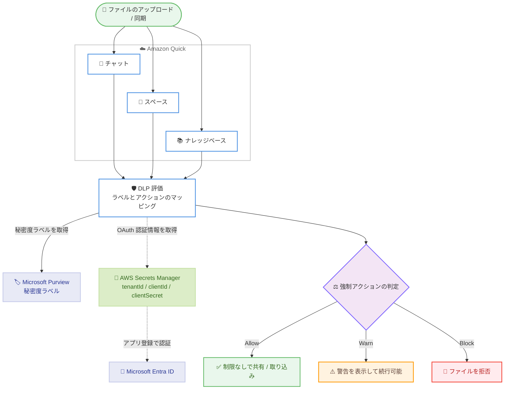

# Amazon Quick - Microsoft Purview 連携によるデータ損失防止 DLP

**リリース日**: 2026 年 8 月 12 日
**サービス**: Amazon Quick
**機能**: Microsoft Purview と連携したデータ損失防止 (Data Loss Prevention、DLP)

📊 [このアップデートのインフォグラフィックを見る](https://takech9203.github.io/aws-news-summary/20260812-amazon-quick-dlp-purview.html)

## 概要

Amazon Quick が Microsoft Purview と統合され、組織のデータ損失防止 (DLP) ポリシーを Quick 環境全体に適用できるようになりました。Microsoft Purview テナントを接続すると、Quick はチャット、スペース、ナレッジベースで共有される機密ファイルを Purview の秘密度ラベル (Sensitivity Labels) に基づいて分類・保護します。組織にとって「機密ファイルが承認されていないチャネルの外に共有されない」ことを保証する仕組みが、追加ツールなしで実現できます。

管理者は秘密度ラベルごとに強制アクション (Block: ブロック、Warn: 警告、Allow: 許可) を設定でき、機密ファイルの共有をきめ細かく制御できます。例えば金融サービス企業では、「Highly Confidential」ラベルの付いたファイルは共有スペースへのアップロードをブロックし、「Internal」ラベルのファイルは警告通知を表示したうえで許可する、といった運用が可能です。

主な対象は、Microsoft 365 / Purview で情報ガバナンスを運用しており、Amazon Quick のエージェント機能 (チャット、スペース、ナレッジベース) を利用する組織の IT 管理者およびセキュリティチームです。既存の Purview ガバナンスポリシーをそのまま Quick に拡張できる点が最大の価値です。

**アップデート前の課題**

- 以前は、Microsoft Purview で定義した秘密度ラベルによる DLP ポリシーを Amazon Quick 内のファイル共有に適用する手段がなかった
- 機密ラベル付きファイルがチャットやスペース、ナレッジベース同期を通じて意図しない範囲に共有・取り込みされるリスクを、Quick 側で自動的に防止できなかった
- Quick 向けに別のガバナンスツールや手動レビュープロセスを用意する必要があった

**アップデート後の改善**

- 既存の Purview 秘密度ラベルをそのまま利用し、Quick のチャット、スペース、ナレッジベースでのファイル取り扱いを自動制御できるようになった
- ラベルごとに Block / Warn / Allow の強制アクションを設定でき、未マッピングのラベルや無ラベルファイルにはデフォルトアクションが適用されるため、保護の漏れがなくなった
- Purview が一時的に到達不能な場合の動作 (プロバイダー停止時アクション) も指定でき、フェイルクローズ運用が可能になった

## アーキテクチャ図



ファイルが保護対象の Quick 機能に入ると、Quick が Microsoft Purview から秘密度ラベルを取得し、DLP 設定のラベルマッピングに従って Allow / Warn / Block のいずれかのアクションを適用するフローを示しています。Purview への認証情報は AWS Secrets Manager に保存され、Quick は実行時にのみ読み取ります。

## サービスアップデートの詳細

### 主要機能

1. **秘密度ラベルに基づく強制アクション**
   - Microsoft Purview で定義・公開済みの秘密度ラベル (例: Public、Confidential、Highly Confidential) を Quick がテナントからライブで読み取る
   - ラベルごとに Block (ファイルを拒否)、Warn (警告を表示して続行可能)、Allow (制限なし) のいずれかをマッピングできる
   - 親ラベルと子ラベル (サブラベル) の階層に対応し、明示的に上書きしない限りサブラベルは親ラベルのアクションを継承する

2. **3 つの適用対象機能 (Capabilities)**
   - **スペース**: ユーザーがコラボレーションワークスペースにアップロードするファイル
   - **チャット**: チャット会話を通じて共有されるファイル
   - **ナレッジベース**: SharePoint、OneDrive などのコネクタ経由で同期されるコンテンツ
   - 設定ごとに適用対象の機能を選択でき、別の設定が既に適用している機能は選択できない (機能ごとに 1 設定)

3. **デフォルトアクションによる保護の網羅**
   - 明示的にマッピングしていないラベル、ラベルのないファイル、サポート外のファイル形式にはデフォルトアクションが適用される
   - Purview 側でセットアップ後に新しく公開されたラベルも即座にデフォルトアクションでカバーされるため、保護の空白期間が発生しない

4. **プロバイダー停止時アクション (Provider Outage Action)**
   - Microsoft Purview が一時的に到達不能な場合の動作を Block (フェイルクローズ)、Warn、Allow (フェイルオープン) から選択できる
   - 機密データを扱うナレッジベースでは Block が推奨されている

5. **テスト機能と可観測性**
   - ダッシュボードのテスト (ファイルスキャン) アイコンから、ラベル付きファイルの Amazon S3 URI (例: `s3://bucket/key`) を指定してドライランを実行し、期待どおりのアクションが返るか本番適用前に確認できる
   - ナレッジベース同期での DLP 判定結果は Quick Observability レポートで確認できる (BLOCKED / ADDED / MODIFIED)

### 強制アクションの動作 (機能別)

| アクション | チャット / スペース (対話型) | ナレッジベース (バックグラウンド同期) |
|------------|------------------------------|----------------------------------------|
| Block | ファイルが拒否され、エラーメッセージが表示される | ファイルはインデックスに取り込まれず、Observability レポートに BLOCKED と記録される |
| Warn | 警告が表示され、続行またはキャンセルを選択できる | 警告プロンプトはなく、ファイルは取り込まれる (ユーザーが待機しないため) |
| Allow | 制限なしで共有される | 通常どおり取り込まれる |

## 技術仕様

### 主要な概念

| 項目 | 詳細 |
|------|------|
| DLP プロバイダー | 現時点では `MICROSOFT_PURVIEW` のみサポート |
| 認証方式 | Microsoft Entra ID のアプリ登録による OAuth。認証情報 (tenantId、clientId、clientSecret) は AWS Secrets Manager に保存 |
| 必要な Purview API 権限 | `UnifiedPolicy.Tenant.Read` (必須)、`SensitivityLabels.Read.All` (必須)、`Files.Read.All` (SharePoint / OneDrive 連携のナレッジベース利用時のみ) |
| 強制アクション | `ALLOW` / `WARN` / `BLOCK` |
| デフォルトアクション (UnmappedAction) | 未マッピングのラベル・無ラベルファイルに適用するアクション |
| プロバイダー停止時アクション | Purview 到達不能時に適用するアクション |
| DLP 設定数の上限 | アカウントあたり 10 (アクティブにできるのは 1 つ) |
| スキャン対象の最大ファイルサイズ | 500 MB (超過分はスキャンされずデフォルトアクションを適用) |
| 対応ファイル形式 | Purview がラベル付けをサポートする形式: Word、Excel、PowerPoint、PDF、Visio、Project、画像 (JPEG、PNG、TIFF、DNG、PSD)、XPS、Power BI (.pbit、.pbix)、.dwfx、メール (.msg、.eml) |
| 保護付きラベル | Azure Rights Management による保護が有効なラベルのファイルはスキャンされず、デフォルトアクションが適用される |

### API変更履歴

| 日付 | サービス | 変更内容 |
|------|----------|----------|
| 2026/08/12 | [Amazon QuickSight](https://awsapichanges.com/archive/changes/144a68-quicksight.html) | 16 new 4 updated api methods - Microsoft Purview 連携の DLP 設定管理、承認ワークフロー (Approval Workflows)、リミット管理 (Limits Management) の API 追加 |

本アップデートに直接関連する DLP 設定管理の API として、以下の 5 つが追加されました。

- `CreateDlpSetting`: DLP 設定 (プロバイダー、強制動作、適用対象機能) を作成
- `UpdateDlpSetting` / `DeleteDlpSetting`: DLP 設定の更新・削除
- `DescribeDlpSetting` / `ListDlpSettings`: DLP 設定の詳細取得・一覧表示

同日に、資産共有の承認ワークフロー (`CreateApprovalPolicy` など 5 メソッド) と、インデックスストレージやエージェント時間のリミットプロファイル管理 (`CreateLimitsProfile`、`BatchDescribeUserLimits` など 6 メソッド) の API も追加されています。

**注意**: API 操作は Amazon QuickSight の名前空間を使用します。

### CreateDlpSetting のリクエスト例

```json
{
    "AwsAccountId": "123456789012",
    "DlpSettingId": "purview-dlp-01",
    "Name": "Knowledge base DLP",
    "ProviderType": "MICROSOFT_PURVIEW",
    "ProviderConfig": {
        "MicrosoftPurview": {
            "Credentials": {
                "SecretArn": "arn:aws:secretsmanager:us-east-1:123456789012:secret:purview-credentials"
            },
            "LabelActionMappings": [
                {
                    "LabelId": "aaaa1111-....",
                    "LabelName": "Highly Confidential",
                    "Action": "BLOCK"
                },
                {
                    "LabelId": "bbbb2222-....",
                    "LabelName": "Internal",
                    "Action": "WARN"
                }
            ],
            "UnmappedAction": "BLOCK"
        }
    },
    "ProviderOutageAction": "BLOCK",
    "Enabled": true
}
```

`LabelActionMappings` で Purview の秘密度ラベルと強制アクションをマッピングし、`UnmappedAction` (デフォルトアクション) と `ProviderOutageAction` (停止時アクション) をいずれも `BLOCK` に設定したフェイルクローズ構成の例です。

### Secrets Manager シークレットの形式

```json
{
    "clientId": "abcdef12-3456-7890-abcd-ef1234567890",
    "clientSecret": "<client secret value>",
    "tenantId": "11111111-1111-1111-1111-111111111111"
}
```

キー名は `clientId`、`clientSecret`、`tenantId` の 3 つを正確に使用する必要があります。キー名の変更や欠落は検証エラーになります。Quick が保持するのはシークレットの ARN のみで、認証情報は実行時に読み取られ、コンソール表示・API 応答・ログ出力されることはありません。

## 設定方法

### 前提条件

1. Microsoft Purview / Microsoft 365 テナントで秘密度ラベル (例: Public、Confidential、Highly Confidential) を公開済みであること
2. Microsoft Entra ID でアプリ登録を作成し、Directory (tenant) ID と Application (client) ID を控え、必要な API 権限 (`UnifiedPolicy.Tenant.Read`、`SensitivityLabels.Read.All`、必要に応じて `Files.Read.All`) を付与していること
3. Quick アカウントと同じ AWS アカウントの AWS Secrets Manager に、上記形式の JSON で Purview 認証情報を保存していること
4. Quick 管理コンソールの [Permissions] → [AWS resources] で、Quick にシークレットの読み取り権限を付与していること (顧客管理 KMS キーで暗号化している場合は、Quick サービスロールに `kms:Decrypt` を IAM で直接追加する必要がある)

### 手順

#### ステップ1: DLP 設定ウィザードを開く

Quick 管理コンソールにサインインし、[Governance] → [Data loss prevention] → [Create DLP configuration] を選択します。ウィザードは Provider、Credentials、Label mapping、Review の 4 ステップで構成されます。

#### ステップ2: プロバイダーと認証情報を設定する

1. DLP プロバイダーとして [Microsoft Purview] を選択する
2. 設定名 (例: `Knowledge base DLP`) と Secrets Manager シークレットの ARN を入力する
3. [Validate] を選択して Purview への接続と必要な読み取り権限を検証する

検証が成功するまで次のステップへは進めません。権限ごとに緑のチェックが表示され、不足がある場合はインラインで指摘されます。

#### ステップ3: ラベルマッピングを設定する

1. **Capabilities**: 適用対象の機能 (スペース、チャット、ナレッジベース) を選択する。他の設定が既に適用している機能は選択できない
2. **Default action**: 未マッピングのラベルに適用するアクションを選択する。保守的な運用では Block が推奨
3. **Sensitivity labels**: Purview テナントから読み込まれた現在のラベル一覧に対して、ラベルごとにアクションを選択する。サブラベルは親のアクションを継承する
4. **Provider outage action**: Purview 到達不能時の動作を選択する。機密データを扱うナレッジベースでは Block (フェイルクローズ) が推奨

#### ステップ4: 確認と有効化

設定内容 (プロバイダー、設定名、認証方式、対象機能、ラベルとアクションの内訳、デフォルトアクション、停止時アクション) を確認し、Active / Inactive トグルで即時強制するかどうかを選択して [Create] を選択します。作成した設定はダッシュボードにカードとして表示され、Active のままにすると新規ファイルアップロードに対して即座に強制が開始されます。

#### ステップ5: 動作をテストする

```text
ダッシュボードの設定カード → テスト (ファイルスキャン) アイコン → s3://bucket/key を指定
```

ラベル付きファイルの S3 URI を指定してドライランを実行し、期待どおり Allow / Warn / Block が返ることを本番運用前に確認します。テストは現在のマッピングを使用した読み取り専用の実行で、ファイルや実データには影響しません。

## メリット

### ビジネス面

- **既存ガバナンス投資の活用**: Microsoft Purview で構築済みの秘密度ラベル体系と DLP ポリシーを、追加ツールなしでそのまま Quick に拡張できる
- **コンプライアンス強化**: 金融・医療などの規制産業で求められる「機密データを承認済みチャネル内に留める」統制を、AI アシスタント環境にも適用できる
- **監査可能性**: ナレッジベース同期の DLP 判定結果が Observability レポートに記録され、何がブロックされたかを追跡できる

### 技術面

- **一元的なラベル管理**: ラベルは Purview テナントからライブで読み込まれるため、Quick 側でラベル定義を二重管理する必要がない。新規ラベルもデフォルトアクションで即座にカバーされる
- **フェイルクローズ設計が可能**: デフォルトアクションとプロバイダー停止時アクションの両方を Block に設定することで、無ラベルファイルや障害時の取り込みを防止できる
- **セキュアな認証情報管理**: Purview 認証情報は Secrets Manager に保存され、Quick は ARN のみを保持。実行時読み取りでログや API 応答に露出しない

## デメリット・制約事項

### 制限事項

- 対応する DLP プロバイダーは現時点で Microsoft Purview のみ
- アクティブにできる DLP 設定はアカウントあたり 1 つ (作成上限は 10)
- スキャン対象は 500 MB 以下のファイルのみ。それを超えるファイルはスキャンされない (デフォルトアクションを適用)
- ナレッジベースでは Warn アクションのユーザー向け警告は表示されず、ファイルは取り込まれる (バックグラウンド同期のため)
- 保護 (Azure Rights Management による暗号化) が有効なラベルのファイルはスキャンされず、デフォルトアクションが適用される

### 考慮すべき点

- Quick はファイルを評価するすべての AWS リージョンでシークレットを読み取るため、シークレットを各リージョンにレプリケートし、サービスロールにすべてのレプリカ ARN へのアクセスを付与する必要がある。顧客管理 KMS キー使用時はマルチリージョンキーの利用などの追加設計が必要
- 顧客管理 KMS キーの `kms:Decrypt` は管理コンソールの [AWS resources] ページでは付与できず、IAM でサービスロールを直接編集する必要がある。手動編集後はコンソールからのロール管理ができなくなる
- ナレッジベースの Observability レポートで BLOCKED は DLP による拒否と内部エラーの両方を示すため、原因の切り分けに注意が必要
- Purview 側で新しいラベルを公開した場合、明示的にマッピングするまでデフォルトアクションが適用される。ダッシュボードカードに未マッピングラベルの警告が表示される

## ユースケース

### ユースケース1: 金融サービス企業における機密ファイルの共有制御

**シナリオ**: 金融サービス企業が Quick のスペースとチャットを全社展開する際、「Highly Confidential」ラベルのファイルは共有を禁止し、「Internal」ラベルは警告付きで許可したい。

**実装例**:
```text
Label mapping:
  Highly Confidential → Block
  Internal            → Warn
  Public              → Allow
Default action        → Block
Provider outage action → Block
Capabilities          → Spaces、Chat
```

**効果**: 最高機密ファイルのアップロードは即座に拒否され、社内限定ファイルには警告が表示されてユーザーの自覚を促せる。無ラベルファイルもブロックされるため、ラベル付け運用の徹底にもつながる。

### ユースケース2: SharePoint 連携ナレッジベースのフェイルクローズ運用

**シナリオ**: SharePoint / OneDrive のドキュメントをナレッジベースに同期して AI 検索に活用したいが、機密文書が AI のインデックスに取り込まれることは絶対に避けたい。

**実装例**:
```text
Entra ID アプリ権限: UnifiedPolicy.Tenant.Read、SensitivityLabels.Read.All、Files.Read.All
Capabilities          → Knowledge bases
Default action        → Block
Provider outage action → Block
同期後: Quick Observability レポートで BLOCKED / ADDED / MODIFIED を確認
```

**効果**: 同期のたびに各ファイルのラベルが評価され、機密ラベル・無ラベル・Purview 障害時のファイルはインデックスに一切取り込まれない。判定結果はレポートで監査できる。

### ユースケース3: 段階的なロールアウトと本番前検証

**シナリオ**: DLP を全社適用する前に、ラベルマッピングが意図どおり動作するかを検証したい。

**実装例**:
```text
1. Inactive 状態で DLP 設定を作成 (強制は開始されない)
2. テストアイコンから s3://test-bucket/labeled-sample.docx を指定してドライラン
3. Allow / Warn / Block の判定結果を確認
4. 問題なければトグルを Active に切り替えて強制を開始
```

**効果**: 実データに影響を与えずにラベル判定を検証でき、誤ブロックによる業務影響や誤許可による情報漏えいリスクを本番適用前に排除できる。

## 料金

DLP 機能自体の追加料金に関する記載は公式発表にはありません。Amazon Quick の利用料金は既存の料金体系に従います。なお、認証情報の保存に使用する AWS Secrets Manager のシークレット保管・API 呼び出し、および顧客管理 KMS キーを使用する場合の AWS KMS 料金が別途発生します。詳細は [Amazon Quick 料金ページ](https://aws.amazon.com/quicksight/pricing/) を参照してください。

## 利用可能リージョン

Amazon Quick のエージェント機能 (agentic capabilities) がサポートされているすべての AWS リージョンで利用できます。詳細は [AWS リージョン別サービス一覧](https://aws.amazon.com/about-aws/global-infrastructure/regional-product-services/) を参照してください。

## 関連サービス・機能

- **Microsoft Purview**: 秘密度ラベルの定義・公開を行う DLP プロバイダー。Quick はテナントからラベルをライブで読み取る
- **Microsoft Entra ID**: Quick が Purview に接続するためのアプリ登録と API 権限を管理する ID 基盤
- **AWS Secrets Manager**: Purview の OAuth 認証情報 (tenantId、clientId、clientSecret) を安全に保管。マルチリージョン利用時はシークレットのレプリケーションが必要
- **AWS KMS**: シークレットを顧客管理キーで暗号化する場合に使用。Quick サービスロールへの `kms:Decrypt` 付与が必要
- **Amazon Quick のガバナンス機能群**: 同日に発表されたカスタム権限のデフォルト拒否や、API が追加された承認ワークフロー・リミット管理と組み合わせることで、Quick 環境全体のエンタープライズガバナンスを強化できる

## 参考リンク

- 📊 [インフォグラフィック](https://takech9203.github.io/aws-news-summary/20260812-amazon-quick-dlp-purview.html)
- [公式発表 (What's New)](https://aws.amazon.com/whats-new/2026/08/amazon-quick-dlp-purview/)
- [ドキュメント: Data loss prevention - Amazon Quick User Guide](https://docs.aws.amazon.com/quicksuite/latest/userguide/data-loss-prevention.html)
- [API 変更履歴 (awsapichanges.com)](https://awsapichanges.com/archive/changes/144a68-quicksight.html)
- [料金ページ](https://aws.amazon.com/quicksight/pricing/)

## まとめ

Amazon Quick の Microsoft Purview 連携 DLP は、既存の Purview 秘密度ラベル体系を AI アシスタント環境にそのまま拡張できる、エンタープライズ導入の障壁を下げる重要なガバナンス機能です。Microsoft 365 で情報保護を運用している組織は、まず Inactive 設定とテスト機能でラベルマッピングを検証したうえで、デフォルトアクションと停止時アクションを Block とするフェイルクローズ構成での本番適用を検討することを推奨します。
