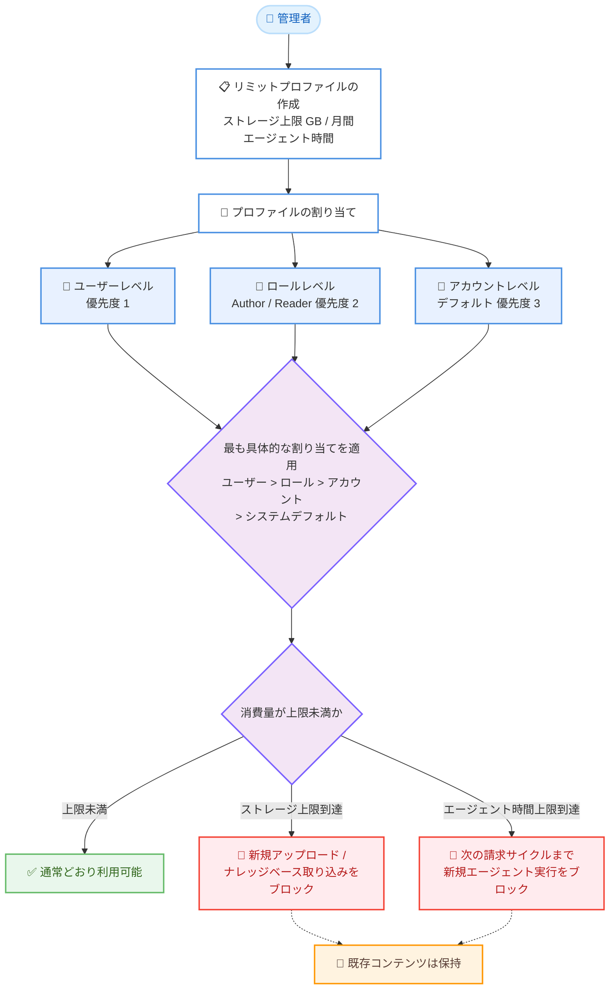

# Amazon Quick - ユーザー単位のリソース制限 (Limits Management)

**リリース日**: 2026 年 8 月 12 日
**サービス**: Amazon Quick
**機能**: ユーザー単位のリソース制限 (Limits Management / リミットプロファイル)

📊 [このアップデートのインフォグラフィックを見る](https://takech9203.github.io/aws-news-summary/20260812-amazon-quick-per-user-resource-limits.html)

## 概要

Amazon Quick に、管理者がユーザー単位でインデックスストレージとエージェント時間 (agent hours) の上限を設定できる「Limits Management (リミット管理)」機能が追加されました。管理者は再利用可能な「リミットプロファイル」を作成してユーザーごとの消費量に上限を設け、想定外の超過課金を防止しながら、サブスクリプションの利用枠を組織全体で効率的に活用できます。

リミットプロファイルは、ユーザー、ロール (Author / Reader)、アカウントの 3 つのレベルで割り当てることができ、優先順位の階層 (ユーザー > ロール > アカウント > システムデフォルト) により、適切なユーザーに適切なキャパシティを確実に割り当てられます。例えば、数千人規模で Quick を全社展開する組織では、アカウントレベルのプロファイルでコスト予測可能なベースラインを設定したうえで、より多くのエージェント時間を必要とする特定のロールには高い上限を割り当てる、といった運用が可能です。

ユーザーが上限に達すると新規の消費はブロックされますが、既存のコンテンツはそのまま保持されます。この機能は Professional プランおよび Enterprise プランで、Amazon Quick のエージェント機能がサポートされているすべての AWS リージョンで利用できます。

**アップデート前の課題**

- 以前は、インデックスストレージのプールがアカウント (支払いアカウント) レベルで共有されており、一部のヘビーユーザーが他のユーザーが使うはずのキャパシティを消費してしまう可能性があった
- ユーザー単位でエージェント時間の消費を制限する仕組みがなく、サブスクリプションのコストが予測しづらく、想定外の超過課金が発生するリスクがあった
- 管理者がユーザーごとの消費量を統制する手段が限られており、大規模展開時のコストガバナンスが難しかった

**アップデート後の改善**

- リミットプロファイルにより、ユーザー単位でインデックスストレージ (GB) と月間エージェント時間の上限を設定できるようになった
- ユーザー / ロール / アカウントの 3 レベルの割り当てと優先順位の階層により、ロールや業務内容に応じたきめ細かなキャパシティ配分が可能になった
- 上限到達時は新規消費のみがブロックされ、既存のファイルやナレッジベースは削除されないため、安全に制限を適用できるようになった
- 管理者はユーザー別の消費状況を一覧で確認でき、エンドユーザー自身も「My usage」ウィジェットで自分の消費量を確認できるようになった

## アーキテクチャ図



リミットプロファイルの割り当てから制限適用までの流れを示しています。複数の割り当てが該当する場合は最も具体的なレベルの設定が有効となり、上限到達時も既存コンテンツは削除されずに保持されます。

## サービスアップデートの詳細

### 主要機能

1. **リミットプロファイルによるユーザー単位の上限設定**
   - 名前 (必須)、説明 (任意)、ストレージ上限 (GB)、月間エージェント時間の 4 項目で構成される再利用可能なプロファイルを作成できる
   - ストレージ上限と月間エージェント時間の少なくとも一方の設定が必須
   - 対象リソースは「インデックスストレージ」と「エージェント時間」の 2 種類

2. **3 レベルの割り当てと解決階層**
   - プロファイルは個別ユーザー、ロール (Author / Reader)、アカウントデフォルトの 3 レベルで割り当て可能
   - 複数の割り当てが該当する場合、「ユーザー > ロール > アカウント > システムデフォルト (サブスクリプション標準の権利)」の順で最も具体的な割り当てが有効になる
   - グループレベル (IdP グループ) の割り当ては将来リリース予定で、提供時はユーザーレベルとロールレベルの間に位置づけられる

3. **上限到達時の安全な制限適用**
   - インデックスストレージが上限に達すると、そのユーザーの新規ファイルアップロードとナレッジベースへの取り込みがブロックされる
   - エージェント時間が上限に達すると、次の請求サイクルが始まるまで新規のエージェント実行がブロックされる
   - 既存コンテンツは常に保持され、上限を厳しくしてもファイルやナレッジベースが削除されることはない
   - 制限はすべての AWS リージョンにわたってグローバルに適用され、どのリージョンでの利用も同じユーザー単位の上限にカウントされる

4. **管理者向けの消費状況の可視化**
   - 「Per-user Capacity Overview」テーブルで、ユーザーごとのストレージ使用量、当該請求サイクルのエージェント時間、ナレッジベース / スペース別の使用内訳を一覧できる
   - ユーザー行を選択すると、リンクされたプロファイル、有効上限に対する消費量などの詳細をサイドパネルで確認できる
   - インデックスキャパシティの消費はユーザー別、ナレッジベース別、スペース別の 3 つの観点で確認できる

5. **エンドユーザー向けのセルフサービス可視化**
   - ユーザー自身が「My stuff」内の「My usage」ウィジェットで、月間上限に対するエージェント時間の消費 (請求サイクルごとにリセット) と、有効上限に対するインデックスストレージ消費を確認できる

### 計測対象の詳細

**インデックスストレージ**: Quick による処理前の、ソース上の元 (raw) ファイルサイズで計測されます。対象のソースには Amazon S3、SharePoint、Confluence が含まれます。割り当てはユーザー数とサブスクリプションティアに基づき、支払いアカウントレベルでプールされます。

**エージェント時間**: 以下の AI 機能の実行時間が計測対象です。

| 機能 | 計測対象 |
|------|----------|
| Quick Research | リサーチリクエストの送信からレポート完成までの時間 |
| Quick Flows | ワークフローが実際に実行されている時間 (アイドル / 待機時間は除外) |
| Quick Automate | デプロイされた自動化の実行時間 |
| デスクトップアプリ | AI アシスタントをアクティブに使用した時間 |
| カスタムアプリ | AI 搭載カスタムアプリケーションの実行時間 |
| 成果物生成 | ドキュメント、プレゼンテーション、画像の生成に要した時間 |

## 技術仕様

### リミットプロファイルの構成要素

| 項目 | 詳細 |
|------|------|
| Name | プロファイルの名前 (必須) |
| Description | プロファイルの目的などの説明 (任意) |
| Storage limit | ユーザーが消費できるインデックスストレージの上限 (GB、任意) |
| Agent hours per month | 請求サイクルごとにユーザーが消費できるエージェント時間の上限 (任意) |
| 制約 | ストレージ上限と月間エージェント時間の少なくとも一方が必須 |
| 割り当てレベル | ユーザー / ロール (Author、Reader) / アカウントデフォルト |
| 適用範囲 | 全リージョンでグローバルに適用 (どのリージョンの利用も同一上限にカウント) |

### API変更履歴

| 日付 | サービス | 変更内容 |
|------|----------|----------|
| 2026/08/12 | [Amazon QuickSight](https://awsapichanges.com/archive/changes/144a68-quicksight.html) | 16 new 4 updated api methods - Limits Management (リミットプロファイル)、Microsoft Purview 連携 DLP、承認ポリシーの API 追加 |

Limits Management 関連では以下の 6 つの API が追加されています。

| API | 用途 |
|-----|------|
| `CreateLimitsProfile` | リミットプロファイルの作成 (`resourceLimits` に上限値と単位 `MB` / `GB` / `HOURS` / `DAYS` を指定) |
| `UpdateLimitsProfile` | プロファイルの更新 |
| `DeleteLimitsProfile` | プロファイルの削除 |
| `DescribeLimitsProfile` | プロファイルの詳細取得 |
| `ListLimitsProfiles` | プロファイルの一覧取得 (`INDEX_STORAGE` / `AGENT_HOURS` でフィルタ可能) |
| `BatchDescribeUserLimits` | 複数ユーザーの有効上限を一括取得 (適用元 `DIRECT_USER` / `GROUP` / `ROLE` / `ACCOUNT` / `SYSTEM_DEFAULT` を含む) |

`BatchDescribeUserLimits` のレスポンスに含まれる `source` フィールドにより、各ユーザーの有効上限がどのレベルの割り当てに由来するかをプログラムから確認できます。

### API リクエスト例 (CreateLimitsProfile)

```json
{
    "accountId": "123456789012",
    "profileName": "Analyst-Standard",
    "description": "Standard limits for analysts",
    "resourceLimits": {
        "INDEX_STORAGE": {
            "maxValue": 10,
            "unit": "GB"
        },
        "AGENT_HOURS": {
            "maxValue": 20,
            "unit": "HOURS"
        }
    }
}
```

## 設定方法

### 前提条件

1. Amazon Quick の Professional プランまたは Enterprise プランを利用していること
2. Quick 管理者 (システム管理者または Quick 管理者) の権限を保有していること
3. Amazon Quick のエージェント機能がサポートされているリージョンでアカウントを利用していること

### 手順

#### ステップ1: 消費状況を確認する

1. Quick の管理画面 (Manage account) を開く
2. 「Per-user Capacity Overview」テーブルで、ユーザーごとのストレージ使用量とエージェント時間の消費状況を確認する
3. ユーザー行を選択してサイドパネルを開き、ナレッジベース / スペース別の使用内訳を確認する

制限を設計する前に現状の消費傾向を把握することで、業務に支障のない適切な上限値を設定できます。

#### ステップ2: リミットプロファイルを作成する

1. リミット管理の画面でプロファイルの作成を開始する
2. 名前 (必須) と説明 (任意) を入力する
3. ストレージ上限 (GB) と月間エージェント時間の少なくとも一方を設定して保存する

プログラムから管理する場合は `CreateLimitsProfile` API を使用します。

#### ステップ3: プロファイルを割り当てる

1. アカウントデフォルトとしてベースラインのプロファイルを割り当てる (個別の割り当てがないすべてのユーザーに適用)
2. より多くのキャパシティが必要なロール (例: Author) には、ロールレベルで上限の高いプロファイルを割り当てる
3. 特別な要件を持つ個別ユーザーには、ユーザーレベルでプロファイルを割り当てる

「ユーザー > ロール > アカウント」の優先順位により、最も具体的な割り当てが有効になります。

#### ステップ4: 運用状況をモニタリングする

1. 「Per-user Capacity Overview」で上限に近づいているユーザーを定期的に確認する
2. エンドユーザーには「My stuff」内の「My usage」ウィジェットで自身の消費量を確認するよう案内する
3. エージェント時間の消費トレンドの詳細分析には Usage metrics (使用状況メトリクス) を活用する

## メリット

### ビジネス面

- **コストの予測可能性**: アカウントレベルのベースライン設定により、大規模展開時でもサブスクリプションコストの上限を予測しやすくなり、想定外の超過課金を防止できる
- **利用枠の公平な配分**: 一部のヘビーユーザーが共有プールのキャパシティを使い切ってしまう事態を防ぎ、組織全体でサブスクリプションの権利を効率的に活用できる
- **役割に応じた投資配分**: エージェント時間を多く必要とする役割にのみ高い上限を割り当てることで、コストを業務価値に沿って配分できる

### 技術面

- **安全な制限適用**: 上限到達時も既存コンテンツが保持されるため、データ損失のリスクなしに制限を導入・強化できる
- **グローバルな一貫性**: 制限は全リージョン横断で適用されるため、マルチリージョン利用時もユーザー単位の統制が一元化される
- **プログラマブルな管理**: 6 つの新 API により、プロファイルのライフサイクル管理やユーザーの有効上限の監査を自動化できる

## デメリット・制約事項

### 制限事項

- Professional プランおよび Enterprise プランでのみ利用可能
- 制限できるリソースはインデックスストレージとエージェント時間の 2 種類
- グループレベル (IdP グループ) の割り当ては未対応 (将来リリース予定)
- エージェント時間の上限に達したユーザーは、次の請求サイクルまで新規のエージェント実行がブロックされる (管理者が上限を引き上げない限り解除されない)

### 考慮すべき点

- ユーザーレベルの割り当てはロール / アカウントレベルの設定を上書きするため、割り当てレベルの設計と棚卸しを計画的に行う必要がある
- 上限が厳しすぎると業務中に突然新規アップロードやエージェント実行がブロックされるため、事前に「Per-user Capacity Overview」で実際の消費傾向を確認してから上限値を設定することが望ましい
- インデックスストレージは処理前の元ファイルサイズで計測されるため、ソース (Amazon S3、SharePoint、Confluence) 上のファイルサイズを基準に見積もる必要がある

## ユースケース

### ユースケース1: 全社展開時のコストベースライン設定

**シナリオ**: 数千人規模で Quick を全社展開する企業。ユーザーごとの消費を統制し、月次コストを予測可能にしたい。

**実装例**:
```
1. アカウントデフォルトのプロファイル「Company-Baseline」を作成
   - ストレージ上限: 5 GB / ユーザー
   - エージェント時間: 10 時間 / 月
2. アカウントレベルに割り当て (個別割り当てのない全ユーザーに適用)
```

**効果**: 全ユーザーの消費に上限が設定され、ユーザー数に基づいてコストの上限を事前に見積もれる。共有プールの枯渇や想定外の超過課金を防止できる。

### ユースケース2: ロール別のキャパシティ配分

**シナリオ**: データ分析チーム (Author ロール) は Quick Research や Flows を多用する一方、閲覧中心の Reader ロールには最小限の枠で十分な企業。

**実装例**:
```
1. プロファイル「Author-Extended」を作成 (ストレージ 20 GB、エージェント時間 40 時間 / 月)
2. プロファイル「Reader-Minimal」を作成 (ストレージ 2 GB、エージェント時間 5 時間 / 月)
3. それぞれ Author ロール、Reader ロールに割り当て
```

**効果**: ロールの業務特性に応じてキャパシティが配分され、分析チームの生産性を維持しながら全体コストを最適化できる。優先順位により、特別な要件を持つユーザーにはユーザーレベルの割り当てで個別対応も可能。

### ユースケース3: 有効上限の監査の自動化

**シナリオ**: コンプライアンス要件により、主要ユーザーに適用されている上限とその適用元を定期的に監査したい企業。

**実装例**:
```python
# boto3 で複数ユーザーの有効上限と適用元を一括取得
response = client.batch_describe_user_limits(
    accountId="123456789012",
    users=[
        {"userName": "analyst01", "namespace": "default"},
        {"userName": "analyst02", "namespace": "default"},
    ],
    resourceTypes=["INDEX_STORAGE", "AGENT_HOURS"],
)
```

**効果**: 各ユーザーの有効上限値と適用元 (`DIRECT_USER` / `ROLE` / `ACCOUNT` / `SYSTEM_DEFAULT`) をプログラムで取得でき、意図しない割り当ての検出や監査レポートの作成を自動化できる。

## 料金

リミット管理機能自体に追加料金はありません。本機能はむしろ、インデックスストレージやエージェント時間の超過利用による追加課金を防止するためのコスト管理機能です。Amazon Quick の料金体系 (サブスクリプションおよびインデックスキャパシティ / エージェント時間の超過分) の詳細は [Amazon Quick 料金ページ](https://aws.amazon.com/quicksight/pricing/) を参照してください。

## 利用可能リージョン

Professional プランおよび Enterprise プランで、Amazon Quick のエージェント機能がサポートされているすべての AWS リージョンで利用できます。2026 年 8 月時点で Quick のエージェント機能は、米国東部 (バージニア北部)、米国西部 (オレゴン)、欧州 (フランクフルト、アイルランド、ロンドン)、アジアパシフィック (シドニー、東京)、AWS GovCloud (米国西部) の 8 リージョンで提供されています。最新のリージョン情報は [AWS リージョン表](https://aws.amazon.com/about-aws/global-infrastructure/regional-product-services/) を参照してください。

なお、制限の適用自体はリージョン横断でグローバルに行われ、どのリージョンでの利用も同じユーザー単位の上限にカウントされます。

## 関連サービス・機能

- **Amazon Quick インデックスキャパシティ**: 本機能が制御する対象の 1 つ。ナレッジベースなどの元ファイルサイズに基づいて計測され、支払いアカウントレベルでプールされる
- **Amazon Quick 使用状況メトリクス (Usage metrics)**: エージェント時間の消費トレンドを分析するための機能。リミット設計時の消費傾向の把握に活用できる
- **Amazon Quick カスタム権限 / 承認ポリシー / Microsoft Purview 連携 DLP**: 同日に発表された Quick のエンタープライズガバナンス機能群。機能アクセス制御 (カスタム権限)、共有統制 (承認ポリシー)、データ保護 (DLP)、コスト統制 (リミット管理) を組み合わせて包括的なガバナンスを実現できる

## 参考リンク

- 📊 [インフォグラフィック](https://takech9203.github.io/aws-news-summary/20260812-amazon-quick-per-user-resource-limits.html)
- [公式発表 (What's New)](https://aws.amazon.com/whats-new/2026/08/amazon-quick-per-user-resource-limits/)
- [ドキュメント: Limit profiles - Amazon Quick User Guide](https://docs.aws.amazon.com/quick/latest/userguide/limit-profiles.html)
- [ドキュメント: Index capacity](https://docs.aws.amazon.com/quick/latest/userguide/manage-unstructured-data-capacity.html)
- [ドキュメント: Usage metrics](https://docs.aws.amazon.com/quick/latest/userguide/qs-usage-metrics.html)
- [料金ページ](https://aws.amazon.com/quicksight/pricing/)

## まとめ

Amazon Quick のリミット管理は、エージェント型 AI の全社展開における最大の懸念であるコストの予測不能性に対する直接的な解決策です。同日に発表された承認ポリシー、デフォルト拒否、Purview 連携 DLP と合わせて、Quick のエンタープライズガバナンスが大きく強化されました。大規模展開を検討している組織は、まず「Per-user Capacity Overview」で現状の消費傾向を把握したうえで、アカウントレベルのベースラインとロール別プロファイルの設計から着手することを推奨します。
