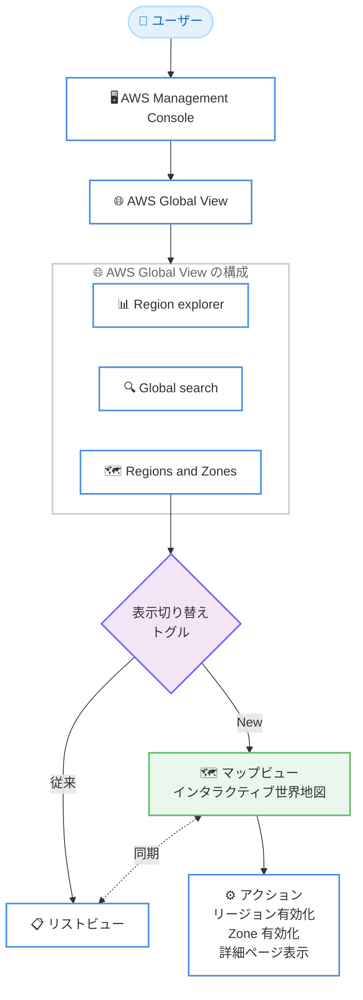

# AWS Global View - AWS リージョンと AWS Local Zones のインタラクティブマップビュー

**リリース日**: 2026 年 8 月 12 日
**サービス**: AWS Global View (AWS Management Console)
**機能**: AWS リージョンおよび AWS Local Zones のインタラクティブマップビュー

📊 [このアップデートのインフォグラフィックを見る](https://takech9203.github.io/aws-news-summary/20260812-aws-global-view-map-view.html)

## 概要

AWS Global View に、AWS グローバルインフラストラクチャを視覚的に探索できるインタラクティブマップビューが追加されました。AWS Management Console の Global View にある「Regions and Zones」ページで、従来のリストビューと新しいマップビューをトグルで切り替えられるようになります。マップビューを選択すると、すべての AWS リージョンと Local Zones が世界地図上にプロットされ、有効化済みのロケーションと利用可能なすべてのロケーションをひと目で確認できます。

マップ上の各ロケーションはステータスごとに色分けされており、ポイントまたは選択することで詳細情報を表示できます。さらに、マップ上からリージョンの有効化、Local Zone のオプトイン、詳細ページの表示といったアクションを直接実行できます。マップと詳細リストは同期しており、一方でロケーションを選択するともう一方でもハイライトされます。

複数リージョンにまたがるワークロードの配置検討や、Local Zones を活用した低レイテンシー構成の計画など、グローバルインフラストラクチャを俯瞰しながらインフラ計画を進めたいユーザーにとって有用なアップデートです。

**アップデート前の課題**

- 以前は AWS Global View 内で AWS のロケーションをリスト形式でしか閲覧できなかった
- リージョンや Local Zones の地理的な位置関係を把握するには、別途 AWS グローバルインフラストラクチャのウェブページなどを参照する必要があった
- 有効化済みのロケーションと利用可能なロケーションの全体像を視覚的に比較することが難しかった

**アップデート後の改善**

- インタラクティブマップビューとリストビューをトグルで切り替えられるようになった
- すべての AWS リージョンと Local Zones が世界地図上にプロットされ、地理的な分布をひと目で把握できるようになった
- 有効化済みのロケーションと利用可能なすべてのロケーションを 1 つの画面で確認でき、インフラ計画に活用できるようになった
- マップ上からリージョンの有効化や Local Zone のオプトインなどのアクションを直接実行できるようになった

## アーキテクチャ図



AWS Global View の「Regions and Zones」ページに、従来のリストビューに加えてインタラクティブマップビューが追加されました。両ビューはトグルで切り替え可能で、選択状態は相互に同期します。

## サービスアップデートの詳細

### 主要機能

1. **インタラクティブマップビュー**
   - すべての AWS リージョンと Local Zones を世界地図上にプロットして表示
   - 各ロケーションはステータス (有効化済みかどうかなど) ごとに色分けされる
   - ロケーションをポイントまたは選択すると詳細情報を表示できる
   - 特定のステータスのみを表示するフィルタリングが可能

2. **マップ上からの直接アクション**
   - マップ上でロケーションを選択して、リージョンの有効化を実行できる
   - Local Zone のオプトイン (有効化) をマップ上から実行できる
   - ロケーションの詳細ページをマップから直接開ける

3. **リストビューとのシームレスな切り替えと同期**
   - 「List view」/「Map view」トグルでビューを切り替え可能
   - ビューの選択はセッションをまたいで保持される
   - マップと詳細リストは同期しており、一方でロケーションを選択するともう一方でもハイライトされる

## 技術仕様

### AWS Global View の「Regions and Zones」ページ

| 項目 | 詳細 |
|------|------|
| 表示対象 | AWS リージョン、Availability Zones、Local Zones、Wavelength Zones |
| マップビューの表示対象 | AWS リージョンと Local Zones を世界地図上に表示 |
| ビュー切り替え | List view / Map view のトグルで切り替え、設定はセッションをまたいで保持 |
| ステータス表示 | ロケーションをステータスごとに色分け表示、ステータスによるフィルタリングが可能 |
| 実行可能なアクション | リージョンの有効化、Zone の有効化 (オプトイン)、詳細ページの表示 |
| アクセス方法 | AWS Global View コンソールの「Regions and Zones」ページ |

### 必要な権限

AWS Global View を利用するには、以下のような権限が必要です (抜粋)。リージョンとゾーンの表示には特に `ec2:DescribeRegions` と `ec2:DescribeAvailabilityZones` が関係します。

```json
{
  "Version": "2012-10-17",
  "Statement": [
    {
      "Effect": "Allow",
      "Action": [
        "ec2:DescribeRegions",
        "ec2:DescribeAvailabilityZones",
        "ec2:DescribeInstances",
        "ec2:DescribeVpcs",
        "ec2:DescribeSubnets"
      ],
      "Resource": "*"
    }
  ]
}
```

権限の完全なリストは [AWS Global View のドキュメント](https://docs.aws.amazon.com/AWSEC2/latest/UserGuide/global-view.html)を参照してください。

## 設定方法

### 前提条件

1. AWS アカウントと AWS Management Console へのアクセス権限
2. AWS Global View の利用に必要な IAM 権限 (上記「必要な権限」を参照)
3. リージョンの有効化や Local Zone のオプトインを行う場合は、それぞれの操作に必要な権限

### 手順

#### ステップ 1: AWS Global View コンソールを開く

AWS Management Console にサインインし、[AWS Global View コンソール](https://console.aws.amazon.com/ec2globalview/home#RegionsAndZones)を開きます。ナビゲーションから「Regions and Zones」ページに移動します。

#### ステップ 2: マップビューに切り替える

ページ上部の「List view」/「Map view」トグルで「Map view」を選択します。すべての AWS リージョンと Local Zones がインタラクティブな世界地図上に表示されます。選択したビューはセッションをまたいで保持されるため、次回以降も同じビューで表示されます。

#### ステップ 3: ロケーションの確認とアクションの実行

マップ上のロケーションをポイントまたは選択すると、詳細情報が表示されます。ロケーションを選択して、リージョンの有効化、Local Zone のオプトイン、詳細ページの表示といったアクションを実行できます。必要に応じて、ステータスによるフィルタリングで表示対象を絞り込めます。

## メリット

### ビジネス面

- **インフラ計画の効率化**: 有効化済みのロケーションと利用可能なロケーションをひと目で比較でき、グローバル展開の計画立案が容易になる
- **低レイテンシー戦略の可視化**: Local Zones の地理的な配置を地図上で確認でき、エンドユーザーに近いロケーションの選定を直感的に行える
- **学習コストの低減**: AWS グローバルインフラストラクチャの全体像を視覚的に把握でき、チーム内での共通理解を形成しやすい

### 技術面

- **コンソール内で完結**: 別のウェブページや資料を参照せずに、コンソール内でロケーションの地理的分布を確認できる
- **アクションの一体化**: リージョンの有効化や Local Zone のオプトインをマップから直接実行でき、操作の手数が減る
- **ビューの同期**: マップと詳細リストが同期するため、視覚的な確認と詳細情報の確認をスムーズに行き来できる

## デメリット・制約事項

### 制限事項

- AWS Global View はリソースの参照専用であり、リソース自体の変更はできない (リージョン、Zone の有効化操作を除く)
- マップビューで表示されるのはリージョンと Local Zones であり、個々のリソースの配置が地図上に表示されるわけではない
- Firefox のプライベートウィンドウでは AWS Global View を利用できない

### 考慮すべき点

- リージョンの有効化や Local Zone のオプトインは課金やコンプライアンスに影響し得るため、組織のポリシーに沿って実行する必要がある
- 表示には対応する IAM 権限 (`ec2:DescribeRegions` など) が必要であり、最小権限の観点で必要な権限のみを付与することが望ましい

## ユースケース

### ユースケース 1: グローバル展開の候補リージョン選定

**シナリオ**: 海外ユーザー向けにサービスを展開するにあたり、ユーザーの所在地に近いリージョンを選定したい。

**実装例**:
```
1. AWS Global View の「Regions and Zones」ページを開く
2. Map view に切り替え、ターゲット地域周辺のリージョンを地図上で確認
3. 候補リージョンを選択して詳細 (リージョンコード、Zone 数など) を確認
4. 未有効のオプトインリージョンであれば、マップ上から有効化を実行
```

**効果**: 地理的な位置関係を踏まえたリージョン選定を、コンソール内で完結して実施できる。

### ユースケース 2: Local Zones を活用した低レイテンシー構成の計画

**シナリオ**: 特定都市のエンドユーザーに対して低レイテンシーなアプリケーションを提供するため、利用可能な Local Zones を調査したい。

**実装例**:
```
1. Map view でターゲット都市周辺の Local Zones を確認
2. ステータスフィルタで未有効の Local Zones を表示
3. 対象の Local Zone を選択し、マップ上からオプトインを実行
4. 詳細ページでゾーン情報を確認し、リソース配置を計画
```

**効果**: Local Zones の地理的配置を視覚的に把握し、オプトインまでの作業を一画面で完了できる。

### ユースケース 3: アカウントの有効化状況の棚卸し

**シナリオ**: マルチリージョン運用のガバナンス確認として、アカウントで有効化されているリージョンの全体像を定期的に確認したい。

**実装例**:
```
1. Map view を開き、ステータスごとの色分けで有効化済みリージョンを確認
2. ステータスフィルタで有効化済みのロケーションのみを表示
3. 想定外に有効化されているリージョンがないかを確認
4. 必要に応じてリストビューに切り替え、詳細を一覧で確認
```

**効果**: 有効化状況をひと目で把握でき、ガバナンス確認の作業時間を短縮できる。

## 料金

AWS Global View およびマップビューの利用に追加料金はかかりません。AWS Management Console の機能として無料で利用できます。なお、リージョンの有効化や Local Zone のオプトイン後にリソースを作成した場合は、各リソースの通常料金が発生します。

## 利用可能リージョン

すべてのパブリック AWS リージョンで利用可能です。

## 関連サービス・機能

- **Amazon EC2**: AWS Global View は EC2 コンソールの一部として提供され、インスタンスやボリュームなどのリソースをリージョン横断で参照できる
- **AWS Local Zones**: 大都市圏の近くに配置されるインフラストラクチャで、低レイテンシーが求められるワークロードに活用できる。マップビューで配置を確認し、オプトインが可能
- **AWS Wavelength**: 5G ネットワークのエッジに配置されるゾーン。「Regions and Zones」ページで一覧を確認できる
- **AWS Organizations / IAM**: リージョンの有効化・無効化のガバナンス管理と、Global View 利用に必要な権限管理に関連する

## 参考リンク

- 📊 [インフォグラフィック](https://takech9203.github.io/aws-news-summary/20260812-aws-global-view-map-view.html)
- [公式発表 (What's New)](https://aws.amazon.com/about-aws/whats-new/2026/08/aws-global-view-map-view/)
- [AWS Global View ドキュメント](https://docs.aws.amazon.com/AWSEC2/latest/UserGuide/global-view.html)
- [AWS Global View コンソール](https://console.aws.amazon.com/ec2globalview/home#RegionsAndZones)
- [AWS グローバルインフラストラクチャ](https://aws.amazon.com/about-aws/global-infrastructure/)

## まとめ

AWS Global View のマップビューにより、AWS リージョンと Local Zones の地理的な分布と有効化状況をコンソール内でひと目で把握できるようになりました。追加料金なしで全パブリックリージョンから利用できるため、マルチリージョン構成や Local Zones の活用を検討している場合は、「Regions and Zones」ページでマップビューを試してみることを推奨します。
