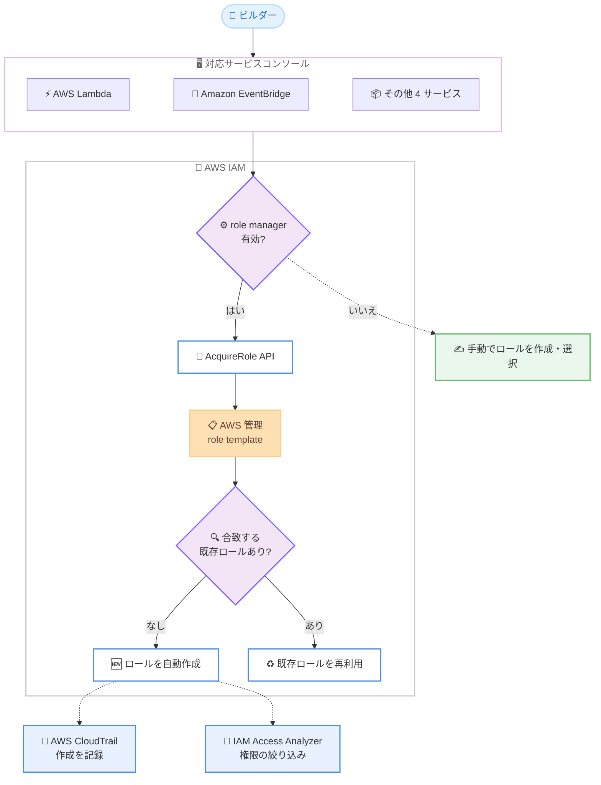

# AWS IAM - role manager による IAM ロールの自動セットアップ

**リリース日**: 2026 年 8 月 12 日
**サービス**: AWS Identity and Access Management (IAM)
**機能**: role manager (IAM ロールの自動作成・再利用機能)

📊 [このアップデートのインフォグラフィックを見る](https://takech9203.github.io/aws-news-summary/20260812-aws-iam-role-manager.html)

## 概要

AWS Identity and Access Management (IAM) に、AWS サービスが必要とする IAM ロールを自動的にセットアップする新機能「role manager」が一般提供 (GA) されました。role manager を有効にすると、対応するサービスをコンソールでセットアップする際に、デフォルトのロールがユーザーに代わって自動作成されます。必要な権限に合致する既存のロールがアカウント内にある場合は、新規作成せずにそのロールを再利用します。

role manager は「role template (ロールテンプレート)」という AWS 管理のテンプレートを適用することで動作します。テンプレートには、信頼ポリシー、インライン/マネージドポリシー、アクセス許可境界、タグ、最大セッション時間などのロール構成が定義されており、コンソールが新しい IAM API である `AcquireRole` を呼び出すことで、テンプレートに基づくロールのプロビジョニングが行われます。ローンチ時点では AWS Lambda や Amazon EventBridge を含む 6 つの AWS サービスコンソールに対応しています。

role manager はアカウント単位の任意設定であり、いつでも有効化・無効化できます。作成されたロールは通常の IAM ロールとして IAM コンソールに表示され、ユーザーが完全に制御できます。各ロールには作成元のテンプレート情報が記録されるため、role manager が作成したロールを識別でき、AWS CloudTrail で作成の監査も可能です。AWS を使い始めるビルダーや、開発・検証環境で素早くプロトタイピングを進めたいチームに特に有用なアップデートです。

**アップデート前の課題**

- 以前は Lambda 関数の実行ロールや EventBridge ルールのターゲット呼び出しロールなど、サービスがユーザーに代わって動作するためのロールを、構築のたびに手動で作成・設定する必要があった
- 信頼ポリシーやアクセス許可の設計には IAM の知識が必要で、AWS を使い始めたばかりのビルダーにとって構築作業を中断する障壁になっていた
- 同じ用途のロールがアカウント内に重複して作成され、ロールが乱立しやすかった

**アップデート後の改善**

- 対応サービスのコンソールワークフロー内で、必要な IAM ロールが AWS 管理テンプレートから自動作成されるようになり、追加の IAM 設定なしで構築を開始できるようになった
- 必要な権限に合致する既存ロールがある場合は再利用されるため、同一用途のロールの重複作成を防げるようになった
- ロールに作成元テンプレートが記録され、`GetRole` / `ListRoles` で参照できるため、自動作成されたロールの識別と棚卸しが容易になった
- 権限を絞り込む段階では、role manager を無効化して IAM Access Analyzer で各ロールを必要最小限の権限に精緻化できる

## アーキテクチャ図



対応サービスのコンソールでリソースを作成すると、role manager が `AcquireRole` API を通じて AWS 管理テンプレートを適用し、ロールの新規作成または既存ロールの再利用を自動的に行う流れを示しています。作成は CloudTrail に記録され、権限の絞り込みには IAM Access Analyzer を活用できます。

## サービスアップデートの詳細

### 主要機能

1. **IAM ロールの自動作成**
   - 対応サービスのコンソールでリソースをセットアップすると、必要なデフォルトロールがユーザーに代わって自動作成される
   - 例: Lambda 関数をコンソールで作成すると、そのワークフロー用の AWS 管理テンプレートが適用され、実行ロールがデフォルトで作成される
   - 別のロールを使いたい場合は、従来どおり既存ロールの選択や手動作成も可能

2. **AWS 管理の role template**
   - テンプレートには信頼ポリシー、インライン/マネージドポリシー、アクセス許可境界、タグ、最大セッション時間などが定義されている
   - 特定タスク向けのテンプレートは、そのタスクに必要なアクションのみを許可する
   - ユーザー自身のコードを実行するようなオープンエンドな用途 (例: Lambda) では、`PowerUserAccess` マネージドポリシーのような広い権限を付与しつつ、信頼ポリシーは対象サービスのみに限定される
   - role manager がデプロイするテンプレートの内容は `GetRoleTemplateVersion` API などでいつでも確認できる

3. **既存ロールの再利用**
   - 必要な権限に合致するロールがアカウント内に既に存在する場合、新規作成せずにそのロールを再利用する
   - 同じタスク用のロールがアカウント内に重複して蓄積されることを防ぐ
   - 再利用時に必要な権限は `iam:GetRole` と `iam:GetRoleTemplateVersion` のみ

4. **完全な可視性とコントロール**
   - role manager はいつでも有効化・無効化できるアカウント単位のオプション設定
   - 作成されたロールは標準の IAM ロールとして表示・編集・削除が可能で、作成元テンプレートが記録されるため識別できる
   - ロール作成は AWS CloudTrail に記録され、いつどのようにロールが作成されたか監査できる
   - 無効化してもすでに作成されたロールは削除されず、既存リソースへの影響はない

## 技術仕様

### 対応サービスコンソール (ローンチ時点: 6 サービス)

| サービス | 主な用途 |
|------|------|
| AWS Lambda | 関数の実行ロール |
| Amazon EventBridge | ルールのターゲット呼び出しロール |
| AWS Elastic Beanstalk | 環境のサービスロール |
| Amazon SageMaker Unified Studio | プロジェクト用ロール |
| AWS Secrets Manager | ローテーション関数用ロール |
| AWS Step Functions | ステートマシンの実行ロール |

対応サービスは今後順次拡大される予定です。

### 新規 API

| API | 種別 | 説明 |
|------|------|------|
| `AcquireRole` | 新規 | 指定した role template からロールを作成する。テンプレートにパラメータが定義されている場合は置換値を指定可能 |
| `GetRoleTemplateVersion` | 新規 | role template のバージョン情報 (信頼ポリシー、ポリシー、タグ、最大セッション時間など) を取得する |
| `PutAccountProperties` | 新規 | role manager などアカウント全体の IAM 機能を制御するアカウントプロパティを `Namespace/PropertyName` 形式で設定する |
| `GetAccountProperties` | 新規 | 現在のアカウントプロパティを取得する |

このほか、`GetRole` / `ListRoles` / `CreateRole` など 10 の既存 API が更新され、ロールの作成元テンプレートを示す `SourceRoleTemplate` (テンプレート ARN とマイナーバージョン) がレスポンスに追加されています。

### API変更履歴

| 日付 | サービス | 変更内容 |
|------|----------|----------|
| 2026/08/12 | [AWS Identity and Access Management](https://awsapichanges.com/archive/changes/144a68-iam.html) | 4 new 10 updated api methods - role manager の導入に伴う `AcquireRole` / `GetRoleTemplateVersion` / `PutAccountProperties` / `GetAccountProperties` の追加と、ロール関連 API への `SourceRoleTemplate` の追加 |

## 設定方法

### 前提条件

1. role manager の有効化・無効化には `iam:PutAccountProperties` 権限が必要 (AWS 管理ポリシー `IAMFullAccess` に含まれる)
2. ロールの自動作成は操作するユーザー自身の IAM 権限で実行されるため、ロールの作成・ポリシーのアタッチに必要な権限が必要 (既存ロールの再利用のみの場合は `iam:GetRole` と `iam:GetRoleTemplateVersion` のみ)
3. AWS GovCloud (US) リージョンおよび中国リージョン以外の AWS リージョンであること

### 手順

#### ステップ1: role manager を有効化する

1. AWS Management Console にサインインし、IAM コンソールを開く
2. ナビゲーションペインで **Account settings** を選択する
3. **role manager** セクションで **Enable** を選択する

IAM コンソールのアカウント設定ページで、アカウント全体の role manager を有効化します。同じページで現在の有効・無効の状態も確認できます。

#### ステップ2: アカウント設定を CLI で確認する

```bash
aws iam get-account-properties
```

`GetAccountProperties` API でアカウントプロパティを取得し、role manager を含むアカウント全体の IAM 機能の設定状態を `Namespace/PropertyName` 形式のキーと値のペアで確認します。

#### ステップ3: 対応サービスのコンソールでリソースを作成する

例として AWS Lambda コンソールで関数を作成すると、role manager がそのワークフロー用の AWS 管理テンプレートを適用し、実行ロールを自動的に作成またはアカウント内の合致する既存ロールを再利用します。追加の操作は不要です。

#### ステップ4: 作成されたロールを確認する

```bash
aws iam get-role --role-name <ロール名>
```

`GetRole` API のレスポンスに含まれる `SourceRoleTemplate` フィールドで、ロールの作成元となった role template の ARN とマイナーバージョンを確認できます。role manager が作成したロールの識別に利用できます。あわせて AWS CloudTrail でロール作成イベントを監査できます。

#### ステップ5: 権限を絞り込む

本番稼働に向けて権限を厳格化する段階では、role manager を無効化し、IAM Access Analyzer の未使用アクセス分析で各ロールを実際に必要な権限のみに絞り込みます。role manager の無効化から 90 日間は未使用アクセス分析を無料で利用できます。

## メリット

### ビジネス面

- **構築開始までの時間短縮**: IAM ロールの手動設定という構築の中断要因がなくなり、ビルダーがサービス構築そのものに集中できる
- **学習コストの低減**: IAM の詳細な知識がなくても、AWS のベストプラクティスに基づくロール構成で安全に使い始められる
- **ガバナンスとの両立**: アカウント単位の有効・無効切り替えと、AWS Organizations の SCP による組織的な制御が可能

### 技術面

- **ロールの乱立防止**: 合致する既存ロールの再利用により、同じ用途のロールがアカウント内に重複して蓄積されることを防げる
- **透明性と監査性**: 作成元テンプレートがロールに記録され、CloudTrail にも作成が記録されるため、自動作成されたロールの識別・監査が容易
- **最小権限化への道筋**: IAM Access Analyzer との組み合わせで、まず動くロールから始めて実際の利用状況に基づき権限を絞り込むワークフローを実現できる

## デメリット・制約事項

### 制限事項

- ローンチ時点で対応するのは 6 つのサービスコンソールのみ (対応サービスは今後拡大予定)
- AWS GovCloud (US) リージョンおよび中国リージョンでは利用できない
- コンソールでのセットアップワークフローが対象であり、CLI や IaC でのリソース作成にはこの自動化は適用されない

### 考慮すべき点

- 用途を特定できないオープンエンドなワークフロー (例: Lambda の実行ロール) では `PowerUserAccess` のような広い権限が付与されるため、本番環境ではロールの権限を絞り込んでから稼働させることが推奨される
- role manager が作成したロールを編集すると role manager の管理対象から外れ、通常のカスタマー管理ロールとして扱われる
- role manager を無効化しても作成済みのロールは削除されないため、不要なロールの棚卸しは別途必要
- 推奨される運用は、サンドボックス・開発アカウントでは有効化し、本番アカウントでは無効化して権限を厳格化するという使い分け

## ユースケース

### ユースケース1: 開発・検証環境での迅速なプロトタイピング

**シナリオ**: 新しいアイデアの検証のため、Lambda 関数と EventBridge ルールを組み合わせたイベント駆動アプリケーションを素早く構築したい。IAM ロールの設計に時間をかけず、まず動くものを作りたい。

**実装例**:
```
1. 開発アカウントの IAM コンソール > Account settings で role manager を有効化
2. Lambda コンソールで関数を作成 → 実行ロールが自動作成される
3. EventBridge コンソールでルールを作成し SQS / SNS をターゲットに設定
   → ターゲット呼び出し用ロールが自動作成される
```

**効果**: ロール作成のための画面遷移や信頼ポリシーの設定が不要になり、構築フローが中断されずにプロトタイピングを完了できる。

### ユースケース2: 本番移行前の最小権限化

**シナリオ**: role manager で作成したロールを使って開発したワークロードを本番に移行するにあたり、セキュリティ要件として最小権限の原則を満たす必要がある。

**実装例**:
```
1. IAM コンソールで role manager を無効化
2. GetRole / ListRoles の SourceRoleTemplate で自動作成されたロールを特定
3. IAM Access Analyzer の未使用アクセス分析 (無効化後 90 日間無料) で
   実際に使用されたアクションを確認
4. 推奨されるスコープダウンポリシーを適用して権限を絞り込み
```

**効果**: 実際の利用実績に基づいてロールを必要最小限の権限に精緻化でき、開発スピードとセキュリティを両立できる。

### ユースケース3: 組織全体でのガバナンス制御

**シナリオ**: マルチアカウント環境を運用する組織で、開発系アカウントでは role manager の利用を許可し、本番系アカウントでは利用を禁止したい。

**実装例**:
```json
{
  "Version": "2012-10-17",
  "Statement": [
    {
      "Effect": "Deny",
      "Action": "iam:PutAccountProperties",
      "Resource": "*"
    }
  ]
}
```

**効果**: AWS Organizations のサービスコントロールポリシー (SCP) を本番系 OU に適用することで、メンバーアカウントによる role manager の有効化を組織的に制御できる。

## 料金

IAM および role manager は追加料金なしで利用できます。

なお、role manager を無効化した後の権限絞り込みを支援するため、IAM Access Analyzer の未使用アクセス分析 (通常は有料) を無効化から 90 日間無料で利用できます。

## 利用可能リージョン

AWS GovCloud (US) リージョンと中国リージョンを除く、すべての AWS リージョンで利用可能です。

## 関連サービス・機能

- **IAM Access Analyzer**: 未使用アクセス分析により、role manager で作成したロールを実際の利用状況に基づいて最小権限に絞り込める
- **AWS CloudTrail**: role manager によるロール作成イベントを記録し、いつどのようにロールが作成されたかを監査できる
- **AWS Organizations (SCP)**: `iam:PutAccountProperties` を制御することで、メンバーアカウントでの role manager の有効化可否を組織的に管理できる
- **AWS Lambda / Amazon EventBridge**: ローンチ時点の代表的な対応サービス。実行ロールやターゲット呼び出しロールの自動セットアップに対応

## 参考リンク

- 📊 [インフォグラフィック](https://takech9203.github.io/aws-news-summary/20260812-aws-iam-role-manager.html)
- [公式発表 (What's New)](https://aws.amazon.com/about-aws/whats-new/2026/08/aws-iam-role-manager)
- [AWS Security Blog - How AWS IAM role manager rethinks the starting point for IAM roles](https://aws.amazon.com/blogs/security/how-aws-iam-role-manager-rethinks-the-starting-point-for-iam-roles/)
- [ドキュメント - Create roles automatically with role manager](https://docs.aws.amazon.com/IAM/latest/UserGuide/id_roles_create_role-manager.html)
- [API 変更履歴 (awsapichanges.com)](https://awsapichanges.com/archive/changes/144a68-iam.html)

## まとめ

role manager は、AWS での構築の出発点となる IAM ロールのセットアップを自動化し、「まず動くものを作り、その後に権限を絞り込む」という現実的なワークフローを公式にサポートするアップデートです。開発・サンドボックスアカウントでは有効化して構築スピードを高め、本番アカウントでは無効化して IAM Access Analyzer による最小権限化を徹底する、という使い分けから始めることを推奨します。
