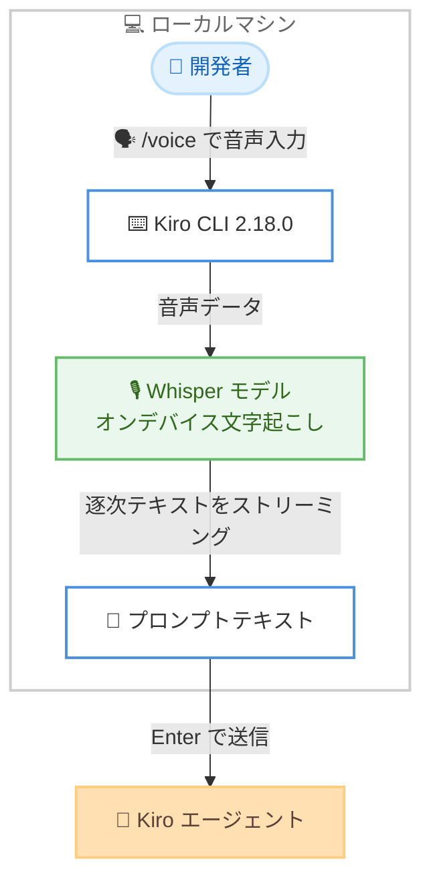
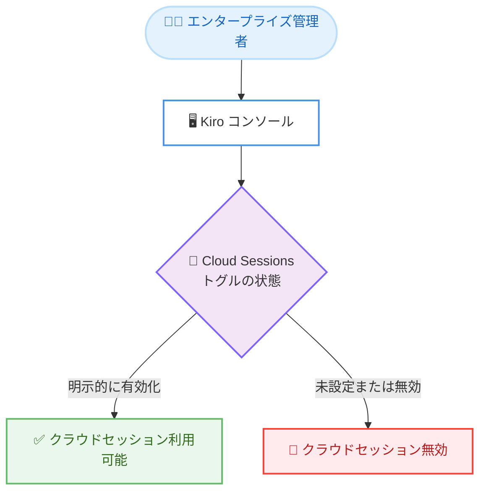

# Kiro - 音声モード、クラウドセッションのオプトイン化、スペックレビュー画面

**リリース日**: 2026 年 8 月 12 日
**サービス**: Kiro (AWS が提供する AI 搭載 IDE)
**機能**: `/voice` 音声ディクテーション、クラウドセッションのオプトイン化、スペックレビュー画面、ネストされた AGENTS.md ステアリング

📊 [このアップデートのインフォグラフィックを見る](https://takech9203.github.io/aws-news-summary/20260812-kiro-changelog-2026-08-12.html)

## 概要

2026 年 8 月 12 日、Kiro CLI 2.18.0 がリリースされました。目玉機能は **`/voice` 音声ディクテーション**で、キーボード入力の代わりに話しかけるだけでプロンプトを入力できるようになりました。文字起こしはデフォルトでローカルマシン上の Whisper モデルによって実行されるため、音声データがマシンの外に送信されることはなく、クラウド API キーも不要です。

スペック実行には**レビュー画面**が追加され、フェーズドキュメントをその場で読みながら変更してほしい箇所に行コメントをステージングし、まとめて 1 つの修正リクエストとしてエージェントに送信できます。また、**AGENTS.md ファイル**がワークスペースツリー内の任意の場所からステアリングコンテキストとして読み込まれるようになり、コードのすぐ隣にコンテキストを配置できるようになりました。

エンタープライズ管理者にとって重要な変更として、**クラウドセッションがオプトイン制**になりました。未設定のトグルは「無効」として解決されるため、これまで設定を行っていない組織では、管理者が Kiro コンソールで明示的に有効化するまでクラウドセッションは利用できません。

**アップデート前の課題**

- プロンプトの入力はキーボードのタイピングに限られていた
- 音声入力を実現するには外部ツールやクラウドベースの音声認識サービスを併用する必要があった
- スペックのフェーズチェックポイントで修正を依頼するには、ドキュメントを読む操作と変更依頼のやり取りが分離しており、指摘箇所を都度テキストで説明する必要があった
- AGENTS.md ファイルはワークスペースルートと `~/.kiro/steering/` に配置されたものしか読み込まれず、モノレポなどでコードの近くにコンテキストを置けなかった
- クラウドセッションは管理者による明示的な設定がなくても利用できる状態だった

**アップデート後の改善**

- `/voice`、`Ctrl+O`、または `Space` 長押しで録音を開始し、話した内容がリアルタイムでプロンプトにストリーミングされるようになった
- オンデバイスの Whisper による文字起こしにより、音声データを外部送信せずに音声入力が利用できるようになった
- `--continuous` フラグにより、ターンごとに自動で録音が始まるハンズフリーの対話が可能になった
- スペックのフェーズチェックポイントで `Ctrl+X` を押すと、ドキュメントの閲覧と行コメントのステージングを単一画面で完結できるようになった
- AGENTS.md をワークスペースツリー内のどこに置いても、他のステアリングファイルと同様にエージェントが読み込むようになった
- クラウドセッションがオプトイン制となり、組織のガバナンスが強化された

## アーキテクチャ図



`/voice` 音声ディクテーションの処理フローを示しています。音声の文字起こしはローカルマシン上の Whisper モデルで完結するため、音声データがマシンの外に出ることはありません。



クラウドセッションのオプトイン制の動作を示しています。トグルが未設定の場合は「無効」として扱われるため、利用には管理者による明示的な有効化が必要です。

## サービスアップデートの詳細

### 主要機能

1. **`/voice` 音声ディクテーション**
   - `/voice` コマンド、`Ctrl+O`、または `Space` の長押しで録音を開始
   - 話している間、部分的なテキストがリアルタイムでプロンプトにストリーミングされる
   - `Enter` を押すか、無音を検知すると自動的に録音が停止する
   - デフォルトでは Whisper モデルによりローカルマシン上で文字起こしが実行され、音声データは外部に送信されず、クラウド API キーも不要
   - モデルは初回使用時に明示的な確認を経て 1 回だけダウンロードされる
   - `--continuous` フラグを付けると、ターンごとに新しい録音が自動開始されるハンズフリーの対話が可能

2. **クラウドセッションのオプトイン化 (v3)**
   - 管理者が Kiro コンソールで Cloud Sessions を明示的に有効化しない限り、クラウドセッションは無効
   - 未設定のトグルは「無効」として解決されるため、これまで設定を行っていない組織ではクラウドセッションが利用不可となる
   - 組織のガバナンス要件に応じて、管理者がオプトインするまで利用を制限できる

3. **スペックレビュー画面 (v3)**
   - スペックのフェーズチェックポイントで `Ctrl+X` を押すと、フェーズドキュメントをその場で閲覧できる
   - 変更してほしい箇所に行コメントをステージング可能
   - チェックポイントの質問に回答すると、ステージングしたすべてのコメントが 1 つの修正リクエストとしてエージェントに送信される
   - ドキュメントの閲覧と変更依頼が単一画面で完結する

4. **ネストされた AGENTS.md ステアリング (v3)**
   - AGENTS.md ファイルが、ワークスペースルートと `~/.kiro/steering/` だけでなく、ワークスペースツリー内の任意の場所からステアリングコンテキストとして読み込まれるようになった
   - 説明対象のコードのすぐ隣に AGENTS.md を配置すると、エージェントが他のステアリングファイルと合わせて読み込む

## 技術仕様

### 音声ディクテーションの操作方法

| 操作 | 説明 |
|------|------|
| `/voice` | 録音を開始するスラッシュコマンド |
| `Ctrl+O` | 録音を開始するキーボードショートカット |
| `Space` 長押し | 押している間だけ録音するプッシュトゥトーク |
| `Enter` | 録音を停止してプロンプトを確定 |
| 無音検知 | 一定時間の無音で録音を自動停止 |
| `--continuous` | ターンごとに録音を自動開始するハンズフリーモード |

### 各機能の対象と要件

| 項目 | 詳細 |
|------|------|
| 対象バージョン | Kiro CLI 2.18.0 |
| 音声の文字起こし | オンデバイスの Whisper (デフォルト)。音声データの外部送信なし、クラウド API キー不要 |
| Whisper モデルの取得 | 初回使用時に明示的な確認を経て 1 回のみダウンロード |
| スペックレビュー画面 | エージェント v3 のスペック実行で `Ctrl+X` により起動 |
| AGENTS.md の読み込み範囲 | ワークスペースツリー内の任意の場所 (従来はルートと `~/.kiro/steering/` のみ) |
| クラウドセッション | Kiro コンソールでのオプトインが必要 (未設定は無効扱い) |

## 設定方法

### 前提条件

1. Kiro CLI 2.18.0 以降にアップデートしていること
2. 音声入力にはマイクが利用できる環境であること
3. クラウドセッションを利用する場合は、管理者が Kiro コンソールで Cloud Sessions を有効化していること

### 手順

#### ステップ 1: 音声ディクテーションを開始する

```bash
kiro-cli chat
# チャット内で以下を実行
/voice
```

`/voice` コマンド (または `Ctrl+O`、`Space` 長押し) で録音を開始します。初回使用時には Whisper モデルのダウンロード確認が表示され、承認すると 1 回だけモデルがダウンロードされます。話した内容が逐次プロンプトに反映され、`Enter` または無音検知で録音が停止します。

#### ステップ 2: ハンズフリーの連続対話を利用する

```bash
/voice --continuous
```

`--continuous` フラグを付けると、エージェントの応答が終わるたびに新しい録音が自動的に開始され、キーボードに触れずに対話を続けられます。

#### ステップ 3: スペックレビュー画面で修正を依頼する

```bash
# スペック実行中のフェーズチェックポイントで Ctrl+X を押す
```

フェーズドキュメントがその場で表示され、変更してほしい行にコメントをステージングできます。チェックポイントの質問に回答すると、ステージングしたコメントがまとめて 1 つの修正リクエストとしてエージェントに送信されます。

#### ステップ 4: AGENTS.md をコードの近くに配置する

```bash
# 例: 特定のモジュールのディレクトリに AGENTS.md を配置
my-repo/
├── AGENTS.md              # ワークスペース全体のコンテキスト
└── services/
    └── payment/
        ├── AGENTS.md      # payment モジュール固有のコンテキスト
        └── src/
```

ワークスペースツリー内の任意の場所に置いた AGENTS.md が、他のステアリングファイルと合わせてエージェントに読み込まれます。モジュールごとの規約や注意点を、対象コードのすぐ隣で管理できます。

#### ステップ 5: クラウドセッションを有効化する (管理者)

Kiro コンソールで Cloud Sessions のトグルを明示的に有効化します。未設定のままではトグルは「無効」として解決され、組織のユーザーはクラウドセッションを利用できません。

## メリット

### ビジネス面

- **入力効率の向上**: 長い指示や背景説明を話すだけで入力でき、プロンプト作成にかかる時間を短縮できる
- **ガバナンスの強化**: クラウドセッションがオプトイン制になったことで、組織はコードをクラウドサンドボックスで扱う機能の利用可否を明示的に統制できる
- **レビューサイクルの短縮**: スペックレビュー画面により、フェーズドキュメントへのフィードバックが 1 画面・1 リクエストにまとまり、仕様確定までの往復が減る

### 技術面

- **プライバシー重視の設計**: 文字起こしがオンデバイスの Whisper で完結するため、音声データが外部に送信されず、クラウド API キーの管理も不要
- **コンテキスト管理の柔軟性**: AGENTS.md をコードの隣に配置できるため、モノレポや大規模リポジトリでモジュール固有のステアリングを自然に管理できる
- **構造化されたフィードバック**: 行コメントのステージングにより、修正依頼が具体的な行に紐づいた形でエージェントに伝わり、意図のずれが減る

## デメリット・制約事項

### 制限事項

- クラウドセッションのオプトイン化は**破壊的変更**であり、トグルを設定していない組織では既存のクラウドセッション機能が利用できなくなる
- スペックレビュー画面とネストされた AGENTS.md ステアリングはエージェント v3 の機能
- 音声入力の初回使用時には Whisper モデルのダウンロードが必要

### 考慮すべき点

- クラウドセッションを利用していた組織は、アップデート後に管理者が Kiro コンソールでトグルを明示的に有効化する必要がある
- オンデバイス文字起こしはローカルマシンのリソースを使用するため、低スペック環境ではパフォーマンスへの影響を確認することを推奨
- オフィスなど発話が難しい環境では、従来どおりのキーボード入力と使い分ける運用が現実的

## ユースケース

### ユースケース 1: 長い指示の音声入力

**シナリオ**: バグの再現手順や背景情報など、長文の説明をエージェントに伝えたいが、タイピングに時間がかかる。

**実装例**:
```
1. /voice (または Ctrl+O、Space 長押し) で録音を開始
2. 再現手順や期待動作を口頭で説明 (テキストが逐次プロンプトに反映)
3. Enter で確定し、エージェントに送信
```

**効果**: タイピングより速く詳細な指示を入力でき、音声データはローカルで処理されるため機密性も保たれる。

### ユースケース 2: スペックのフェーズドキュメントに対する一括フィードバック

**シナリオ**: スペック駆動開発で要件定義フェーズのドキュメントをレビューし、複数箇所の修正をまとめて依頼したい。

**実装例**:
```
1. フェーズチェックポイントで Ctrl+X を押してレビュー画面を開く
2. ドキュメントを読みながら、修正したい行にコメントをステージング
3. チェックポイントの質問に回答すると、全コメントが 1 つの修正リクエストとして送信される
```

**効果**: ドキュメント閲覧と修正依頼が単一画面で完結し、指摘箇所を口頭やテキストで説明し直す手間がなくなる。

### ユースケース 3: モノレポでのモジュール別ステアリング管理

**シナリオ**: 複数チームが 1 つのモノレポで開発しており、モジュールごとに異なるコーディング規約やドメイン知識をエージェントに伝えたい。

**実装例**:
```
monorepo/
├── AGENTS.md                     # リポジトリ共通の規約
├── services/
│   ├── auth/
│   │   └── AGENTS.md             # 認証サービス固有の規約
│   └── billing/
│       └── AGENTS.md             # 課金サービス固有の規約
```

**効果**: 各モジュールのコンテキストがコードと同じ場所で管理され、エージェントが該当コードを扱う際に適切なステアリングを自動的に読み込む。

## 利用可能リージョン

Kiro はグローバルに提供されており、リージョンの制約はありません。

## 関連サービス・機能

- **Kiro CLI**: ターミナルから利用できるエージェント型コーディングアシスタント。今回 2.18.0 で音声ディクテーションなどが追加された
- **Kiro クラウドセッション**: マネージドクラウドサンドボックスでセッションを実行する機能 (2.17.0 でプレビュー導入)。今回オプトイン制に変更された
- **Kiro スペック / スペック駆動開発**: 要件・設計・タスクのフェーズドキュメントを通じて開発を進める Kiro の中核機能。今回レビュー画面が追加された
- **Kiro ステアリング**: エージェントにプロジェクト固有のコンテキストを与える仕組み。今回 AGENTS.md の読み込み範囲が拡大された

## 参考リンク

- 📊 [インフォグラフィック](https://takech9203.github.io/aws-news-summary/20260812-kiro-changelog-2026-08-12.html)
- [Kiro Changelog](https://kiro.dev/changelog/)
- [Kiro CLI 2.18.0 Changelog](https://kiro.dev/changelog/cli/2-18)
- [Voice ドキュメント](https://kiro.dev/docs/cli/voice)
- [Cloud Sessions ガバナンスドキュメント](https://kiro.dev/docs/enterprise/governance/#cloud-sessions-governance)
- [Specs ドキュメント](https://kiro.dev/docs/specs/)
- [Steering ドキュメント](https://kiro.dev/docs/steering/)

## まとめ

Kiro CLI 2.18.0 は、オンデバイス Whisper による `/voice` 音声ディクテーション、スペックレビュー画面、ネストされた AGENTS.md ステアリングにより、エージェントとの対話とスペック駆動開発の体験を大きく向上させるアップデートです。一方で、クラウドセッションのオプトイン化は破壊的変更であり、クラウドセッションを利用している組織の管理者は、アップデート後速やかに Kiro コンソールで Cloud Sessions を有効化する必要があります。まずは `/voice` で音声入力を試し、モノレポでは AGENTS.md のネスト配置によるステアリング整理を検討することを推奨します。
