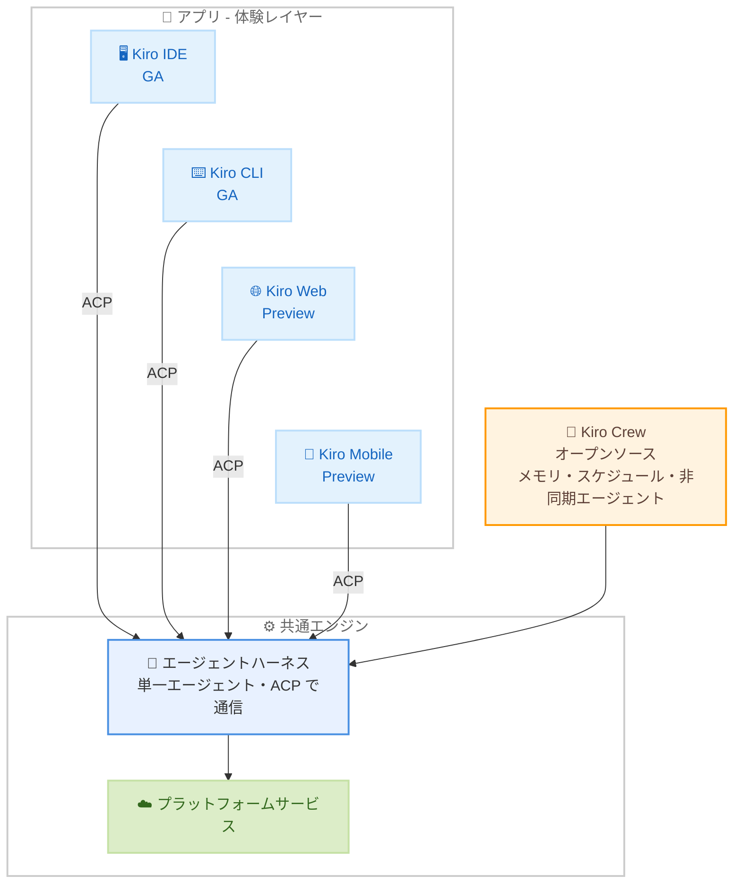

# Kiro - どの Kiro アプリを選ぶべきか? (Which Kiro app should I pick?)

**リリース日**: 2026年8月12日
**サービス**: Kiro
**機能**: Kiro アプリポートフォリオ (IDE / CLI / Web / Mobile / Crew) の位置付けと選び方

📊 [このアップデートのインフォグラフィックを見る](https://takech9203.github.io/aws-news-summary/20260812-kiro-which-kiro-app-should-i-pick.html)

## 概要

Kiro 公式ブログにて、「どの Kiro アプリを選ぶべきか?」という利用者からの定番の質問に答える解説記事が公開されました。Kiro は現在、IDE、CLI、Web、Mobile、Crew という複数のアプリ (フロントドア) を提供していますが、これらはすべて単一の「エージェントハーネス」という共通エンジンの上に構築されています。記事では、この統合アーキテクチャの背景と、各アプリの位置付け、そしてタスクに応じた選び方のフレームワークが示されています。

記事の核心は「どれか 1 つを選ぶ」という問い自体が誤りであり、正しい問いは「このタスクにはどのアプリか?」であるという点です。ハーネスがエージェントの能力 (何ができるか) を定義し、アプリは体験 (どう使うか) を定義するという意図的な分離により、どのアプリを選んでも同じエンジンの能力を利用でき、複数アプリの併用が前提の設計になっています。

Kiro を利用する開発者だけでなく、PM、アーキテクト、QA リード、運用担当者など、ソフトウェアデリバリーに関わるすべてのロールが対象読者です。

**アップデート前の課題**

以前の Kiro は、アプリごとに独立したエージェント実装を抱えていました。

- IDE は TypeScript、CLI は Rust、Web は Python と、3 つの別々の「頭脳」が存在していた
- セッションの保存形式や権限の扱いがアプリ間で互換性がなく、動作が一貫しなかった
- 新機能を追加するたびに 3 回実装する必要があり、機能追加の速度と一貫性に課題があった
- 利用者から見ると「どのアプリを選ぶべきか」が分かりにくく、選択がロックインのように感じられた

**アップデート後の改善**

単一のエージェントハーネスへの統合により、以下が実現されています。

- ハーネスに追加されたコア機能は、すべてのサーフェス (アプリ) に同時に反映される
- どのアプリを使っても動作が一貫し、セッションはラップトップで開始し、クラウドで実行を継続し、スマートフォンから確認できる
- Skills、Steering ファイル、カスタムエージェント、各種設定はハーネス側に紐付くため、アプリを移動しても環境を再構築する必要がない
- アプリの選択は「壁に囲まれた庭」ではなく「玄関 (front door)」の選択となり、タスクごとに使い分けられる

## アーキテクチャ図



すべてのアプリは横方向 (アプリ同士) ではなく下方向 (共通ハーネス) に収束します。ハーネスはコードの隣でスタンドアロンプロセスとして動作し、各アプリとは ACP (Agent Client Protocol) という明確に定義されたプロトコルで通信します。

## サービスアップデートの詳細

### アプリ選定の背後にある 2 つの原則

1. **Kiro はソフトウェアデリバリーライフサイクルに奉仕する**
   - 開発者を第一としつつ、PM、プロジェクトマネージャー、アーキテクト、QA リード、UX デザイナー、Ops / DevOps 担当者まで「ソフトウェアを出荷する人々」のためにアプリを構築する
   - 判断基準は「この人は開発者か?」ではなく「これはソフトウェアの出荷という行為に役立つか?」
   - 汎用的な「万人向け AI アシスタント」は意図的に構築しない

2. **ビルダーの現在地で出会い、前進を助ける**
   - ファイルと関数の中で生きる「コードファースト」層と、エージェントをオーケストレーションしコードを副産物と捉える「エージェントファースト」層の両方に対応する
   - 業界の主流は依然コードファーストだが、エージェントファーストが業界の向かう先であるため、エージェントファーストの世界に向けて構築しつつ、両者の間にシンプルで文脈に沿ったオンランプ (移行経路) を用意する

### 各アプリの位置付け

1. **Kiro IDE: ホームベース (GA)**
   - Code OSS ベースのエディタで、多くの人が「Kiro」と言うときに指すプライマリサーフェス
   - エンタープライズチームの主流開発者にとってのホームベース
   - 実験的機能の Agent Focus Mode により、Code Focus (従来のコード中心の編集) と Agent Focus (複数セッションの並列オーケストレーション) をエディタ内でトグル切り替え可能。エージェントファーストの世界への「オンランプ」と位置付けられる

2. **Kiro CLI: ターミナルとパイプライン (GA)**
   - 2 つの異なるオーディエンスに対応: (1) ターミナルを好む開発者 (4〜6 セッションを並列実行する使い方も一般的)、(2) 人間が介在しない自動化 (シェルスクリプト、GitHub / GitLab の CI/CD パイプラインへの組み込み)
   - 自動化ユースケースは、エンジンと体験が分離されているからこそ可能な「UI なしの Kiro」
   - フル TUI の提供後、一部ユーザーには過剰だったため lite モードを追加。「より多くのサーフェスが常に有用とは限らない」という学びが共有されている

3. **Kiro on the web: クラウドファーストサーフェス (Preview)**
   - コラボレーション、作業の開始、バックグラウンドエージェントの監視のためのクラウドファーストな場所
   - IDE や CLI からクラウドエージェントを直接起動できるようになった現在、Web の実質的な役割は「すべてのクラウドセッションを一箇所で監視・操縦するコントロールプレーン」に進化している
   - スペック駆動開発は元々 IDE 専用機能だったが、ワークフローがハーネスに移動したことで、個別の再実装なしに Web でも利用可能になった。これが統合アーキテクチャの配当の具体例

4. **Kiro Mobile: 外出先の Kiro (Preview)**
   - バックグラウンドエージェントの監視、結果のレビュー、アクションの承認、長時間タスクの後押しなど、デスクにいなくてもよい操作に特化
   - スマートフォンからローカルのラップトップセッションに到達する機能は、今後の課題として明示されている

5. **Kiro Crew: アウターハーネス (オープンソース)**
   - 永続メモリ、スケジュールジョブ、非同期バックグラウンドエージェントをバンドルし、「エージェントを 1 つ実行する」を超えて「寝ている間もエージェントのクルー全体を動かし続ける」ための初のオープンソースアプリ
   - チケットキューの トリアージと振り分け、リポジトリ横断のインシデント調査、チェックポイントとリトライを伴うマイグレーションの実行などを委任できる
   - デスクトップアプリ、Web ダッシュボード、TUI、Slack 連携という独自のアプリ群を持つ「フルシステム拡張」であり、厳密にはアプリと呼ぶのはやや還元的と記事内で認めている
   - 前身は Amazon 社内ツール「MeshClaw」。6 か月未満で 39,000 人以上の Amazon ビルダーに利用され、約 500 人がコントリビュートし、597 回の更新 (週約 143 コミットのペース) を経て公開に至った
   - 一部機能はハーネス側と重複しており、出荷を加速するために意図的にアーキテクチャ原則から逸脱したが、今後共有アーキテクチャとの整合を計画している

### 選び方のチートシート

記事の結論として、「やりたいこと」ベースの選択表が提示されています。

| やりたいこと | 選ぶアプリ | 成熟度 |
|------|------|------|
| エディタで AI を織り込みながらコードを書き、Agent Focus Mode でエージェントファーストを覗く | IDE | GA |
| ターミナルで作業する、または人間の介在なしで Kiro を実行する (スクリプト、CI/CD、パイプライン) | CLI | GA |
| 腰を据えてエージェントと働く: すべてのクラウドセッションを一箇所から開始・レビュー・操縦する | Web | Preview |
| 移動中のトランザクショナルな操作: セッションの起動、承認、確認、後押し | Mobile | Preview |
| 最も自律的な作業の委任: メモリ、スケジュール、非同期エージェント、不在中も動き続けるクルー | Crew | オープンソース |

重要なのは、これらの答えがすべて「アイデンティティ」ではなく「タスク」である点です。同じエンジンを共有しているため、デスクでは IDE、パイプラインでは CLI、電車では Mobile、常時稼働の作業には Crew と、すべてを同時に使い分けられます。

## 技術仕様

### 統合アーキテクチャの要点

| 項目 | 詳細 |
|------|------|
| エージェントハーネス | 単一のエージェント実装。コードの隣でスタンドアロンプロセスとして動作 |
| 通信プロトコル | ACP (Agent Client Protocol) |
| 統合前の構成 | IDE は TypeScript、CLI は Rust、Web は Python の 3 つの独立実装 |
| 設定の可搬性 | Skills、Steering ファイル、カスタムエージェント、設定はハーネスに紐付く (現時点では特定のアプリ組み合わせで有効、全組み合わせへの拡大が方向性) |
| セッション継続性 | ラップトップで開始、クラウドで継続、スマートフォンから確認まで同一エージェントで一貫 |

### アプリポートフォリオ

| アプリ | 成熟度 | 主なオーディエンス |
|------|------|------|
| Kiro IDE | GA | エンタープライズチームの主流開発者 |
| Kiro CLI | GA | ターミナル指向の開発者、CI/CD 自動化 |
| Kiro on the web | Preview | フロンティア開発者、チーム、PM やリードなど隣接ロール |
| Kiro Mobile | Preview | 外出先でセッションを監視・承認したいすべてのユーザー |
| Kiro Crew | オープンソース (GA 相当の品質・サポート基準) | パワーユーザー、フロンティア開発者 |

## メリット

### ビジネス面

- **ロックインのない選択**: どのアプリを選んでも同じエンジンの能力を利用できるため、アプリ選定が「間違えられない賭け」になり、導入判断のリスクが低い
- **幅広いロールのカバー**: 開発者に加えて PM、QA、Ops など、ソフトウェアデリバリーに関わるロール全体が自分に合ったサーフェスから参加できる
- **段階的な移行**: コードファーストからエージェントファーストへ、チームが自分のペースで移行できるオンランプが用意されている

### 技術面

- **機能の即時展開**: ハーネスに一度実装された機能 (例: スペック駆動開発) が、再実装なしで全サーフェスに展開される
- **環境の可搬性**: Skills や Steering などの設定がハーネス側に保持されるため、サーフェスを移動しても環境の再構築が不要
- **ヘッドレス実行**: エンジンと UI の分離により、CI/CD パイプラインなど人間が介在しない完全自動化のユースケースに対応

## デメリット・制約事項

### 制限事項

- Kiro on the web と Kiro Mobile は Preview 段階であり、今後変更される可能性がある
- Mobile からローカルのラップトップセッションへのアクセスは未対応 (今後の課題として明示)
- 設定の可搬性は現時点では特定のアプリ組み合わせでのみ成立しており、全組み合わせへの対応は今後の方向性
- Kiro Crew の一部機能 (常時稼働の自動化、マルチエージェントオーケストレーション、永続メモリ) は共有ハーネスではなく Crew 側に実装されており、ハーネスの機能と重複がある (将来的に整合予定)

### 考慮すべき点

- IDE と Web の Agent Focus 体験は現時点で疎結合であり、フィードバックを募集している段階
- アプリ間の機能重複は意図的な設計 (「排除すべきバグではなく、複数の体験レイヤーが 1 つの基盤に載る際の期待される形」) であるため、単一アプリへの機能集約は方針として想定されていない

## ユースケース

### ユースケース1: エンタープライズチームでの日常開発

**シナリオ**: エンタープライズチームの開発者が、使い慣れたエディタ環境で AI 支援を受けながらコードを書きつつ、エージェント活用も試したい。

**実装例**:
```text
1. Kiro IDE (GA) をホームベースとして利用
2. 通常は Code Focus で従来のコード中心編集
3. Agent Focus Mode に切り替え、複数エージェントセッションを
   並列オーケストレーション
4. 慣れない場合はいつでも Code Focus に戻る
```

**効果**: 既知の環境の安全圏からエージェントファーストの世界を試すことができ、チームのペースで段階的に移行できる。

### ユースケース2: CI/CD パイプラインへの組み込み

**シナリオ**: GitHub / GitLab のパイプラインで、人間の介在なしに Kiro をジョブとして実行したい。

**実装例**:
```text
1. Kiro CLI (GA) をシェルスクリプトでラップ
2. CI/CD パイプラインのステップとして組み込み
3. 会話ではなくジョブとして実行 (UI なしの Kiro)
```

**効果**: エンジンと体験の分離を活かし、レビューやテストの自動化など完全自動のワークフローを構築できる。

### ユースケース3: 不在中も動き続けるエージェントクルーへの委任

**シナリオ**: チケットキューの処理や大規模マイグレーションを、会議中や就寝中もエージェントに進めてほしい。

**実装例**:
```text
1. Kiro Crew (オープンソース) にチケットキューを渡し、
   トリアージと振り分けを委任
2. リポジトリ横断のインシデント調査を並行実行
3. マイグレーションをチェックポイントとリトライ付きで実行
4. 進捗はデスクトップアプリ、Web ダッシュボード、TUI、
   Slack のいずれからでも確認
5. 外出先では Kiro Mobile で承認・確認・後押し
```

**効果**: 「運転する」から「委任する」への移行により、複数エージェントが常時稼働し、過去の指摘や好みをセッションをまたいで記憶した状態で作業が進む。

## 料金

本記事は料金改定の発表ではありません。参考として、kiro.dev に掲載されている料金プランは以下のとおりです (全アプリ共通のエンジンを利用)。

| プラン | 月額 | クレジット |
|--------|------|------------|
| Kiro Free | $0 | 50 クレジット (オープンウェイトモデルと Claude Sonnet 4.5) |
| Kiro Pro | $20 | 1,000 クレジット (プレミアムモデル、追加クレジット $0.04/クレジット) |
| Kiro Pro+ | $40 | 2,000 クレジット |
| Kiro Pro Max | $100 | 5,000 クレジット |
| Kiro Power | $200 | 10,000 クレジット |

最新の情報は [料金ページ](https://kiro.dev/pricing/) を参照してください。

## 利用可能リージョン

Kiro はグローバルに利用可能です。

## 関連サービス・機能

- **Kiro IDE**: Code OSS ベースのエージェンティック IDE。スペック駆動開発の発祥のサーフェス
- **Kiro CLI**: ターミナルおよび CI/CD 自動化向けのコマンドラインインターフェース
- **Kiro Crew**: 永続メモリ・スケジュールジョブ・非同期エージェントを備えたオープンソースのシステム拡張 (旧 Amazon 社内ツール MeshClaw)
- **ACP (Agent Client Protocol)**: ハーネスと各アプリを疎結合に接続するプロトコル

## 参考リンク

- 📊 [インフォグラフィック](https://takech9203.github.io/aws-news-summary/20260812-kiro-which-kiro-app-should-i-pick.html)
- [公式ブログ記事: Which Kiro app should I pick?](https://kiro.dev/blog/which-kiro-app-should-i-pick/)
- [Kiro ドキュメント](https://kiro.dev/docs/)
- [Kiro Changelog](https://kiro.dev/changelog/)
- [Kiro ダウンロード](https://kiro.dev/downloads/)
- [料金ページ](https://kiro.dev/pricing/)

## まとめ

本記事は、Kiro の複数アプリが単一のエージェントハーネスに収束するアーキテクチャを前提に、「どのアプリを永遠に選ぶか」ではなく「このタスク、この瞬間にはどのアプリか」という問いへの転換を促すものです。IDE と CLI は GA、Web と Mobile は Preview、Crew はオープンソースという成熟度を踏まえ、まずは自分の現在の作業スタイルに合う「玄関」から入り、タスクに応じて複数アプリを併用するアプローチが推奨されます。
