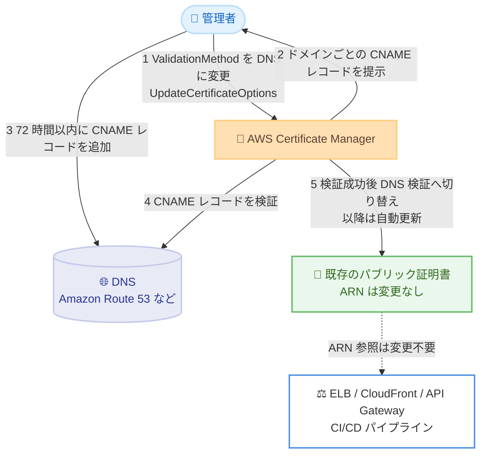

# AWS Certificate Manager - E メール検証から DNS 検証への切り替えサポート

**リリース日**: 2026年8月13日
**サービス**: AWS Certificate Manager (ACM)
**機能**: 既存のパブリック証明書における E メール検証から DNS 検証への切り替え

📊 [このアップデートのインフォグラフィックを見る](https://takech9203.github.io/aws-news-summary/20260813-AWS-Certificate-Manager-Email-DNS-Switch.html)

## 概要

AWS Certificate Manager (ACM) が、既存のパブリック TLS 証明書のドメイン検証方式を E メール検証から DNS 検証へ切り替える機能をサポートしました。切り替えの際に証明書の再発行は不要で、既存の Amazon Resource Name (ARN) も変更されません。そのため、ロードバランサー設定や CI/CD パイプラインなど、証明書 ARN を参照している既存のインフラストラクチャは変更なしでそのまま動作し続けます。

この機能の背景には、CA/Browser Forum による業界全体の方針変更があります。パブリックに信頼される証明書における E メールベースのドメイン検証は 2028 年 3 月 15 日をもって廃止されることが決定しており、ACM も 2027 年中に E メール検証を段階的に終了する予定です。具体的には、2027 年 3 月 31 日に E メール検証による証明書の新規発行を停止し、2027 年 9 月 30 日に E メール検証による証明書の更新を停止します。

E メール検証の証明書を利用中のユーザーは、この機能を使って期限より前に DNS 検証へ移行することで、証明書更新の完全な自動化というメリットも得られます。E メール検証では更新のたびに検証メールの手動承認が必要でしたが、DNS 検証では ACM が自動的に証明書を更新します。

**アップデート前の課題**

- 以前は既存証明書の検証方式を変更できず、DNS 検証へ移行するには新しい証明書を発行して ARN の参照先をすべて更新する必要があった
- E メール検証の証明書は更新のたびに検証メールの手動承認が必要で、承認漏れによる証明書失効のリスクがあった
- 証明書の有効期間が業界全体で短縮される傾向にあり (2027 年 3 月に最大 100 日、2029 年 3 月に最大 47 日へ)、手動更新の運用負荷が増大する見込みだった

**アップデート後の改善**

- 今回のアップデートにより、証明書を再発行せず、ARN を維持したまま E メール検証から DNS 検証へ切り替え可能になった
- ロードバランサーや CI/CD パイプラインなど、既存の ARN 参照を変更する作業が不要になった
- DNS 検証への切り替え後は ACM による証明書の自動更新が有効になり、手動承認の運用負荷と失効リスクが解消された

## アーキテクチャ図



既存の E メール検証証明書を DNS 検証へ切り替える流れを示しています。証明書の ARN は変更されないため、証明書を参照する AWS リソースや CI/CD パイプラインの設定変更は不要です。

## サービスアップデートの詳細

### 主要機能

1. **証明書の再発行なしで検証方式を切り替え**
   - 既存のパブリック証明書の検証方式を E メール検証から DNS 検証へ変更可能
   - 証明書の ARN は変更されないため、ELB、CloudFront、API Gateway などの AWS 統合や CI/CD パイプラインの参照はそのまま動作
   - ACM コンソールまたは `UpdateCertificateOptions` API から実行可能

2. **ドメインごとの CNAME レコードによる検証**
   - 切り替えを開始すると、証明書に含まれる各ドメインに対して CNAME レコードが提示される (新規の DNS 検証証明書と同じ仕組み)
   - CNAME レコードを DNS 設定に追加するための猶予は最大 72 時間
   - Amazon Route 53 を利用している場合はレコード追加を簡単に実施可能

3. **検証ステータスのモニタリング**
   - 新 API `ListCertificateDomainValidations` により、ドメインごとの検証設定と検証ステータスを確認可能
   - 現在有効な検証設定 (`ActiveValidationConfiguration`) とリクエスト中の検証設定 (`RequestedValidationConfiguration`) を区別して取得できる
   - 検証ステータスは `PENDING_VALIDATION`、`SUCCESS`、`FAILED` で表される

## 技術仕様

### E メール検証と DNS 検証の比較

| 項目 | E メール検証 | DNS 検証 |
|------|--------------|----------|
| 検証方法 | ドメイン管理者宛の検証メールを承認 | ACM が提示する CNAME レコードを DNS に追加 |
| 証明書の自動更新 | 不可 (更新のたびに手動承認が必要) | 可能 (CNAME レコードが存在する限り自動更新) |
| 新規発行の期限 | 2027 年 3 月 31 日に停止 | 継続 (推奨方式) |
| 更新の期限 | 2027 年 9 月 30 日に停止 | 継続 |
| 業界動向 | CA/Browser Forum により 2028 年 3 月 15 日で廃止 | 標準的な検証方式 |

### API変更履歴

| 日付 | サービス | 変更内容 |
|------|----------|----------|
| 2026/08/13 | [acm](https://awsapichanges.com/archive/changes/db5022-acm.html) | 1 new 3 updated api methods - 既存の E メール検証証明書を DNS 検証方式へ更新する機能を追加 |

主な API の変更点は以下のとおりです。

- **`ListCertificateDomainValidations`** (新規): 証明書のドメインごとの検証設定と検証ステータスの一覧を取得
- **`UpdateCertificateOptions`** (更新): `Options` に `ValidationMethod` パラメータ (`EMAIL` | `DNS` | `HTTP`) が追加され、検証方式の切り替えが可能に
- **`DescribeCertificate`**、**`RequestCertificate`** (更新): 検証方式関連の情報が拡張

## 設定方法

### 前提条件

1. E メール検証で発行された既存の ACM パブリック証明書があること
2. 証明書に含まれる各ドメインの DNS レコードを追加できる権限があること (Amazon Route 53 または外部 DNS プロバイダー)
3. `acm:UpdateCertificateOptions` および `acm:ListCertificateDomainValidations` を実行できる IAM 権限があること

### 手順

#### ステップ1: 検証方式を DNS に変更

```bash
aws acm update-certificate-options \
  --certificate-arn arn:aws:acm:ap-northeast-1:123456789012:certificate/xxxxxxxx-xxxx-xxxx-xxxx-xxxxxxxxxxxx \
  --options ValidationMethod=DNS
```

`UpdateCertificateOptions` API で対象証明書の検証方式を DNS に変更します。ACM コンソールからも同様の操作が可能です。

#### ステップ2: 提示された CNAME レコードを確認

```bash
aws acm list-certificate-domain-validations \
  --certificate-arn arn:aws:acm:ap-northeast-1:123456789012:certificate/xxxxxxxx-xxxx-xxxx-xxxx-xxxxxxxxxxxx
```

`ListCertificateDomainValidations` API で、証明書に含まれる各ドメインに対して ACM が提示した CNAME レコード (`Name`、`Type`、`Value`) と検証ステータスを確認します。

#### ステップ3: CNAME レコードを DNS に追加

```bash
# Amazon Route 53 の場合の例
aws route53 change-resource-record-sets \
  --hosted-zone-id Z1234567890ABC \
  --change-batch '{
    "Changes": [{
      "Action": "UPSERT",
      "ResourceRecordSet": {
        "Name": "_xxxxxxxxxxxx.example.com.",
        "Type": "CNAME",
        "TTL": 300,
        "ResourceRecords": [{"Value": "_yyyyyyyyyyyy.acm-validations.aws."}]
      }
    }]
  }'
```

提示された CNAME レコードを 72 時間以内に DNS 設定へ追加します。上記は Route 53 のホストゾーンにレコードを追加する例です。ACM が CNAME レコードを検出して検証に成功すると、検証方式が DNS に切り替わり、以降は自動更新が有効になります。

#### ステップ4: 検証ステータスの確認

ステップ 2 と同じ `ListCertificateDomainValidations` API を実行し、各ドメインの `ValidationStatus` が `SUCCESS` になっていることを確認します。

## メリット

### ビジネス面

- **証明書失効リスクの低減**: 検証メールの承認漏れによる証明書失効とサービス停止のリスクを解消できる
- **運用コストの削減**: 更新のたびに必要だった手動承認作業が不要になり、証明書管理の運用負荷を削減できる
- **業界要件への先行対応**: CA/Browser Forum による E メール検証廃止 (2028 年 3 月 15 日) および ACM の段階的終了 (2027 年) に余裕をもって対応できる

### 技術面

- **ARN の維持**: 証明書 ARN が変更されないため、ELB、CloudFront、API Gateway、CI/CD パイプラインなどの参照設定を変更する必要がない
- **自動更新の実現**: DNS 検証への切り替え後は、CNAME レコードが存在する限り ACM が証明書を自動更新する
- **API によるモニタリング**: `ListCertificateDomainValidations` API により、ドメインごとの検証状況をプログラムから追跡できる

## デメリット・制約事項

### 制限事項

- CNAME レコードの追加期限は切り替え開始から最大 72 時間であり、期限内に追加できない場合は再度切り替え操作が必要になる
- 対象はパブリック証明書のみ (プライベート証明書は対象外)
- 証明書に含まれるすべてのドメインについて CNAME レコードの追加が必要

### 考慮すべき点

- DNS 設定を外部プロバイダーで管理している場合、レコード追加の社内プロセスに時間がかかる可能性があるため、72 時間の期限を考慮して計画する
- 自動更新を継続するには、検証用 CNAME レコードを削除せずに維持する必要がある
- Amazon CloudFront ディストリビューション向けには、AWS は用途に応じて HTTP 検証も推奨している (新規証明書の場合)
- 2027 年 3 月 31 日以降は E メール検証による新規発行が、2027 年 9 月 30 日以降は更新が停止されるため、早めの移行計画が推奨される

## ユースケース

### ユースケース1: 本番環境のロードバランサーで使用中の証明書の移行

**シナリオ**: E メール検証で発行した証明書を Application Load Balancer に関連付けて本番運用しており、サービスを止めずに DNS 検証へ移行したい。

**実装例**:
```bash
# 検証方式を DNS に変更 (ALB との関連付けはそのまま)
aws acm update-certificate-options \
  --certificate-arn <certificate-arn> \
  --options ValidationMethod=DNS

# CNAME レコードを確認して Route 53 に追加
aws acm list-certificate-domain-validations --certificate-arn <certificate-arn>
```

**効果**: ARN が変更されないため ALB のリスナー設定は変更不要で、ダウンタイムなしで DNS 検証へ移行できる。以降の更新は自動化される。

### ユースケース2: 多数の E メール検証証明書の棚卸しと一括移行

**シナリオ**: 複数の AWS アカウント・リージョンに E メール検証の証明書が散在しており、2027 年の期限までに計画的に移行したい。

**実装例**:
```bash
# E メール検証の証明書を洗い出すスクリプトの例
for arn in $(aws acm list-certificates --query 'CertificateSummaryList[].CertificateArn' --output text); do
  method=$(aws acm describe-certificate --certificate-arn "$arn" \
    --query 'Certificate.DomainValidationOptions[0].ValidationMethod' --output text)
  if [ "$method" = "EMAIL" ]; then
    echo "EMAIL validation: $arn"
  fi
done
```

**効果**: 移行対象を特定し、`UpdateCertificateOptions` API を用いた自動化スクリプトで計画的に DNS 検証へ移行できる。証明書失効による障害を未然に防止できる。

### ユースケース3: 証明書有効期間短縮への備え

**シナリオ**: CA/Browser Forum の方針により証明書の最大有効期間が段階的に短縮される (2027 年 3 月に 100 日、2029 年 3 月に 47 日) ため、更新頻度の増加に耐えられる運用体制を構築したい。

**実装例**:
```bash
# 検証ステータスを定期的に監視する例
aws acm list-certificate-domain-validations \
  --certificate-arn <certificate-arn> \
  --query 'DomainValidationSummaryList[].{Domain:DomainName,Status:ActiveValidationConfiguration.ValidationStatus}'
```

**効果**: DNS 検証による自動更新に移行することで、更新頻度が増加しても手動作業なしで証明書を維持でき、運用体制をスケールさせずに対応できる。

## 料金

ACM が発行するパブリック証明書は無料で利用できます。E メール検証から DNS 検証への切り替えにも追加料金は発生しません。

Amazon Route 53 を DNS として利用する場合は、ホストゾーンとクエリに対する Route 53 の標準料金が適用されます。

## 利用可能リージョン

ACM 証明書が提供されているすべての AWS リージョンで利用可能です (東京・大阪リージョンを含む)。

## 関連サービス・機能

- **Amazon Route 53**: 検証用 CNAME レコードの追加先となる DNS サービス。Route 53 を利用している場合はコンソールからのレコード作成が容易
- **Elastic Load Balancing / Amazon CloudFront / Amazon API Gateway**: ACM 証明書を関連付ける代表的なサービス。ARN が維持されるため設定変更は不要
- **ACM の ACME サポート**: 2026 年 8 月に発表された ACME プロトコル対応により、証明書管理の自動化がさらに強化されている

## 参考リンク

- 📊 [インフォグラフィック](https://takech9203.github.io/aws-news-summary/20260813-AWS-Certificate-Manager-Email-DNS-Switch.html)
- [公式発表 (What's New)](https://aws.amazon.com/about-aws/whats-new/2026/08/AWS-Certificate-Manager-Email-DNS-Switch)
- [AWS Security Blog: AWS Certificate Manager will discontinue email validation to prove domain validation for certificates](https://aws.amazon.com/blogs/security/aws-certificate-manager-will-discontinue-email-validation-to-prove-domain-validation-for-certificates/)
- [ドキュメント: Migrating from email to DNS validation](https://docs.aws.amazon.com/acm/latest/userguide/email-to-dns-migration.html)
- [API リファレンス: UpdateCertificateOptions](https://docs.aws.amazon.com/acm/latest/APIReference/API_UpdateCertificateOptions.html)
- [API リファレンス: ListCertificateDomainValidations](https://docs.aws.amazon.com/acm/latest/APIReference/API_ListCertificateDomainValidations.html)
- [料金ページ](https://aws.amazon.com/certificate-manager/pricing/)

## まとめ

ACM の既存パブリック証明書を、再発行や ARN 変更なしで E メール検証から DNS 検証へ切り替えられるようになりました。E メール検証は 2027 年 3 月 31 日に新規発行、同年 9 月 30 日に更新が停止されるため、E メール検証の証明書を利用中の場合は、`DescribeCertificate` などで対象を棚卸しし、早期に DNS 検証への移行を計画することを推奨します。
