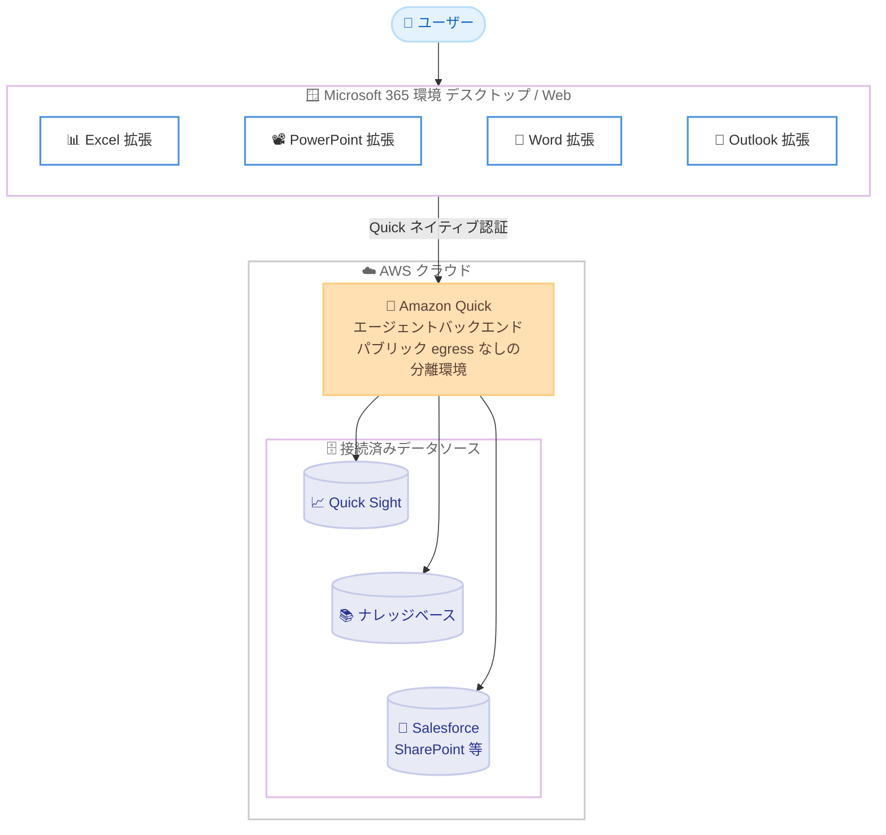

# Amazon Quick - Microsoft 365 拡張機能の一般提供開始

**リリース日**: 2026 年 8 月 13 日
**サービス**: Amazon Quick
**機能**: Microsoft 365 extensions (Excel、PowerPoint、Word、Outlook 向け拡張機能)

📊 [このアップデートのインフォグラフィックを見る](https://takech9203.github.io/aws-news-summary/20260813-amazon-quick-microsoft-365-extensions-generally-available.html)

## 概要

Amazon Quick の Microsoft 365 拡張機能 (Excel、PowerPoint、Word、Outlook 向け) が一般提供開始されました。この拡張機能により、Quick がユーザーの Microsoft 365 環境内で直接タスクを実行できるようになります。AI を活用して、ドキュメントの変更履歴付き校閲 (レッドライン)、財務モデルの構築、プレゼンテーション資料の作成、Outlook の受信トレイ管理といった複雑なローカルタスクを処理します。

Amazon Quick は、Quick Sight ダッシュボード、Salesforce、Jira、Slack、SharePoint などのエンタープライズデータに接続された AI アシスタントです。今回の拡張機能は単なるチャットアシスタントではなく、ドキュメント内で実際にアクションを実行する「エージェント型」である点が特徴です。テキストの編集、セルの変更、スライドの生成、メールの下書き作成などを、既存の Quick 環境に設定されたナレッジベース、データソース、アクセス許可を継承したうえで実行します。

対象ユーザーは、財務、営業、マーケティング、法務、オペレーション、IT など、Microsoft 365 を日常業務で利用するすべてのチームです。デスクトップ版と Web 版の両方の Microsoft 365 アプリで利用できます。

**アップデート前の課題**

これまで、エンタープライズデータを活用した AI アシスタントと Microsoft 365 での実作業は分断されていました。

- Quick で得た分析結果や回答を、手作業で Excel、PowerPoint、Word にコピーして整形する必要があった
- CRM やデータウェアハウスのデータを参照しながら資料を作成する際、アプリケーション間の切り替えとデータ転記が必要だった
- メールの整理、返信の下書き、会議の調整などの受信トレイ業務を、社内データを参照しながら自動化する手段がなかった

**アップデート後の改善**

今回のアップデートにより、Microsoft 365 アプリ内で Quick のエージェント機能を直接利用できるようになりました。

- Excel、PowerPoint、Word、Outlook の内部で Quick が直接タスクを実行し、アプリケーション間のコピーや転記が不要になった
- 既存の Quick 環境のデータソース、ナレッジベース、アクセス許可をそのまま継承し、追加のデータ連携設定なしで利用可能になった
- エージェントによるすべての編集は変更前後の比較付きで追跡され、監査可能性が確保された

## アーキテクチャ図



Microsoft 365 アプリ内の拡張機能が AWS クラウド上の Amazon Quick バックエンドと連携し、既存の Quick 環境に接続されたデータソースとアクセス許可を継承してエージェントタスクを実行する構成です。

## サービスアップデートの詳細

### 主要機能

1. **Excel 拡張機能**
   - 複雑なスプレッドシート分析、ピボットテーブルやグラフの作成、データのインポートとクレンジングを支援
   - 数式の説明と依存関係の追跡、異常値の検出が可能
   - Quick Sight、Salesforce、SharePoint、データウェアハウスなどの外部データを直接取り込み、ライブメトリクスに対するモデルの検証も実行

2. **PowerPoint 拡張機能**
   - 組織で定義されたテンプレート (スライドマスターやブランドテンプレート) を使用して、Quick のデータからプレゼンテーションを作成・改善
   - データドリブンなグラフの生成に対応
   - Excel での分析結果を経営会議向け資料に変換するといった連携が可能

3. **Word 拡張機能**
   - Word のプリミティブ (書式要素) を使用したフォーマット済みドキュメントの生成
   - 変更履歴 (track changes) を有効にした一括編集に対応し、既存のフォントやスタイルを尊重して共同編集
   - コメント機能を通じてレビュアーとして参加可能

4. **Outlook 拡張機能**
   - メールの優先順位付け、受信トレイの整理、会議のスケジューリング、返信の下書き作成を実行
   - Quick のデータと受信トレイ全体のコンテキストを活用し、スレッドの文脈を自動的に読み取り
   - スレッドの要約、アクションアイテムの抽出、アジェンダ付き会議の自動生成に対応

5. **監査可能性と会話履歴**
   - エージェントによるすべての編集は、変更前後の比較と影響を受けたコンテンツへの参照付きで追跡
   - 会話履歴はセッションをまたいで保持され、Outlook ではメールスレッドごとに個別の会話を維持

## 技術仕様

### 拡張機能の構成

| 項目 | 詳細 |
|------|------|
| 対象アプリ | Excel、PowerPoint、Word、Outlook (デスクトップ版・Web 版) |
| 配布形態 | Microsoft アドインストア経由、または Microsoft 365 管理センターからの管理者一括展開 |
| 認証 | Quick のネイティブ認証を使用 (Microsoft Entra アプリの登録は不要)。エンタープライズ認証情報またはソーシャルログインに対応 |
| バックエンド | クラウドベースで動作し、クライアント側への追加インストールは不要。バックエンドはパブリック egress のない分離環境で実行 |
| データアクセス | 既存の Quick 環境のナレッジベース、データソース、インテグレーション、アクセス許可を継承 |
| 更新 | 自動更新 |

### 前提となる Quick 環境

| 項目 | 詳細 |
|------|------|
| Quick アプリケーション | アクティブな Amazon Quick 環境が必要 |
| データソース例 | Quick Sight ダッシュボード、Salesforce、Jira、Slack、SharePoint、AWS 上のデータ |
| カスタマイズ | マニフェストまたはポリシーによるブランディングと設定の調整が可能 |

## 設定方法

### 前提条件

1. アクティブな Amazon Quick 環境 (対応リージョンでのセットアップ)
2. Microsoft 365 のライセンスと対象アプリ (Excel、PowerPoint、Word、Outlook)
3. Outlook 拡張機能を利用する場合、多くの組織では Microsoft 365 管理者の承認 (Graph API のアクセス許可制限のため)

### 手順

#### ステップ 1: 拡張機能の入手

Quick のダウンロードページ (https://aws.amazon.com/quick/download/) にアクセスするか、Microsoft アドインストアで「Quick」を検索して拡張機能を入手します。個々のユーザーによるセルフインストールが可能です。

#### ステップ 2: 管理者による一括展開 (組織展開の場合)

Microsoft 365 管理センターから、標準のマニフェストを使用して組織全体に拡張機能を展開します。Outlook 拡張機能は Graph API のアクセス許可が制限されているため、通常は管理者による承認と展開が必要です。組織展開を計画する際は、管理者側での事前準備を推奨します。

#### ステップ 3: サインインと利用開始

Microsoft 365 アプリ内で拡張機能を開き、Quick のネイティブ認証でサインインします。Microsoft Entra アプリの登録は不要です。サインイン後は、既存の Quick 環境に設定済みのデータソースとアクセス許可がそのまま適用されます。

## メリット

### ビジネス面

- **業務時間の短縮**: 財務モデルの構築、提案書の作成、ブランド準拠のプレゼンテーション作成など、これまで手作業だったタスクを自然言語の指示で自動化できる
- **チーム横断の生産性向上**: 財務、営業、マーケティング、法務、オペレーション、IT の各チームがそれぞれの日常業務で活用できる
- **追加ライセンス費用が不要**: Quick の Plus、Professional、Enterprise プランの利用者は追加費用なしで利用可能

### 技術面

- **既存環境の継承**: Quick 環境に設定済みのナレッジベース、データソース、アクセス許可をそのまま利用でき、追加のデータ連携構築が不要
- **セキュアなアーキテクチャ**: バックエンドはパブリック egress のない分離環境で動作し、データレジデンシー制御に対応
- **監査可能性**: エージェントのすべての編集が変更前後の比較付きで追跡され、ガバナンス要件に対応しやすい

## デメリット・制約事項

### 制限事項

- Outlook 拡張機能は Graph API のアクセス許可制限により、多くの組織で管理者の承認が必要
- 利用にはアクティブな Amazon Quick 環境が前提となる
- 提供リージョンが限定されている (下記「利用可能リージョン」参照)

### 考慮すべき点

- エージェントがドキュメントやメールに対して直接編集を行うため、組織のガバナンスポリシーに沿った利用ルールの整備を推奨
- 拡張機能は既存の Quick 環境のアクセス許可を継承するため、事前に Quick 側のデータソースと許可設定の見直しが望ましい
- Microsoft Purview との DLP 統合 (2026 年 8 月 12 日発表) と組み合わせることで、機密ファイルの取り扱い制御を強化できる

## ユースケース

### ユースケース 1: 財務チームによる財務モデルの構築

**シナリオ**: 財務アナリストが四半期予測のための財務モデルを Excel で構築する。従来はデータウェアハウスからのデータ抽出、クレンジング、モデル構築を手作業で行っていた。

**実装例**:
```
Excel 拡張機能への指示例:
「データウェアハウスから直近 8 四半期の売上データを取り込み、
 製品カテゴリ別のピボットテーブルと成長率の推移グラフを作成して。
 異常値があればフラグを立てて」
```

**効果**: 必要なモデルを自然言語で記述するだけで構築でき、データ取り込みからクレンジング、可視化までの手作業を大幅に削減できる。ライブメトリクスに対するモデル検証により精度も向上する。

### ユースケース 2: 営業チームによる CRM データを活用した提案書作成

**シナリオ**: 営業担当者が顧客向け提案書を Word で作成する。顧客情報や過去の取引履歴は Salesforce に格納されている。

**実装例**:
```
Word 拡張機能への指示例:
「Salesforce の顧客 A 社の情報をもとに提案書のドラフトを作成して。
 過去の導入実績セクションには直近の取引データを表形式で挿入して。
 編集は変更履歴を有効にして実施して」
```

**効果**: CRM データが自動的に提案書へ反映され、転記ミスの防止と作成時間の短縮を実現できる。変更履歴付きの編集により、レビュープロセスにも自然に組み込める。

### ユースケース 3: オペレーションチームによる受信トレイ管理の自動化

**シナリオ**: オペレーションマネージャーが大量のメールを処理しており、優先順位付け、返信、会議調整に多くの時間を費やしている。

**実装例**:
```
Outlook 拡張機能への指示例:
「今日の受信メールを優先度順に整理して。
 このスレッドの論点を要約し、アクションアイテムを抽出して。
 関係者との 30 分の会議をアジェンダ付きでスケジュールして」
```

**効果**: 受信トレイ全体のコンテキストと Quick のデータを活用したインテリジェントなメール処理により、日々の受信トレイ業務の負荷を大幅に軽減できる。

## 料金

Amazon Quick の Plus、Professional、Enterprise プランの利用者は、追加のライセンス費用なしで Microsoft 365 拡張機能を利用できます。新規ユーザー向けには無料トライアルが提供されています。

料金の詳細は [Amazon Quick の料金ページ](https://aws.amazon.com/quick/pricing/) を参照してください。

## 利用可能リージョン

公式発表 (What's New) では以下の 6 リージョンで利用可能とされています。

- 米国東部 (バージニア北部)
- 米国西部 (オレゴン)
- アジアパシフィック (東京)
- アジアパシフィック (シドニー)
- 欧州 (アイルランド)
- 欧州 (フランクフルト)

なお、AWS Blog 記事では上記に加えて欧州 (ロンドン) を含む 7 リージョンと記載されており、データレジデンシー制御に対応しています。

## 関連サービス・機能

- **Amazon Quick**: エンタープライズデータに接続された AI アシスタント。本拡張機能のバックエンドとして動作する
- **Amazon Quick Sight**: BI サービス。ダッシュボードのデータを Excel 分析や PowerPoint 資料に直接活用できる
- **Microsoft Purview との DLP 統合**: 2026 年 8 月 12 日に発表された機能。Purview の秘密度ラベルを Quick 環境に適用し、機密ファイルの取り扱いを制御できる

## 参考リンク

- 📊 [インフォグラフィック](https://takech9203.github.io/aws-news-summary/20260813-amazon-quick-microsoft-365-extensions-generally-available.html)
- [公式発表 (What's New)](https://aws.amazon.com/amazon-quick-microsoft-365-extensions-generally-available)
- [AWS Blog: Amazon Quick for Microsoft 365: Agentic AI where you work](https://aws.amazon.com/blogs/machine-learning/amazon-quick-for-microsoft-365-agentic-ai-where-you-work/)
- [Quick ダウンロードページ](https://aws.amazon.com/quick/download/)

## まとめ

Amazon Quick の Microsoft 365 拡張機能の一般提供開始により、エンタープライズデータに接続されたエージェント型 AI を Excel、PowerPoint、Word、Outlook の内部で直接利用できるようになりました。既存の Quick 環境のデータソースとアクセス許可を継承するため、追加のデータ連携構築なしで導入できる点が大きな特徴です。Quick を利用中の組織は、ダウンロードページから拡張機能を入手し、Outlook 拡張機能については管理者展開の計画を含めて評価を開始することを推奨します。
