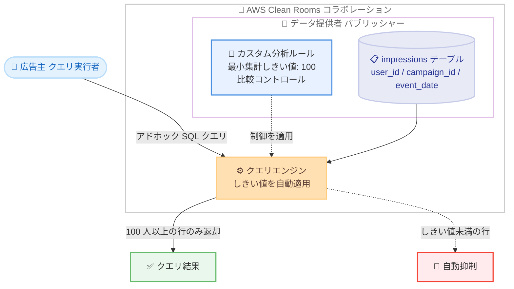

# AWS Clean Rooms - カスタム分析ルールでの最小集計しきい値サポート

**リリース日**: 2026年8月13日
**サービス**: AWS Clean Rooms
**機能**: カスタム分析ルールにおける最小集計しきい値 (Minimum Aggregation Thresholds)

📊 [このアップデートのインフォグラフィックを見る](https://takech9203.github.io/aws-news-summary/20260813-aws-clean-rooms-minimum-aggregation-custom-analysis-rules.html)

## 概要

AWS Clean Rooms が、カスタム分析ルール (Custom analysis rule) タイプで最小集計しきい値 (Minimum Aggregation Thresholds) をサポートしました。この機能により、クエリ結果のすべての行が指定した数以上の異なるデータ主体 (例: ユーザー ID) を表すことが保証され、個人や少人数グループに関する情報が漏洩するリスクを自動的に防止できます。

データ提供者はアイデンティティ列 (identity column) を指定し、クエリ出力で満たすべき最小アイデンティティ数を設定します。さらに、特定の出力列に対して個別のしきい値を上書き設定したり、比較コントロール (Comparison Controls) によってフィルタリングやテーブル間の結合に使用できる列を制限したりすることも可能です。

このアップデートは、広告測定、メディアプランニング、オーディエンス分析などでパートナー企業とデータコラボレーションを行う企業にとって、プライバシー保護とクエリの柔軟性を両立できる重要な機能強化です。

**アップデート前の課題**

- 以前は、カスタム SQL クエリに集計しきい値のような保護を適用するには、事前承認済みの分析テンプレート (Analysis Template) と手動のコードレビューが必要だった
- データ提供者は、パートナーが実行するクエリを 1 つずつレビューする運用負荷を負う必要があった
- アドホックなクエリを許可すると、少人数グループを特定するような結果が返るリスクを制御できなかった

**アップデート後の改善**

- 事前構造化されたクエリや承認ワークフローなしで、カスタム分析ルールに直接しきい値を設定できるようになった
- クエリ結果の各行が最低 N 人の異なるデータ主体を表すことが自動的に保証され、しきい値未満の行は自動的に抑制される
- 出力列ごとのしきい値上書きや、リテラル比較・列間比較を許可する列の制御により、きめ細かなプライバシー制御が可能になった

## アーキテクチャ図



データ提供者がカスタム分析ルールに最小集計しきい値を設定すると、クエリ実行者のアドホッククエリに対して AWS Clean Rooms が自動的にしきい値を適用し、条件を満たさない行を結果から抑制します。

## サービスアップデートの詳細

### 主要機能

1. **最小集計しきい値 (Aggregation Thresholds)**
   - アイデンティティ列 (`identityColumns`) と最小アイデンティティ数 (`minimumIdentityCount`) を指定し、クエリ結果の各行が最低 N 人の異なるデータ主体を表すことを保証
   - `minimumIdentityCount` は 2〜100,000 の範囲で設定可能
   - アイデンティティ列は `string`、`varchar`、`char` 型である必要がある
   - 集計タイプは `COUNT_DISTINCT` (異なる値のカウント)

2. **出力列ごとのしきい値の上書き (Output Column Thresholds)**
   - 出力列の機密性レベルに応じて、列ごとに異なる `minimumIdentityCount` を適用可能
   - 例: 低機密の `campaign_id` にはしきい値 5、高機密の `postal_code` や `income_bracket` にはしきい値 100 を適用
   - 上書き値に `0` を指定すると、その列を最小集計の対象から除外できる

3. **集計関数内のネスト式の制御 (Allowed Aggregate Expression Type)**
   - デフォルトは `COLUMNS_ONLY` で、集計関数内には列のみ許可 (例: `SUM(cost)`、`COUNT(DISTINCT campaign_id)`)。プライバシー強化構成として推奨
   - 信頼できるパートナーとのコラボレーションでは `ANY_EXPRESSION` を許可し、`SUM(cost * quantity)` のような式も利用可能 (ただし再識別リスクが増加するため、プライバシー・法務・コンプライアンスチームへの相談が必要)

4. **比較コントロール (Comparison Controls)**
   - `allowedLiteralComparisonColumns`: リテラル値との比較 (例: `WHERE state = 'New York'`) を許可する列を指定
   - `allowedColumnComparisonColumns`: 列間比較によるテーブル結合 (例: `JOIN ... ON t.user_id = partner.user_id`) を許可する列を指定
   - 郵便番号や年齢層など、カーディナリティが低い準識別子列によって結果が意図せず絞り込まれるリスクを軽減
   - 最小集計しきい値と比較コントロールの併用が推奨構成

## 技術仕様

### 最小集計しきい値のパラメータ

| 項目 | 詳細 |
|------|------|
| `identityColumns` | データ主体を一意に識別する列 (例: `user_id`)。`string`、`varchar`、`char` 型のみ |
| `minimumIdentityCount` | 各結果行が表すべき最小の異なるデータ主体数。2〜100,000 |
| `type` | `COUNT_DISTINCT` (固定) |
| `allowedAggregateExpressionType` | `COLUMNS_ONLY` (デフォルト、推奨) または `ANY_EXPRESSION` |
| `outputColumnThresholds` | 出力列ごとのしきい値の上書き。`0` (除外) または 2〜100,000 |
| `comparisonControls` | リテラル比較および列間比較を許可する列のリスト |

### API変更履歴

| 日付 | サービス | 変更内容 |
|------|----------|----------|
| 2026/08/13 | [cleanrooms](https://awsapichanges.com/archive/changes/db5022-cleanrooms.html) | 8 updated api methods - カスタム分析ルールタイプへの最小集計しきい値と比較コントロールのサポート追加 |

### カスタム分析ルールの設定例

```json
{
  "aggregationThresholds": [
    {
      "identityColumns": [
        "user_id"
      ],
      "minimumIdentityCount": 100,
      "type": "COUNT_DISTINCT",
      "allowedAggregateExpressionType": "COLUMNS_ONLY",
      "outputColumnThresholds": [
        {
          "outputColumnName": "campaign_id",
          "minimumIdentityCount": 5
        }
      ]
    }
  ],
  "comparisonControls": {
    "allowedLiteralComparisonColumns": [
      "campaign_id",
      "event_date"
    ],
    "allowedColumnComparisonColumns": [
      "user_id"
    ]
  },
  "allowedAnalyses": [
    "ANY_QUERY"
  ],
  "allowedAnalysisProviders": [
    "444455556666"
  ]
}
```

この例では、すべての結果行が最低 100 人の異なるユーザーを表すことを要求しつつ、低機密の `campaign_id` 列にはしきい値 5 を適用し、`campaign_id` と `event_date` でのリテラルフィルタリングと `user_id` での結合を許可しています。

## 設定方法

### 前提条件

1. AWS Clean Rooms のコラボレーションが作成済みであること
2. 設定済みテーブル (Configured Table) が作成済みであること
3. アイデンティティ列が `string`、`varchar`、`char` 型であること

### 手順

#### ステップ1: カスタム分析ルールの設定を開始

1. [AWS Clean Rooms コンソール](https://console.aws.amazon.com/cleanrooms/home) を開く
2. 左ナビゲーションペインで [Tables] を選択し、対象の設定済みテーブルを選択
3. [Configure analysis rule] を選択し、分析ルールタイプで [Custom] を選択
4. [Review each new analysis] (分析テンプレートをレビュー) または [Allow any analysis by specific collaborators] (特定のコラボレーターの任意の分析を許可) を選択

#### ステップ2: 最小集計しきい値を設定

1. [Specify analysis results controls - optional] で、[Enforce aggregation thresholds?] に [Yes] を選択
2. アイデンティティ列を選択し、最小アイデンティティ数 (2〜100,000) を指定
3. [Allow nested expressions in aggregate functions?] はデフォルトの [No] のまま維持 (プライバシー強化構成)
4. (オプション) [Add column override] で出力列ごとのしきい値の上書きを追加

#### ステップ3: 比較コントロールを設定 (推奨)

1. デフォルトではすべての列が比較に使用可能。[Custom list] を選択して明示的に制限する構成が推奨
2. リテラル比較を許可する列と、列間比較 (結合) を許可する列をそれぞれ選択
3. 設定内容をレビューし、[Configure analysis rule] を選択
4. 設定済みテーブルをコラボレーションに関連付ける

## メリット

### ビジネス面

- **運用負荷の削減**: 分析テンプレートごとの手動コードレビューが不要になり、データコラボレーションの立ち上げと運用が高速化される
- **パートナー体験の向上**: クエリ実行者は事前承認を待たずにアドホックな分析を実行でき、メディアプランニングなどの反復的な分析サイクルが短縮される
- **プライバシーコンプライアンスの強化**: 個人や少人数グループの情報が結果に含まれないことをサービス側で機械的に保証できる

### 技術面

- **自動的な行レベル抑制**: しきい値未満の行はクエリ結果から自動的に抑制されるため、クエリ側での対策が不要
- **列単位のきめ細かな制御**: 出力列ごとのしきい値の上書きにより、列の機密性レベルに応じた柔軟なポリシー設計が可能
- **多層防御**: 最小集計しきい値、比較コントロール、出力禁止列 (Disallowed Output Columns) を組み合わせた多層的なプライバシー制御を構成できる

## デメリット・制約事項

### 制限事項

- 差分プライバシー (Differential Privacy) は、最小集計しきい値および比較コントロールと併用できない
- アイデンティティ列は `string`、`varchar`、`char` 型に限定される
- `minimumIdentityCount` の設定可能範囲は 2〜100,000 (列ごとの上書きでは `0` による除外も可能)

### 考慮すべき点

- しきい値単独では、カーディナリティの低い列や準識別子列 (郵便番号、年齢層など) を使った絞り込みを防げないため、比較コントロールとの併用が推奨される
- `ANY_EXPRESSION` を許可すると `SUM(CASE WHEN zip_code = '10001' THEN salary ELSE 0 END)` のような式で少人数グループを分離できるリスクがあるため、許可前にプライバシー・法務・コンプライアンスチームへの確認が必要
- しきい値未満の行は結果から抑制されるため、クエリ実行者は欠落した行の存在を考慮して分析結果を解釈する必要がある

## ユースケース

### ユースケース1: パブリッシャーと広告主のメディアプランニング

**シナリオ**: パブリッシャー (データ提供者) が広告主とメディアプランニングのコラボレーションを行う。広告主にアドホックなクエリを許可しつつ、共通ユーザーが 1,000 人未満の小規模な地方郵便番号の結果は自動的に除外したい。

**実装例**:
```json
{
  "aggregationThresholds": [
    {
      "identityColumns": ["user_id"],
      "minimumIdentityCount": 1000,
      "type": "COUNT_DISTINCT",
      "allowedAggregateExpressionType": "COLUMNS_ONLY"
    }
  ],
  "allowedAnalyses": ["ANY_QUERY"],
  "allowedAnalysisProviders": ["444455556666"]
}
```

**効果**: 広告主は事前承認なしで自由にメディアプランニング分析を実行でき、パブリッシャーは小規模グループの情報漏洩リスクをサービス側の保証で排除できる。

### ユースケース2: キャンペーンリーチ測定

**シナリオ**: パブリッシャーの `impressions` テーブル (`user_id`、`campaign_id`、`event_date`) に対し、広告主がキャンペーンの日次リーチ (異なるユーザー数) を測定する。

**実装例**:
```sql
SELECT event_date, COUNT(DISTINCT user_id) AS reach
FROM impressions
WHERE event_date >= '2026-01-01' AND campaign_id = 'Holiday Promotion'
GROUP BY event_date;
```

**効果**: 最小集計しきい値 100 を設定しておくことで、100 人以上の異なるユーザーに裏付けられた日付の行のみが返却され、閲覧者が少なかった日の行は自動的に抑制される。個人や少人数グループの情報を明かすことなく日次リーチを把握できる。

### ユースケース3: 機密性レベルに応じた列ごとのしきい値設計

**シナリオ**: データ提供者のテーブルに、機密性の低い `campaign_id` と機密性の高い `postal_code` や `income_bracket` が混在している。列ごとに適切な保護レベルを設定したい。

**実装例**:
```json
{
  "aggregationThresholds": [
    {
      "identityColumns": ["user_id"],
      "minimumIdentityCount": 100,
      "type": "COUNT_DISTINCT",
      "allowedAggregateExpressionType": "COLUMNS_ONLY",
      "outputColumnThresholds": [
        {
          "outputColumnName": "campaign_id",
          "minimumIdentityCount": 5
        }
      ]
    }
  ]
}
```

**効果**: デフォルトしきい値 100 で高機密列を保護しつつ、低機密の `campaign_id` はしきい値 5 に緩和することで、プライバシー保護と分析の有用性のバランスを列単位で最適化できる。

## 料金

最小集計しきい値の利用自体に関する追加料金の記載はなく、AWS Clean Rooms の標準料金体系が適用されます。AWS Clean Rooms はクエリ実行時のコンピューティング使用量に基づいて課金されます。詳細は [AWS Clean Rooms 料金ページ](https://aws.amazon.com/clean-rooms/pricing/) を参照してください。

## 利用可能リージョン

AWS Clean Rooms が利用可能なすべての AWS リージョンで利用できます。最新のリージョン一覧は [AWS リージョン別サービス表](https://docs.aws.amazon.com/general/latest/gr/clean-rooms.html#clean-rooms_region) を参照してください。

## 関連サービス・機能

- **AWS Clean Rooms 分析テンプレート**: 従来の事前承認方式。特定のクエリのみを許可したい場合は引き続き有効な選択肢
- **AWS Clean Rooms Differential Privacy**: 数学的に厳密なプライバシー保護フレームワーク。ただし最小集計しきい値および比較コントロールとは併用不可
- **AWS Clean Rooms 集計分析ルール / リスト分析ルール**: 構造化されたクエリのみを許可する既存の分析ルールタイプ。集計分析ルールにも同様の集計制約の概念があり、今回のアップデートでカスタム分析ルールでも同等の保護が利用可能になった
- **AWS Entity Resolution**: コラボレーション前の ID 解決に利用でき、アイデンティティ列の品質向上に寄与

## 参考リンク

- 📊 [インフォグラフィック](https://takech9203.github.io/aws-news-summary/20260813-aws-clean-rooms-minimum-aggregation-custom-analysis-rules.html)
- [公式発表 (What's New)](https://aws.amazon.com/about-aws/whats-new/2026/08/aws-clean-rooms-minimum-aggregation-custom-analysis-rules)
- [ドキュメント: カスタム分析ルール](https://docs.aws.amazon.com/clean-rooms/latest/userguide/analysis-rules-custom.html)
- [ドキュメント: 最小集計しきい値](https://docs.aws.amazon.com/clean-rooms/latest/userguide/custom-min-agg-thresholds.html)
- [AWS Clean Rooms 製品ページ](https://aws.amazon.com/clean-rooms/)
- [料金ページ](https://aws.amazon.com/clean-rooms/pricing/)

## まとめ

AWS Clean Rooms のカスタム分析ルールに最小集計しきい値が追加され、分析テンプレートの事前レビューなしでアドホッククエリを安全に許可できるようになりました。データコラボレーションを運用しているチームは、比較コントロールとの併用を推奨構成として、既存のカスタム分析ルールへのしきい値追加を検討することをお勧めします。差分プライバシーとは併用できないため、どちらの保護方式が要件に適しているかを事前に評価してください。
