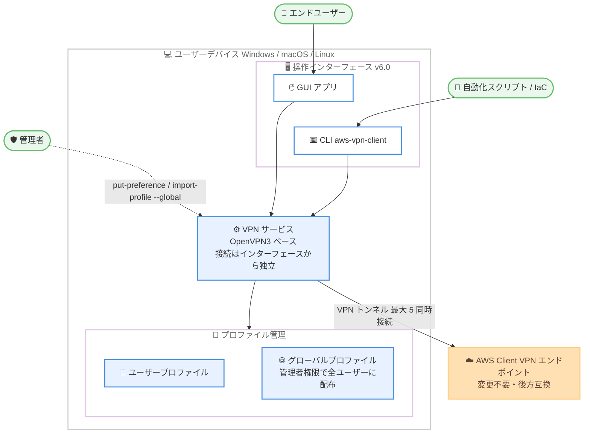

# AWS Client VPN - CLI サポート、管理者コントロール、接続高速化

**リリース日**: 2026 年 8 月 13 日
**サービス**: AWS Client VPN
**機能**: AWS 提供クライアント (AWS VPN Client) バージョン 6.0 における CLI サポート、エンタープライズ管理者コントロール、接続確立の高速化

📊 [このアップデートのインフォグラフィックを見る](https://takech9203.github.io/aws-news-summary/20260813-aws-client-vpn-cli.html)

## 概要

AWS Client VPN の AWS 提供クライアント (AWS VPN Client) がバージョン 6.0 で刷新され、コマンドラインインターフェース (CLI)、エンタープライズ向け管理者コントロール、接続確立時間の高速化という 3 つの主要な機能強化が発表されました。VPN 接続の自動化とデバイス管理の一元化を実現することが目的です。

新しい CLI ツール `aws-vpn-client` は GUI アプリケーションと完全な機能パリティを持ち、プロファイル管理、接続管理、管理者設定のすべてをコマンドラインから操作できます。これにより、VPN 接続を自動化ワークフローや Infrastructure as Code のデプロイメントに組み込むことが可能になります。また、接続アーキテクチャが OpenVPN3 ベースで再構築され、サポート対象のすべての OS で接続確立が高速化されています。既存の AWS Client VPN エンドポイントとの完全な後方互換性が維持されており、エンドポイント側の変更は不要です。

対象ユーザーは、リモートアクセス VPN を大規模に運用するエンタープライズの IT 管理者、VPN 接続をスクリプトや CI/CD に組み込みたい開発者・運用担当者です。

**アップデート前の課題**

- 以前はクライアントに CLI がなく、VPN 接続の自動化やバックグラウンド操作にはサードパーティツールや手動操作が必要だった
- 以前は VPN プロファイルがデバイス上のすべてのユーザーに配布され、権限チェックなしに誰でも管理 (インポート・削除) できた
- 組織で承認された VPN 設定を強制する仕組みがなく、デバイス単位での一元管理が困難だった

**アップデート後の改善**

- CLI (`aws-vpn-client`) により、プロファイルのインポート・接続・切断・状態確認をスクリプトから実行でき、自動化ワークフローや IaC に統合可能になった
- 管理者はプロファイルを特定ユーザーにスコープしたり、デバイス全体のグローバルプロファイルを管理したり、エンドユーザーのプロファイル管理権限を制御できるようになった
- OpenVPN3 ベースの新アーキテクチャにより、すべての対応 OS で接続確立時間が短縮された
- GUI と CLI を同時に実行でき、VPN 接続はどちらのインターフェースからも独立して維持される

## アーキテクチャ図



バージョン 6.0 では GUI と CLI が同一の VPN サービスを共有し、同時に実行できます。VPN 接続はインターフェースから独立して維持され、管理者はグローバルプロファイルやプリファレンスをデバイス単位で一元管理できます。

## サービスアップデートの詳細

### 主要機能

1. **CLI サポート (`aws-vpn-client`)**
   - GUI アプリケーションと完全な機能パリティを持つ CLI が Windows、macOS、Linux で利用可能
   - バージョン 6.0 以降、AWS 提供クライアントと一緒にインストールされる
   - `connect`、`disconnect`、`import-profile`、`delete-profile`、`list-profiles`、`get-config`、`get-connection-status`、`list-connections`、`put-preference`、`list-preferences`、`send-diagnostic-logs` コマンドを提供
   - 出力は JSON 形式で、終了コード (0: 成功、1: 一般エラー、2: 構文エラー) によりスクリプトから扱いやすい
   - バックグラウンド操作をサポートし、サードパーティツールや手動操作が不要になった

2. **エンタープライズ管理者コントロール**
   - エンドユーザーのプロファイル管理権限の制御 (`enable-user-profile-management`)
   - 同時接続数の上限設定 (`max-connections`、1〜5)
   - テレメトリ設定の管理 (`enable-telemetry`)
   - `import-profile --global` により、デバイス上の全ユーザーに対してプロファイルをグローバルにインポート可能
   - 管理者コマンドの実行には昇格権限 (macOS/Linux では sudo、Windows では管理者権限) が必要
   - 設定ファイルはシステムワイドの管理者保護された場所に移動された

3. **接続確立の高速化とアーキテクチャ刷新**
   - OpenVPN3 ベースで再構築され、すべての対応 OS で接続確立時間が改善
   - GUI と CLI は同時に実行でき、VPN 接続はどちらのインターフェースからも独立して維持される
   - GUI も再設計され、セキュリティポスチャーが強化された
   - 既存の AWS Client VPN エンドポイントとの完全な後方互換性を維持 (エンドポイント側の変更は不要)

## 技術仕様

### CLI コマンド一覧

| コマンド | 説明 | 管理者権限 |
|------|------|------|
| `connect` | プロファイルへの VPN 接続を確立 (`--profile-name` 必須、`--auth-user-pass` 任意) | 不要 |
| `disconnect` | アクティブな VPN 接続を切断 | 不要 |
| `import-profile` | VPN 接続プロファイルをインポート (`--global` でデバイス全体に適用) | `--global` 時のみ必要 |
| `delete-profile` | プロファイルを削除 | 不要 |
| `list-profiles` | インポート済みプロファイルを一覧表示 | 不要 |
| `get-config` | プロファイルの OpenVPN 設定を取得 | 不要 |
| `get-connection-status` | 接続状態を取得 (`--show-details` でバイト統計を表示) | 不要 |
| `list-connections` | アクティブな VPN 接続を一覧表示 | 不要 |
| `put-preference` | グローバル設定値を設定 | 必要 (ほとんどの設定) |
| `list-preferences` | すべてのグローバル設定と現在値を表示 | 不要 |
| `send-diagnostic-logs` | 診断ログを AWS に送信 (トラブルシューティング用) | 不要 |

### 管理者プリファレンス設定

| 設定キー | 値 | 説明 |
|------|------|------|
| `enable-user-profile-management` | true/false | エンドユーザーによるプロファイルのインポート・削除の許可 / 禁止 |
| `max-connections` | 整数 (1〜5) | 同時接続数の上限 |
| `enable-telemetry` | true/false | テレメトリの有効 / 無効 |

### 対応プラットフォーム

| プラットフォーム | アーキテクチャ | バージョン |
|------|------|------|
| Windows | x64 / ARM | 6.0.x |
| macOS | x64 / ARM64 | 6.0.x (6.0.0: 2026 年 8 月 4 日、6.0.1: 2026 年 8 月 7 日リリース) |
| Linux (Ubuntu) | x64 | 6.0.x |

## 設定方法

### 前提条件

1. AWS Client VPN エンドポイントが作成済みで、クライアント設定ファイル (.ovpn) を管理者から入手していること
2. AWS 提供クライアント (AWS VPN Client) バージョン 6.0 以降をインストールしていること
3. 管理者コマンドを実行する場合は、デバイスの昇格権限 (sudo / 管理者権限) を持っていること

### 手順

#### ステップ 1: バージョン 6.0 クライアントのインストール

```bash
# macOS の例: リリースノートページから最新の 6.0.x パッケージをダウンロードしてインストール
# https://docs.aws.amazon.com/vpn/latest/clientvpn-user/client-vpn-connect-macos-release-notes.html
```

各 OS のリリースノートページから最新の 6.0.x インストーラーをダウンロードしてインストールします。CLI ツール `aws-vpn-client` はクライアントアプリケーションと一緒にインストールされます。

#### ステップ 2: プロファイルのインポート

```bash
# 個人用プロファイルのインポート
aws-vpn-client import-profile --profile-name "Production-VPN" --config-path /path/to/vpn-config.ovpn

# 管理者: デバイス上の全ユーザー向けにグローバルプロファイルをインポート
sudo aws-vpn-client import-profile --profile-name "Company-VPN" --config-path /path/to/config.ovpn --global
```

`import-profile` コマンドで OpenVPN 設定ファイルからプロファイルを作成します。`--global` フラグを付けると、デバイス上のすべてのユーザーが利用できるグローバルプロファイルとしてインポートされます (昇格権限が必要)。

#### ステップ 3: VPN 接続の確立と状態確認

```bash
# VPN 接続を確立
aws-vpn-client connect --profile-name "Production-VPN"

# 接続状態を確認 (バイト統計付き)
aws-vpn-client get-connection-status --profile-name "Production-VPN" --show-details

# 接続を切断
aws-vpn-client disconnect --profile-name "Production-VPN"
```

`connect` コマンドで VPN 接続を確立します。成功すると `{"status": "Connected"}` が JSON で返却されます。`get-connection-status` で接続状態やトンネルのバイト統計を確認でき、`disconnect` で切断します。

#### ステップ 4: 管理者コントロールの設定

```bash
# エンドユーザーによるプロファイル管理を無効化
sudo aws-vpn-client put-preference --key enable-user-profile-management --value false

# 同時接続数の上限を設定
sudo aws-vpn-client put-preference --key max-connections --value 4

# 現在の設定を確認
aws-vpn-client list-preferences
```

`put-preference` コマンドでデバイス全体のグローバル設定を管理します。エンドユーザーのプロファイル管理権限、同時接続数上限、テレメトリ設定を制御できます。ほとんどの設定変更には昇格権限が必要です。

## メリット

### ビジネス面

- **デバイス管理の一元化**: グローバルプロファイルとプリファレンス設定により、組織で承認された VPN 設定を全社的に強制でき、ガバナンスとコンプライアンスが向上する
- **運用コストの削減**: プロファイル配布やクライアント設定を MDM やデバイス管理ツールと組み合わせてスクリプトで自動化でき、手動セットアップの工数を削減できる
- **移行コストが不要**: 既存の Client VPN エンドポイントと完全な後方互換性があり、エンドポイント側の変更なしで新クライアントの恩恵を受けられる

### 技術面

- **自動化との親和性**: JSON 出力と明確な終了コードを持つ CLI により、CI/CD パイプライン、IaC、シェルスクリプトへの統合が容易になる
- **接続の独立性**: VPN 接続が GUI / CLI から独立して維持されるため、インターフェースの終了が接続に影響しない
- **接続確立の高速化**: OpenVPN3 ベースの新アーキテクチャにより、すべての対応 OS で接続確立時間が短縮される
- **セキュリティ強化**: 設定ファイルが管理者保護されたシステムワイドの場所に移動され、権限のないユーザーによるプロファイルの改変を防止できる

## デメリット・制約事項

### 制限事項

- 同時接続数は最大 5 (管理者は `max-connections` で 1〜5 の範囲で制限可能)
- 管理者コマンド (`put-preference` のほとんどの設定、`import-profile --global`) には昇格権限が必要
- 複数エンドポイントへの同時接続時、CIDR ブロックやルーティングポリシーが競合する場合、またはフルトンネル接続が既に確立されている場合は接続に失敗する
- Linux 版は x64 のみの提供 (Ubuntu がサポート対象)

### 考慮すべき点

- バージョン 6.0 へのアップグレード後、設定ファイルの保存場所が変更されるため、プロファイルやプリファレンスが見つからない場合はトラブルシューティングドキュメントの手順に従う必要がある
- macOS ではバージョン 6.0.0 に SAML 認証の散発的な接続エラーが存在したため、修正済みの 6.0.1 以降の利用が推奨される
- `enable-user-profile-management` を無効化すると、エンドユーザーは自分でプロファイルをインポート・削除できなくなるため、グローバルプロファイルの配布運用を事前に設計する必要がある

## ユースケース

### ユースケース 1: 開発マシンのセットアップ自動化

**シナリオ**: 新入社員や新規開発マシンのオンボーディングで、社内リソースへの VPN 接続を含む開発環境のセットアップをスクリプトで完結させたい。

**実装例**:
```bash
#!/bin/bash
# オンボーディングスクリプトの一部
aws-vpn-client import-profile --profile-name "Corp-VPN" --config-path ./corp-vpn.ovpn
aws-vpn-client connect --profile-name "Corp-VPN"

# 接続確認後に内部リポジトリからツールを取得
STATUS=$(aws-vpn-client get-connection-status --profile-name "Corp-VPN")
echo "$STATUS"
```

**効果**: 手動での GUI 操作が不要になり、開発環境のセットアップを完全に自動化できる。JSON 出力によりスクリプト内での接続確認も容易。

### ユースケース 2: MDM を利用した全社デバイスへの VPN プロファイル配布

**シナリオ**: IT 部門が数千台の社用デバイスに承認済み VPN プロファイルを配布し、エンドユーザーによる勝手なプロファイル追加・削除を禁止したい。

**実装例**:
```bash
# MDM 経由で実行する管理者スクリプト
sudo aws-vpn-client import-profile --profile-name "Company-VPN" \
  --config-path /opt/corp/company-vpn.ovpn --global
sudo aws-vpn-client put-preference --key enable-user-profile-management --value false
sudo aws-vpn-client put-preference --key max-connections --value 1
```

**効果**: 承認済み設定を組織全体で強制でき、シャドー IT やプロファイルの誤設定によるセキュリティリスクを低減できる。

### ユースケース 3: CI/CD パイプラインからの内部リソースアクセス

**シナリオ**: セルフホストの CI ランナーから、VPC 内のプライベートな成果物リポジトリやステージング環境にアクセスする必要がある。

**実装例**:
```bash
# CI ジョブの前処理
aws-vpn-client connect --profile-name "Staging-VPN" \
  --auth-user-pass /secure/credentials.txt

# テスト実行後の後処理
aws-vpn-client disconnect --profile-name "Staging-VPN"
if [ $? -eq 0 ]; then
  echo "VPN disconnected successfully"
fi
```

**効果**: サードパーティの OpenVPN クライアントを使わずに、SAML 認証や Client Routes Enforcement などの AWS 提供クライアント固有のセキュリティ機能を維持したまま CI/CD を構成できる。

## 料金

新クライアント (バージョン 6.0) の利用に追加料金はありません。標準の AWS Client VPN の料金 (エンドポイントのサブネット関連付けおよびアクティブなクライアント接続に基づく時間課金) が適用されます。詳細は [AWS VPN 料金ページ](https://aws.amazon.com/vpn/pricing/) を参照してください。

## 利用可能リージョン

本アップデートはクライアントアプリケーションの更新であり、AWS Client VPN が利用可能なすべてのリージョンで利用できます。クライアントは以下のプラットフォームで提供されています。

- Windows (x64 / ARM)
- macOS (x64 / ARM)
- Linux (x64)

## 関連サービス・機能

- **AWS Client VPN エンドポイント**: 本クライアントが接続するマネージドなリモートアクセス VPN サービス。既存エンドポイントは変更不要で新クライアントと互換
- **SAML 2.0 フェデレーション認証**: AWS 提供クライアント固有のセキュリティ機能。IdP と連携したユーザー認証を CLI 接続でも利用可能
- **Client Routes Enforcement**: AWS 提供クライアント固有の機能で、クライアント側のルーティング改変を防止
- **AWS Site-to-Site VPN**: 拠点間接続向けの VPN サービス。リモートアクセスには Client VPN、拠点間には Site-to-Site VPN と使い分ける

## 参考リンク

- 📊 [インフォグラフィック](https://takech9203.github.io/aws-news-summary/20260813-aws-client-vpn-cli.html)
- [公式発表 (What's New)](https://aws.amazon.com/about-aws/whats-new/2026/08/aws-client-vpn-cli/)
- [ドキュメント: AWS 提供クライアントでの接続 (CLI コマンド / 管理者コントロール)](https://docs.aws.amazon.com/vpn/latest/clientvpn-user/connect-aws-client-vpn-connect.html)
- [ドキュメント: CLI コマンド構文](https://docs.aws.amazon.com/vpn/latest/clientvpn-user/cli-command-syntax.html)
- [リリースノート: macOS](https://docs.aws.amazon.com/vpn/latest/clientvpn-user/client-vpn-connect-macos-release-notes.html)
- [リリースノート: Windows](https://docs.aws.amazon.com/vpn/latest/clientvpn-user/client-vpn-connect-windows-release-notes.html)
- [リリースノート: Linux](https://docs.aws.amazon.com/vpn/latest/clientvpn-user/client-vpn-connect-linux-release-notes.html)
- [料金ページ](https://aws.amazon.com/vpn/pricing/)

## まとめ

AWS VPN Client 6.0 は、CLI による自動化、管理者コントロールによる一元管理、OpenVPN3 ベースの高速な接続確立という、エンタープライズ運用に直結する 3 つの強化を一度に提供する大型アップデートです。既存エンドポイントとの後方互換性があるため移行リスクは低く、まずは検証環境で 6.0.1 以降のクライアントを導入し、CLI を活用したプロファイル配布や接続自動化の運用設計を進めることを推奨します。
