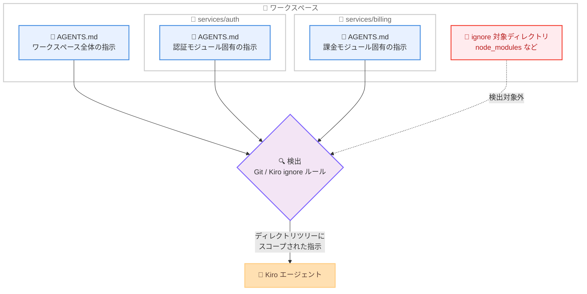
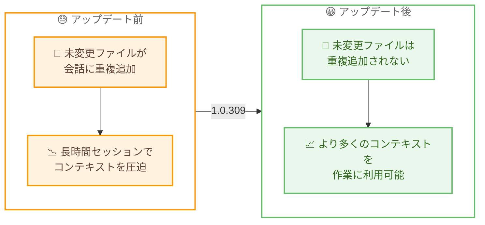

# Kiro - ネストされた AGENTS.md サポートと長時間セッションの効率化

**リリース日**: 2026 年 8 月 13 日
**サービス**: Kiro (AWS が提供する AI 搭載 IDE)
**機能**: ネストされた AGENTS.md サポート、アイドルリソース使用量の削減、コンテキスト使用の効率化、Cloud 設定同期の信頼性向上

📊 [このアップデートのインフォグラフィックを見る](https://takech9203.github.io/aws-news-summary/20260813-kiro-changelog-2026-08-13.html)

## 概要

2026 年 8 月 13 日、Kiro IDE 1.0.309 がリリースされました。目玉機能は**ネストされた AGENTS.md サポート**です。ワークスペース内のサブディレクトリに `AGENTS.md` ファイルを配置すると、そのディレクトリツリーにスコープされた指示を Kiro に与えられるようになりました。ファイルの検出は Git と Kiro の ignore ルールに従うため、無視対象のディレクトリに置かれたファイルが誤って読み込まれることはありません。

本バージョンは長時間セッションの効率化にも重点を置いています。セッション履歴が増えてもアイドル時の CPU 使用量が抑えられるようになり、変更されていないファイルが会話に繰り返し追加されなくなったことで、長いセッションでもより多くのコンテキストを本来の作業に使えるようになりました。依存関係ディレクトリを持つスキルが過剰なシステムリソースを消費して Git、リンター、エディタ拡張機能に影響を与える問題も解消されています。

このほか、Cloud Sessions への設定同期 (ステアリング、カスタムエージェント、スキル、Powers、フック) が一時的な失敗から回復して一貫性を保つようになったほか、チャット、フック、MCP 接続に関する多数の修正が含まれています。

**アップデート前の課題**

- IDE では AGENTS.md によるディレクトリ単位のスコープ指定ができず、モジュール固有の指示をコードの近くに配置して管理することが難しかった
- セッション履歴が増えるにつれて、アイドル時の CPU 使用量が増加していた
- 変更されていないファイルが会話に繰り返し追加され、長時間セッションでコンテキストを圧迫していた
- 依存関係ディレクトリを持つスキルが過剰なシステムリソースを消費し、Git、リンター、エディタ拡張機能の動作を妨げることがあった
- Cloud Sessions への設定同期が一時的な失敗から回復できず、同期内容に不整合が生じることがあった
- エンタープライズ MCP レジストリが `User-Agent` ヘッダーを必須とする CDN やファイアウォールの背後にある場合、HTTP 403 で接続に失敗していた

**アップデート後の改善**

- サブディレクトリに配置した AGENTS.md が、そのディレクトリツリーにスコープされた指示として Kiro に読み込まれるようになった (検出は Git と Kiro の ignore ルールに準拠)
- セッション履歴が増えてもアイドル時の CPU 使用量が低く保たれるようになった
- 変更されていないファイルが会話に重複追加されなくなり、長時間セッションで利用可能なコンテキストが増えた
- スキルの監視が改善され、Git、リンター、エディタ拡張機能への影響がなくなった
- Cloud Sessions への設定同期が一時的な失敗から自動回復し、一貫性を維持するようになった
- MCP 接続やフック、チャットに関する多数の不具合が修正された

## アーキテクチャ図



ネストされた AGENTS.md の検出フローを示しています。ワークスペース内の各ディレクトリに配置された AGENTS.md が、Git と Kiro の ignore ルールに従って検出され、そのディレクトリツリーにスコープされた指示としてエージェントに読み込まれます。



コンテキスト使用の効率化を Before/After で示しています。変更されていないファイルが会話に繰り返し追加されなくなったことで、長時間セッションでも利用可能なコンテキストが確保されます。

## サービスアップデートの詳細

### 主要機能 (Improvements)

1. **ネストされた AGENTS.md サポート**
   - サブディレクトリに `AGENTS.md` ファイルを配置すると、ワークスペースのその部分にスコープされたガイダンスを Kiro に与えられる
   - ファイルの検出は Git と Kiro の ignore ルールに従うため、`node_modules` などの無視対象ディレクトリは読み込まれない
   - モノレポや大規模リポジトリで、モジュール固有の規約やドメイン知識をコードのすぐ隣で管理できる

2. **アイドルリソース使用量の削減**
   - セッション履歴が増えても、アイドル時の CPU 使用量が低く保たれるようになった

3. **コンテキスト使用の効率化**
   - 変更されていないファイルが会話に繰り返し追加されなくなった
   - 長時間のセッションでも、より多くのコンテキストを本来の作業に利用できる

4. **スキル監視の信頼性向上**
   - 依存関係ディレクトリを持つスキルが過剰なシステムリソースを消費しなくなった
   - Git、リンター、エディタ拡張機能の動作を妨げる問題が解消された

5. **Cloud 設定同期の信頼性向上**
   - Cloud Sessions に同期されるステアリング、カスタムエージェント、スキル、Powers、フックが、一時的な失敗から回復して一貫性を保つようになった

6. **チャットタブタイトルのホバー表示**
   - 省略表示されたチャットタブのタイトルにホバーすると、フルネームを確認できるようになった

### 修正 (Fixes)

- 特定の Go コードブロックを含むチャットがフリーズしたり、再度開けなくなる問題を修正
- マルチルートワークスペースや `file://` URI を使用するリンクで、ワークスペースファイルリンクが誤った場所を開く問題を修正 (Agent Focus Mode を含む)
- `~/.kiro/hooks/` のグローバルフックが Agent Hooks エディタで空のフィールドとして開かれる問題を修正 (読み込み失敗時に既存フックを上書きするリスクも解消)
- macOS で新規作成された設定ディレクトリが検出されず、ステアリング、カスタムエージェント、Powers、MCP 設定の更新が遅延することがある問題を修正
- 入力エリアのサイズ変更時に、チャットの最新メッセージへの自動スクロールが停止することがある問題を修正
- `User-Agent` ヘッダーを必須とする CDN やファイアウォールルールの背後にあるエンタープライズ MCP レジストリが HTTP 403 を返す問題を修正
- MCP の再試行がサーバーステータスの更新や、接続失敗後のクリーンアップに失敗する問題を修正
- ファイルマッチ型ステアリングファイルへの同一サイズの編集が、同じセッション中に検出されない問題を修正
- 有効な旧形式の `.kiro.hook` ファイルが無効と表示される問題を修正し、自動トリガーフックの有効/無効の切り替えコントロールを復元
- エージェントがファイル検索でサポート外の正規表現構文を使用し、結果が返らないことがある問題を修正

## 技術仕様

### 各機能の対象と要件

| 項目 | 詳細 |
|------|------|
| 対象バージョン | Kiro IDE 1.0.309 |
| AGENTS.md の配置場所 | ワークスペース内の任意のサブディレクトリ |
| AGENTS.md のスコープ | 配置したディレクトリツリー配下 |
| AGENTS.md の検出ルール | Git および Kiro の ignore ルールに準拠 |
| コンテキスト効率化 | 変更されていないファイルは会話に重複追加されない |
| Cloud 設定同期の対象 | ステアリング、カスタムエージェント、スキル、Powers、フック |

## 設定方法

### 前提条件

1. Kiro IDE 1.0.309 以降にアップデートしていること
2. Cloud 設定同期を利用する場合は、Cloud Sessions が組織で有効化されていること

### 手順

#### ステップ 1: サブディレクトリに AGENTS.md を配置する

```bash
# 例: モジュールごとに AGENTS.md を配置
my-repo/
├── AGENTS.md              # ワークスペース全体の指示
└── services/
    ├── auth/
    │   ├── AGENTS.md      # 認証モジュール固有の指示
    │   └── src/
    └── billing/
        ├── AGENTS.md      # 課金モジュール固有の指示
        └── src/
```

ワークスペース内のサブディレクトリに `AGENTS.md` を作成します。各ファイルは配置したディレクトリツリーにスコープされた指示として Kiro に読み込まれます。`.gitignore` や Kiro の ignore ルールで無視されているディレクトリ内のファイルは検出されません。

#### ステップ 2: スコープされた指示を記述する

```markdown
# services/auth/AGENTS.md の例

## 認証モジュールの規約
- トークン検証には共通ライブラリ auth-core を使用する
- 秘密情報は環境変数から取得し、ハードコードしない
- 新しいエンドポイントには必ずレート制限を設定する
```

そのディレクトリ配下のコードを扱う際に Kiro へ伝えたい規約や注意点を記述します。ワークスペースルートの AGENTS.md には共通ルールを、サブディレクトリにはモジュール固有のルールを配置する構成が有効です。

#### ステップ 3: 長時間セッションでの動作を確認する

アップデート後は追加の設定なしで、アイドル時の CPU 使用量の削減とコンテキスト使用の効率化が適用されます。長時間のセッションで、変更していないファイルが会話に繰り返し追加されないことを確認できます。

## メリット

### ビジネス面

- **コンテキスト管理の分権化**: モジュールごとの規約を各チームがコードと同じ場所で管理でき、モノレポでの大規模開発におけるナレッジ共有が効率化される
- **開発マシンの生産性向上**: アイドル時のリソース使用量が減り、スキル監視の改善により Git やリンターへの干渉もなくなるため、開発環境全体の快適さが向上する
- **エンタープライズ環境での安定運用**: `User-Agent` ヘッダーを要求するファイアウォール配下での MCP レジストリ接続や、Cloud 設定同期の自動回復により、企業ネットワークでの運用が安定する

### 技術面

- **スコープされたステアリング**: AGENTS.md がディレクトリツリー単位でスコープされるため、無関係なモジュールの指示がエージェントのコンテキストを汚染しない
- **長時間セッションの品質維持**: 未変更ファイルの重複追加がなくなり、コンテキストウィンドウを実際の作業に有効活用できるため、長いセッションでもエージェントの応答品質が維持されやすい
- **ignore ルールとの統合**: AGENTS.md の検出が Git と Kiro の ignore ルールに従うため、ビルド成果物や依存関係ディレクトリ内のファイルが誤って読み込まれる心配がない

## デメリット・制約事項

### 制限事項

- 本アップデートは Kiro IDE (1.0.309) が対象。Kiro CLI では 2.18.0 で同様のネストされた AGENTS.md サポートが先行導入されている
- AGENTS.md の検出は Git と Kiro の ignore ルールに従うため、ignore 対象ディレクトリに配置したファイルは読み込まれない

### 考慮すべき点

- ワークスペースルートとサブディレクトリの AGENTS.md で指示が重複・矛盾しないよう、共通ルールはルートに、モジュール固有ルールはサブディレクトリに、と役割を分けて整理することを推奨
- 多数の AGENTS.md を配置する場合は、各ファイルを簡潔に保ち、エージェントに読み込まれるコンテキスト量を意識する

## ユースケース

### ユースケース 1: モノレポでのモジュール別ガイダンス

**シナリオ**: 複数チームが 1 つのモノレポで開発しており、モジュールごとに異なるコーディング規約やドメイン知識を IDE のエージェントに伝えたい。

**実装例**:
```
monorepo/
├── AGENTS.md                     # リポジトリ共通の規約
├── frontend/
│   └── AGENTS.md                 # UI コンポーネントの規約
└── backend/
    └── AGENTS.md                 # API 設計の規約
```

**効果**: 各モジュールを扱う際にスコープされた指示が読み込まれ、無関係なモジュールの規約でコンテキストが消費されない。

### ユースケース 2: 長時間のリファクタリングセッション

**シナリオ**: 大規模なリファクタリングで多数のファイルを参照しながら、1 つのセッションで長時間作業を続けたい。

**実装例**:
```
1. Kiro IDE 1.0.309 以降で長時間のセッションを開始
2. 多数のファイルを参照しつつ作業を継続
3. 変更されていないファイルは会話に重複追加されない
```

**効果**: コンテキストが本来の作業に使われるため、セッション後半でもエージェントの応答品質が維持される。アイドル時の CPU 使用量も低く保たれる。

### ユースケース 3: 企業ネットワーク配下での MCP レジストリ利用

**シナリオ**: `User-Agent` ヘッダーを必須とする CDN やファイアウォールの背後にあるエンタープライズ MCP レジストリに接続したいが、HTTP 403 で失敗していた。

**実装例**:
```
1. Kiro IDE 1.0.309 以降にアップデート
2. エンタープライズ MCP レジストリへ再接続
3. 接続失敗時も MCP の再試行がステータス更新とクリーンアップを正しく実行
```

**効果**: 企業ネットワークのセキュリティ要件を満たしたまま、MCP レジストリを安定して利用できる。

## 利用可能リージョン

Kiro はグローバルに提供されており、リージョンの制約はありません。

## 関連サービス・機能

- **Kiro ステアリング / AGENTS.md**: エージェントにプロジェクト固有のコンテキストを与える仕組み。今回 IDE でサブディレクトリへのネスト配置がサポートされた
- **Kiro CLI**: ターミナルから利用できるエージェント型コーディングアシスタント。2.18.0 (2026 年 8 月 12 日) でネストされた AGENTS.md のステアリング読み込みが先行導入されている
- **Kiro Cloud Sessions**: マネージドクラウドサンドボックスでセッションを実行する機能。今回、ステアリング、カスタムエージェント、スキル、Powers、フックの同期が一時的な失敗から回復するよう改善された
- **Kiro Agent Hooks**: イベントをトリガーにエージェントを自動実行する機能。今回グローバルフックの読み込みや旧形式フックの表示に関する修正が含まれる
- **MCP (Model Context Protocol)**: 外部ツールをエージェントに接続するプロトコル。今回エンタープライズレジストリ接続と再試行処理が改善された

## 参考リンク

- 📊 [インフォグラフィック](https://takech9203.github.io/aws-news-summary/20260813-kiro-changelog-2026-08-13.html)
- [Kiro Changelog](https://kiro.dev/changelog/)
- [Kiro IDE 1.0.309 Changelog](https://kiro.dev/changelog/ide/1-0-309/)
- [Steering ドキュメント](https://kiro.dev/docs/steering/)
- [Cloud Sessions ドキュメント](https://kiro.dev/docs/cloud-sessions)

## まとめ

Kiro IDE 1.0.309 は、ネストされた AGENTS.md サポートによりディレクトリツリー単位でスコープされた指示を実現し、モノレポや大規模リポジトリでのコンテキスト管理を大きく改善するアップデートです。加えて、アイドルリソース使用量の削減と未変更ファイルの重複追加の解消により、長時間セッションでの快適さと応答品質の維持が期待できます。モノレポで Kiro IDE を利用しているチームは、まず共通規約をルートの AGENTS.md に、モジュール固有の規約を各サブディレクトリの AGENTS.md に整理することから始めることを推奨します。
