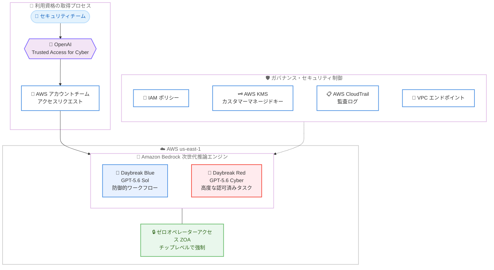

# Amazon Bedrock - OpenAI Daybreak Red / Daybreak Blue の提供開始

**リリース日**: 2026 年 8 月 13 日
**サービス**: Amazon Bedrock
**機能**: OpenAI Daybreak Red および Daybreak Blue モデルの提供 (対象要件を満たす顧客向け)

📊 [このアップデートのインフォグラフィックを見る](https://takech9203.github.io/aws-news-summary/20260813-openai-daybreak-red-and-blue-on-amazon-bedrock.html)

## 概要

OpenAI のサイバー防御イニシアチブ「Daybreak」に基づく 2 つのモデル、**Daybreak Blue** と **Daybreak Red** が、対象要件を満たす顧客向けに Amazon Bedrock で利用可能になりました。Daybreak は、防御側 (ディフェンダー) がガバナンスの効いた形でフロンティア AI をサイバーセキュリティ業務に活用できるようにする取り組みです。

**Daybreak Blue** は GPT-5.6 Sol へのアクセスを提供し、脆弱性の発見、検知エンジニアリング、インシデント対応といった防御的ワークフロー向けに調整されたセーフガードを備えています。多くのセキュリティチームにとっての出発点と位置付けられています。**Daybreak Red** は、サイバーセキュリティ向けに専用トレーニングされた GPT-5.6 Cyber へのアクセスを提供し、脆弱性リサーチ、エクスプロイトの再現、緩和策の開発など、認可された高度なタスク向けに設計されています。Red は拒否 (refusal) のしきい値が低く設定されている代わりに、より強力な本人確認、モニタリング、アクセス制御が適用されます。

両モデルは、デュアルユース (攻防両用) となり得るセキュリティ関連のリクエストを一律に拒否するのではなく、「誰が」「どこで」「どのようなセーフガードのもとで」作業しているかというコンテキストに基づいて処理する点が特徴です。AWS ブログによると、OpenAI の報告として、GPT-5.6 Cyber を Daybreak Red 経由で利用した研究者が Chrome の JavaScript エンジン V8 の未知の脆弱性 2 件 (メモリ破壊とヒープサンドボックスエスケープに連鎖) を発見し、最初の欠陥は CVE-2026-15903 として登録された事例が紹介されています。

**アップデート前の課題**

- フロンティアモデルはサイバーセキュリティのデュアルユース性 (攻撃にも防御にも使える性質) を考慮し、エクスプロイト解析や脆弱性リサーチなどの正当な防御目的のリクエストであっても一律に拒否されることが多かった
- 高度なセキュリティリサーチ向けの AI を利用するには、エンタープライズのガバナンス要件 (アクセス制御、監査、データ保護) を満たす提供形態が不足していた
- 機密性の高いセキュリティ調査データを外部の AI サービスに送信する際、データの取り扱いに関する懸念があった

**アップデート後の改善**

- 防御的ワークフロー向けの Daybreak Blue と、認可された高度なリサーチ向けの Daybreak Red という 2 段階のモデルを、用途とガバナンスレベルに応じて使い分けられるようになった
- Amazon Bedrock の次世代推論エンジン上で動作し、チップレベルで強制されるゼロオペレーターアクセス (ZOA) により、AWS のオペレーターが推論中のプロンプトや出力にアクセスできない環境で利用できるようになった
- 推論データはモデルのトレーニングに使用されず、OpenAI とのデータ共有へのオプトインも不要で利用できるようになった

## アーキテクチャ図



OpenAI の Trusted Access for Cyber プログラムへの登録と AWS アカウントチーム経由のアクセスリクエストを経て、us-east-1 リージョンの Amazon Bedrock 上で Daybreak Blue / Red を利用する流れを示しています。推論はゼロオペレーターアクセスが強制された次世代推論エンジン上で実行され、IAM、KMS、CloudTrail、VPC エンドポイントによるガバナンスが適用されます。

## サービスアップデートの詳細

### 主要機能

1. **Daybreak Blue (GPT-5.6 Sol ベース)**
   - 防御的セキュリティ業務向けに調整されたセーフガードを備えたモデル
   - 脆弱性の発見、検知エンジニアリング、インシデント対応などのワークフローに対応
   - ほとんどのセキュリティチームにとって最初に選択すべきモデルと位置付けられている

2. **Daybreak Red (GPT-5.6 Cyber ベース)**
   - サイバーセキュリティ向けに専用トレーニングされたモデル
   - 脆弱性リサーチ、エクスプロイトの再現、緩和策の開発といった認可済みの高度なタスクに対応
   - 拒否のしきい値が低い代わりに、より強力な本人確認、モニタリング、アクセス制御が適用される

3. **コンテキストに基づくデュアルユースリクエストの処理**
   - セキュリティ関連の依頼を一律拒否するのではなく、利用者・作業環境・適用されるセーフガードといったコンテキストに基づいて応答を判断
   - Red はより厳格なガバナンスのもとで、より深い攻撃的リサーチ寄りのタスクを許可

4. **エンタープライズグレードのセキュリティとデータ保護**
   - Amazon Bedrock の次世代推論エンジン上で動作し、チップレベルで強制されるゼロオペレーターアクセス (ZOA) を提供
   - 転送中および保管時の暗号化 (カスタマーマネージド AWS KMS キー対応)
   - 推論データはモデルトレーニングに使用されず、OpenAI とのデータ共有へのオプトインも不要

## 技術仕様

### モデル比較

| 項目 | Daybreak Blue | Daybreak Red |
|------|---------------|--------------|
| ベースモデル | GPT-5.6 Sol | GPT-5.6 Cyber (サイバーセキュリティ専用トレーニング) |
| 主な用途 | 脆弱性の発見、検知エンジニアリング、インシデント対応 | 脆弱性リサーチ、エクスプロイト再現、緩和策の開発 |
| 拒否のしきい値 | 防御的業務向けの標準的なセーフガード | 低め (認可済みタスク向け) |
| 追加の統制 | 標準のガバナンス | より強力な本人確認、モニタリング、アクセス制御 |
| 想定ユーザー | ほとんどのセキュリティチーム | 認可された高度なリサーチを行うチーム |

### セキュリティ・データ保護

| 項目 | 詳細 |
|------|------|
| 推論基盤 | Amazon Bedrock 次世代推論エンジン |
| オペレーターアクセス | ゼロオペレーターアクセス (ZOA) をチップレベルで強制 |
| 暗号化 | 転送中・保管時の暗号化、カスタマーマネージド AWS KMS キー対応 |
| アクセス制御 | IAM ポリシーによる制御、CloudTrail への記録、VPC エンドポイント経由のルーティング |
| データ境界 | 組織レベルのデータ境界ポリシーによる持ち出し防止 |
| トレーニング利用 | 推論データはモデルトレーニングに使用されない |
| 不正利用検知 | 分類器によりフラグ付けされたトラフィックは最大 30 日間 AWS が保持しプログラムで処理。ゼロデータ保持はアカウントチーム経由でリクエスト可能 |

## 設定方法

### 前提条件

1. OpenAI の Trusted Access for Cyber プログラムへの登録 (Daybreak アクセスの利用資格が必要)
2. AWS アカウントおよび Amazon Bedrock へのアクセス権限
3. 米国東部 (バージニア北部) リージョンの利用

### 手順

#### ステップ 1: OpenAI の Trusted Access for Cyber に登録する

OpenAI のエンタープライズ向け Trusted Access フォーム (https://openai.com/form/enterprise-trusted-access-for-cyber/) から Daybreak アクセスへの登録を申請します。利用資格については OpenAI または AWS アカウントチームに問い合わせて確認します。

#### ステップ 2: AWS アカウントチームにアクセスをリクエストする

OpenAI 側の承認が完了したら、AWS アカウントチームと連携して Amazon Bedrock 上での Daybreak Blue / Red へのアクセスをリクエストします。

#### ステップ 3: Amazon Bedrock でモデルへのアクセスを確認する

```bash
# 利用可能な OpenAI モデルの一覧を確認 (us-east-1)
aws bedrock list-foundation-models \
  --region us-east-1 \
  --by-provider openai \
  --query "modelSummaries[].modelId"
```

Amazon Bedrock の `ListFoundationModels` API で、アクセスが付与されたモデルの ID を確認します。アクセス付与後は、通常の Bedrock モデルと同様に IAM ポリシーで利用範囲を制御し、VPC エンドポイントや KMS キーの設定を行ったうえで推論を実行します。

## メリット

### ビジネス面

- **セキュリティ業務への AI 活用の解禁**: これまで一律拒否されがちだった脆弱性リサーチやエクスプロイト解析などの正当な防御業務に、フロンティア AI を正式なガバナンスのもとで活用できる
- **実績に裏付けられた効果**: GPT-5.6 Cyber を用いた V8 の未知の脆弱性発見 (CVE-2026-15903) など、実際のセキュリティリサーチでの成果が報告されている
- **コンプライアンス対応**: 推論データがトレーニングに使用されず、OpenAI とのデータ共有も不要なため、機密性の高いセキュリティ調査データを扱う組織でも導入しやすい

### 技術面

- **ゼロオペレーターアクセス**: チップレベルで強制される ZOA により、AWS オペレーターが推論中のデータにアクセスできない高い機密性を確保
- **AWS ネイティブなガバナンス**: IAM、CloudTrail、VPC エンドポイント、KMS といった既存の AWS セキュリティ制御をそのまま適用可能
- **用途に応じたモデル選択**: 防御的ワークフローには Blue、認可済みの高度なリサーチには Red と、リスクレベルに応じた使い分けができる

## デメリット・制約事項

### 制限事項

- 利用には OpenAI の Trusted Access for Cyber プログラムへの登録と承認が必要で、すべての顧客が利用できるわけではない
- 利用可能リージョンは米国東部 (バージニア北部) のみ
- Daybreak Red の利用には、より強力な本人確認、モニタリング、アクセス制御の受け入れが必要

### 考慮すべき点

- 不正利用検知のため、分類器によりフラグ付けされたトラフィックは最大 30 日間 AWS に保持される (ゼロデータ保持はアカウントチーム経由で個別にリクエスト可能)
- What's New および AWS ブログでは、モデル ID、コンテキストウィンドウ、料金などの詳細仕様は公表されていないため、AWS アカウントチームへの確認が必要
- 攻撃的リサーチ寄りのタスクを扱う場合は、組織内の認可プロセスや法的・倫理的な確認を事前に整備しておく必要がある

## ユースケース

### ユースケース 1: SOC における検知エンジニアリングの強化 (Daybreak Blue)

**シナリオ**: セキュリティオペレーションセンター (SOC) が、新たな攻撃手法に対応する検知ルールの開発とインシデント対応の初動分析を高速化したい。

**実装例**:
```
1. Daybreak Blue へのアクセスを取得し、us-east-1 の Bedrock で有効化
2. 脅威インテリジェンスレポートやログサンプルをプロンプトとして入力
3. 検知ルール案 (Sigma / SIEM クエリなど) の生成とインシデント対応手順のドラフト作成に活用
4. CloudTrail で利用状況を監査し、IAM で利用者を SOC チームに限定
```

**効果**: 検知ルール開発とインシデント初動分析のリードタイムを短縮し、アナリストはルールの検証と意思決定に集中できる。

### ユースケース 2: 認可済みの脆弱性リサーチ (Daybreak Red)

**シナリオ**: 製品セキュリティチームが、自社製品に対する認可された脆弱性リサーチとエクスプロイトの再現検証を実施し、修正の優先順位付けを行いたい。

**実装例**:
```
1. OpenAI の Trusted Access for Cyber で Red 相当のアクセスを申請・承認
2. 本人確認とモニタリング要件を満たしたリサーチ環境を分離された AWS アカウントに構築
3. Daybreak Red で脆弱性の解析、エクスプロイト再現、緩和策の開発を実施
4. 組織レベルのデータ境界ポリシーで成果物の持ち出しを制御
```

**効果**: 従来は手作業に依存していたエクスプロイト再現や緩和策検討を AI で加速し、修正までの時間を短縮できる。

### ユースケース 3: 機密データを扱う規制業界でのセキュリティ分析

**シナリオ**: 金融機関が、機密性の高いインシデントデータを外部に共有することなく AI によるセキュリティ分析を行いたい。

**実装例**:
```
1. カスタマーマネージド KMS キーで保管時の暗号化を構成
2. VPC エンドポイント経由で Bedrock にアクセスし、インターネット経由の通信を排除
3. ゼロデータ保持をアカウントチーム経由でリクエスト
4. Daybreak Blue でインシデントデータの分析・対応支援を実施
```

**効果**: 推論データがトレーニングに使用されず、ZOA と暗号化により機密性を保ったまま、規制要件を満たす形で AI を活用できる。

## 料金

What's New および AWS ブログでは、Daybreak Red / Daybreak Blue の具体的な料金は公表されていません。Amazon Bedrock の料金体系 (トークンベースの従量課金など) については料金ページを参照し、Daybreak モデルの詳細な料金は AWS アカウントチームに確認してください。

## 利用可能リージョン

- 米国東部 (バージニア北部) : us-east-1

リージョン別のモデル対応状況は [Amazon Bedrock のリージョン互換性ドキュメント](https://docs.aws.amazon.com/bedrock/latest/userguide/models-region-compatibility.html)を参照してください。

## 関連サービス・機能

- **Amazon Bedrock**: Daybreak モデルの実行基盤。次世代推論エンジンとゼロオペレーターアクセスを提供
- **AWS KMS**: カスタマーマネージドキーによる転送中・保管時の暗号化
- **AWS IAM / AWS CloudTrail**: モデルアクセスの制御と監査ログの記録
- **Amazon VPC (VPC エンドポイント)**: インターネットを経由しないプライベートなモデルアクセス経路
- **OpenAI GPT-5.6 ファミリー (Sol / Terra / Luna)**: Amazon Bedrock で提供される OpenAI のフロンティアモデル群。Daybreak Blue は GPT-5.6 Sol をベースとする

## 参考リンク

- 📊 [インフォグラフィック](https://takech9203.github.io/aws-news-summary/20260813-openai-daybreak-red-and-blue-on-amazon-bedrock.html)
- [公式発表 (What's New)](https://aws.amazon.com/about-aws/whats-new/2026/08/openai-daybreak-red-and-blue-on-amazon-bedrock/)
- [AWS Blog: Accelerate cyber defense with OpenAI and AWS](https://aws.amazon.com/blogs/machine-learning/accelerate-cyber-defense-with-openai-and-aws-daybreak-red-daybreak-blue-now-available-to-eligible-customers-on-amazon-bedrock/)
- [ドキュメント: Amazon Bedrock リージョン互換性](https://docs.aws.amazon.com/bedrock/latest/userguide/models-region-compatibility.html)
- [OpenAI Trusted Access for Cyber 登録フォーム](https://openai.com/form/enterprise-trusted-access-for-cyber/)
- [料金ページ: Amazon Bedrock](https://aws.amazon.com/bedrock/pricing/)

## まとめ

OpenAI の Daybreak Blue / Red が Amazon Bedrock で利用可能になり、サイバーセキュリティチームはガバナンスの効いた環境でフロンティア AI を防御業務や認可済みの高度なリサーチに活用できるようになりました。利用には OpenAI の Trusted Access for Cyber への登録が必要で、リージョンも us-east-1 に限定されるため、関心のある組織はまず OpenAI または AWS アカウントチームに利用資格を確認することを推奨します。
