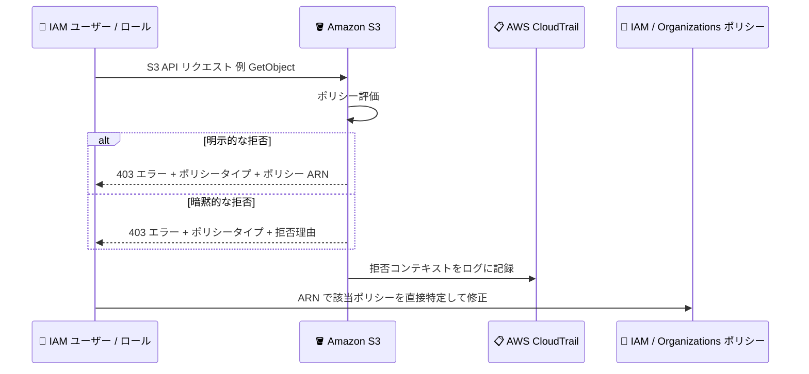

# Amazon S3 - アクセス拒否エラーメッセージへのポリシー詳細の追加

**リリース日**: 2026 年 8 月 13 日
**サービス**: Amazon S3
**機能**: アクセス拒否エラーメッセージへの IAM / Organizations ポリシー ARN の追加

📊 [このアップデートのインフォグラフィックを見る](https://takech9203.github.io/aws-news-summary/20260813-s3-additional-policy-details-access-denied-error-messages.html)

## 概要

Amazon S3 が、同一 AWS アカウントまたは AWS Organizations の同一組織内からのリクエストに対する HTTP 403 (Access Denied) エラーメッセージに、拒否の原因となった AWS Identity and Access Management (IAM) および AWS Organizations ポリシーの Amazon Resource Name (ARN) を含めるようになりました。これにより、S3 へのリクエストが拒否された際に、原因となった正確なポリシーを迅速に特定し、直接そのポリシーに移動して修正できます。

明示的な拒否 (explicit deny) のケースでは、Service Control Policies (SCP)、Resource Control Policies (RCP)、アイデンティティベースポリシー、セッションポリシー、アクセス許可境界 (Permissions Boundary) のポリシー ARN がエラーメッセージに含まれます。この追加コンテキストは AWS CloudTrail ログにも記録されます。

なお、2026 年 1 月に AWS 全体としてアクセス拒否エラーメッセージへのポリシー ARN 追加が発表されていますが (類似レポート: 2026-01-21)、今回のアップデートはこの拡張エラーメッセージを Amazon S3 の HTTP 403 レスポンスで利用できるようにした S3 固有の展開です。S3 特有の挙動 (バケットポリシー、Object Ownership、ディレクトリバケット、VPC エンドポイントポリシーとの関係など) が明確化されている点が特徴です。

**アップデート前の課題**

- S3 の 403 エラーメッセージには、拒否したポリシーのタイプと拒否理由は含まれていましたが、どのポリシーが原因かまでは特定できませんでした
- 同じタイプのポリシーが複数存在する場合 (例: 複数の SCP や複数のアイデンティティベースポリシー)、根本原因を見つけるために各ポリシーを 1 つずつ手動で調査する必要がありました
- S3 バケットへのアクセス拒否のトラブルシューティングに時間がかかり、問題解決が遅れることがありました

**アップデート後の改善**

- 明示的な拒否のケースで、エラーメッセージに拒否の原因となったポリシーの ARN が含まれるようになりました
- ポリシー ARN から該当ポリシーへ直接移動して修正できるため、トラブルシューティングが大幅に効率化されました
- 拒否コンテキストが AWS CloudTrail ログにも記録されるため、事後分析や監査にも活用できます

## アーキテクチャ図



同一アカウントまたは同一組織内からの S3 リクエストが拒否された場合、エラーメッセージに拒否理由の詳細が含まれ、明示的な拒否ではポリシー ARN も返されるフローを示しています。

## サービスアップデートの詳細

### 主要機能

1. **明示的な拒否におけるポリシー ARN の表示**
   - エラーメッセージに `with an explicit deny in a {type} policy, with policy ARN: {arn}` の形式でポリシー ARN が含まれます
   - 対象のポリシータイプ: Service Control Policies (SCP)、Resource Control Policies (RCP)、アイデンティティベースポリシー、セッションポリシー、アクセス許可境界
   - ARN から該当ポリシーに直接移動して `Deny` ステートメントを確認・修正できます

2. **暗黙的な拒否における拒否理由の表示**
   - 該当する `Allow` ステートメントがない場合、`because no {type} policy allows the {action} action` の形式でポリシータイプと不足しているアクションが示されます
   - どのポリシータイプに `Allow` を追加すべきかが明確になります

3. **同一アカウント・同一組織内での適用**
   - 拡張エラーメッセージは、同一 AWS アカウント内、または AWS Organizations の同一組織内からのリクエストに対して返されます
   - バケット所有者と呼び出し元アカウントが同一組織であれば、S3 Object Ownership の設定によりオブジェクト所有者が異なる場合でも、すべてのオブジェクトリクエストに対して拡張エラーメッセージが返されます

4. **AWS CloudTrail ログへの記録**
   - 追加コンテキストは CloudTrail ログにも記録され、事後のトラブルシューティングや監査に活用できます

## 技術仕様

### エラーメッセージの形式

エラーメッセージの基本形式は次のとおりです。

```
User {user-arn} is not authorized to perform {action} on "{resource-arn}" because {context}
```

**明示的な拒否の例 (SCP):**

```
User: arn:aws:iam::777788889999:user/MaryMajor is not authorized to perform:
s3:GetObject with an explicit deny in a service control policy, with policy ARN:
arn:aws:organizations::777788889999:policy/o-exampleorgid/service_control_policy/p-examplepolicyid
```

**明示的な拒否の例 (アイデンティティベースポリシー):**

```
User: arn:aws:iam::123456789012:user/MaryMajor is not authorized to perform:
s3:GetObject on resource: "arn:aws:s3:::amzn-s3-demo-bucket1/object-name" with
an explicit deny in an identity-based policy, with policy ARN:
arn:aws:iam::123456789012:policy/ExampleIdentityBasedPolicy
```

**暗黙的な拒否の例 (SCP):**

```
User: arn:aws:iam::777788889999:user/MaryMajor is not authorized to perform:
s3:GetObject because no service control policy allows the s3:GetObject action
```

### ポリシータイプ別の ARN 表示対応

| ポリシータイプ | 明示的な拒否での ARN 表示 | ARN の例 |
|----------------|--------------------------|----------|
| Service Control Policy (SCP) | 対応 | arn:aws:organizations::777788889999:policy/o-exampleorgid/service_control_policy/p-examplepolicyid |
| Resource Control Policy (RCP) | 対応 | arn:aws:organizations::777788889999:policy/o-exampleorgid/resource_control_policy/p-examplepolicyid |
| アイデンティティベースポリシー | 対応 | arn:aws:iam::123456789012:policy/ExampleIdentityBasedPolicy |
| セッションポリシー | 対応 | arn:aws:iam::123456789012:policy/ExampleSessionPolicy |
| アクセス許可境界 | 対応 | arn:aws:iam::777788889999:policy/ExamplePermissionsBoundaryPolicy |
| リソースベースポリシー (バケットポリシー) | 非対応 (ポリシータイプのみ表示) | - |
| VPC エンドポイントポリシー | 非対応 (拡張メッセージ対象外) | - |

### 2026 年 1 月の発表との違い

| 項目 | 2026 年 1 月の発表 | 今回のアップデート |
|------|-------------------|-------------------|
| 対象 | AWS 全体 (段階的に展開) | Amazon S3 の HTTP 403 レスポンス |
| 提供範囲 | すべてのサービス・リージョンで段階的に展開 | すべての AWS リージョンで利用可能 (GovCloud、中国リージョン含む) |
| S3 固有の挙動の明確化 | なし | ディレクトリバケット、Object Ownership、VPC エンドポイントポリシーなどの挙動を明確化 |
| CloudTrail 連携 | - | 拒否コンテキストを CloudTrail ログに記録 |

## 設定方法

### 前提条件

この機能は自動的に有効になり、追加の設定は不要です。同一アカウントまたは同一組織内からの S3 リクエストに対して拡張エラーメッセージが返されます。

### トラブルシューティング手順

#### ステップ 1: エラーメッセージの確認

S3 へのアクセスが拒否された場合、エラーメッセージからポリシータイプと ARN を確認します。

```bash
# S3 オブジェクトの取得を試行
aws s3api get-object --bucket amzn-s3-demo-bucket1 --key object-name output.txt

# エラーメッセージの例
# An error occurred (AccessDenied) when calling the GetObject operation:
# User: arn:aws:iam::123456789012:user/MaryMajor is not authorized to perform:
# s3:GetObject on resource: "arn:aws:s3:::amzn-s3-demo-bucket1/object-name" with
# an explicit deny in an identity-based policy, with policy ARN:
# arn:aws:iam::123456789012:policy/ExampleIdentityBasedPolicy
```

このコマンドは S3 オブジェクトの取得を試み、アクセスが拒否された場合は拒否の原因となったポリシーの ARN を含むエラーメッセージを返します。

#### ステップ 2: 該当ポリシーの確認

エラーメッセージに含まれるポリシー ARN を使用して、該当ポリシーの内容を確認します。

```bash
# IAM ポリシーの詳細を取得
aws iam get-policy \
  --policy-arn arn:aws:iam::123456789012:policy/ExampleIdentityBasedPolicy

# デフォルトバージョンのポリシードキュメントを取得
aws iam get-policy-version \
  --policy-arn arn:aws:iam::123456789012:policy/ExampleIdentityBasedPolicy \
  --version-id v1
```

このコマンドは、ARN で特定したポリシーのドキュメントを取得し、どの `Deny` ステートメントが原因かを確認できます。SCP や RCP の場合は AWS Organizations の `describe-policy` コマンドを使用します。

#### ステップ 3: ポリシーの修正

拒否の原因となった `Deny` ステートメントを修正するか、必要な `Allow` ステートメントを追加します。

```bash
# ポリシーの新しいバージョンを作成してデフォルトに設定
aws iam create-policy-version \
  --policy-arn arn:aws:iam::123456789012:policy/ExampleIdentityBasedPolicy \
  --policy-document file://updated-policy.json \
  --set-as-default
```

このコマンドは、修正したポリシードキュメントを新しいバージョンとして登録し、デフォルトバージョンに設定します。

## メリット

### ビジネス面

- **トラブルシューティング時間の短縮**: 拒否の原因となったポリシーを ARN で即座に特定でき、調査時間を大幅に削減できます
- **ダウンタイムの削減**: S3 に依存するアプリケーションのアクセス障害を迅速に解決できます
- **運用コストの削減**: 複数ポリシーの手動調査が不要になり、サポート対応やエスカレーションの負荷が軽減されます

### 技術面

- **正確な原因特定**: 同じタイプのポリシーが複数ある場合でも、原因となったポリシーを ARN で一意に特定できます
- **CloudTrail との統合**: 拒否コンテキストがログに記録されるため、リアルタイム対応だけでなく事後分析にも活用できます
- **追加設定不要**: 自動的に有効化されるため、既存のワークフローを変更する必要がありません

## デメリット・制約事項

### 制限事項

- 拡張エラーメッセージは、同一アカウントまたは AWS Organizations の同一組織内からのリクエストに対してのみ返されます。組織外からのクロスアカウントリクエストには汎用的な `Access Denied` メッセージが返されます
- ディレクトリバケットへのリクエストは対象外で、汎用的な `Access Denied` メッセージが返されます
- VPC エンドポイントポリシーによる拒否の場合、拡張エラーメッセージは返されません
- ポリシー ARN が含まれるのは明示的な拒否のケースのみです。暗黙的な拒否ではポリシータイプと不足アクションのみが示されます

### 考慮すべき点

- 同じポリシータイプの複数のポリシーが拒否した場合でも、ポリシー数は表示されません
- 複数のポリシータイプが拒否した場合、エラーメッセージにはそのうち 1 つのポリシータイプのみが含まれます
- 複数の理由で拒否された場合、エラーメッセージには 1 つの理由のみが含まれます
- バケットポリシー (リソースベースポリシー) による明示的な拒否ではポリシータイプは表示されますが、ARN 表示の対象は SCP、RCP、アイデンティティベースポリシー、セッションポリシー、アクセス許可境界です

## ユースケース

### ユースケース 1: 複数の IAM ポリシーがアタッチされたユーザーのアクセス拒否調査

**シナリオ**: IAM ユーザーに複数の管理ポリシーがアタッチされており、S3 バケットへの `GetObject` が拒否されている。どのポリシーの `Deny` ステートメントが原因かを特定したい。

**実装例**:
```
1. aws s3api get-object を実行し、エラーメッセージからポリシー ARN を取得
2. aws iam get-policy-version で該当ポリシーのドキュメントを確認
3. Deny ステートメントの条件を確認し、ポリシーを修正
```

**効果**: 全ポリシーを 1 つずつ確認する必要がなくなり、原因ポリシーを即座に特定してトラブルシューティング時間を短縮できます。

### ユースケース 2: SCP / RCP による組織レベルの制限の特定

**シナリオ**: AWS Organizations 環境で、メンバーアカウントから S3 バケットへのアクセスが拒否されている。アカウント内のポリシーには問題がなく、組織レベルのポリシーが疑われる。

**実装例**:
```
1. エラーメッセージを確認し、service control policy または
   resource control policy の ARN が含まれているかを確認
2. 管理アカウントで aws organizations describe-policy を実行し、
   該当ポリシーの内容を確認
3. 必要に応じて SCP / RCP の Deny ステートメントを修正
```

**効果**: アカウント内のポリシー調査と組織レベルのポリシー調査の切り分けが即座にでき、組織管理者へのエスカレーションを迅速に行えます。

### ユースケース 3: CloudTrail ログを活用したアクセス拒否の事後分析

**シナリオ**: 本番環境のアプリケーションで散発的に S3 の 403 エラーが発生している。発生時のリクエストを事後に分析して根本原因を特定したい。

**実装例**:
```
1. CloudTrail ログから errorCode が AccessDenied のイベントを抽出
2. errorMessage に含まれるポリシータイプとポリシー ARN を確認
3. 該当ポリシーを修正し、再発を防止
```

**効果**: エラー発生時に立ち会えなくても、CloudTrail ログから拒否の原因ポリシーを特定でき、監査やコンプライアンス対応にも活用できます。

## 料金

この機能に追加料金はかかりません。

なお、バケット所有者のアカウント外またはバケット所有者の組織外から開始されたリクエストによる 403 エラーについては、Amazon S3 はバケット所有者に課金しません。

## 利用可能リージョン

AWS GovCloud (US) リージョンおよび中国リージョンを含む、すべての AWS リージョンで利用可能です。

## 関連サービス・機能

- **AWS IAM**: アイデンティティベースポリシー、セッションポリシー、アクセス許可境界を管理するサービス。エラーメッセージに含まれる ARN から該当ポリシーを確認・修正できます
- **AWS Organizations**: SCP および RCP を管理するサービス。組織レベルの拒否の原因特定に活用できます
- **AWS CloudTrail**: 拒否コンテキストを含むログを記録し、事後分析や監査に活用できます
- **IAM Access Analyzer**: ポリシーの検証や外部アクセスの分析により、アクセス制御の問題を事前に検出できます

## 参考リンク

- 📊 [インフォグラフィック](https://takech9203.github.io/aws-news-summary/20260813-s3-additional-policy-details-access-denied-error-messages.html)
- [公式発表 (What's New)](https://aws.amazon.com/about-aws/whats-new/2026/08/s3-additional-policy-details-access-denied-error-messages/)
- [Troubleshoot access denied (403 Forbidden) errors in Amazon S3 ドキュメント](https://docs.aws.amazon.com/AmazonS3/latest/userguide/troubleshoot-403-errors.html)
- [Troubleshoot access denied error messages (IAM ドキュメント)](https://docs.aws.amazon.com/IAM/latest/UserGuide/troubleshoot_access-denied.html)
- [関連レポート: AWS 全体でのアクセス拒否エラーメッセージ詳細化 (2026 年 1 月)](../2026/2026-01-21-additional-policy-details-access-denied-error.md)

## まとめ

Amazon S3 の HTTP 403 エラーメッセージに、拒否の原因となったポリシーの ARN が含まれるようになり、S3 のアクセス拒否トラブルシューティングが大幅に効率化されました。2026 年 1 月に発表された AWS 全体でのエラーメッセージ詳細化を S3 で利用できるようにした展開であり、追加設定は不要で全リージョンで利用可能です。S3 を利用するすべての組織は、403 エラー発生時にエラーメッセージと CloudTrail ログのポリシー ARN を確認するトラブルシューティング手順を運用に組み込むことをお勧めします。
