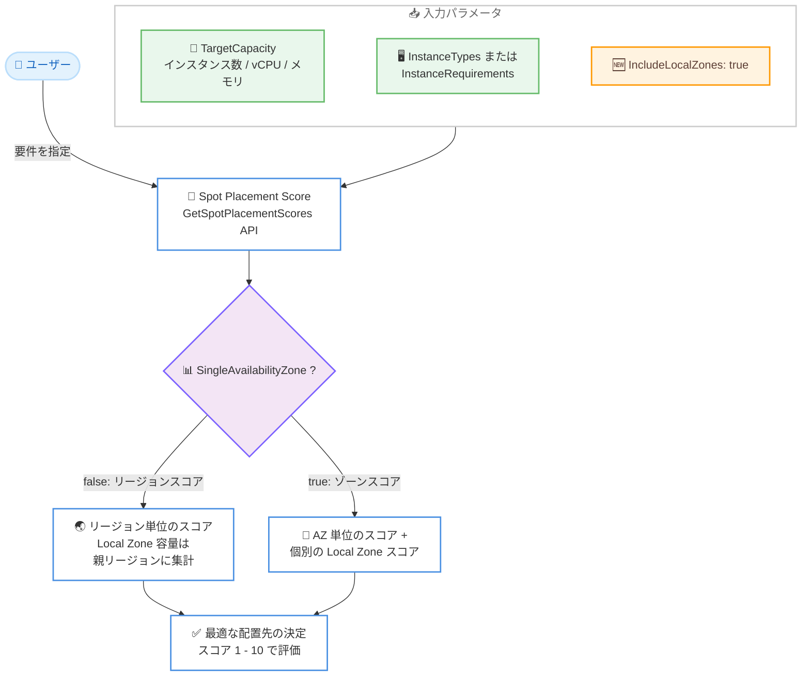

# Amazon EC2 - Spot Placement Score の Local Zones 対応

**リリース日**: 2026 年 8 月 13 日
**サービス**: Amazon EC2 (Spot Instances)
**機能**: Spot Placement Score による AWS Local Zones のスコアリング対応

📊 [このアップデートのインフォグラフィックを見る](https://takech9203.github.io/aws-news-summary/20260813-spot-placement-score-local-zones.html)

## 概要

Amazon EC2 の Spot Placement Score (スポット配置スコア) が AWS Local Zones に対応しました。Spot Placement Score は、指定したターゲットキャパシティとコンピューティング要件を評価し、Spot キャパシティリクエストが成功する可能性を AWS リージョンまたはアベイラビリティーゾーン単位のスコアとして返す機能です。今回のアップデートにより、ゾーンスコアとリージョンスコアの両方に Local Zones を任意で含められるようになり、Spot キャパシティの選択肢をより広い視野で評価できるようになりました。

本機能は EC2 Spot コンソール、AWS CLI、AWS SDK から利用できます。API レベルでは、`GetSpotPlacementScores` API に `IncludeLocalZones` パラメータが追加されており、リージョンスコアでは Local Zone のキャパシティが親リージョンに集計され、ゾーンスコアでは個別の Local Zone のスコアが返されます。

低レイテンシー要件のためにメトロエリア (大都市圏) の Local Zones で Spot インスタンスを活用するユーザーや、コスト最適化のために Spot キャパシティの配置先を柔軟に検討したいユーザーにとって、データに基づいた配置判断が可能になる有用なアップデートです。

**アップデート前の課題**

- 以前は Spot Placement Score のゾーンスコアおよびリージョンスコアに Local Zone のキャパシティデータが含まれておらず、Local Zones の Spot キャパシティ状況を事前に評価できなかった
- Local Zones で Spot インスタンスを起動する際、リクエストが成功する可能性を予測する手段がなく、試行錯誤が必要だった
- リージョン全体の Spot キャパシティを評価する際も Local Zone 分が考慮されず、実際のキャパシティ状況を完全には反映していなかった

**アップデート後の改善**

- ゾーンスコアのレスポンスに個別の Local Zone のスコアを含められるようになり、Local Zone ごとの Spot リクエスト成功可能性を事前に評価できるようになった
- リージョンスコアでは Local Zone のキャパシティが親リージョンに集計され、リージョン全体としてより実態に即したスコアを取得できるようになった
- EC2 Spot コンソールの「Include Local Zones」オプション、または API の `IncludeLocalZones` パラメータを指定するだけで、既存のワークフローに Local Zones の評価を簡単に組み込めるようになった

## アーキテクチャ図



`IncludeLocalZones` パラメータを指定すると、リージョンスコアでは Local Zone のキャパシティが親リージョンに集計され、ゾーンスコアでは個別の Local Zone のスコアがレスポンスに含まれます。

## サービスアップデートの詳細

### 主要機能

1. **ゾーンスコアへの Local Zone の追加**
   - `SingleAvailabilityZone: true` かつ `IncludeLocalZones: true` を指定すると、アベイラビリティーゾーンに加えて個別の Local Zone のスコアがレスポンスに含まれる
   - Local Zone ごとに Spot リクエストが成功する可能性を 1〜10 のスコアで確認できる
   - 低レイテンシー要件のワークロードで、どの Local Zone に Spot キャパシティを配置すべきかをデータに基づいて判断できる

2. **リージョンスコアへの Local Zone キャパシティの集計**
   - リージョンスコア (デフォルト) では、Local Zone のキャパシティが親リージョンのスコアに集計される
   - リージョン全体の Spot キャパシティをより実態に即して評価できる
   - `IncludeLocalZones` を省略または `false` に設定した場合、従来どおり Local Zones は無視される

3. **コンソール・CLI・SDK からの利用**
   - EC2 Spot コンソールの「Calculate Spot Placement Score」画面で、Score options の「Include Local Zones」を選択して利用できる
   - コンソールで Local Zones を含めるには、アカウントで少なくとも 1 つの Local Zone が有効化されている必要がある
   - AWS CLI では `get-spot-placement-scores` コマンドの JSON 設定に `IncludeLocalZones` を追加するだけで利用できる

## 技術仕様

### Spot Placement Score の基本仕様

| 項目 | 詳細 |
|------|------|
| スコア範囲 | 1〜10 (10 が最も成功可能性が高い) |
| スコア単位 | リージョン単位 (デフォルト) またはアベイラビリティーゾーン / Local Zone 単位 |
| ターゲットキャパシティ単位 | `units` (インスタンス数)、`vcpu`、`memory-mib` |
| 最小インスタンスタイプ数 | 3 種類以上 (それ未満の場合は低いスコアが返される) |
| Local Zones の扱い | `IncludeLocalZones: true` で有効化。リージョンスコアでは親リージョンに集計、ゾーンスコアでは個別スコアを返却 |
| 料金 | 追加料金なし |

### API 変更内容

`GetSpotPlacementScores` API に以下のパラメータが追加されました。

| パラメータ | 型 | 説明 |
|------------|-----|------|
| `IncludeLocalZones` | Boolean | `true` を指定すると Local Zones をスコアリングに含める。リージョンスコアでは Local Zone 容量が親リージョンに集計され、ゾーンスコアでは個別の Local Zone スコアが返される。省略時または `false` の場合、Local Zones は無視される |

### 制限事項に関する仕様

| 制限 | 詳細 |
|------|------|
| ターゲットキャパシティ制限 | 直近の Spot 使用量に基づき決定。使用実績がない場合は低いデフォルト制限が適用される |
| リクエスト設定数の制限 | 意図された用途と異なる利用パターンを検出した場合、24 時間以内の新規リクエスト設定数が制限される場合がある |
| コンソールでの Local Zones 利用 | アカウントで少なくとも 1 つの Local Zone が有効化されている必要がある |

## 設定方法

### 前提条件

1. `ec2:GetSpotPlacementScores` の IAM 権限があること
2. AWS CLI を使用する場合、最新バージョンにアップデートされていること
3. コンソールで Local Zones を含める場合、アカウントで少なくとも 1 つの Local Zone が有効化されていること

### 手順

#### ステップ1: JSON 設定ファイルの作成

```bash
cat > sps-config.json << 'EOF'
{
    "InstanceTypes": [
        "m5.4xlarge",
        "r5.2xlarge",
        "m4.4xlarge"
    ],
    "TargetCapacity": 500,
    "SingleAvailabilityZone": true,
    "IncludeLocalZones": true
}
EOF
```

Spot Placement Score のリクエスト設定を JSON ファイルとして作成します。3 種類以上のインスタンスタイプとターゲットキャパシティを指定し、`SingleAvailabilityZone: true` でゾーン単位のスコアを要求、`IncludeLocalZones: true` で Local Zones をスコアリング対象に含めます。

#### ステップ2: Spot Placement Score の取得

```bash
aws ec2 get-spot-placement-scores \
    --region us-east-1 \
    --cli-input-json file://sps-config.json
```

作成した JSON 設定ファイルを指定して `get-spot-placement-scores` コマンドを実行し、アベイラビリティーゾーンおよび Local Zone ごとのスコアを取得します。レスポンスにはゾーン ID とスコア (1〜10) が含まれます。

#### ステップ3: コンソールでの確認

1. [Amazon EC2 コンソール](https://console.aws.amazon.com/ec2/) を開く
2. ナビゲーションペインで「Spot Requests」を選択
3. 「Request Spot Instances」横の下矢印から「Calculate Spot Placement Score」を選択
4. ターゲットキャパシティとインスタンスタイプ要件を入力し、「Load placement scores」を選択
5. 「Score options」で「Include Local Zones」を選択してスコアを再計算

コンソールでは、インスタンス属性またはインスタンスタイプを指定してスコアを計算し、Score options から Local Zones を含めるかどうかを切り替えられます。

## メリット

### ビジネス面

- **コスト最適化の推進**: Local Zones を含めた幅広い配置先から Spot キャパシティを評価できるため、オンデマンドと比較して大幅なコスト削減が期待できる Spot インスタンスの活用範囲が広がる
- **低レイテンシーとコスト削減の両立**: エンドユーザーに近い Local Zones での Spot インスタンス活用を事前評価でき、レイテンシー要件とコスト要件の両立を図れる
- **追加料金なし**: Spot Placement Score は無料で利用でき、Local Zones 対応も追加コストなしで利用できる

### 技術面

- **データに基づく配置判断**: Local Zone ごとの Spot リクエスト成功可能性を 1〜10 のスコアで定量的に評価できる
- **既存ワークフローへの容易な統合**: `IncludeLocalZones` パラメータを追加するだけで、既存の Spot Placement Score を利用した自動化 (スコアトラッカーダッシュボードなど) に Local Zones の評価を組み込める
- **より正確なリージョン評価**: リージョンスコアに Local Zone キャパシティが集計されるため、リージョン全体の Spot キャパシティをより実態に即して把握できる

## デメリット・制約事項

### 制限事項

- Spot Placement Score はあくまで推奨情報であり、キャパシティの確保や中断リスクの低減を保証するものではない
- インスタンスタイプは 3 種類以上指定する必要があり、それ未満の場合は低いスコアが返される
- ターゲットキャパシティの上限は直近の Spot 使用量に基づいて決定されるため、使用実績がない場合は低いデフォルト制限が適用される
- コンソールで Local Zones を含めるには、アカウントで少なくとも 1 つの Local Zone が有効化されている必要がある

### 考慮すべき点

- Local Zones ではリージョンと比較して利用可能なインスタンスタイプが限られるため、スコアだけでなく必要なインスタンスタイプが Local Zone で提供されているかの確認も必要
- Local Zones の利用には事前のオプトイン (有効化) が必要であり、Spot インスタンスの料金体系もリージョンとは異なる場合がある
- 意図された用途と異なる利用パターン (過剰なリクエスト設定の生成など) を検出した場合、24 時間以内の新規リクエスト設定が制限される場合がある

## ユースケース

### ユースケース1: 低レイテンシーワークロードの Spot 配置先選定

**シナリオ**: リアルタイムゲームサーバーやメディアレンダリングなど、エンドユーザーに近い場所での低レイテンシー処理が必要なワークロードを、コスト効率の高い Spot インスタンスで実行したい。

**実装例**:
```json
{
    "InstanceTypes": ["c5.2xlarge", "c5d.2xlarge", "c6i.2xlarge"],
    "TargetCapacity": 100,
    "SingleAvailabilityZone": true,
    "IncludeLocalZones": true,
    "RegionNames": ["us-east-1", "us-west-2"]
}
```

**効果**: 対象リージョン配下の Local Zone ごとの Spot スコアを取得し、レイテンシー要件を満たしつつ Spot リクエストの成功可能性が高い Local Zone を選定できる。

### ユースケース2: リージョン全体の Spot キャパシティ評価の精度向上

**シナリオ**: 大規模なバッチ処理や CI/CD ワークロードを複数リージョンで運用しており、Spot キャパシティが最も豊富なリージョンへ柔軟にワークロードを移動させたい。

**実装例**:
```json
{
    "TargetCapacity": 5000,
    "TargetCapacityUnitType": "vcpu",
    "IncludeLocalZones": true,
    "InstanceRequirementsWithMetadata": {
        "ArchitectureTypes": ["x86_64"],
        "VirtualizationTypes": ["hvm"],
        "InstanceRequirements": {
            "VCpuCount": {"Min": 4, "Max": 16},
            "MemoryMiB": {"Min": 8192}
        }
    }
}
```

**効果**: Local Zone のキャパシティを含めたリージョン単位のスコアを取得でき、リージョン選定の精度が向上する。属性ベースのインスタンスタイプ選択により、要件を満たす幅広いインスタンスタイプで評価できる。

### ユースケース3: Spot Placement Score トラッカーによる継続的なモニタリング

**シナリオ**: Spot キャパシティの状況は変動するため、Local Zones を含めたスコアを定期的に取得し、CloudWatch ダッシュボードで可視化して配置戦略を継続的に見直したい。

**実装例**:
```bash
# 定期実行 (EventBridge Scheduler + Lambda など) でスコアを取得し
# CloudWatch にカスタムメトリクスとして送信
aws ec2 get-spot-placement-scores \
    --region us-east-1 \
    --cli-input-json file://sps-config.json \
    --query 'SpotPlacementScores[*].[Region,AvailabilityZoneId,Score]' \
    --output text
```

**効果**: Local Zones を含めたスコアの推移を継続的に監視でき、キャパシティ状況の変化に応じた Spot 配置先の見直しを自動化できる。AWS が公開している「Spot Placement Score Tracker Dashboard」のガイダンスも活用できる。

## 料金

Spot Placement Score の利用に追加料金はかかりません。Local Zones を含めたスコアリングも無料で利用できます。

なお、実際に Local Zones で Spot インスタンスを起動する場合の料金は、リージョンとは異なる Local Zones の Spot 料金が適用されます。詳細は [Amazon EC2 スポットインスタンスの料金ページ](https://aws.amazon.com/ec2/spot/pricing/) を参照してください。

## 利用可能リージョン

本機能は EC2 Spot コンソール、AWS CLI、AWS SDK から利用できます。公式発表では特定リージョンの限定は明記されておらず、Spot Placement Score が利用可能な環境で AWS Local Zones を対象としたスコアリングが可能です。コンソールから Local Zones を含める場合は、アカウントで少なくとも 1 つの Local Zone が有効化されている必要があります。

## 関連サービス・機能

- **AWS Local Zones**: 大都市圏の近くにコンピューティングやストレージなどの AWS サービスを配置するインフラストラクチャ。今回のアップデートで Spot Placement Score の評価対象に追加された
- **Amazon EC2 Spot Instances**: AWS の余剰キャパシティを活用した割引価格のインスタンス。Spot Placement Score はその配置先選定を支援する
- **Amazon EC2 Auto Scaling / EC2 Fleet**: 属性ベースのインスタンスタイプ選択と組み合わせて、スコアの高いゾーンやリージョンへ Spot キャパシティを柔軟にプロビジョニングできる
- **Amazon CloudWatch**: Spot Placement Score を定期取得してダッシュボード化する「Spot Placement Score Tracker」構成で利用される

## 参考リンク

- 📊 [インフォグラフィック](https://takech9203.github.io/aws-news-summary/20260813-spot-placement-score-local-zones.html)
- [公式発表 (What's New)](https://aws.amazon.com/about-aws/whats-new/2026/08/spot-placement-score-local-zones/)
- [ドキュメント: Spot placement score](https://docs.aws.amazon.com/AWSEC2/latest/UserGuide/spot-placement-score.html)
- [ドキュメント: Calculate the Spot placement score](https://docs.aws.amazon.com/AWSEC2/latest/UserGuide/work-with-spot-placement-score.html)
- [CLI リファレンス: get-spot-placement-scores](https://docs.aws.amazon.com/cli/latest/reference/ec2/get-spot-placement-scores.html)
- [AWS Local Zones](https://aws.amazon.com/about-aws/global-infrastructure/localzones/)
- [ガイダンス: Spot Placement Score Tracker Dashboard](https://aws.amazon.com/solutions/guidance/building-a-spot-placement-score-tracker-dashboard-on-aws/)

## まとめ

Spot Placement Score が AWS Local Zones に対応し、Local Zone を含めた Spot キャパシティの配置評価がゾーンスコア・リージョンスコアの両方で可能になりました。低レイテンシー要件のワークロードで Spot インスタンスの活用を検討している場合や、Spot キャパシティの配置先をより広い選択肢から最適化したい場合は、`GetSpotPlacementScores` API の `IncludeLocalZones` パラメータ、またはコンソールの「Include Local Zones」オプションを試すことを推奨します。追加料金なしで利用できるため、既存の Spot 運用ワークフローへの組み込みも容易です。
