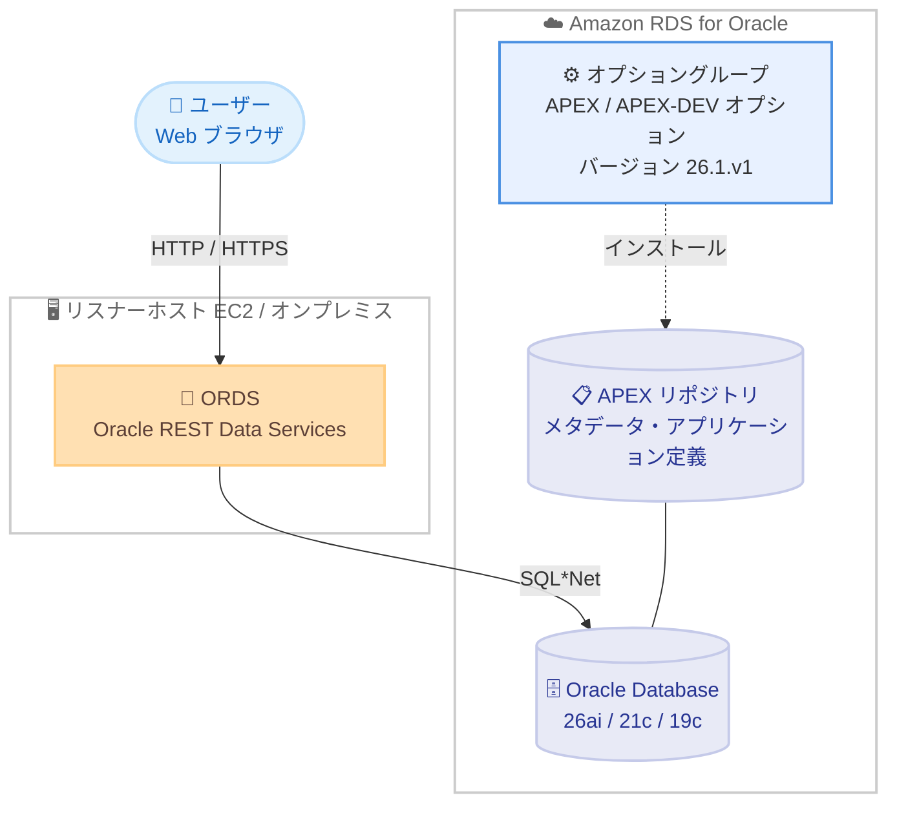

# Amazon RDS for Oracle - Oracle Application Express (APEX) バージョン 26.1 サポート

**リリース日**: 2026 年 8 月 14 日
**サービス**: Amazon RDS for Oracle
**機能**: Oracle Application Express (APEX) バージョン 26.1 のサポート

📊 [このアップデートのインフォグラフィックを見る](https://takech9203.github.io/aws-news-summary/20260814-amazon-rds-oracle-apex-26-1.html)

## 概要

Amazon RDS for Oracle が Oracle Application Express (APEX) バージョン 26.1 のサポートを開始しました。Amazon RDS for Oracle は、クラウド上で Oracle Database のセットアップ、運用、スケーリングを簡単に行えるマネージドデータベースサービスです。Oracle APEX はローコード開発プラットフォームであり、モダンな UI を備えたスケーラブルで安全なエンタープライズアプリケーションを Web ブラウザ上だけで構築できます。

RDS for Oracle では、`APEX` オプションと `APEX-DEV` オプションをオプショングループに追加することで、APEX をランタイム環境またはフル開発環境として利用できます。今回サポートされた APEX 26.1.v1 は、Oracle Database 26ai、21c、および 19c (Release Update 19.0.0.0.ru-2023-01.rur-2023-01.r1 以降) に対応しています。

Oracle APEX 26.1 では、生成 AI サポート (Generative AI Services の管理、APEX AI Assistant、アプリケーションへの生成 AI 組み込み) がドキュメント上の主要テーマとして位置づけられており、最新の APEX 機能を RDS for Oracle 上のマネージド環境で利用したいユーザーにとって重要なアップデートです。

**アップデート前の課題**

このアップデート以前は、RDS for Oracle 上で利用できる APEX の最新バージョンに制限がありました。

- RDS for Oracle でサポートされる APEX の最新バージョンは 24.2.v1 までであり、APEX 26.1 の新機能を利用できなかった
- APEX 26.1 を利用するには、EC2 インスタンスなどにセルフマネージドで Oracle Database と APEX を構築・運用する必要があった
- 最新の APEX リリースに含まれるパッチバンドル (PSE) を自身で適用・管理する必要があった

**アップデート後の改善**

今回のアップデートにより、以下が可能になりました。

- オプショングループの設定だけで、マネージド環境のまま APEX 26.1 を利用可能になった
- APEX 26.1 の生成 AI サポートなどの最新機能を RDS for Oracle 上で活用できるようになった
- APEX 26.1.v1 にはパッチ 39179920 (PSE BUNDLE FOR APEX 26.1、PATCH_VERSION 2) が含まれており、パッチ適用済みの状態で導入できる

## アーキテクチャ図



RDS for Oracle の APEX 構成では、オプショングループにより APEX リポジトリが DB インスタンスにインストールされ、HTTP 通信を処理するリスナー (ORDS) は EC2 インスタンスなどの別ホストに配置します。

## サービスアップデートの詳細

### 主要機能

1. **APEX 26.1.v1 オプションのサポート**
   - オプショングループに `APEX` オプション (バージョン 26.1.v1) を追加することで利用可能
   - フル開発環境が必要な場合は `APEX-DEV` オプションを併せて追加
   - ストレージ要件は約 122 MiB (DB インスタンスクラスのストレージを使用)

2. **パッチ適用済みバンドルの提供**
   - APEX 26.1.v1 にはパッチ 39179920: PSE BUNDLE FOR APEX 26.1 (PSES ON TOP OF 26.1.0)、PATCH_VERSION 2 が含まれる
   - EC2 インスタンスに同一の APEX images バージョンをインストールする場合は、パッチ 39743459: 26.1.2 PSE BUNDLE FOR APEX 26.1 をダウンロードして使用

3. **幅広いエンジンバージョンへの対応**
   - Oracle Database 26ai、21c、19c (Release Update 19.0.0.0.ru-2023-01.rur-2023-01.r1 以降) で利用可能
   - Oracle Database 26ai では APEX 24.1.v1 以降のみサポートされるため、26ai ユーザーにとって選択肢が拡大

## 技術仕様

### サポートされる APEX バージョン (抜粋)

| APEX バージョン | ストレージ要件 | 対応 Oracle Database バージョン |
|------|------|------|
| 26.1.v1 | 122 MiB | 26ai、21c、19c (RU 2023-01 以降) |
| 24.2.v1 | 114 MiB | すべて |
| 24.1.v1 | 112 MiB | すべて |
| 23.2.v1 | 110 MiB | 21c、19c |

### APEX の主要コンポーネント

| コンポーネント | 説明 |
|------|------|
| リポジトリ | APEX アプリケーションとコンポーネントのメタデータを格納。RDS DB インスタンス内にテーブル、インデックスなどとしてインストールされる |
| リスナー | APEX クライアントとの HTTP 通信を管理。EC2 インスタンス、オンプレミスサーバーなどの別ホストに配置する |

### リスナーの要件

- APEX 5.0 以降では ORDS (Oracle REST Data Services) バージョン 19.1 以降を使用する
- Amazon RDS は、組み込み PL/SQL ゲートウェイを使用する Oracle XML DB HTTP サーバーをリスナーとしてサポートしない
- ORDS の実行には Java Runtime Environment (JRE) が必要

## 設定方法

### 前提条件

1. RDS for Oracle DB インスタンス (Oracle Database 26ai、21c、または 19c の対応 RU) が稼働していること
2. リスナー (ORDS) を稼働させるホスト (EC2 インスタンスなど) と JRE が用意されていること
3. 管理タスク用に SQL*Plus または SQL Developer、および Oracle Net Services を含む Oracle クライアントがあること

### 手順

#### ステップ1: オプショングループの作成

```bash
aws rds create-option-group \
    --option-group-name apex-26-1-og \
    --engine-name oracle-ee \
    --major-engine-version 19 \
    --option-group-description "Option group for APEX 26.1"
```

APEX オプションを追加するためのオプショングループを作成します。エンジン名とメジャーバージョンは使用中の DB インスタンスに合わせます。

#### ステップ2: APEX オプションの追加

```bash
aws rds add-option-to-option-group \
    --option-group-name apex-26-1-og \
    --options "OptionName=APEX,OptionVersion=26.1.v1" \
    --apply-immediately

# フル開発環境が必要な場合は APEX-DEV も追加
aws rds add-option-to-option-group \
    --option-group-name apex-26-1-og \
    --options "OptionName=APEX-DEV" \
    --apply-immediately
```

オプショングループに `APEX` オプション (バージョン 26.1.v1) を追加します。ブラウザベースの開発環境 (App Builder など) を使用する場合は `APEX-DEV` オプションも追加します。

#### ステップ3: DB インスタンスへのオプショングループの適用

```bash
aws rds modify-db-instance \
    --db-instance-identifier my-oracle-instance \
    --option-group-name apex-26-1-og \
    --apply-immediately
```

作成したオプショングループを DB インスタンスに適用します。これにより APEX リポジトリが DB インスタンスにインストールされます。

#### ステップ4: ORDS のセットアップ

リスナーホスト (EC2 インスタンスなど) に ORDS をインストールし、RDS DB インスタンスへの接続を設定します。詳細な手順は [Setting up Oracle APEX and ORDS](https://docs.aws.amazon.com/AmazonRDS/latest/UserGuide/Appendix.Oracle.Options.APEX.settingUp.html) を参照してください。

## メリット

### ビジネス面

- **最新のローコード開発基盤**: APEX 26.1 の最新機能 (生成 AI サポートなど) を利用したアプリケーション開発が可能になり、開発生産性の向上が期待できる
- **運用負荷の軽減**: セルフマネージド環境を構築することなく、マネージドサービス上で最新の APEX を利用できる
- **追加コストなし**: APEX オプションの利用自体に追加料金は発生しない

### 技術面

- **パッチ適用済みで導入可能**: PSE バンドル (パッチ 39179920) が含まれた状態で提供されるため、個別のパッチ適用作業が不要
- **幅広いエンジン対応**: Oracle Database 26ai、21c、19c で利用でき、既存環境からの移行パスが確保しやすい
- **オプショングループによる宣言的な管理**: バージョン指定を含め、オプショングループの操作だけで APEX の導入・アップグレードを管理できる

## デメリット・制約事項

### 制限事項

- Amazon RDS が管理する `APEX_{{version}}` ユーザーアカウントは変更できない (データベースプロファイルの適用やパスワードルールの強制は不可)
- リスナー (ORDS) は DB インスタンスにインストールされないため、EC2 インスタンスなどの別ホストで運用する必要がある
- 組み込み PL/SQL ゲートウェイ (Oracle XML DB HTTP サーバー) はリスナーとしてサポートされない
- Oracle Database 26ai では APEX 24.1.v1 以降のみがサポートされる

### 考慮すべき点

- Oracle Database 19c で APEX 26.1.v1 を使用するには、Release Update 19.0.0.0.ru-2023-01.rur-2023-01.r1 以降が必要
- APEX オプションは DB インスタンスクラスのストレージを約 122 MiB 使用する
- リスナーホストの構築・運用 (ORDS のバージョン管理、JRE の管理、スケーリング) はユーザーの責任範囲となる
- 既存の APEX アプリケーションをアップグレードする場合は、事前に検証環境での動作確認を推奨

## ユースケース

### ユースケース1: 生成 AI を活用した社内業務アプリケーションの構築

**シナリオ**: 既存の RDS for Oracle 上のデータを活用し、生成 AI アシスタント機能を組み込んだ社内業務アプリケーションをローコードで迅速に開発したい。

**実装例**:
```
1. オプショングループに APEX 26.1.v1 と APEX-DEV オプションを追加
2. EC2 インスタンス上に ORDS をセットアップ
3. App Builder で業務アプリケーションを作成し、Generative AI Services を設定
```

**効果**: APEX 26.1 の生成 AI サポートを活用し、コーディング量を最小限に抑えながら AI 機能付きアプリケーションを短期間で構築できます。

### ユースケース2: 既存 APEX アプリケーションの最新バージョンへのアップグレード

**シナリオ**: RDS for Oracle 上で APEX 24.2 以前のバージョンを利用しており、最新機能とセキュリティ改善のために APEX 26.1 へアップグレードしたい。

**実装例**:
```
1. スナップショットを取得し、検証用インスタンスを復元
2. 検証環境でオプショングループの APEX オプションを 26.1.v1 に変更し動作確認
3. 問題がなければ本番環境のオプショングループを更新
```

**効果**: マネージド環境のままオプショングループの変更だけでアップグレードでき、パッチ適用作業も不要なため、移行の作業負荷とリスクを低減できます。

### ユースケース3: Oracle Database 26ai への移行と APEX 環境の刷新

**シナリオ**: Oracle Database 26ai への移行を計画しており、あわせて APEX 環境も最新バージョンに刷新したい。

**実装例**:
```
1. Oracle Database 26ai の RDS インスタンスを準備
2. APEX 26.1.v1 オプションを含むオプショングループを適用
3. 既存の APEX アプリケーションをエクスポートし、新環境にインポート
```

**効果**: 26ai と APEX 26.1 の組み合わせにより、データベースエンジンとローコード開発基盤の両方を最新化した環境を構築できます。

## 料金

Oracle APEX オプションの利用自体に追加料金は発生しません。通常の Amazon RDS for Oracle の料金 (DB インスタンス、ストレージ、データ転送) が適用されます。なお、APEX リポジトリは DB インスタンスのストレージを約 122 MiB 使用します。また、リスナー (ORDS) を稼働させる EC2 インスタンスなどのホストには別途料金が発生します。

## 利用可能リージョン

APEX 26.1 は、Amazon RDS for Oracle が利用可能なすべての AWS リージョンで利用できます。リージョン別の提供状況は [Amazon RDS for Oracle 料金ページ](https://aws.amazon.com/rds/oracle/pricing/) を参照してください。

## 関連サービス・機能

- **Amazon EC2**: APEX のリスナー (ORDS) を稼働させるホストとして使用
- **Amazon RDS オプショングループ**: APEX / APEX-DEV オプションの追加・バージョン管理に使用
- **Oracle REST Data Services (ORDS)**: APEX クライアントとの HTTP 通信を処理するリスナー (バージョン 19.1 以降を使用)

## 参考リンク

- 📊 [インフォグラフィック](https://takech9203.github.io/aws-news-summary/20260814-amazon-rds-oracle-apex-26-1.html)
- [公式発表 (What's New)](https://aws.amazon.com/about-aws/whats-new/2026/08/amazon-rds-oracle-apex-26-1/)
- [Amazon RDS for Oracle - Oracle Application Express (APEX) ドキュメント](https://docs.aws.amazon.com/AmazonRDS/latest/UserGuide/Appendix.Oracle.Options.APEX.html)
- [APEX の要件と制限事項](https://docs.aws.amazon.com/AmazonRDS/latest/UserGuide/Appendix.Oracle.Options.APEX.Requirements.html)
- [Oracle APEX Release 26.1 ドキュメント](https://docs.oracle.com/en/database/oracle/apex/26.1/index.html)
- [Amazon RDS for Oracle 製品ページ](https://aws.amazon.com/rds/oracle/)
- [Amazon RDS for Oracle 料金ページ](https://aws.amazon.com/rds/oracle/pricing/)

## まとめ

Amazon RDS for Oracle での APEX 26.1 サポートにより、生成 AI サポートを含む最新のローコード開発機能をマネージド環境で利用できるようになりました。Oracle Database 26ai、21c、19c に対応しており、オプショングループの変更だけで導入・アップグレードが可能です。APEX を利用中のユーザーは、検証環境での動作確認を経て 26.1.v1 へのアップグレードを検討することを推奨します。
