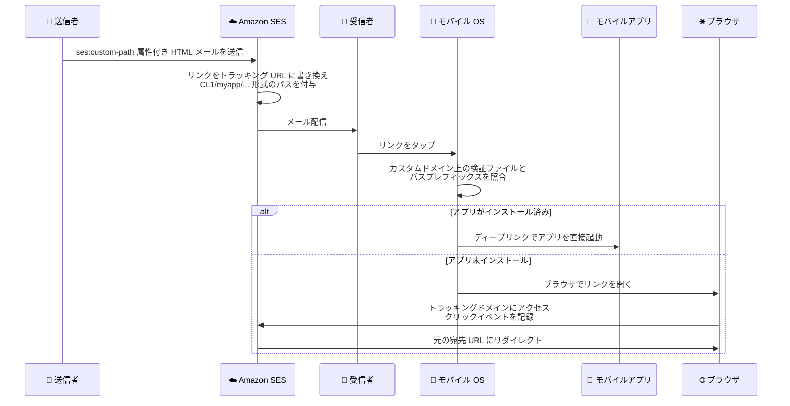

# Amazon SES - クリックトラッキングのカスタム URL パス対応 (モバイルアプリディープリンク)

**リリース日**: 2026 年 8 月 14 日
**サービス**: Amazon Simple Email Service (SES)
**機能**: クリックトラッキング URL へのカスタムパスセグメント追加 (`ses:custom-path` 属性)

📊 [このアップデートのインフォグラフィックを見る](https://takech9203.github.io/aws-news-summary/20260814-amazon-ses-supports-customurl-deeplinking.html)

## 概要

Amazon SES のクリックトラッキング機能が、カスタム URL パスをサポートしました。HTML メール内の `<a>` タグに新しい属性 `ses:custom-path` を追加すると、SES が生成するクリックトラッキング URL に指定したパスセグメントが埋め込まれます。これにより、iOS の Universal Links や Android の App Links によるモバイルアプリのディープリンクと、SES のエンゲージメントトラッキングを両立できるようになります。

iOS / Android のディープリンクの仕組みでは、OS がクリックトラッキングドメイン上にホストされた検証ファイル (iOS は Apple App Site Association、Android は Digital Asset Links) を参照し、パスプレフィックスマッチングによってどのアプリでリンクを開くかを判定します。従来の SES トラッキング URL はパス部分を送信者が制御できなかったため、この照合が困難でした。今回のアップデートで、送信者が固定のパスセグメントを指定できるようになり、アプリがインストール済みの場合はアプリで直接、未インストールの場合は Web ブラウザでリンクを開くという体験を、クリック計測を維持したまま実現できます。

メールマガジンやトランザクションメールからモバイルアプリへの誘導を重視する EC サイト、メディア、モバイルファーストなサービスの開発者にとって、エンゲージメント計測とアプリ体験のトレードオフを解消する重要なアップデートです。

**アップデート前の課題**

このアップデート以前は、クリックトラッキングとモバイルディープリンクの併用に制約がありました。

- SES のクリックトラッキングはメール内のリンクをトラッキング URL に書き換えるため、Universal Links / App Links のパスプレフィックスマッチングに必要なパス構造を送信者が制御できなかった
- ディープリンクを機能させるには `ses:no-track` 属性でリンク単位のトラッキングを無効化するか、設定セット全体でクリックイベントの収集を諦める必要があった
- その結果、アプリ誘導とクリック計測のどちらかを犠牲にする選択を迫られていた

**アップデート後の改善**

今回のアップデートにより、以下が可能になりました。

- `<a>` タグに `ses:custom-path` 属性を追加するだけで、トラッキング URL に固定のパスセグメントが引き継がれるようになった
- カスタムリダイレクトドメイン上の検証ファイルにパスプレフィックス (例: `/CL1/myapp/*`) を定義でき、OS がアプリへのルーティングを判定できるようになった
- クリックトラッキングを無効化することなく、モバイルアプリのディープリンクを利用できるようになった

## アーキテクチャ図



`ses:custom-path` で指定したパスセグメントがトラッキング URL に引き継がれ、モバイル OS が Universal Links / App Links の検証ファイルとパスプレフィックスマッチングを行い、アプリ起動またはブラウザフォールバックを判定するフローを示しています。

## サービスアップデートの詳細

### 主要機能

1. **`ses:custom-path` 属性によるパスセグメントの指定**
   - HTML メール内の個々の `<a>` タグに `ses:custom-path="myapp"` のように指定する
   - SES がリンクをトラッキング URL に書き換える際、指定したパスセグメントをそのまま URL に引き継ぐ
   - `ses:no-track` と同様に非標準の HTML 属性であり、SES は配信前にメールからこの属性を削除するため、受信者には見えない

2. **トラッキング URL 形式の変化**
   - 属性なし (デフォルト): `https://{カスタムリダイレクトドメイン}/CL0/{encodedUrl}/{index}/{messageId}/{hmac}`
   - `ses:custom-path="myapp"` 指定時: `https://{カスタムリダイレクトドメイン}/CL1/myapp/{encodedUrl}/{index}/{messageId}/{hmac}`
   - パスプレフィックスが `/CL1/myapp/` に固定されるため、OS 側の検証ファイルでマッチング可能になる

3. **iOS Universal Links / Android App Links との連携**
   - カスタムリダイレクトドメインの `/.well-known/apple-app-site-association` (iOS) または `/.well-known/assetlinks.json` (Android) に検証ファイルをホストする
   - アプリがインストール済みの端末ではリンクがアプリで直接開き、未インストールの場合は Web ブラウザにフォールバックする

## 技術仕様

### `ses:custom-path` 属性の仕様

| 項目 | 詳細 |
|------|------|
| 使用可能文字 | 英字 (A–Z、a–z)、数字 (0–9)、ハイフン (-)、ピリオド (.)、アンダースコア (_) のみ |
| 長さ | 1〜32 文字 |
| 大文字小文字 | 区別される |
| 配信時の扱い | SES が配信前にメールから属性を削除 |
| 値が無効な場合 | デフォルト形式 (CL0) にフォールバック (属性を省略した場合と同じ) |
| クリックイベントデータ | `ses:custom-path` の値はイベントデータに含まれない。リンク識別には `ses:tags` を使用する |
| `ses:no-track` との併用 | 同じリンクに `ses:no-track` がある場合はトラッキング自体が無効になり、`ses:custom-path` は効果を持たない |

### API 変更履歴

このアップデートは HTML メール内の属性を SES が送信時に処理する機能であり、SES API 自体の変更は伴いません (awsapichanges.com の直近の変更履歴にも SES 関連の API 変更はありません)。

### iOS 用検証ファイルの例 (apple-app-site-association)

```json
{
  "applinks": {
    "apps": [],
    "details": [
      {
        "appID": "{TEAMID}.{com.example.myapp}",
        "paths": ["/CL1/myapp/*"]
      }
    ]
  }
}
```

### Android 用検証ファイルの例 (assetlinks.json)

```json
[{
  "relation": ["delegate_permission/common.handle_all_urls"],
  "target": {
    "namespace": "android_app",
    "package_name": "com.example.myapp",
    "sha256_cert_fingerprints": ["{証明書フィンガープリント}"]
  }
}]
```

Android では iOS と異なり、パスプレフィックスは `assetlinks.json` ではなくアプリの `AndroidManifest.xml` のインテントフィルターで `android:pathPrefix="/CL1/myapp/"` として設定します。

## 設定方法

### 前提条件

1. クリックトラッキング用のカスタムリダイレクトドメイン (サブドメイン) を設定済みであること。Universal Links / App Links は HTTPS を要求するため、CloudFront などの CDN を使った HTTPS ドメイン構成を推奨
2. 設定セット (Configuration Set) の `TrackingOptions` でカスタムリダイレクトドメインを指定し、イベント送信先でクリックイベントを有効化していること
3. ディープリンクに対応したモバイルアプリ (iOS / Android) があること

### 手順

#### ステップ 1: カスタムリダイレクトドメインを設定セットに関連付ける

```bash
aws sesv2 create-configuration-set --cli-input-json file://create.json
```

`create.json` の例。

```json
{
    "ConfigurationSetName": "my-config-set",
    "TrackingOptions": {
        "CustomRedirectDomain": "click.example.com",
        "HttpsPolicy": "REQUIRE"
    },
    "SendingOptions": {
        "SendingEnabled": true
    }
}
```

SES API v2 の `CreateConfigurationSet` で設定セットを作成し、`CustomRedirectDomain` にクリックトラッキング用のカスタムドメインを、`HttpsPolicy` に `REQUIRE` を指定してトラッキングリンクを HTTPS でラップするコマンドです。

#### ステップ 2: 検証ファイルをカスタムドメインにホストする

```bash
# iOS: AASA ファイルを配置
# https://click.example.com/.well-known/apple-app-site-association

# Android: Digital Asset Links ファイルを配置
# https://click.example.com/.well-known/assetlinks.json
```

カスタムリダイレクトドメインの `/.well-known/` パス配下に、対応するモバイルプラットフォームの検証ファイルをホストします。iOS の AASA ファイルでは `paths` に `/CL1/{カスタムパス}/*` を指定し、Android ではアプリの `AndroidManifest.xml` で `android:pathPrefix="/CL1/{カスタムパス}/"` を設定します。

#### ステップ 3: メールのリンクに `ses:custom-path` 属性を追加する

```html
<a href="https://example.com/product/123" ses:custom-path="myapp">商品を見る</a>
```

HTML メール内のディープリンク対象のリンクに `ses:custom-path` 属性を追加します。SES はこのリンクを `https://click.example.com/CL1/myapp/{encodedUrl}/{index}/{messageId}/{hmac}` 形式のトラッキング URL に書き換え、配信前に属性自体はメールから削除します。

## メリット

### ビジネス面

- **アプリエンゲージメントの向上**: メールからアプリへシームレスに誘導でき、Web を経由するよりも高いコンバージョンが期待できる
- **計測と体験の両立**: クリック率などのエンゲージメント指標を維持したままディープリンクを導入でき、マーケティング施策の効果測定を犠牲にしない
- **一貫したブランド体験**: カスタムリダイレクトドメインと組み合わせることで、トラッキング URL からも SES の痕跡が見えない統一的な体験を提供できる

### 技術面

- **実装が簡単**: 既存の HTML メールのリンクに属性を 1 つ追加するだけで利用でき、API やテンプレートの変更は不要
- **安全なフォールバック**: 属性値が無効な場合はデフォルトのトラッキング URL 形式に自動フォールバックし、リンク自体は壊れない
- **プラットフォーム標準に準拠**: iOS Universal Links / Android App Links という OS 標準のディープリンク機構をそのまま利用できる

## デメリット・制約事項

### 制限事項

- 属性値は英数字、ハイフン、ピリオド、アンダースコアのみで 1〜32 文字という制約がある
- `ses:custom-path` の値はクリックイベントデータには含まれないため、どのリンクがクリックされたかの識別には別途 `ses:tags` 属性が必要
- 同じリンクに `ses:no-track` が付いている場合、クリックトラッキング自体が無効になり `ses:custom-path` は機能しない
- クリックトラッキングは HTML メールのみが対象で、1 通あたり最大 250 リンクまで追跡可能

### 考慮すべき点

- Universal Links / App Links には HTTPS のカスタムリダイレクトドメインが事実上必須であり、CloudFront などの CDN 設定と SSL 証明書の管理が必要になる
- 検証ファイル (AASA / assetlinks.json) をトラッキングドメイン上に正しくホストし、アプリ側の設定 (iOS の Associated Domains、Android のインテントフィルター) と整合させる必要がある
- アプリでリンクを直接開いた場合のクリックイベントの計上挙動は、OS やアプリ側でのトラッキング URL の解決方法に依存するため、実装時に動作検証を行うことを推奨

## ユースケース

### ユースケース 1: EC サイトの商品案内メールからアプリの商品ページへ誘導

**シナリオ**: EC 事業者がキャンペーンメールの商品リンクを、アプリインストール済みユーザーにはアプリの商品詳細画面で開かせたい。クリック率の計測も継続したい。

**実装例**:
```html
<a href="https://shop.example.com/product/123" ses:custom-path="shopapp">
  セール対象商品を見る
</a>
```

**効果**: アプリユーザーは Web を経由せず直接アプリの商品ページに遷移し、購入までの導線が短縮される。クリックイベントは引き続きイベント送信先に発行され、キャンペーン効果を測定できる。

### ユースケース 2: iOS / Android でパスを分けたルーティング

**シナリオ**: iOS アプリと Android アプリでディープリンク対応状況が異なるため、リンクごとに異なるカスタムパスを割り当てて OS 側のマッチング範囲を制御したい。

**実装例**:
```html
<!-- iOS の AASA では /CL1/news/* のみを paths に定義 -->
<a href="https://media.example.com/articles/456" ses:custom-path="news">記事を読む</a>

<!-- アプリで開かせたくないリンクは属性を付けずデフォルト形式 CL0 のままにする -->
<a href="https://media.example.com/terms">利用規約</a>
```

**効果**: パスプレフィックスマッチングの単位でアプリ起動の対象リンクを制御でき、規約ページなど Web で開くべきリンクとアプリで開くべきリンクを 1 通のメール内で使い分けられる。

### ユースケース 3: `ses:tags` と組み合わせたリンク単位の分析

**シナリオ**: ディープリンク対応と同時に、どのリンクがクリックされたかをイベントデータで識別して分析したい (`ses:custom-path` の値はイベントデータに含まれないため)。

**実装例**:
```html
<a href="https://shop.example.com/product/123"
   ses:custom-path="shopapp"
   ses:tags="campaign:summer2026;slot:hero;">
  今すぐチェック
</a>
```

**効果**: ディープリンクによるアプリ誘導と、`ses:tags` によるリンク単位のクリック分析を同時に実現できる。タグはイベント発行先 (Kinesis Data Firehose、SNS など) に引き継がれ、詳細なエンゲージメント分析が可能になる。

## 料金

`ses:custom-path` 属性の利用自体に追加料金の発表はなく、クリックトラッキングは SES のイベント発行機能の一部として提供されます。SES の料金は送信メール数などに基づく従量課金です。

なお、HTTPS のカスタムリダイレクトドメインを構成する場合は、CloudFront などの CDN の利用料金が別途発生する点に注意してください。

詳細は [Amazon SES 料金ページ](https://aws.amazon.com/ses/pricing/) を参照してください。

## 利用可能リージョン

Amazon SES が利用可能なすべての AWS リージョンで利用できます。

## 関連サービス・機能

- **SES イベント発行 (Event Publishing)**: クリック / オープンイベントを Amazon SNS、Kinesis Data Firehose、CloudWatch などに発行し、エンゲージメントを分析する基盤機能
- **Amazon CloudFront**: HTTPS のカスタムリダイレクトドメインを構成する際の CDN として利用。SES トラッキングドメインをオリジンに設定する
- **Amazon Route 53**: カスタムリダイレクトドメインの DNS 設定 (CNAME / Alias レコード) の管理に利用
- **`ses:tags` 属性**: リンクにキーバリュー形式のタグを付与し、クリックイベントデータでリンクを識別するための既存機能。`ses:custom-path` と併用可能

## 参考リンク

- 📊 [インフォグラフィック](https://takech9203.github.io/aws-news-summary/20260814-amazon-ses-supports-customurl-deeplinking.html)
- [公式発表 (What's New)](https://aws.amazon.com/about-aws/whats-new/2026/08/amazon-ses-supports-customurl-deeplinking)
- [ドキュメント: カスタムドメインによるオープン / クリックトラッキングの設定](https://docs.aws.amazon.com/ses/latest/dg/configure-custom-open-click-domains.html)
- [ドキュメント: メール送信メトリクスに関する FAQ](https://docs.aws.amazon.com/ses/latest/dg/faqs-metrics.html)
- [Amazon SES 製品ページ](https://aws.amazon.com/ses/)
- [料金ページ](https://aws.amazon.com/ses/pricing/)

## まとめ

Amazon SES の `ses:custom-path` 属性により、これまでトレードオフの関係にあったクリックトラッキングとモバイルディープリンクを両立できるようになりました。モバイルアプリを持つメール送信者は、カスタムリダイレクトドメインに検証ファイルをホストし、リンクに属性を 1 つ追加するだけで、アプリへの直接誘導とエンゲージメント計測を同時に実現できます。メール経由のアプリ誘導を強化したい場合は、まず HTTPS のカスタムリダイレクトドメインの構成から着手することを推奨します。
