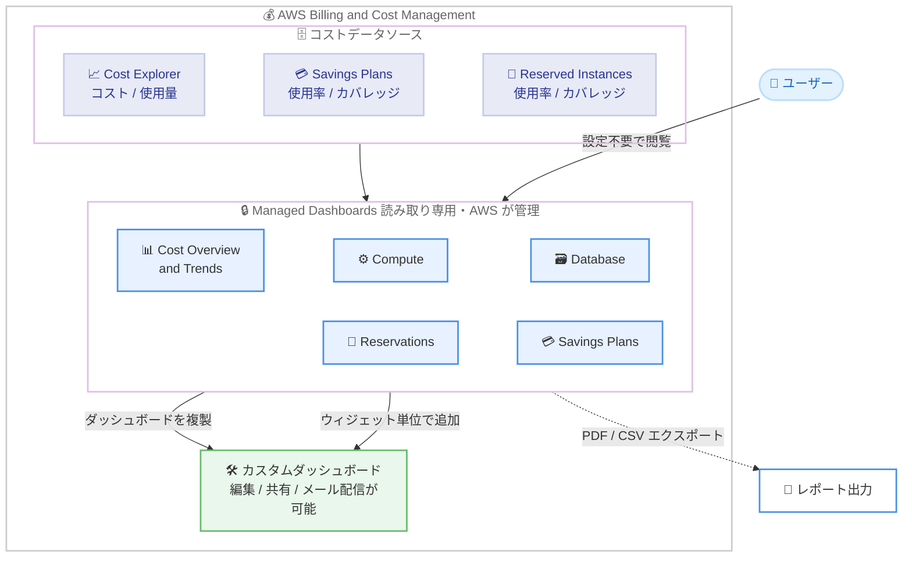

# AWS Billing and Cost Management - Managed Dashboards

**リリース日**: 2026 年 8 月 14 日
**サービス**: AWS Billing and Cost Management
**機能**: Managed Dashboards (マネージドダッシュボード)

📊 [このアップデートのインフォグラフィックを見る](https://takech9203.github.io/aws-news-summary/20260814-aws-billing-and-cost-management-managed-dashboards.html)

## 概要

AWS Billing and Cost Management Dashboards に、AWS が事前構成して提供する読み取り専用の Managed Dashboards が追加されました。ダッシュボード一覧に自動的に表示され、アカウントのコストデータがあらかじめ反映された状態で提供されるため、一切の設定作業なしでコストの傾向、サービスカテゴリ別のコスト、コミットメント (Savings Plans / Reserved Instances) のパフォーマンスを即座に可視化できます。

提供されるのは、一般的なカスタマーレポーティングパターンと FinOps のベストプラクティスに基づいて設計された 5 種類のダッシュボード (Cost Overview & Trends、Compute、Database、Reservations、Savings Plans) です。FinOps プラクティスをこれから始めるユーザーにも、複数アカウントにわたる標準化されたベースラインレポートを求める組織にも有用です。

Managed Dashboards は読み取り専用ですが、複製して完全に編集可能なカスタムダッシュボードを作成したり、個別のウィジェットを既存のカスタムダッシュボードに追加したりできます。また、PDF または CSV 形式でのエクスポートにも対応しています。

**アップデート前の課題**

- コスト可視化のためには、Cost Explorer や Dashboards でウィジェットを 1 つずつ選択・設定してカスタムダッシュボードを自作する必要があった
- どの指標を組み合わせて見るべきかという FinOps のベストプラクティスを自分で調査・設計する必要があり、初期構築の負荷が高かった
- 組織内の複数アカウントで一貫した標準レポートを維持するには、各アカウントで同じダッシュボードを再現・管理する運用負荷があった

**アップデート後の改善**

- ダッシュボード一覧に AWS 管理の 5 種類のダッシュボードが自動的に表示され、設定ゼロで即座にコスト分析を開始できるようになった
- AWS がベストプラクティスに基づいてウィジェット構成を設計・維持するため、レポート設計の知識がなくても標準的なコスト分析が可能になった
- 複製やウィジェット単位のコピーにより、Managed Dashboards を出発点として自組織向けのカスタムダッシュボードを効率的に構築できるようになった

## アーキテクチャ図



アカウントのコストデータが自動的に反映された 5 種類の Managed Dashboards を設定不要で閲覧でき、複製やウィジェット追加によりカスタムダッシュボードの出発点としても活用できます。

## サービスアップデートの詳細

### 提供される 5 種類の Managed Dashboards

Managed Dashboards は「コスト / 使用量トレンド」「主要サービスカテゴリ」「コミットメントレポート」の 3 つの可視化レイヤーで構成されています。

1. **Cost Overview & Trends (コスト概要とトレンド)**
   - サービス、アカウント、リージョン、チャージタイプ、請求エンティティ別の支出を 12 か月間にわたって追跡する財務サマリー
   - 将来のコスト予測 (フォーキャスト) を含む
   - ウィジェット例: 月次コストトレンド合計、現在および予測コスト、上位サービス別コスト、サービス別内訳、連結アカウント別、リージョン別、チャージタイプ別、請求エンティティ別、Marketplace コスト
   - 月次レビュー、経営層向け報告、全体的な支出傾向の把握に活用

2. **Compute (コンピューティング)**
   - Amazon EC2、Amazon ECS、Amazon EKS、AWS Lambda などのコンピューティングコストをインスタンスタイプ、プラットフォーム、アベイラビリティーゾーン別に分解
   - コスト内訳と Savings Plans / Reserved Instance の使用率・カバレッジメトリクスを同一ビューで表示
   - ライトサイジング機会の特定、Graviton 移行候補の評価、コンピューティングワークロードのカバレッジギャップ評価に活用

3. **Database (データベース)**
   - Amazon RDS、ElastiCache、OpenSearch Service、DynamoDB、Redshift などのデータサービスをデータベースエンジン、インスタンスタイプ、購入オプション、使用タイプ別に分解
   - サービスごとの RI カバレッジと Savings Plans カバレッジのウィジェットにより、データベースポートフォリオ全体のコミットメントギャップを可視化

4. **Reservations (リザベーション)**
   - RI 対象の全サービス (Amazon EC2、ElastiCache、RDS、OpenSearch Service、Redshift、MemoryDB) にわたる Reserved Instance パフォーマンスの統合ビュー
   - 各サービスのインスタンスタイプ別コストとカバレッジメトリクス、使用率の詳細を表示
   - カバレッジのギャップや低使用率を金額ベースで定量化

5. **Savings Plans (セービングスプラン)**
   - Compute、EC2 Instance、Amazon SageMaker の 3 タイプすべての Savings Plans ポートフォリオの使用率とカバレッジを表示
   - オンデマンド支出と購入オプション構成を併せて表示し、追加購入による節約余地の特定を支援

### カスタムダッシュボードへの展開

1. **ダッシュボードの複製**
   - 任意の Managed Dashboard を複製し、完全に所有・編集可能な独立したコピーを作成可能
   - 複製後はウィジェットの追加・削除、期間の変更、コスト配分タグの適用、ディメンション調整、レイアウト変更、メール配信スケジュール設定、他アカウントとの共有が可能
   - AWS による元の Managed Dashboard への変更は複製したコピーに影響しない

2. **ウィジェット単位の追加**
   - ダッシュボード全体を複製せずに、個別のウィジェットのみを既存のカスタムダッシュボードに追加可能
   - ウィジェットメニューから [Add to dashboard] を選択して追加先を指定

3. **エクスポート**
   - PDF または CSV 形式でのエクスポートに対応

## 技術仕様

### Managed Dashboards の特性

| 項目 | 詳細 |
|------|------|
| 提供形態 | AWS が作成・維持する事前構成済みダッシュボード |
| 表示 | ダッシュボード一覧に自動表示 (全アカウントで利用可能) |
| データ | アカウントのコストデータが自動的に反映 |
| 編集 | 不可 (読み取り専用)。複製すれば編集可能 |
| 削除 | 不可 (常にダッシュボード一覧に表示) |
| 共有 | 不可 (各アカウントに自動提供されるため不要) |
| タグ付け | 不可 |
| メール配信スケジュール | 直接は不可。複製したカスタムダッシュボードで設定可能 |
| エクスポート | PDF / CSV に対応 |
| 追加料金 | なし |

## 設定方法

### 前提条件

1. AWS Billing and Cost Management コンソールへのアクセス権限を持っていること
2. Billing and Cost Management Dashboards の閲覧に必要な IAM 権限が付与されていること

### 手順

#### ステップ 1: Managed Dashboards を表示する

1. [Billing and Cost Management コンソール](https://console.aws.amazon.com/costmanagement/) を開く
2. ナビゲーションペインで [Dashboards] を選択する
3. ダッシュボード一覧に自動表示されている 5 種類の Managed Dashboards から閲覧したいものを選択する

設定作業は不要で、アカウントのコストデータが反映された状態で即座に閲覧できます。

#### ステップ 2: Managed Dashboard を複製してカスタマイズする

1. 複製したい Managed Dashboard を選択する
2. [Actions] から [Duplicate dashboard] を選択する
3. 新しいダッシュボードの名前と説明を編集する
4. [Duplicate] を選択する

複製されたダッシュボードは元の名前に「duplicate」が付いた名前で作成され、ウィジェットの追加・削除、期間変更、共有、メール配信スケジュールなどを自由に設定できます。

#### ステップ 3: ウィジェットを既存のカスタムダッシュボードに追加する

1. 追加したいウィジェットを含む Managed Dashboard を開く
2. 対象ウィジェットのメニュー (3 点リーダー) を開く
3. [Add to dashboard] を選択する
4. 追加先のカスタムダッシュボードを選択するか、新規ダッシュボードを作成する

必要な可視化のみを選択して、自組織のレポーティング要件に合わせたダッシュボードを構築できます。

## メリット

### ビジネス面

- **FinOps の即時開始**: レポート設計の知識や構築作業なしで、ベストプラクティスに基づくコスト分析を即座に開始できる
- **組織全体の標準化**: すべてのアカウントに同じダッシュボードが自動提供されるため、複数アカウント間で一貫したコストレポーティングのベースラインを確立できる
- **コミットメント最適化の促進**: RI / Savings Plans のカバレッジギャップや低使用率を金額ベースで定量化でき、コミットメント購入の意思決定を支援する

### 技術面

- **構築・維持コストゼロ**: ダッシュボードは AWS が作成・維持するため、ウィジェット構成の設計やメンテナンスが不要
- **カスタマイズへの拡張性**: 複製またはウィジェット単位の追加により、Managed Dashboards を出発点として独自要件に合わせたカスタムダッシュボードを効率的に構築できる
- **レポート出力対応**: PDF / CSV エクスポートにより、ステークホルダーへの共有やオフライン分析が可能

## デメリット・制約事項

### 制限事項

- **編集不可**: ウィジェット構成の変更、追加・削除、レイアウトの恒久的な変更はできない (複製が必要)
- **削除不可**: Managed Dashboards はダッシュボード一覧から削除できず、常に表示される
- **共有不可**: 他アカウントへの共有はできない (各アカウントに自動提供されるため)
- **タグ付け不可**: Managed Dashboards にタグを追加することはできない
- **メール配信の直接設定不可**: メール配信スケジュールを設定するには、まず複製してカスタムダッシュボード化する必要がある

### 考慮すべき点

- 複製したコピーには AWS による元の Managed Dashboard への改善・変更が反映されないため、最新のベストプラクティス構成を維持したい場合は元の Managed Dashboard を参照する運用が必要
- 表示される当月の料金は見積もりであり、実際の請求額とは異なる場合がある (Dashboards 全般の特性)

## ユースケース

### ユースケース 1: FinOps プラクティスの立ち上げ

**シナリオ**: クラウドコスト管理の専任チームがまだなく、これからコスト可視化を始めたい組織が、何をどう見るべきかわからない状態にある。

**実装例**:
```
1. Billing and Cost Management コンソールの [Dashboards] を開く
2. [Cost Overview & Trends] で 12 か月の支出トレンドと予測を確認
3. [Compute] / [Database] でコストが集中しているサービスカテゴリを特定
4. 月次レビュー資料として PDF エクスポートを活用
```

**効果**: レポート設計の試行錯誤なしに、FinOps ベストプラクティスに沿ったコスト分析を初日から開始できる。

### ユースケース 2: RI / Savings Plans コミットメントの定期レビュー

**シナリオ**: EC2、RDS、ElastiCache など複数サービスで RI と Savings Plans を購入しており、カバレッジギャップや低使用率を横断的に把握したい。

**実装例**:
```
1. [Reservations] ダッシュボードで RI 対象全サービスの
   カバレッジと使用率を金額ベースでスキャン
2. [Savings Plans] ダッシュボードで Compute / EC2 Instance /
   SageMaker の各タイプの使用率とオンデマンド支出を確認
3. ギャップが大きいサービスについて追加購入やサイズ調整を検討
```

**効果**: サービスごとに個別画面を行き来することなく、コミットメントポートフォリオ全体の課題を単一ビューで特定できる。

### ユースケース 3: 自組織向け標準ダッシュボードの効率的な構築

**シナリオ**: 経営層向けの月次コストレポートを自動配信したいが、ダッシュボードをゼロから設計する工数を削減したい。

**実装例**:
```
1. [Cost Overview & Trends] を選択し [Actions] から
   [Duplicate dashboard] で複製
2. 複製したダッシュボードにコスト配分タグによる
   部門別ウィジェットを追加
3. メール配信スケジュールを月次で設定し、
   経営層と財務チームに PDF レポートを自動配信
```

**効果**: AWS 設計のダッシュボードを土台とすることで、標準レポートの構築工数を大幅に削減しつつ、組織要件に合わせた自動レポーティングを実現できる。

## 料金

Managed Dashboards は追加料金なしで利用できます。

## 利用可能リージョン

すべての AWS 商用リージョンで利用可能です。

## 関連サービス・機能

- **AWS Cost Explorer**: Managed Dashboards のコスト / 使用量データの基盤。より詳細なアドホック分析に利用
- **AWS Budgets**: Dashboards では予算の実績と予測をコストデータと並べて監視可能。予算超過アラートと組み合わせて利用
- **Savings Plans / Reserved Instances**: Managed Dashboards のコミットメントレポートで使用率とカバレッジを可視化する対象
- **BCM Dashboards (カスタムダッシュボード)**: Managed Dashboards の複製やウィジェット追加によりカスタマイズ、共有、メール配信スケジュールが可能

## 参考リンク

- 📊 [インフォグラフィック](https://takech9203.github.io/aws-news-summary/20260814-aws-billing-and-cost-management-managed-dashboards.html)
- [公式発表 (What's New)](https://aws.amazon.com/about-aws/whats-new/2026/08/aws-billing-and-cost-management-managed-dashboards/)
- [ドキュメント: Dashboards](https://docs.aws.amazon.com/cost-management/latest/userguide/dashboards.html)
- [ドキュメント: Managed Dashboards](https://docs.aws.amazon.com/cost-management/latest/userguide/managed-dashboards.html)
- [ドキュメント: Available Managed Dashboards](https://docs.aws.amazon.com/cost-management/latest/userguide/managed-dashboards-available.html)
- [ドキュメント: Limitations of Managed Dashboards](https://docs.aws.amazon.com/cost-management/latest/userguide/managed-dashboards-limitations.html)
- [Billing and Cost Management コンソール](https://console.aws.amazon.com/costmanagement/)

## まとめ

Managed Dashboards により、設定作業なしで FinOps ベストプラクティスに基づく 5 種類のコスト分析ダッシュボードを即座に利用できるようになりました。追加料金なしで全商用リージョンに提供されるため、まずは Billing and Cost Management コンソールの [Dashboards] で内容を確認し、自組織のレポーティング要件に応じて複製やウィジェット追加によるカスタマイズを検討することを推奨します。
