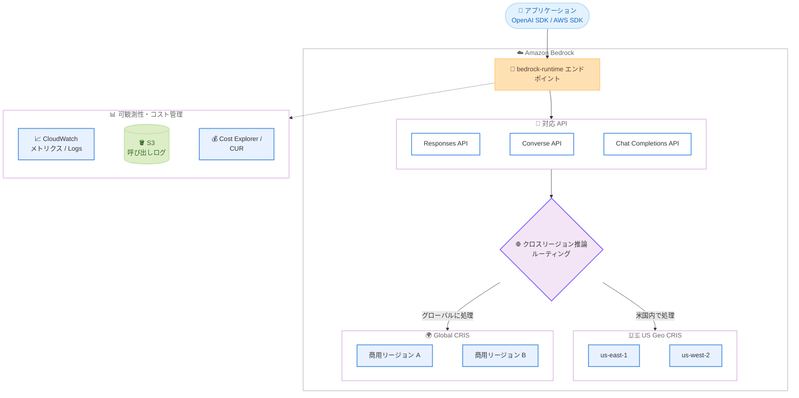

# Amazon Bedrock - OpenAI モデルの API サポート拡大とクロスリージョン推論の導入

**リリース日**: 2026 年 8 月 17 日
**サービス**: Amazon Bedrock
**機能**: OpenAI GPT-5.6 モデルの bedrock-runtime エンドポイント対応とクロスリージョン推論 (Global / Geo CRIS)

📊 [このアップデートのインフォグラフィックを見る](https://takech9203.github.io/aws-news-summary/20260817-amazon-bedrock-cross-region-openai-v2.html)

## 概要

Amazon Bedrock が、OpenAI の GPT-5.6 モデル群 (Sol、Terra、Luna) を `bedrock-runtime` エンドポイントでサポートし、Responses API、Chat Completions API、Converse API の 3 つの API に対応しました。ネイティブな OpenAI API 形式が bedrock-runtime 上で動作するため、既存の OpenAI SDK ベースのアプリケーションを大きく変更することなく、Bedrock のアカウントレベルのガバナンス機能をそのまま活用できます。

さらに、OpenAI モデル向けにクロスリージョン推論 (Cross Region Inference) が導入されました。Global クロスリージョン推論に加え、今回新たに US Geo (US CRIS) がサポートされ、地理的範囲内にデータ処理を保ちながら、容量管理なしで高スループットを実現できます。Global 推論は OpenAI モデルについてトークンあたりの料金がリージョン内推論や Geo 推論より低く設定されており、コスト面でもメリットがあります。

Bedrock のモデル呼び出しログ (Amazon S3 または Amazon CloudWatch Logs へ配信)、CloudWatch メトリクス、AWS Cost Explorer / AWS Cost and Usage Report との連携も利用可能で、生成 AI ワークロードの可観測性とコスト管理を一元化できます。

**アップデート前の課題**

このアップデート以前には、以下の課題や制限がありました。

- OpenAI モデルを Bedrock で利用する際、対応 API が限定されており、既存の OpenAI SDK ベースのアプリケーションの移行に追加の実装が必要だった
- OpenAI モデルの推論が単一リージョンに依存し、需要急増時のスループット確保には容量管理やリージョン選定の考慮が必要だった
- データ処理の地理的範囲を保ちながらスケールする仕組みが OpenAI モデルには提供されていなかった

**アップデート後の改善**

今回のアップデートにより、以下が可能になりました。

- Responses / Converse / Chat Completions の 3 つの API を `bedrock-runtime` エンドポイントで利用でき、OpenAI ネイティブな API 形式のまま Bedrock の管理機能を活用できる
- Global クロスリージョン推論により、モデルが利用可能な任意の商用 AWS リージョンでリクエストを処理し、最大のスループットと低いトークン単価を実現できる
- 新しい US Geo (US CRIS) により、データ処理を米国内に保ちながらクロスリージョンでスケールできる
- モデル呼び出しログ、CloudWatch メトリクス、Cost Explorer によりロギング・モニタリング・コスト配分を一元管理できる

## アーキテクチャ図



アプリケーションからのリクエストは `bedrock-runtime` エンドポイントの 3 つの API で受け付けられ、クロスリージョン推論プロファイルの種類 (US Geo または Global) に応じて最適なリージョンへ自動ルーティングされます。呼び出しログとメトリクスは CloudWatch / S3 / Cost Explorer で一元的に確認できます。

## サービスアップデートの詳細

### 主要機能

1. **OpenAI GPT-5.6 モデルの bedrock-runtime エンドポイント対応**
   - OpenAI GPT-5.6 モデル群 (Sol、Terra、Luna) を `bedrock-runtime` エンドポイントで呼び出し可能
   - Responses API、Chat Completions API、Converse API の 3 つの API をサポート
   - ネイティブな OpenAI API 形式が動作するため、既存の OpenAI SDK ベースのコードを最小限の変更で移行可能
   - Bedrock のアカウントレベルの管理・ガバナンス機能をそのまま利用可能

2. **Global クロスリージョン推論**
   - モデルが利用可能な任意の商用 AWS リージョンでリクエストを処理
   - Bedrock の最も広い容量プールへアクセスでき、需要急増時にも最高のスループットを提供
   - OpenAI モデルについてはトークンあたりの料金がリージョン内推論や Geo 推論より低く設定される

3. **Geo クロスリージョン推論と新しい US CRIS**
   - 事前定義された地理的範囲内でのみリクエストをルーティング
   - 今回のローンチで新たに US Geo (US CRIS) がサポートされ、データ処理を米国内に保ちながらスケール可能
   - データレジデンシー要件のあるワークロードでもクロスリージョン推論の恩恵を受けられる

4. **可観測性とコスト管理の統合**
   - Bedrock モデル呼び出しログを Amazon S3 または Amazon CloudWatch Logs へ配信可能
   - CloudWatch メトリクスで呼び出し数、トークン数、レイテンシー、スロットリング、エラーを確認可能
   - AWS Cost Explorer と AWS Cost and Usage Report でモデル別にコストを明細化

## 技術仕様

### 対応 API とルーティング方式

| 項目 | 詳細 |
|------|------|
| 対象モデル | OpenAI GPT-5.6 (Sol、Terra、Luna) |
| エンドポイント | `bedrock-runtime` |
| 対応 API | Responses API、Converse API、Chat Completions API |
| Global CRIS | モデルが利用可能な任意の商用リージョンで処理。最大スループット、低いトークン単価 |
| Geo CRIS | 事前定義された地理的範囲内で処理。今回 US CRIS が新たに追加 |
| ロギング | モデル呼び出しログを S3 または CloudWatch Logs へ配信 |
| メトリクス | CloudWatch で呼び出し数、トークン数、レイテンシー、スロットリング、エラーを提供 |
| コスト管理 | Cost Explorer / Cost and Usage Report でモデル別に明細化 |

### 呼び出し例 (Converse API)

```json
{
  "modelId": "us.openai.gpt-5.6-sol-v1:0",
  "messages": [
    {
      "role": "user",
      "content": [{ "text": "こんにちは。Bedrock からの呼び出しです。" }]
    }
  ],
  "inferenceConfig": {
    "maxTokens": 512,
    "temperature": 0.7
  }
}
```

US CRIS を利用する場合は `us.` プレフィックス付き、Global CRIS を利用する場合は `global.` プレフィックス付きの推論プロファイル ID を `modelId` に指定します (正確なモデル ID は Bedrock コンソールのモデルカードで確認してください)。

## 設定方法

### 前提条件

1. AWS アカウントと Amazon Bedrock へのアクセス権限があること
2. Bedrock コンソールで OpenAI GPT-5.6 モデル (Sol、Terra、Luna) へのモデルアクセスが有効化されていること
3. `bedrock:InvokeModel` などの必要な IAM 権限が付与されていること

### 手順

#### ステップ 1: 利用可能な推論プロファイルの確認

```bash
aws bedrock list-inference-profiles \
  --region us-east-1 \
  --query "inferenceProfileSummaries[?contains(inferenceProfileId, 'openai')]"
```

OpenAI モデルに対応するクロスリージョン推論プロファイル (US Geo / Global) の一覧を取得し、利用したいプロファイル ID を確認します。

#### ステップ 2: Converse API での呼び出し

```bash
aws bedrock-runtime converse \
  --region us-east-1 \
  --model-id "us.openai.gpt-5.6-sol-v1:0" \
  --messages '[{"role":"user","content":[{"text":"クロスリージョン推論のテストです"}]}]'
```

US CRIS プロファイルを指定して Converse API でモデルを呼び出します。リクエストは米国内のリージョンに自動ルーティングされます。

#### ステップ 3: モデル呼び出しログとメトリクスの設定

```bash
aws bedrock put-model-invocation-logging-configuration \
  --region us-east-1 \
  --logging-config '{
    "cloudWatchConfig": {
      "logGroupName": "/aws/bedrock/model-invocations",
      "roleArn": "arn:aws:iam::123456789012:role/BedrockLoggingRole"
    },
    "textDataDeliveryEnabled": true
  }'
```

モデル呼び出しログを CloudWatch Logs へ配信するように設定します。あわせて CloudWatch メトリクスや Cost Explorer でトークン使用量とコストを確認します。

## メリット

### ビジネス面

- **コスト削減**: Global クロスリージョン推論はトークンあたりの料金がリージョン内推論や Geo 推論より低く、大規模ワークロードのコストを最適化できる
- **移行コストの低減**: ネイティブな OpenAI API 形式に対応しているため、既存の OpenAI SDK ベースのアプリケーションを最小限の変更で Bedrock に移行できる
- **コンプライアンス対応**: US Geo CRIS によりデータ処理を米国内に保ちながらスケールでき、データレジデンシー要件に対応しやすい

### 技術面

- **高スループット**: 複数リージョンへの自動ルーティングにより、容量管理なしで需要急増時にもスループットを確保できる
- **API の柔軟性**: Responses / Converse / Chat Completions の 3 つの API から、アプリケーションに適した形式を選択できる
- **可観測性の統合**: 呼び出しログ、CloudWatch メトリクス、Cost Explorer が統合されており、他の Bedrock モデルと同じ運用基盤で管理できる

## デメリット・制約事項

### 制限事項

- 対象は OpenAI GPT-5.6 モデル (Sol、Terra、Luna) であり、利用にはモデルアクセスの有効化が必要
- Geo CRIS は事前定義された地理的範囲に限定される (今回追加されたのは US CRIS)
- Global CRIS では商用 AWS リージョンのいずれかで処理されるため、処理リージョンを個別に指定することはできない

### 考慮すべき点

- データレジデンシー要件がある場合は、Global CRIS ではなく Geo CRIS (US CRIS など) の利用を検討する必要がある
- クロスリージョンルーティングにより、リージョン間のネットワークレイテンシーがわずかに増加する可能性がある
- 正確なモデル ID や推論プロファイル ID は、Bedrock コンソールのモデルカードや `list-inference-profiles` で事前に確認する必要がある

## ユースケース

### ユースケース 1: OpenAI SDK ベースアプリケーションの Bedrock 移行

**シナリオ**: OpenAI の Responses API / Chat Completions API を直接利用しているチャットアプリケーションを、AWS のガバナンス基盤に統合したい。

**実装例**:
```python
import openai

client = openai.OpenAI(
    base_url="https://bedrock-runtime.us-east-1.amazonaws.com/openai/v1",
    api_key="$AWS_BEARER_TOKEN_BEDROCK",
)

response = client.chat.completions.create(
    model="us.openai.gpt-5.6-luna-v1:0",
    messages=[{"role": "user", "content": "こんにちは"}],
)
```

**効果**: エンドポイントとモデル ID の変更のみで移行でき、IAM ベースのアクセス制御、呼び出しログ、コスト管理などの Bedrock の管理機能をそのまま活用できる。

### ユースケース 2: 需要急増に対応する大規模バッチ推論

**シナリオ**: キャンペーン期間中にリクエストが急増する生成 AI サービスで、容量管理なしにスループットを確保しつつコストを抑えたい。

**実装例**:
```bash
aws bedrock-runtime converse \
  --model-id "global.openai.gpt-5.6-sol-v1:0" \
  --messages '[{"role":"user","content":[{"text":"要約対象のテキスト..."}]}]'
```

**効果**: Global CRIS により最も広い容量プールへアクセスでき、需要急増時にも最高のスループットを確保。トークン単価も低く、コスト効率が高い。

### ユースケース 3: データレジデンシー要件のある米国内ワークロード

**シナリオ**: 米国内でのデータ処理が求められる規制業界のワークロードで、単一リージョンのスループット制約を回避したい。

**実装例**:
```bash
aws bedrock-runtime converse \
  --model-id "us.openai.gpt-5.6-terra-v1:0" \
  --messages '[{"role":"user","content":[{"text":"顧客データの分類..."}]}]'
```

**効果**: US CRIS によりデータ処理を米国内の地理的範囲に保ちながら、複数リージョンへの自動ルーティングでスループットを向上できる。

## 料金

トークンベースの従量課金です。Global クロスリージョン推論を利用する場合、OpenAI モデルについてはトークンあたりの料金がリージョン内推論および Geo クロスリージョン推論より低く設定されています。加えて、AWS Cost Explorer と AWS Cost and Usage Report によりモデル別にコストを明細化できます。

最新の料金は [Amazon Bedrock の料金ページ](https://aws.amazon.com/bedrock/pricing/) を参照してください。

## 利用可能リージョン

Amazon Bedrock で OpenAI モデルが提供されているすべての AWS リージョンで利用可能です。クロスリージョン推論プロファイル (US Geo / Global) の対応状況は、Bedrock コンソールまたはドキュメントで確認してください。

## 関連サービス・機能

- **Amazon CloudWatch**: モデル呼び出し数、トークン数、レイテンシー、スロットリング、エラーのメトリクス確認と、呼び出しログの配信先として利用
- **Amazon S3**: モデル呼び出しログの配信先として利用
- **AWS Cost Explorer / AWS Cost and Usage Report**: モデル別のコスト明細化と使用量分析
- **Amazon Bedrock クロスリージョン推論**: Anthropic Claude など他モデルでも提供されているクロスリージョン推論の仕組み。今回 OpenAI モデルに拡大

## 参考リンク

- 📊 [インフォグラフィック](https://takech9203.github.io/aws-news-summary/20260817-amazon-bedrock-cross-region-openai-v2.html)
- [公式発表 (What's New)](https://aws.amazon.com/about-aws/whats-new/2026/08/amazon-bedrock-cross-region-openai-v2/)
- [Amazon Bedrock ユーザーガイド](https://docs.aws.amazon.com/bedrock/)
- [Amazon Bedrock クロスリージョン推論 (ドキュメント)](https://docs.aws.amazon.com/bedrock/latest/userguide/cross-region-inference.html)
- [料金ページ](https://aws.amazon.com/bedrock/pricing/)

## まとめ

OpenAI GPT-5.6 モデル (Sol、Terra、Luna) が bedrock-runtime エンドポイントで Responses / Converse / Chat Completions API に対応し、Global および新しい US Geo クロスリージョン推論により、高スループットかつ低コストでの利用が可能になりました。既存の OpenAI SDK ベースのアプリケーションを Bedrock のガバナンス基盤に統合したい場合に有力な選択肢となるため、まずは Bedrock コンソールで GPT-5.6 のモデルカードと推論プロファイルを確認し、Converse API での動作検証から始めることを推奨します。
