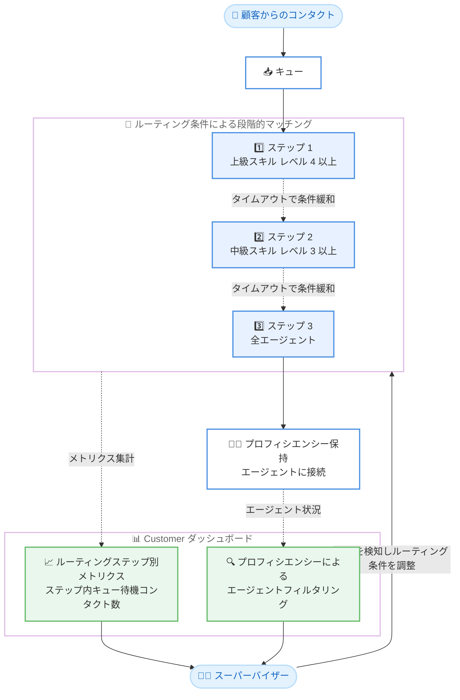

# Amazon Connect - Customer ダッシュボードがルーティングステップとエージェントプロフィシエンシーのレポートに対応

**リリース日**: 2026 年 8 月 17 日
**サービス**: Amazon Connect
**機能**: Customer ダッシュボードにおけるルーティングステップおよびエージェントプロフィシエンシーのレポート機能

📊 [このアップデートのインフォグラフィックを見る](https://takech9203.github.io/aws-news-summary/20260817-amazon-connect-routing-steps.html)

## 概要

Amazon Connect Customer の分析ダッシュボードが、ルーティングステップ (routing steps) とエージェントプロフィシエンシー (agent proficiencies) に関するレポートに対応しました。スーパーバイザーは、エージェントのプロフィシエンシーに基づいてコンタクトがどのようにエージェントへマッチングされているかをダッシュボード上で監視し、最適化できるようになります。

具体的には、割り当てられたプロフィシエンシーによるエージェントのフィルタリング、ルーティングステップ単位でのメトリクスのグループ化、そして「ルーティングステップでキュー待機中のコンタクト数」などの新しいメトリクスの追跡が可能になりました。例えば、高いスキルレベルのエージェントを必要とするルーティングステップで待機コンタクト数の急増に気付いたスーパーバイザーが、ルーティング条件を緩和してエージェントプールを拡大し、待ち時間を短縮する、といった運用が実現できます。

本アップデートは、コンタクトセンターのスーパーバイザーや運用管理者を主な対象としており、スキルベースルーティングの運用状況を可視化し、データに基づいたルーティング条件の調整を可能にするものです。

**アップデート前の課題**

これまで、ルーティング条件 (routing criteria) とプロフィシエンシーによるスキルベースルーティングを利用している場合でも、その稼働状況をダッシュボードで詳細に把握する手段が限られていました。

- ルーティングステップごとにコンタクトの待機状況を集計・可視化できなかった
- 特定のプロフィシエンシーを持つエージェントに絞り込んでパフォーマンスを確認することが難しかった
- ルーティング条件が厳しすぎてコンタクトが特定のステップに滞留していても、ダッシュボード上で早期に検知しにくかった

**アップデート後の改善**

- ルーティングステップ単位でメトリクスをグループ化し、各ステップでのコンタクトの流れを可視化できるようになった
- 割り当てられたプロフィシエンシーでエージェントをフィルタリングし、スキル別のエージェント状況を確認できるようになった
- 「ルーティングステップでキュー待機中のコンタクト数」などの新しいメトリクスにより、ボトルネックとなっているステップを特定し、ルーティング条件の調整に活かせるようになった

## アーキテクチャ図



ルーティング条件により段階的にエージェントマッチングが行われる流れと、ダッシュボードで各ルーティングステップの待機状況やプロフィシエンシー別のエージェント状況を監視し、条件調整にフィードバックするループを示しています。

## サービスアップデートの詳細

### 主要機能

1. **ルーティングステップによるメトリクスのグループ化**
   - ダッシュボードのメトリクスをルーティングステップ単位でグループ化して表示可能
   - ルーティング条件の各ステップ (例: 厳格な条件のステップ 1、緩和された条件のステップ 2) ごとにコンタクトの状況を把握できる
   - Queue and agent performance ダッシュボードでは、キューでグループ化したウィジェットからワンクリックドリルダウンの「View steps」により、そのキューのアクティブなコンタクトで使用中のルーティングステップを表示する「Current routing step expression performance」ウィジェットを作成できる

2. **エージェントプロフィシエンシーによるフィルタリング**
   - 割り当てられたプロフィシエンシー (スキルとレベル) でエージェントをフィルタリング可能
   - 特定のスキルを持つエージェントの稼働状況や対応状況をスキル別に監視できる

3. **新しいメトリクスの追加**
   - 「ルーティングステップでキュー待機中のコンタクト数」を含む新しいメトリクスを追跡可能
   - 特定のルーティングステップでの滞留を定量的に検知し、ルーティング条件の見直し判断に活用できる

### ダッシュボードの基本機能 (共通)

Amazon Connect Customer ダッシュボードでは、以下の共通機能が利用できます。

- リアルタイムダッシュボードは 15 秒ごとに更新 (時系列ウィジェットは 15 分ごと)
- 過去 3 か月までの履歴データを選択可能
- ウィジェットのサイズ変更・並べ替えなどのカスタマイズ、カスタム期間とベンチマーク比較期間の指定
- CSV / PDF でのダウンロード、保存、共有、インスタンス全体への公開

## 技術仕様

### 関連する技術要素

| 項目 | 詳細 |
|------|------|
| 対象ダッシュボード | Amazon Connect Customer の分析ダッシュボード (Queue and agent performance ダッシュボードなど) |
| 新しいグループ化 | ルーティングステップ単位のメトリクスグループ化 |
| 新しいフィルター | エージェントプロフィシエンシーによるエージェントのフィルタリング |
| 新しいメトリクス | ルーティングステップでキュー待機中のコンタクト数など |
| ドリルダウン | キューでグループ化したリアルタイムウィジェットから「View steps」でルーティングステップのパフォーマンスウィジェットを作成 |
| データ更新間隔 | リアルタイムウィジェットは 15 秒ごと (時系列ウィジェットは 15 分ごと) |

### API 変更履歴

本アップデートはダッシュボード (分析 UI) の機能強化であり、awsapichanges.com では本機能に直接対応する API 変更は確認できませんでした。なお、直近では分析ダッシュボード関連として、カスタムメトリクスを管理する API 群が 2026 年 8 月 11 日に追加されています。

| 日付 | サービス | 変更内容 |
|------|----------|----------|
| 2026/08/11 | [connect](https://awsapichanges.com/archive/changes/88995d-connect.html) | 7 new api methods - カスタムメトリクスの作成・取得・更新・削除など、ダッシュボードのカスタマイズに関連する API の追加 (参考) |

## 設定方法

### 前提条件

1. Amazon Connect インスタンスでエージェントプロフィシエンシーとルーティング条件 (routing criteria) を設定済みであること
2. ダッシュボードを閲覧するユーザーに、セキュリティプロファイルで「Access metrics - Access」権限または「Dashboard - Access」権限が付与されていること
3. 各ダッシュボードのデータ閲覧に必要な権限 (例: フローデータの閲覧には「Flows - View」権限) が付与されていること

### 手順

#### ステップ 1: ダッシュボードを開く

Amazon Connect Customer の管理 Web サイトにサインインし、「Analytics and Optimization」から「Dashboards and reports」に移動します。表示された一覧から確認したいダッシュボード (例: Queue and agent performance ダッシュボード) を選択します。

#### ステップ 2: 期間フィルターとベンチマークを設定する

ダッシュボードを開いたら、必須フィルターである「Time range」で対象期間を指定します。リアルタイムの状況を確認する場合は「Today」、履歴分析の場合は「Day」「Week」「Month」「Custom」を選択します。「Compare to」でベンチマーク比較期間 (例: 前週同曜日・同時間帯) を設定すると、各ウィジェットで比較分析が行われます。

#### ステップ 3: ルーティングステップとプロフィシエンシーで分析する

ウィジェットの「Actions」から「Edit」を選択し、グループ化にルーティングステップを指定するか、エージェントプロフィシエンシーによるフィルターを設定します。キューでグループ化したリアルタイムウィジェットでは、キュー名の横のドリルダウンメニューから「View steps」を選択すると、そのキューでアクティブなコンタクトが使用中のルーティングステップを表示するウィジェットを作成できます。「ルーティングステップでキュー待機中のコンタクト数」などのメトリクスを追加し、滞留しているステップを特定します。

## メリット

### ビジネス面

- **待ち時間の短縮**: 特定のルーティングステップでの滞留を早期に検知し、ルーティング条件を緩和してエージェントプールを拡大することで、顧客の待ち時間を削減できる
- **スキルベースルーティングの継続的な最適化**: プロフィシエンシー要件と実際のエージェント供給のバランスをデータで確認し、ルーティング設計を改善できる
- **顧客体験と運用効率の両立**: 適切なスキルを持つエージェントへのマッチング品質を維持しつつ、過剰に厳しい条件による機会損失を防止できる

### 技術面

- **標準ダッシュボードでの可視化**: 追加の開発なしで、既存の Customer ダッシュボード上でルーティングステップ別の分析が可能
- **リアルタイム監視**: リアルタイムウィジェットは 15 秒ごとに更新されるため、滞留の発生をほぼリアルタイムに検知できる
- **柔軟なカスタマイズ**: フィルター、グループ化、しきい値、比較期間などを組み合わせて、組織のニーズに合わせたビューを構築できる

## デメリット・制約事項

### 制限事項

- 本機能はエージェントプロフィシエンシーとルーティング条件を利用している場合に効果を発揮するため、これらを設定していないコンタクトセンターでは活用範囲が限定される
- ダッシュボードの履歴データは過去 3 か月まで、カスタム期間は最大 35 日間という制約がある
- Queue and agent performance ダッシュボードではタグベースのアクセス制御がサポートされない

### 考慮すべき点

- ダッシュボードの閲覧にはセキュリティプロファイルでの適切な権限設定が必要
- ルーティング条件の緩和は待ち時間の短縮につながる一方、要求スキルレベルを下げることによる応対品質への影響も考慮して判断する必要がある

## ユースケース

### ユースケース 1: 高スキルエージェント要求ステップの滞留解消

**シナリオ**: テクニカルサポート窓口で、ルーティングステップ 1 に「上級トラブルシューティングスキル レベル 4 以上」という条件を設定している。ある日、当該ステップで待機コンタクト数が急増した。

**実装例**:
```
1. Queue and agent performance ダッシュボードでメトリクスをルーティングステップでグループ化
2. 「ルーティングステップでキュー待機中のコンタクト数」の急増をステップ 1 で確認
3. プロフィシエンシーフィルターでレベル 4 以上のエージェントの稼働状況を確認
4. ルーティング条件をレベル 3 以上に緩和し、エージェントプールを拡大
```

**効果**: 滞留の原因となっていた厳格な条件を特定・緩和し、顧客の待ち時間を短縮できる。

### ユースケース 2: プロフィシエンシー別のエージェント配置計画

**シナリオ**: 多言語対応のコンタクトセンターで、言語スキルごとのエージェント稼働状況と需要のバランスを把握し、シフト計画に反映したい。

**実装例**:
```
1. ダッシュボードでエージェントをプロフィシエンシー (言語スキル) でフィルタリング
2. スキル別のエージェント数と各ルーティングステップの待機状況を比較
3. 需要に対して供給が不足しているスキルを特定し、採用・トレーニング計画に反映
```

**効果**: スキル別の需給ギャップをデータで把握し、中長期的な人員計画の精度を向上できる。

### ユースケース 3: ルーティング条件変更の効果測定

**シナリオ**: ルーティング条件の緩和を実施した後、待ち時間や応対品質への影響を継続的に評価したい。

**実装例**:
```
1. ダッシュボードの「Compare to」ベンチマークで変更前の期間 (例: 前週同時間帯) を設定
2. ルーティングステップ別の待機コンタクト数と平均応答時間を変更前後で比較
3. しきい値を設定し、滞留が再発した場合に一目で検知できるようにする
```

**効果**: ルーティング条件変更の効果を定量的に検証し、継続的な改善サイクルを実現できる。

## 料金

本アップデートに関する追加料金の記載はありません。Amazon Connect は従量課金制のサービスであり、ダッシュボードによる分析機能の詳細な料金体系については [Amazon Connect の料金ページ](https://aws.amazon.com/connect/pricing/) を参照してください。

## 利用可能リージョン

Amazon Connect Customer が提供されているすべての AWS 商用リージョンおよび AWS GovCloud (US-West) リージョンで利用可能です。対象リージョンの詳細は [リージョン一覧](https://docs.aws.amazon.com/connect/latest/adminguide/regions.html#amazonconnect_region) を参照してください。

## 関連サービス・機能

- **エージェントプロフィシエンシー**: エージェントにスキル属性とレベルを割り当てる Amazon Connect の機能。本アップデートによりダッシュボードでのフィルタリングに利用可能になった
- **ルーティング条件 (routing criteria)**: コンタクトを段階的な条件 (ルーティングステップ) でエージェントにマッチングする機能。本アップデートによりステップ単位のメトリクス分析が可能になった
- **カスタムメトリクス**: ダッシュボードで独自のしきい値、フィルター、計算を適用したメトリクスを定義できる機能。ルーティングステップ分析と組み合わせて活用できる
- **GetMetricDataV2 API**: Amazon Connect のメトリクスをプログラムから取得する API。ダッシュボードと併せたメトリクス活用の選択肢となる

## 参考リンク

- 📊 [インフォグラフィック](https://takech9203.github.io/aws-news-summary/20260817-amazon-connect-routing-steps.html)
- [公式発表 (What's New)](https://aws.amazon.com/about-aws/whats-new/2026/08/amazon-connect-routing-steps/)
- [ドキュメント: Dashboards (Administrator Guide)](https://docs.aws.amazon.com/connect/latest/adminguide/dashboards.html)
- [ドキュメント: Queue and agent performance dashboard](https://docs.aws.amazon.com/connect/latest/adminguide/queue-performance-dashboard.html)
- [Amazon Connect 製品ページ](https://aws.amazon.com/connect/)
- [料金ページ](https://aws.amazon.com/connect/pricing/)

## まとめ

Amazon Connect Customer ダッシュボードがルーティングステップとエージェントプロフィシエンシーのレポートに対応し、スキルベースルーティングの稼働状況を可視化してデータに基づく条件調整が可能になりました。ルーティング条件とプロフィシエンシーを活用しているコンタクトセンターでは、ダッシュボードにルーティングステップ別のメトリクスを追加し、滞留の検知とルーティング条件の最適化サイクルを確立することを推奨します。
