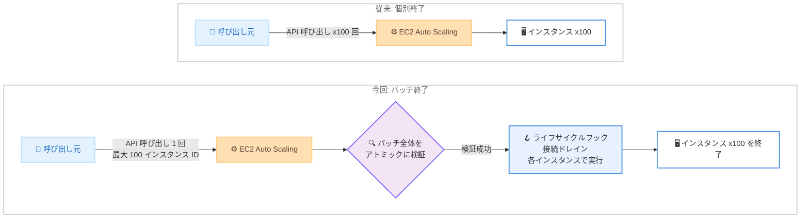

# Amazon EC2 Auto Scaling - バッチインスタンス終了のサポート

**リリース日**: 2026 年 8 月 17 日
**サービス**: Amazon EC2 Auto Scaling
**機能**: バッチインスタンス終了 (Batch Instance Termination)

📊 [このアップデートのインフォグラフィックを見る](https://takech9203.github.io/aws-news-summary/20260817-amazon-ec2-auto-scaling-batch-termination.html)

## 概要

Amazon EC2 Auto Scaling が、単一の API 呼び出しによるバッチインスタンス終了をサポートしました。`TerminateInstanceInAutoScalingGroup` API に最大 100 個のインスタンス ID を渡してバッチとして終了できるようになり、Auto Scaling グループのスケールダウンに必要な API 呼び出し数を削減できます。

バッチ終了は、AI/ML トレーニングジョブ、コンテナオーケストレーター、大規模なフリートを一時的に起動するイベント駆動アーキテクチャなど、迅速なスケールダウンが必要なワークロード向けに設計されています。バッチ内のすべてのインスタンスは終了開始前にアトミックに検証され、ライフサイクルフックやロードバランサーの接続ドレイン (Connection Draining) といった既存の Auto Scaling の動作は、バッチ内の各インスタンスに対して維持されます。

**アップデート前の課題**

- `TerminateInstanceInAutoScalingGroup` API は 1 回の呼び出しで 1 つのインスタンスしか終了できなかった
- 大量のインスタンスをスケールダウンするには、インスタンス数分の API 呼び出しが必要で、API スロットリングの制約を受けやすかった
- 大規模フリートの迅速な縮退に時間がかかり、不要なインスタンスのコストが発生しやすかった

**アップデート後の改善**

- 1 回の API 呼び出しで最大 100 個のインスタンス ID を指定して一括終了できるようになった
- API 呼び出し数が大幅に削減され、大規模なスケールダウンを迅速に実行できるようになった
- バッチ全体が終了開始前にアトミックに検証されるため、一貫性のある操作が可能になった
- ライフサイクルフックや接続ドレインなどの既存動作は各インスタンスで従来どおり維持される

## アーキテクチャ図



従来はインスタンスごとに API を呼び出す必要がありましたが、今回のアップデートにより 1 回の呼び出しで最大 100 インスタンスをバッチとして検証・終了できるようになりました。

## サービスアップデートの詳細

### 主要機能

1. **バッチでのインスタンス終了**
   - `TerminateInstanceInAutoScalingGroup` API に最大 100 個のインスタンス ID を渡して一括終了できる
   - API 呼び出し数が削減され、Auto Scaling グループのスケールダウンを高速化できる
   - API には新しい `InstanceIds` パラメータが追加され、レスポンスとしてスケーリングアクティビティのリスト (`Activities`) が返される

2. **アトミックなバッチ検証**
   - バッチ内のすべてのインスタンスは、終了処理の開始前にアトミックに検証される
   - 検証により、バッチ操作の一貫性が確保される

3. **既存の Auto Scaling 動作の維持**
   - ライフサイクルフック (Lifecycle Hooks) はバッチ内の各インスタンスに対して従来どおり実行される
   - ロードバランサーの接続ドレインも各インスタンスで維持され、安全なスケールダウンが可能

## 技術仕様

### バッチ終了の仕様

| 項目 | 詳細 |
|------|------|
| 対象 API | `TerminateInstanceInAutoScalingGroup` |
| 最大バッチサイズ | 100 インスタンス ID |
| 検証方式 | バッチ全体を終了開始前にアトミックに検証 |
| ライフサイクルフック | 各インスタンスで従来どおり実行 |
| 接続ドレイン | 各インスタンスで従来どおり実行 |
| 追加料金 | なし |

### API 変更履歴

| 日付 | サービス | 変更内容 |
|------|----------|----------|
| 2026/08/13 | [autoscaling](https://awsapichanges.com/archive/changes/db5022-autoscaling.html) | 1 updated api method - `TerminateInstanceInAutoScalingGroup` に `InstanceIds` パラメータが追加され、`Activities` リストを返すように更新 |

## 設定方法

### 前提条件

1. EC2 Auto Scaling グループが作成済みであること
2. `autoscaling:TerminateInstanceInAutoScalingGroup` を許可する IAM 権限があること
3. AWS CLI または SDK が最新バージョンに更新されていること

### 手順

#### ステップ 1: 終了対象のインスタンスを確認する

```bash
aws autoscaling describe-auto-scaling-groups \
  --auto-scaling-group-names my-asg \
  --query "AutoScalingGroups[0].Instances[].InstanceId"
```

Auto Scaling グループ `my-asg` に所属するインスタンス ID の一覧を取得しています。この中から終了対象のインスタンスを選定します。

#### ステップ 2: バッチでインスタンスを終了する

```bash
aws autoscaling terminate-instance-in-auto-scaling-group \
  --instance-ids i-0123456789abcdef0 i-0abcdef1234567890 i-0fedcba9876543210 \
  --should-decrement-desired-capacity
```

複数のインスタンス ID を指定して 1 回の API 呼び出しでバッチ終了を実行しています。`--should-decrement-desired-capacity` を指定すると、終了と同時に希望容量 (Desired Capacity) が減少し、代替インスタンスは起動されません。

#### ステップ 3: スケーリングアクティビティを確認する

```bash
aws autoscaling describe-scaling-activities \
  --auto-scaling-group-name my-asg \
  --max-items 10
```

バッチ終了によって発生したスケーリングアクティビティを確認し、各インスタンスの終了が正常に進行しているかを検証しています。

## メリット

### ビジネス面

- **コスト削減の迅速化**: 不要になった大規模フリートを素早く縮退でき、余分なインスタンス稼働時間を削減できる
- **追加料金なし**: 本機能は追加料金なしで利用でき、既存の運用にそのまま組み込める
- **運用効率の向上**: スケールダウン処理のためのカスタムロジック (ループ処理やリトライ制御) を簡素化できる

### 技術面

- **API 呼び出し数の削減**: 最大 100 インスタンスを 1 回の呼び出しで終了でき、API スロットリングの影響を受けにくくなる
- **アトミックな検証**: バッチ全体が事前に検証されるため、一貫性のあるスケールダウン操作が可能
- **既存動作との互換性**: ライフサイクルフックや接続ドレインが各インスタンスで維持されるため、既存のワークフローを変更せずに利用できる

## デメリット・制約事項

### 制限事項

- 1 回の API 呼び出しで指定できるインスタンス ID は最大 100 個まで
- 対象は Auto Scaling グループに所属するインスタンスに限られる

### 考慮すべき点

- バッチはアトミックに検証されるため、無効なインスタンス ID が含まれる場合の挙動を事前にテストしておくことが望ましい
- `ShouldDecrementDesiredCapacity` の指定によって、終了後に代替インスタンスが起動されるかどうかが変わるため、意図したスケールダウン動作になるよう設定を確認する
- ライフサイクルフックを設定している場合、バッチ内の各インスタンスでフックが実行されるため、終了完了までの所要時間はフックのタイムアウト設定に依存する

## ユースケース

### ユースケース 1: AI/ML トレーニングジョブ完了後の一括縮退

**シナリオ**: 大規模な分散トレーニングジョブのために数百台のインスタンスを一時的に起動し、ジョブ完了後に速やかにスケールダウンしたい。

**実装例**:
```bash
# ジョブ完了後、ワーカーインスタンスを 100 台ずつバッチで終了
aws autoscaling terminate-instance-in-auto-scaling-group \
  --instance-ids $(cat worker-instance-ids.txt | head -100 | tr '\n' ' ') \
  --should-decrement-desired-capacity
```

**効果**: 数百回の API 呼び出しが数回に削減され、トレーニング完了後のコスト発生時間を最小化できる。

### ユースケース 2: コンテナオーケストレーターによるノードの一括削除

**シナリオ**: コンテナオーケストレーターがクラスターの負荷低下を検知し、ドレイン済みの複数ノードをまとめて削除したい。

**実装例**:
```python
import boto3

client = boto3.client("autoscaling")

response = client.terminate_instance_in_auto_scaling_group(
    InstanceIds=drained_node_instance_ids,  # 最大 100 件
    ShouldDecrementDesiredCapacity=True,
)
for activity in response["Activities"]:
    print(activity["ActivityId"], activity["StatusCode"])
```

**効果**: ノード削除処理が 1 回の API 呼び出しにまとまり、スケールイン処理のスループットと信頼性が向上する。

### ユースケース 3: イベント駆動アーキテクチャでの一時フリートの解放

**シナリオ**: バッチ処理イベントに応じて大規模フリートを一時的に起動し、処理完了イベントを契機に Lambda 関数からフリートを解放したい。

**実装例**:
```python
def handler(event, context):
    instance_ids = event["completed_instance_ids"]
    client = boto3.client("autoscaling")
    # 100 件ずつのバッチに分割して終了
    for i in range(0, len(instance_ids), 100):
        client.terminate_instance_in_auto_scaling_group(
            InstanceIds=instance_ids[i : i + 100],
            ShouldDecrementDesiredCapacity=True,
        )
```

**効果**: Lambda 関数の実行時間と API 呼び出し数が削減され、イベント駆動のスケールダウンがシンプルかつ高速になる。

## 料金

本機能は追加料金なしで利用できます。Amazon EC2 Auto Scaling 自体にも追加料金はなく、起動した EC2 インスタンスなどのリソース使用分に対してのみ料金が発生します。

## 利用可能リージョン

すべての AWS リージョンで利用可能です。

## 関連サービス・機能

- **Amazon EC2**: Auto Scaling グループが管理するインスタンスの基盤サービス。バッチ終了の対象となる
- **Elastic Load Balancing**: 接続ドレインにより、終了対象インスタンスへの新規リクエストを停止しつつ既存リクエストを完了させる
- **AWS Lambda / Amazon EventBridge**: イベント駆動でのスケールダウン自動化に活用でき、バッチ終了 API との組み合わせで処理を簡素化できる
- **Amazon ECS / Amazon EKS**: コンテナオーケストレーターのノードスケールインで本機能を活用できる

## 参考リンク

- 📊 [インフォグラフィック](https://takech9203.github.io/aws-news-summary/20260817-amazon-ec2-auto-scaling-batch-termination.html)
- [公式発表 (What's New)](https://aws.amazon.com/about-aws/whats-new/2026/08/amazon-ec2-auto-scaling-batch-termination)
- [Amazon EC2 Auto Scaling ユーザーガイド](https://docs.aws.amazon.com/autoscaling/ec2/userguide/what-is-amazon-ec2-auto-scaling.html)
- [Amazon EC2 Auto Scaling API リファレンス - TerminateInstanceInAutoScalingGroup](https://docs.aws.amazon.com/autoscaling/ec2/APIReference/API_TerminateInstanceInAutoScalingGroup.html)
- [Amazon EC2 Auto Scaling 料金](https://aws.amazon.com/ec2/autoscaling/pricing/)

## まとめ

Amazon EC2 Auto Scaling のバッチインスタンス終了により、最大 100 インスタンスを 1 回の API 呼び出しで安全に終了できるようになりました。AI/ML トレーニングやコンテナ基盤、イベント駆動型の一時フリートなど、大規模かつ迅速なスケールダウンが求められるワークロードでは、既存のスケールイン処理を本機能に置き換えることで API 呼び出し数の削減と縮退の高速化が期待できます。まずは開発環境で `InstanceIds` パラメータを使用したバッチ終了の挙動 (検証エラー時の動作やライフサイクルフックの実行) を確認することを推奨します。
