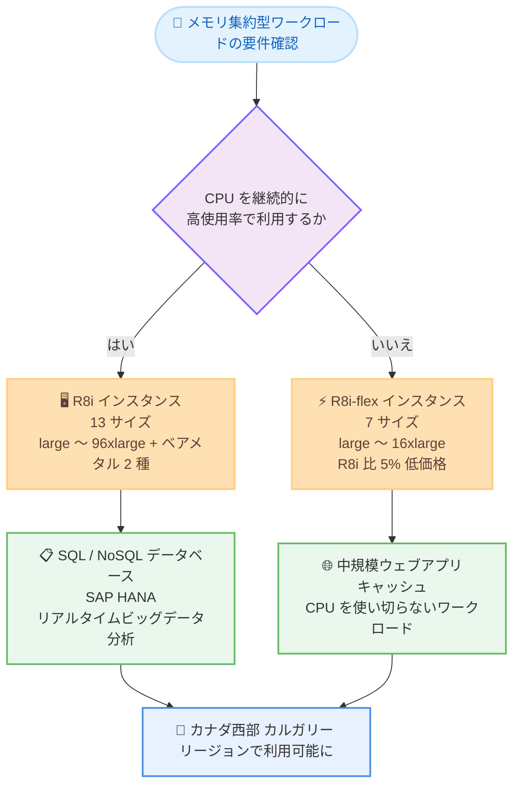

# Amazon EC2 - R8i / R8i-flex インスタンスがカナダ西部 (カルガリー) リージョンで利用可能に

**リリース日**: 2026 年 8 月 17 日
**サービス**: Amazon EC2
**機能**: Amazon EC2 R8i / R8i-flex インスタンス (カナダ西部 (カルガリー) リージョン対応)

📊 [このアップデートのインフォグラフィックを見る](https://takech9203.github.io/aws-news-summary/20260817-amazon-ec2-r8i-r8i-flex-calgary.html)

## 概要

Amazon EC2 のメモリ最適化インスタンスである R8i および R8i-flex がカナダ西部 (カルガリー) リージョンで利用可能になりました。これらのインスタンスは AWS 専用にカスタマイズされた Intel Xeon 6 プロセッサを搭載しており、クラウド上の同等 Intel ベースインスタンスの中で最高のパフォーマンスと最速のメモリ帯域幅を提供します。

R8i / R8i-flex は前世代の Intel ベースインスタンスと比較して最大 15% 優れた価格性能と 2.5 倍のメモリ帯域幅を実現します。R7i と比較すると全体で 20% 高いパフォーマンスを発揮し、ワークロードによってはさらに大きな効果が得られます。具体的には、PostgreSQL データベースで最大 30%、NGINX ウェブアプリケーションで最大 60%、AI 深層学習レコメンデーションモデルで最大 40% の高速化が確認されています。

カナダ西部 (カルガリー) リージョンを利用するお客様は、SQL / NoSQL データベース、Memcached や Redis などの分散インメモリキャッシュ、SAP HANA などのインメモリデータベース、リアルタイムビッグデータ分析といったメモリ集約型ワークロードを、最新世代のインスタンスでデータレジデンシー要件を満たしながら実行できるようになります。

**アップデート前の課題**

このアップデート以前に存在していた課題や制限は以下のとおりです。

- 以前はカナダ西部 (カルガリー) リージョンで R8i / R8i-flex を利用できず、メモリ集約型ワークロードには前世代のインスタンスを使用する必要があった
- カナダ国内のデータレジデンシー要件を満たしつつ最新世代の Intel ベースメモリ最適化インスタンスを利用することができなかった
- 大規模な SAP HANA などのワークロードで、最新世代の高い aSAPS 性能をカルガリーリージョンで活用できなかった

**アップデート後の改善**

今回のアップデートにより可能になったことは以下のとおりです。

- カナダ西部 (カルガリー) リージョンで R8i / R8i-flex インスタンスを起動できるようになった
- 前世代 Intel ベースインスタンス比で最大 15% 優れた価格性能と 2.5 倍のメモリ帯域幅を同リージョンで活用できるようになった
- カナダ国内で稼働するデータベースやインメモリ分析ワークロードを、より高い性能とコスト効率で運用できるようになった

## アーキテクチャ図



R8i と R8i-flex の選択フローと主なユースケースを示しています。CPU を継続的に高使用率で利用するワークロードには R8i、コンピュートリソースを使い切らないワークロードにはコスト効率の高い R8i-flex が適しています。

## サービスアップデートの詳細

### 主要機能

1. **カスタム Intel Xeon 6 プロセッサによる高性能**
   - AWS 専用にカスタマイズされた Intel Xeon 6 プロセッサを搭載し、クラウド上の同等 Intel プロセッサの中で最高性能を実現
   - 持続的な全コアターボ周波数は 3.9 GHz (前世代は 3.2 GHz)
   - 前世代 Intel ベースインスタンス比で最大 15% 優れた価格性能と 2.5 倍のメモリ帯域幅を提供
   - Intel AMX の FP16 データ型をサポートし、深層学習の学習・推論などの AI / ML ワークロードを高速化

2. **ワークロード別の大幅な性能向上 (R7i 比)**
   - 全体で 20% 高いパフォーマンス
   - PostgreSQL データベース: 最大 30% 高速
   - NGINX ウェブアプリケーション: 最大 60% 高速
   - AI 深層学習レコメンデーションモデル: 最大 40% 高速

3. **R8i: 幅広いサイズ展開と SAP 認定**
   - 13 サイズを提供し、2 種類のベアメタルサイズと最大規模アプリケーション向けの新しい 96xlarge (384 vCPU、3,072 GiB メモリ) を含む
   - SAP 認定済みで 142,100 aSAPS を達成し、オンプレミス・クラウドを含む同等マシンの中で最高水準
   - 継続的な高 CPU 使用率が必要なデータベースや分析、エンタープライズアプリケーションに最適

4. **R8i-flex: 初のメモリ最適化 Flex インスタンス**
   - large から 16xlarge までの一般的な 7 サイズを提供
   - コンピュートリソースを常時フル活用しないアプリケーション向けに、R8i 比 5% 低い価格と最大 5% 優れた価格性能を提供
   - 大多数のメモリ集約型ワークロードにとって、価格性能メリットを得る最も簡単な選択肢

## 技術仕様

### R8i インスタンスサイズ

| サイズ | vCPU | メモリ (GiB) | ネットワーク帯域 (Gbps) | EBS 帯域 (Gbps) |
|--------|------|--------------|-------------------------|-----------------|
| large | 2 | 16 | 最大 12.5 | 最大 10 |
| xlarge | 4 | 32 | 最大 12.5 | 最大 10 |
| 2xlarge | 8 | 64 | 最大 15 | 最大 10 |
| 4xlarge | 16 | 128 | 最大 15 | 最大 10 |
| 8xlarge | 32 | 256 | 15 | 10 |
| 12xlarge | 48 | 384 | 22.5 | 15 |
| 16xlarge | 64 | 512 | 30 | 20 |
| 24xlarge | 96 | 768 | 40 | 30 |
| 32xlarge | 128 | 1,024 | 50 | 40 |
| 48xlarge | 192 | 1,536 | 75 | 60 |
| 96xlarge | 384 | 3,072 | 100 | 80 |
| metal-48xl | 192 | 1,536 | 75 | 60 |
| metal-96xl | 384 | 3,072 | 100 | 80 |

### R8i-flex インスタンスサイズ

| サイズ | vCPU | メモリ (GiB) | ネットワーク帯域 (Gbps) | EBS 帯域 (Gbps) |
|--------|------|--------------|-------------------------|-----------------|
| large | 2 | 16 | 最大 12.5 | 最大 10 |
| xlarge | 4 | 32 | 最大 12.5 | 最大 10 |
| 2xlarge | 8 | 64 | 最大 15 | 最大 10 |
| 4xlarge | 16 | 128 | 最大 15 | 最大 10 |
| 8xlarge | 32 | 256 | 最大 15 | 最大 10 |
| 12xlarge | 48 | 384 | 最大 22.5 | 最大 15 |
| 16xlarge | 64 | 512 | 最大 30 | 最大 20 |

### R8i と R8i-flex の比較

| 項目 | R8i | R8i-flex |
|------|-----|----------|
| サイズ展開 | 13 サイズ (large 〜 96xlarge、ベアメタル 2 種) | 7 サイズ (large 〜 16xlarge) |
| CPU 性能 | 常時フル性能 | 時間の 95% でフル CPU 性能に到達可能 |
| 価格 | 標準 | R8i 比 5% 低価格 |
| 適するワークロード | 継続的な高 CPU 使用率、最大サイズが必要な場合 | コンピュートリソースを使い切らないワークロード |
| SAP 認定 | あり (142,100 aSAPS) | - |

### その他の技術的特徴

| 項目 | 詳細 |
|------|------|
| プロセッサ | AWS 専用カスタム Intel Xeon 6 (全コアターボ 3.9 GHz) |
| L3 キャッシュ | 前世代の 4.6 倍 |
| Nitro Card | 第 6 世代 Nitro Card により、ネットワーク / EBS 帯域が前世代比最大 2 倍 |
| 帯域調整 | ネットワークと EBS 間で 25% の帯域割り当て調整が可能 |
| AI / ML 対応 | Intel AMX の FP16 データ型サポート |

## 設定方法

### 前提条件

1. AWS アカウントを保有していること
2. カナダ西部 (カルガリー) リージョン (ca-west-1) が有効化されていること (オプトインリージョンのため有効化が必要)
3. EC2 インスタンスを起動する IAM 権限を保有していること

### 手順

#### ステップ 1: 利用可能なインスタンスタイプの確認

```bash
aws ec2 describe-instance-type-offerings \
  --region ca-west-1 \
  --filters "Name=instance-type,Values=r8i.*,r8i-flex.*" \
  --query "InstanceTypeOfferings[].InstanceType" \
  --output table
```

カナダ西部 (カルガリー) リージョンで利用可能な R8i / R8i-flex のインスタンスタイプ一覧を表示します。

#### ステップ 2: インスタンスの起動

```bash
aws ec2 run-instances \
  --region ca-west-1 \
  --instance-type r8i.xlarge \
  --image-id ami-xxxxxxxxxxxxxxxxx \
  --key-name my-key-pair \
  --subnet-id subnet-xxxxxxxxxxxxxxxxx \
  --security-group-ids sg-xxxxxxxxxxxxxxxxx
```

カナダ西部 (カルガリー) リージョンで r8i.xlarge インスタンスを起動します。CPU を使い切らないワークロードの場合は `r8i-flex.xlarge` などの Flex サイズを指定することでコストを削減できます。

#### ステップ 3: 既存インスタンスからの移行

```bash
# インスタンスを停止
aws ec2 stop-instances --region ca-west-1 --instance-ids i-xxxxxxxxxxxxxxxxx

# インスタンスタイプを変更
aws ec2 modify-instance-attribute \
  --region ca-west-1 \
  --instance-id i-xxxxxxxxxxxxxxxxx \
  --instance-type "{\"Value\": \"r8i.xlarge\"}"

# インスタンスを起動
aws ec2 start-instances --region ca-west-1 --instance-ids i-xxxxxxxxxxxxxxxxx
```

既存の R7i / R6i などのインスタンスを停止し、インスタンスタイプを R8i に変更してから再起動することで、最新世代へ移行できます。R8i は R7i と同じ x86-64 アーキテクチャのため、AMI やアプリケーションの変更は原則不要です。

## メリット

### ビジネス面

- **コスト効率の向上**: 前世代 Intel ベースインスタンス比で最大 15% 優れた価格性能により、同じ予算でより多くの処理が可能
- **データレジデンシー要件への対応**: カナダ国内 (カルガリー) で最新世代インスタンスを利用でき、規制要件を満たしながら性能を最大化できる
- **柔軟な購入オプション**: Savings Plans、オンデマンド、スポットインスタンスに対応し、ワークロード特性に応じたコスト最適化が可能

### 技術面

- **メモリ帯域幅の大幅向上**: 2.5 倍のメモリ帯域幅により、インメモリデータベースやリアルタイム分析の性能が向上
- **ワークロード別の顕著な高速化**: PostgreSQL 最大 30%、NGINX 最大 60%、AI 深層学習レコメンデーションモデル最大 40% の高速化 (R7i 比)
- **大規模 SAP ワークロード対応**: 142,100 aSAPS の SAP 認定と 96xlarge (384 vCPU、3,072 GiB) により、大規模な SAP HANA 環境にも対応

## デメリット・制約事項

### 制限事項

- R8i-flex は large から 16xlarge までのサイズに限定され、ベアメタルや 96xlarge は提供されない
- R8i-flex はフル CPU 性能に到達できるのが時間の 95% であり、継続的な高 CPU 使用率が必要なワークロードには不向き
- カナダ西部 (カルガリー) はオプトインリージョンのため、利用前にリージョンの有効化が必要

### 考慮すべき点

- 移行前に、現在のワークロードの CPU 使用パターンを分析し、R8i と R8i-flex のどちらが適しているかを判断することが推奨される
- 具体的な料金は Amazon EC2 料金ページでリージョンごとに確認が必要
- Reserved Instances / Savings Plans を利用中の場合は、インスタンスファミリー変更によるコミットメントへの影響を確認する

## ユースケース

### ユースケース 1: カナダ国内向け PostgreSQL データベースの性能向上

**シナリオ**: カナダのデータレジデンシー要件により、カルガリーリージョンで PostgreSQL データベースを R7i インスタンスで運用している。トランザクション量の増加に伴い、性能向上が必要になっている。

**実装例**:
```bash
# R7i から R8i へインスタンスタイプを変更
aws ec2 modify-instance-attribute \
  --region ca-west-1 \
  --instance-id i-xxxxxxxxxxxxxxxxx \
  --instance-type "{\"Value\": \"r8i.4xlarge\"}"
```

**効果**: PostgreSQL ワークロードで最大 30% の高速化が期待でき、スケールアップせずにトランザクション増加に対応できる。

### ユースケース 2: SAP HANA 環境の最新世代への移行

**シナリオ**: カルガリーリージョンで SAP HANA を運用しており、データ量の増加に伴いより大きなメモリと高い SAPS 性能が必要になっている。

**実装例**:
```bash
# SAP HANA 向けに r8i.96xlarge を起動
aws ec2 run-instances \
  --region ca-west-1 \
  --instance-type r8i.96xlarge \
  --image-id ami-xxxxxxxxxxxxxxxxx \
  --key-name my-key-pair \
  --subnet-id subnet-xxxxxxxxxxxxxxxxx
```

**効果**: 142,100 aSAPS の SAP 認定性能と 3,072 GiB のメモリにより、大規模 SAP HANA 環境をカナダ国内で高性能に運用できる。

### ユースケース 3: R8i-flex による中規模ウェブアプリケーションのコスト最適化

**シナリオ**: CPU を常時フル活用しない中規模のウェブアプリケーションとインメモリキャッシュ (Redis) を運用しており、性能を維持しながらコストを削減したい。

**実装例**:
```bash
# コスト効率の高い R8i-flex を起動
aws ec2 run-instances \
  --region ca-west-1 \
  --instance-type r8i-flex.2xlarge \
  --image-id ami-xxxxxxxxxxxxxxxxx \
  --key-name my-key-pair \
  --subnet-id subnet-xxxxxxxxxxxxxxxxx
```

**効果**: R8i 比 5% 低い価格と最大 5% 優れた価格性能により、性能要件を満たしながらインフラコストを削減できる。

## 料金

R8i / R8i-flex は従量課金制で、使用した分のみ支払います。購入オプションとして Savings Plans、オンデマンドインスタンス、スポットインスタンスを利用できます。

R8i-flex は R8i と比較して 5% 低い価格で提供され、コンピュートリソースを使い切らないワークロードでは最大 5% 優れた価格性能を実現します。

カナダ西部 (カルガリー) リージョンにおける具体的な料金は、[Amazon EC2 料金ページ](https://aws.amazon.com/ec2/pricing/) を参照してください。

## 利用可能リージョン

今回のアップデートにより、カナダ西部 (カルガリー) リージョン (ca-west-1) で R8i / R8i-flex インスタンスが利用可能になりました。

これまでに米国東部 (バージニア北部)、米国東部 (オハイオ)、米国西部 (オレゴン)、欧州 (スペイン) などのリージョンで提供されており、対応リージョンは順次拡大しています。最新の対応状況は [インスタンスタイプページ](https://aws.amazon.com/ec2/instance-types/r8i/) を参照してください。

## 関連サービス・機能

- **Amazon EC2 R7i インスタンス**: 前世代の Intel ベースメモリ最適化インスタンス。R8i への移行で最大 20% の性能向上が見込める
- **Amazon EC2 M8i / C8i インスタンス**: 同じカスタム Intel Xeon 6 プロセッサを搭載した汎用 / コンピューティング最適化インスタンス。ワークロード特性に応じて選択可能
- **AWS Nitro System**: 第 6 世代 Nitro Card により、前世代比最大 2 倍のネットワーク / EBS 帯域を実現
- **SAP on AWS**: R8i は SAP 認定済みであり、SAP HANA などのワークロードに利用可能

## 参考リンク

- 📊 [インフォグラフィック](https://takech9203.github.io/aws-news-summary/20260817-amazon-ec2-r8i-r8i-flex-calgary.html)
- [公式発表 (What's New)](https://aws.amazon.com/about-aws/whats-new/2026/08/amazon-ec2-r8i-r8i-flex-calgary/)
- [AWS Blog: Best performance and fastest memory with the new Amazon EC2 R8i and R8i-flex instances](https://aws.amazon.com/blogs/aws/best-performance-and-fastest-memory-with-the-new-amazon-ec2-r8i-and-r8i-flex-instances/)
- [Amazon EC2 R8i インスタンス](https://aws.amazon.com/ec2/instance-types/r8i/)
- [SAP 認定情報 (SAP HANA on AWS)](https://docs.aws.amazon.com/sap/latest/general/sap-hana-aws-ec2.html)
- [Amazon EC2 料金ページ](https://aws.amazon.com/ec2/pricing/)

## まとめ

カスタム Intel Xeon 6 プロセッサを搭載した最新世代のメモリ最適化インスタンス R8i / R8i-flex が、カナダ西部 (カルガリー) リージョンで利用可能になりました。前世代比で最大 15% 優れた価格性能と 2.5 倍のメモリ帯域幅を提供し、データベースやインメモリ分析、SAP HANA などのワークロードで大きな性能向上が期待できます。カルガリーリージョンで R7i / R6i などを利用中のお客様は、CPU 使用パターンに応じて R8i または R8i-flex への移行を検討することを推奨します。
