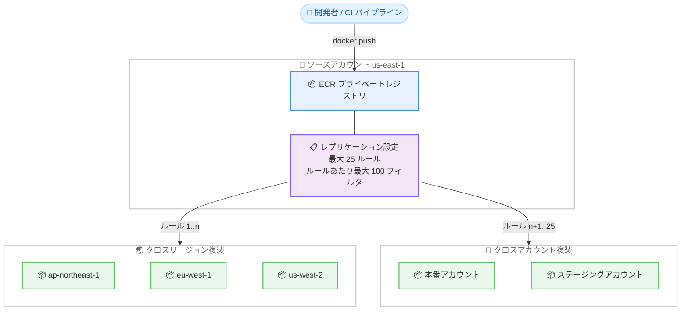

# Amazon ECR - レジストリあたりのレプリケーションルール上限を 25 件に拡大

**リリース日**: 2026 年 8 月 17 日
**サービス**: Amazon Elastic Container Registry (Amazon ECR)
**機能**: レジストリあたりのレプリケーションルール上限の引き上げ (10 件から 25 件へ)

📊 [このアップデートのインフォグラフィックを見る](https://takech9203.github.io/aws-news-summary/20260817-amazon-ecr-increased-replication-rules-limit.html)

## 概要

Amazon Elastic Container Registry (Amazon ECR) は、プライベートレジストリあたりに設定できるレプリケーションルールの最大数を、従来の 10 件から 25 件に引き上げました。ECR のレプリケーション機能は、コンテナイメージのプッシュをトリガーとして、クロスリージョンおよびクロスアカウントへイメージを自動複製する仕組みであり、レプリケーションルールはその複製先やフィルタ条件を定義する設定単位です。

これまで、多数のリージョンやアカウントにまたがる複雑なアーキテクチャを運用するお客様は、10 件というルール上限の範囲内に収めるためにレプリケーション設定を統合 (集約) する必要がありました。今回のアップデートにより、最大 25 件のルールを定義できるようになり、多数のリージョンへの低レイテンシーなイメージプルのための配布や、複数の本番・ステージングアカウントへの複製といったユースケースで、より精緻なレプリケーション戦略を実現できます。

マルチリージョン展開やマルチアカウント構成 (AWS Organizations における環境分離など) を採用する組織のプラットフォームチームや DevOps エンジニアにとって、レプリケーション設計の自由度が大きく向上するアップデートです。

**アップデート前の課題**

このアップデート以前は、レプリケーションルールの上限が制約となっていました。

- 以前はレジストリあたり最大 10 件のレプリケーションルールしか定義できなかった
- 多数のリージョン・アカウントへ複製する場合、用途の異なる複製設定を少数のルールに統合する必要があり、リポジトリフィルタや宛先の管理が複雑化していた
- 本番用・ステージング用・開発用など、環境ごとに独立したルールを分けて管理する構成が上限に達しやすかった

**アップデート後の改善**

今回のアップデートにより、以下が可能になりました。

- レジストリあたり最大 25 件のレプリケーションルールを定義できるようになった
- 用途やチーム、環境ごとにルールを分割して管理でき、リポジトリプレフィックスフィルタと組み合わせた精緻な複製戦略を実現できるようになった
- 多数のリージョンへの低レイテンシープル用の配布や、複数の本番・ステージングアカウントへの複製など、大規模構成でもルールの統合作業が不要になった

## アーキテクチャ図



ソースレジストリへのイメージプッシュをトリガーとして、レプリケーションルールに従いクロスリージョンおよびクロスアカウントの宛先へイメージが自動複製されます。今回のアップデートで、このルールを最大 25 件まで定義できるようになりました。

## サービスアップデートの詳細

### 主要機能

1. **レプリケーションルール上限の引き上げ**
   - レジストリあたりのレプリケーションルール最大数が 10 件から 25 件に拡大
   - レプリケーション設定全体で最大 25 の一意な宛先 (リージョン・アカウントの組み合わせ) を指定可能
   - 各ルールには最大 100 件のリポジトリフィルタ (プレフィックスマッチ) を設定可能

2. **精緻なレプリケーション戦略の実現**
   - 本番用イメージとテスト用イメージなど、用途ごとに独立したルールを定義可能
   - リポジトリプレフィックスフィルタと組み合わせて、複製対象のリポジトリをルール単位で制御可能
   - 多数のリージョンへの配布による低レイテンシーなイメージプルを実現

3. **既存のレプリケーション動作は変更なし**
   - レプリケーションは設定後にプッシュまたはリストアされたイメージのみが対象 (既存イメージは複製されない)
   - 複製アクションはイメージプッシュごとに 1 回のみ実行され、複製先からの連鎖複製は行われない
   - クロスアカウント複製には、宛先アカウント側でレジストリ権限ポリシーの設定が必要

## 技術仕様

### レプリケーション設定の上限

| 項目 | 従来 | 今回のアップデート後 |
|------|------|----------------------|
| レジストリあたりのレプリケーションルール数 | 最大 10 件 | 最大 25 件 |
| レプリケーション設定全体の一意な宛先数 | - | 最大 25 |
| ルールあたりのリポジトリフィルタ数 | 最大 100 件 | 最大 100 件 (変更なし) |

### レプリケーションの主な考慮事項

| 項目 | 詳細 |
|------|------|
| 複製対象 | レプリケーション設定後にプッシュまたはリストアされたイメージのみ |
| リポジトリ名 | 複製先でも同一名を維持 (名前の変更は不可) |
| クロスアカウント複製 | 宛先アカウントのレジストリ権限ポリシーで `ecr:ReplicateImage` と `ecr:CreateRepository` の許可が必要 |
| パーティション間複製 | 非対応 (例: `us-west-2` から `cn-north-1` への複製は不可) |
| 連鎖複製 | 非対応 (複製は 1 プッシュにつき 1 回のみ) |
| 複製時間 | 大多数のイメージは 30 分以内に複製完了 |
| リポジトリ設定 | タグの変更可否、暗号化、ライフサイクルポリシーなどはデフォルトでは複製されない (リポジトリ作成テンプレートで制御可能) |

### クロスアカウント複製時の宛先レジストリ権限ポリシー例

```json
{
    "Version": "2012-10-17",
    "Statement": [
        {
            "Sid": "AllowCrossAccountReplication",
            "Effect": "Allow",
            "Principal": {
                "AWS": "arn:aws:iam::111122223333:root"
            },
            "Action": [
                "ecr:ReplicateImage",
                "ecr:CreateRepository"
            ],
            "Resource": "*"
        }
    ]
}
```

宛先アカウント側で上記のようなレジストリ権限ポリシーを設定することで、ソースアカウント (この例では `111122223333`) からの複製とリポジトリの自動作成を許可します。

## 設定方法

### 前提条件

1. Amazon ECR プライベートレジストリを利用していること
2. クロスリージョン複製の場合、ソースと宛先の両アカウントで対象リージョンが有効化 (オプトイン) されていること
3. クロスアカウント複製の場合、宛先アカウントでレジストリ権限ポリシーが設定されていること

### 手順

#### ステップ1: 現在のレプリケーション設定を確認する

```bash
aws ecr describe-registry --region us-east-1
```

現在のレジストリのレプリケーション設定 (既存ルールと宛先) を取得し、追加可能なルール数を確認します。

#### ステップ2: レプリケーション設定ファイルを作成する

```json
{
    "rules": [
        {
            "destinations": [
                {"region": "ap-northeast-1", "registryId": "111122223333"},
                {"region": "eu-west-1", "registryId": "111122223333"}
            ],
            "repositoryFilters": [
                {"filter": "prod/", "filterType": "PREFIX_MATCH"}
            ]
        },
        {
            "destinations": [
                {"region": "us-east-1", "registryId": "444455556666"}
            ],
            "repositoryFilters": [
                {"filter": "staging/", "filterType": "PREFIX_MATCH"}
            ]
        }
    ]
}
```

`replication-config.json` として保存します。この例では、`prod/` プレフィックスのリポジトリを 2 つのリージョンへ、`staging/` プレフィックスのリポジトリを別アカウントへ複製するルールを定義しています。今回のアップデートにより、このようなルールを最大 25 件まで記述できます。

#### ステップ3: レプリケーション設定を適用する

```bash
aws ecr put-replication-configuration \
    --replication-configuration file://replication-config.json \
    --region us-east-1
```

作成した設定ファイルをレジストリに適用します。適用後にプッシュされたイメージから、ルールに従った複製が開始されます。初回設定時には、複製に必要な権限を持つサービスリンクロールが自動作成されます。

## メリット

### ビジネス面

- **グローバル展開の加速**: 多数のリージョンへイメージを事前配布することで、世界各地のワークロードで低レイテンシーなイメージプルが可能になり、デプロイやスケールアウトが高速化する
- **運用負荷の削減**: ルール上限を回避するための設定統合や回避策の設計・維持が不要になり、レプリケーション管理のコストが低減する
- **追加コストなしで利用可能**: サービスクォータの引き上げであり、機能の利用自体に追加料金は発生しない (クロスリージョンのデータ転送料金は従来どおり適用)

### 技術面

- **環境・用途ごとのルール分離**: 本番、ステージング、開発など環境単位で独立したルールを定義でき、リポジトリフィルタと組み合わせた明確な複製ポリシーを表現できる
- **マルチアカウント戦略との親和性**: AWS Organizations による多数のアカウントへの複製構成でも、アカウントごとにルールを分けて管理できる
- **設定の可読性向上**: 1 つのルールに多数の宛先とフィルタを詰め込む必要がなくなり、設定の見通しと変更時の影響範囲の把握が容易になる

## デメリット・制約事項

### 制限事項

- レプリケーションルールは最大 25 件、設定全体の一意な宛先は最大 25 までであり、それを超える規模の構成には引き続き設計上の工夫が必要
- レプリケーション設定後にプッシュまたはリストアされたイメージのみが複製対象であり、既存イメージは複製されない
- AWS パーティションをまたぐ複製 (商用リージョンから中国リージョンなど) はサポートされない
- 複製は 1 プッシュにつき 1 回のみ実行され、複製先からさらに別の宛先へ連鎖的に複製されることはない

### 考慮すべき点

- ルール数の増加に伴い、宛先リージョン・アカウントが増えるほどクロスリージョンデータ転送料金と宛先側のストレージ料金が増加するため、複製対象はリポジトリフィルタで適切に絞り込むことが望ましい
- リポジトリポリシーやライフサイクルポリシーは複製されないため、宛先側のガバナンスはリポジトリ作成テンプレートなどで別途整備する必要がある
- タグの上書き禁止 (タグ immutability) が有効な宛先リポジトリでは、同一タグの複製時にイメージがタグなしになる場合がある

## ユースケース

### ユースケース1: グローバルサービスの多リージョン配布

**シナリオ**: 世界 10 以上のリージョンで稼働する Web サービスにおいて、各リージョンの Amazon EKS クラスターがローカルの ECR からイメージをプルできるようにしたい。

**実装例**:
```json
{
    "rules": [
        {
            "destinations": [
                {"region": "ap-northeast-1", "registryId": "111122223333"},
                {"region": "ap-southeast-1", "registryId": "111122223333"},
                {"region": "eu-west-1", "registryId": "111122223333"},
                {"region": "us-west-2", "registryId": "111122223333"}
            ],
            "repositoryFilters": [
                {"filter": "web/", "filterType": "PREFIX_MATCH"}
            ]
        }
    ]
}
```

**効果**: 各リージョンのクラスターがリージョン内の ECR からイメージをプルできるため、プルのレイテンシーが低減し、リージョン障害時の可用性も向上する。25 件のルールを活用し、ワークロード種別ごとに配布先リージョンを変える構成も可能になる。

### ユースケース2: マルチアカウント環境での本番・ステージング分離

**シナリオ**: 共有の CI/CD アカウントでビルドしたイメージを、複数の本番アカウントとステージングアカウントへ、環境ごとに異なるルールで複製したい。

**実装例**:
```json
{
    "rules": [
        {
            "destinations": [
                {"region": "ap-northeast-1", "registryId": "444455556666"}
            ],
            "repositoryFilters": [
                {"filter": "prod/", "filterType": "PREFIX_MATCH"}
            ]
        },
        {
            "destinations": [
                {"region": "ap-northeast-1", "registryId": "777788889999"}
            ],
            "repositoryFilters": [
                {"filter": "staging/", "filterType": "PREFIX_MATCH"}
            ]
        }
    ]
}
```

**効果**: 環境ごとに独立したルールを定義することで、本番アカウントには本番用イメージのみ、ステージングアカウントには検証用イメージのみを複製でき、環境分離とガバナンスを維持したままイメージ配布を自動化できる。アカウント数が多い組織でも上限 25 件の範囲で柔軟に構成できる。

### ユースケース3: チーム単位のレプリケーションポリシー管理

**シナリオ**: 1 つの共有レジストリを複数の開発チームが利用しており、チームごとにリポジトリプレフィックス (`team-a/`、`team-b/` など) と複製先が異なる。

**実装例**:
```json
{
    "rules": [
        {
            "destinations": [
                {"region": "us-west-2", "registryId": "111122223333"}
            ],
            "repositoryFilters": [
                {"filter": "team-a/", "filterType": "PREFIX_MATCH"}
            ]
        },
        {
            "destinations": [
                {"region": "eu-central-1", "registryId": "111122223333"}
            ],
            "repositoryFilters": [
                {"filter": "team-b/", "filterType": "PREFIX_MATCH"}
            ]
        }
    ]
}
```

**効果**: 従来はルール上限のためにチーム間で複製設定を共有・統合する必要があったが、チームごとに独立したルールを持てるようになり、変更時の影響範囲がチーム内に閉じるため、安全かつ迅速に設定を更新できる。

## 料金

今回のアップデートはサービスクォータの引き上げであり、追加料金は発生しません。ECR のレプリケーション利用時は、従来どおり以下の料金が適用されます。

- 複製先レジストリでのイメージストレージ料金
- クロスリージョン複製に伴うリージョン間データ転送料金

詳細は [Amazon ECR の料金ページ](https://aws.amazon.com/ecr/pricing/) を参照してください。

## 利用可能リージョン

このサービスクォータの引き上げは、Amazon ECR がサポートされているすべての AWS リージョンで利用可能です。

## 関連サービス・機能

- **Amazon EKS / Amazon ECS**: 複製先リージョンのクラスターがローカルの ECR からイメージをプルすることで、デプロイの高速化と可用性向上を実現できる
- **AWS Organizations**: マルチアカウント戦略における環境分離と組み合わせて、アカウント単位のイメージ配布ルールを構成できる
- **ECR リポジトリ作成テンプレート**: 複製時に自動作成されるリポジトリの暗号化、タグの変更可否、ライフサイクルポリシーなどの設定を制御できる
- **ECR プルスルーキャッシュ**: レプリケーションとは異なるアプローチとして、プル時にオンデマンドで外部レジストリのイメージをキャッシュする方式も選択できる

## 参考リンク

- 📊 [インフォグラフィック](https://takech9203.github.io/aws-news-summary/20260817-amazon-ecr-increased-replication-rules-limit.html)
- [公式発表 (What's New)](https://aws.amazon.com/about-aws/whats-new/2026/08/amazon-ecr-increased-replication-rules-limit)
- [ドキュメント: Private image replication in Amazon ECR](https://docs.aws.amazon.com/AmazonECR/latest/userguide/replication.html)
- [Amazon ECR 製品ページ](https://aws.amazon.com/ecr/)
- [料金ページ](https://aws.amazon.com/ecr/pricing/)

## まとめ

Amazon ECR のレプリケーションルール上限が 10 件から 25 件に拡大され、マルチリージョン・マルチアカウント構成におけるコンテナイメージ配布の設計自由度が大きく向上しました。これまでルール上限のために複製設定を統合していた場合は、環境やチーム単位でルールを分割し、リポジトリフィルタと組み合わせたより明確なレプリケーション戦略への見直しを推奨します。追加料金なしで利用できるため、グローバル展開やアカウント分離を進める組織はまず現在のレプリケーション設定を確認するとよいでしょう。
