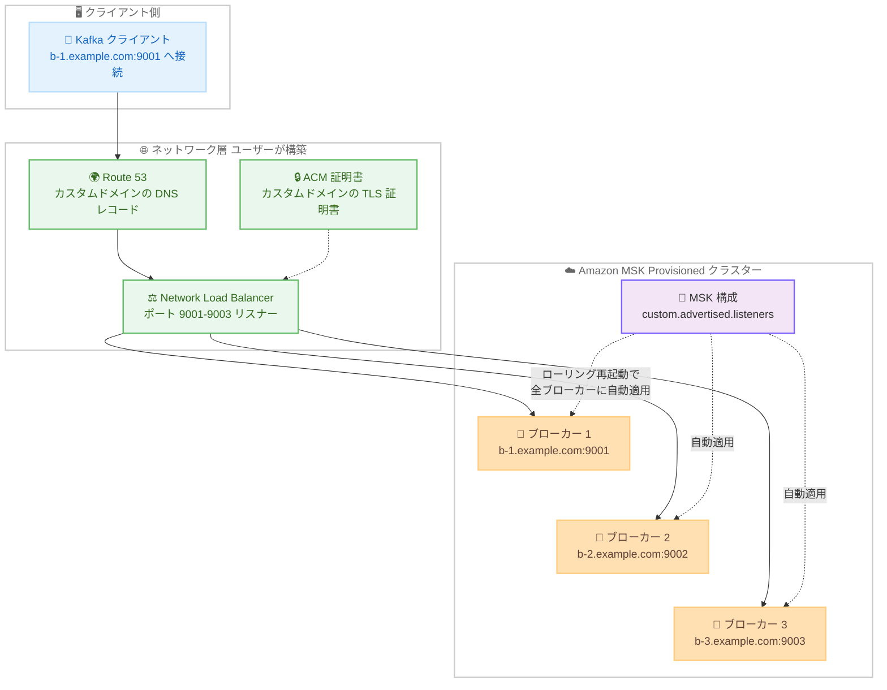

# Amazon MSK - MSK Provisioned クラスターのカスタムドメイン名設定サポート

**リリース日**: 2026 年 8 月 17 日
**サービス**: Amazon Managed Streaming for Apache Kafka (Amazon MSK)
**機能**: MSK Provisioned クラスターのカスタムドメイン名設定 (custom.advertised.listeners)

📊 [このアップデートのインフォグラフィックを見る](https://takech9203.github.io/aws-news-summary/20260817-amazon-msk-custom-domain-names.html)

## 概要

Amazon MSK は、MSK Provisioned クラスターに対してカスタムドメイン名を簡単に設定できる機能を発表しました。メタデータ管理に ZooKeeper と KRaft のどちらのモードを使用しているクラスターでも利用できます。クラスターレベルで一度カスタムドメインを定義するだけで、Amazon MSK がクラスター内のすべてのブローカーに自動的に適用します。

この機能により、クライアントアプリケーションは同じ接続エンドポイントを維持したまま、クラスター移行、災害復旧 (DR) のフェイルオーバー、スケーリング操作を実行できるようになります。Network Load Balancer 経由でトラフィックをルーティングしている場合や、クラスター操作をまたいで永続的なエンドポイントが必要な場合、組織のセキュリティ・コンプライアンス上の命名規則に準拠する必要がある場合に特に有用です。

**アップデート前の課題**

このアップデート以前には、以下の課題がありました。

- カスタムドメイン名を使用するには、ブローカーごとに手動で設定する必要があった
- KRaft ベースのクラスターでは、カスタムドメイン名を設定できなかった
- スケーリングやブローカー交換のたびに、新しいブローカーへの設定作業が発生し、運用負荷が高かった

**アップデート後の改善**

今回のアップデートにより、以下が可能になりました。

- クラスターレベルで一度カスタムドメインを定義すれば、Amazon MSK がすべてのブローカーに自動適用し、ブローカーごとの個別設定が不要になった
- スケーリング操作や自動修復によるブローカー交換の後も、クラスター側の設定が自動的に維持されるようになった
- ZooKeeper モードと KRaft モードの両方で、同一の動作でカスタムドメイン名を利用できるようになった

## アーキテクチャ図



MSK 構成に `custom.advertised.listeners` プロパティを追加すると、Amazon MSK がローリング再起動によりすべてのブローカーへ自動的にカスタムドメインを適用します。クライアントは Route 53 と Network Load Balancer を経由した永続的なカスタムエンドポイントでブローカーに接続します。

## サービスアップデートの詳細

### 主要機能

1. **クラスターレベルでの一括設定**
   - MSK 構成 (MSK Configuration) に `custom.advertised.listeners` プロパティを追加するだけで、クラスター内の全ブローカーにカスタムドメインが適用される
   - Amazon MSK が構成を検証 (リスナー名、フォーマット、一意性) した上で、ブローカーを 1 台ずつローリング再起動して適用する
   - 不正な構成は HTTP 400 エラーとして同期的に拒否されるため、誤った値がブローカーに反映されることはない

2. **ZooKeeper と KRaft の両モードに対応**
   - これまで KRaft ベースのクラスターではカスタムドメイン名を設定できなかったが、今回の機能で両モードが同一の動作でサポートされた
   - Standard ブローカーと Express ブローカーのどちらの MSK Provisioned クラスターでも利用可能

3. **スケーリング・自動修復時の設定維持**
   - クラスターのスケーリングや自動修復によるブローカー交換の際、Amazon MSK が新しいブローカーに構成を自動適用する
   - `{broker_id}` テンプレート変数がブローカー ID ごとに解決されるため、クラスター側の手動作業は不要
   - ただし、Network Load Balancer のリスナー、ターゲットグループ、DNS レコードなどのネットワーク層は自動ではスケールしないため、新規ブローカー分の追加が必要

4. **複数リスナーへの個別ドメイン割り当て**
   - クラスターに複数のクライアント向けリスナーがある場合、カンマ区切りでリスナーごとに異なるドメインを割り当て可能
   - 複数のリスナーが同じドメイン名を共有することも可能 (ブローカーごとに host:port の組み合わせが一意である必要あり)

## 技術仕様

### custom.advertised.listeners プロパティ

| 項目 | 詳細 |
|------|------|
| プロパティ形式 | `LISTENER_NAME://hostname-pattern:port+{broker_id}` |
| 設定例 | `CLIENT_IAM://b-{broker_id}.example.com:9000+{broker_id}` |
| `{broker_id}` 変数 | 必須。各ブローカーが一意のアドレスに解決されるようにポートに含める必要がある |
| `+` 演算子 | ベースポートにブローカー ID を加算 (9000 + 1 = 9001、9000 + 2 = 9002) |
| 複数リスナー | カンマ区切りで指定。リスナーごとに 1 ドメイン (同一リスナーへの複数ドメイン割り当ては不可) |
| 対応リスナー | `CLIENT`、`CLIENT_SECURE`、`CLIENT_SECURE_PUBLIC`、`CLIENT_SASL_SCRAM`、`CLIENT_SASL_SCRAM_PUBLIC`、`CLIENT_IAM`、`CLIENT_IAM_PUBLIC` |
| 非対応リスナー | 内部リスナー (`REPLICATION`、`CONTROLLER`) は検証時に拒否される |

3 ブローカーの IAM 認証クラスターに `CLIENT_IAM://b-{broker_id}.example.com:9000+{broker_id}` を設定した場合、各ブローカーは以下のアドレスに解決されます。

- ブローカー 1: `b-1.example.com:9001`
- ブローカー 2: `b-2.example.com:9002`
- ブローカー 3: `b-3.example.com:9003`

### API 変更

この機能は既存の MSK 構成 API (`CreateConfiguration` / `UpdateClusterConfiguration`) を通じて提供されるため、新しい API メソッドの追加はありません。コンソール、AWS CLI、AWS CloudFormation、AWS CDK、Terraform など、既存のブローカー構成変更と同じワークフローで利用できます。

## 設定方法

### 前提条件

1. クラスターが ACTIVE 状態の MSK Provisioned クラスター (Standard または Express ブローカー) であること
2. 指定するリスナーがクラスター上でバインド (有効) されているクライアントリスナーであること (例: IAM 認証のみのクラスターで `CLIENT_SECURE` を指定すると拒否される)
3. ネットワーク層 (Network Load Balancer、DNS、TLS 証明書) が構築・検証済みであること。構成適用後、メタデータを更新したすべてのクライアントはカスタムドメインのアドレスを受け取るため、クライアントがカスタムドメインを解決できない場合は接続が失われる

### 手順

#### ステップ 1: カスタムドメインを MSK 構成に追加

```bash
# custom-domain-config.txt にプロパティを記述
# custom.advertised.listeners=CLIENT_IAM://b-{broker_id}.example.com:9000+{broker_id}

aws kafka create-configuration \
  --name "custom-domain-iam" \
  --description "Custom advertised listeners for CLIENT_IAM" \
  --server-properties fileb://custom-domain-config.txt
```

`custom.advertised.listeners` プロパティを含む MSK 構成を作成します。`{broker_id}` は Amazon MSK が適用時にブローカーごとに解決するため、ファイル内ではリテラルのまま記述します。波括弧を含むためインライン指定は壊れやすく、`fileb://` (`file://` ではない) を使用して AWS CLI にバイトとして読み込ませ、Base64 エンコードさせます。レスポンスで返される構成の ARN と `LatestRevision.Revision` を次のステップで使用します。

#### ステップ 2: 構成をクラスターに適用

```bash
aws kafka update-cluster-configuration \
  --cluster-arn <your-cluster-arn> \
  --configuration-info arn=<configuration-arn>,revision=<revision> \
  --current-version <current-cluster-version>
```

`UpdateClusterConfiguration` で構成をクラスターに適用します。クラスターの現在のバージョンは `DescribeCluster` オペレーションで確認します。Amazon MSK は適用前に構成を同期的に検証し、不正な構成は HTTP 400 エラーで拒否されるため、不正な値がブローカーに到達することはありません。

#### ステップ 3: ロールアウトの追跡

```bash
aws kafka describe-cluster-operation-v2 \
  --cluster-operation-arn <operation-arn>
```

構成が受理されると、Amazon MSK はローリング再起動で構成を適用します。オペレーションが `UPDATE_COMPLETE` になるまで待機します。`UPDATE_FAILED` の場合はあるブローカーで適用に失敗しており、ロールアウトはそのブローカーで停止し、残りのブローカーは以前の構成を維持します。構成を修正して再適用することで復旧できます。

#### ステップ 4: 接続の確認

カスタムドメインのエンドポイント経由で、リスナーの認証設定を使用するクライアントからトピック一覧を取得し、接続を確認します。`UPDATE_COMPLETE` にもかかわらず接続できない場合は、ネットワークパス (NLB リスナー、ターゲットグループ、セキュリティグループ)、DNS 解決、TLS 証明書 (CN または SAN がブローカーのホスト名をカバーしているか、クライアントが CA を信頼しているか) を確認します。

## メリット

### ビジネス面

- **移行・DR の簡素化**: クライアント側の再設定なしにクラスター移行や災害復旧のフェイルオーバーを実行でき、切り替え時のダウンタイムとオペレーションミスのリスクを低減できる
- **コンプライアンス対応**: 組織のセキュリティ・コンプライアンス上の命名規則に準拠したエンドポイント名を利用できる
- **追加コストなし**: 追加料金なしで新規・既存のすべての MSK Provisioned クラスターに設定できる

### 技術面

- **運用負荷の削減**: ブローカーごとの手動設定が不要になり、クラスターレベルの一括設定と自動適用により設定ミスを防止できる
- **スケーリング耐性**: スケーリングやブローカー交換後も構成が自動的に維持され、`{broker_id}` テンプレートにより新ブローカーのアドレスも自動解決される
- **KRaft 対応**: ZooKeeper 廃止に向けた KRaft ベースのクラスターでも同一の方法でカスタムドメインを利用でき、将来のアップグレードパスを確保できる

## デメリット・制約事項

### 制限事項

- 対象は MSK Provisioned クラスターのみ (MSK Serverless は対象外)
- カスタムドメインを設定できるのはクライアントリスナーのみで、内部リスナー (`REPLICATION`、`CONTROLLER`) には設定できない
- 1 つのリスナーに割り当てられるドメインは 1 つのみ
- `{broker_id}` テンプレート変数は必須で、ポートに含めて各ブローカーが一意のアドレスに解決される必要がある

### 考慮すべき点

- ネットワーク層 (NLB、DNS、TLS 証明書) の構築はユーザーの責任であり、構成適用前に解決・到達・信頼が検証されている必要がある。クライアントがカスタムドメインを解決できないと接続が失われる (直前まで接続していたクライアントも含む)
- ネットワーク層は自動ではスケールしないため、ブローカー追加時には対応する NLB リスナー、ターゲットグループ、DNS レコードの追加が必要
- 構成の適用はローリング再起動を伴うため、適用タイミングの計画が必要
- カスタムドメインを削除して既定のアドレスに戻す際は、クライアントが元の MSK 生成アドレスに到達できることを事前に確認する必要がある

## ユースケース

### ユースケース 1: Network Load Balancer 経由のプライベート接続

**シナリオ**: 別 VPC やオンプレミスのクライアントから、NLB と PrivateLink を経由して MSK クラスターに接続しており、ブローカーのアドバタイズアドレスを NLB のカスタムドメインに揃えたい。

**実装例**:
```
custom.advertised.listeners=CLIENT_IAM://b-{broker_id}.kafka.internal.example.com:9000+{broker_id}
```

**効果**: ブローカーごとの手動設定なしに、全ブローカーが NLB 経由のカスタムエンドポイントをアドバタイズし、クライアントは一貫したエンドポイントで接続できる。

### ユースケース 2: クラスター移行・DR フェイルオーバー

**シナリオ**: クラスターの移行や DR フェイルオーバーの際、多数のプロデューサー・コンシューマーの接続設定を変更せずに切り替えたい。

**実装例**:
```
# 移行先クラスターにも同じカスタムドメイン構成を適用し、
# DNS の向き先を新クラスターのネットワーク層に切り替える
custom.advertised.listeners=CLIENT_IAM://b-{broker_id}.kafka.example.com:9000+{broker_id}
```

**効果**: クライアントアプリケーションの再設定・再デプロイなしにクラスターを切り替えられ、フェイルオーバー時間を短縮できる。

### ユースケース 3: 複数認証リスナーへの個別ドメイン割り当て

**シナリオ**: IAM 認証と SASL/SCRAM 認証を併用するクラスターで、認証方式ごとに異なるドメイン名を割り当てて管理を明確化したい。

**実装例**:
```
custom.advertised.listeners=CLIENT_IAM://b-{broker_id}.iam.example.com:9000+{broker_id},CLIENT_SASL_SCRAM://b-{broker_id}.scram.example.com:19000+{broker_id}
```

**効果**: 認証方式ごとにエンドポイントを分離でき、組織の命名規則やアクセス管理ポリシーに沿った運用が可能になる。

## 料金

カスタムドメイン名の設定機能自体に追加料金はありません。MSK Provisioned クラスターの標準料金に加え、ネットワーク層として使用する Network Load Balancer、Route 53、AWS Certificate Manager などの関連サービスには各サービスの標準料金が適用されます。

## 利用可能リージョン

Amazon MSK Provisioned が利用可能なすべての AWS リージョン (AWS GovCloud (US) を含む) で、新規・既存のすべての MSK Provisioned クラスターに設定できます。

## 関連サービス・機能

- **Elastic Load Balancing (Network Load Balancer)**: カスタムドメインへのトラフィックをブローカーに転送するネットワーク層として使用
- **Amazon Route 53**: カスタムドメインの DNS レコードを管理し、NLB へ名前解決
- **AWS Certificate Manager (ACM)**: カスタムドメインのホスト名をカバーする TLS 証明書を発行・管理
- **AWS CloudFormation / AWS CDK / Terraform**: MSK 構成の作成・適用を IaC で自動化可能

## 参考リンク

- 📊 [インフォグラフィック](https://takech9203.github.io/aws-news-summary/20260817-amazon-msk-custom-domain-names.html)
- [公式発表 (What's New)](https://aws.amazon.com/about-aws/whats-new/2026/17/amazon-msk-custom-domain-names/)
- [AWS Big Data Blog: Configure a custom domain name for your Amazon MSK cluster](https://aws.amazon.com/blogs/big-data/configure-a-custom-domain-name-for-your-amazon-msk-cluster/)
- [ドキュメント: Configure custom domain names for your Amazon MSK cluster](https://docs.aws.amazon.com/msk/latest/developerguide/custom-domain-names.html)
- [ドキュメント: Set up a custom domain name end to end](https://docs.aws.amazon.com/msk/latest/developerguide/custom-domain-setup.html)
- [料金ページ](https://aws.amazon.com/msk/pricing/)

## まとめ

このアップデートにより、MSK Provisioned クラスターのカスタムドメイン名設定が、ブローカーごとの手動作業からクラスターレベルの一括設定へと大幅に簡素化され、これまで不可能だった KRaft モードでも利用可能になりました。NLB 経由の接続構成や DR 対応で永続的なエンドポイントが必要なワークロードでは、`custom.advertised.listeners` プロパティによる構成への移行を検討することを推奨します。適用前にネットワーク層 (NLB、DNS、TLS 証明書) の検証を必ず実施してください。
