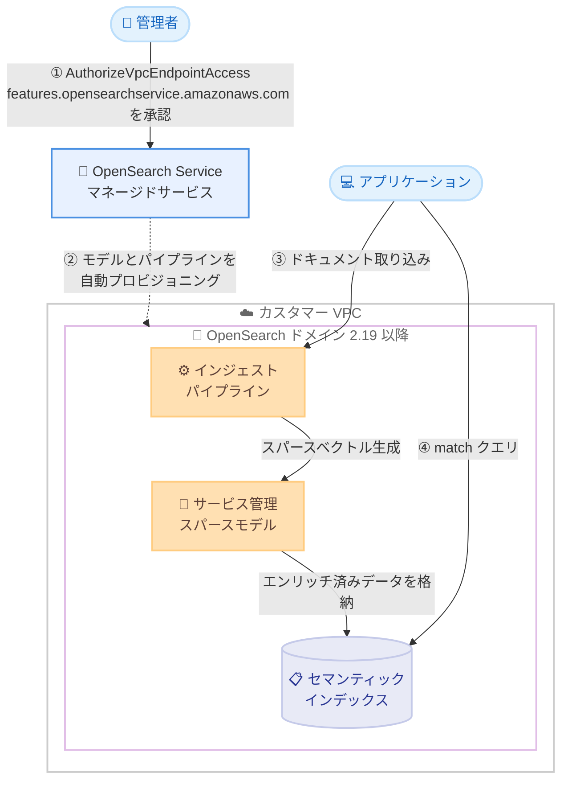

# Amazon OpenSearch Service - VPC ドメインでの自動セマンティックエンリッチメント対応

**リリース日**: 2026年8月17日
**サービス**: Amazon OpenSearch Service
**機能**: Automatic Semantic Enrichment for VPC Domains

📊 [このアップデートのインフォグラフィックを見る](https://takech9203.github.io/aws-news-summary/20260817-amazon-opensearch-service-vpc.html)

## 概要

Amazon OpenSearch Service の自動セマンティックエンリッチメント (Automatic Semantic Enrichment) が、VPC 対応ドメインで利用可能になった。自動セマンティックエンリッチメントは、従来のキーワード検索を意味理解に基づくコンテキスト認識型の検索へと変換する機能であり、これまではパブリックアクセスドメインのみで利用可能だった。

この機能を有効化すると、例えば「旅行用の軽量ノート PC」というクエリに対して、「ウルトラブック」や「ポータブルノートブック」のように完全一致するキーワードを含まない関連ドキュメントも検索結果に含められるようになる。ML モデルの選定、ホスティング、インジェストパイプラインや検索パイプラインの構築は OpenSearch Service 側で自動的に管理されるため、利用者が機械学習モデルを自己管理する必要はない。

今回のアップデートにより、セキュリティやコンプライアンス要件からドメインを VPC 内に配置している組織でも、既存のプライベートネットワーク構成やセキュリティ体制を変更することなくセマンティック検索を利用できる。利用には OpenSearch 2.19 以降を実行するドメインが必要である。

**アップデート前の課題**

- 自動セマンティックエンリッチメントはパブリックアクセスドメインのみで利用可能であり、VPC 内に配置したドメインでは利用できなかった
- VPC ドメインでセマンティック検索を実現するには、ML モデルのデプロイ、ニューラルスパース検索用のパイプライン構築、コネクタ設定などを利用者自身で行う必要があった
- セキュリティ要件により VPC 構成が必須の組織は、検索精度向上のためにネットワーク構成の変更や追加のインフラ管理を検討する必要があった

**アップデート後の改善**

- VPC 対応ドメインでも、マネージド型のセマンティック検索が利用可能になった
- 既存の VPC 構成やセキュリティ体制を変更することなく、セマンティックエンリッチメントを有効化できる
- `AuthorizeVpcEndpointAccess` API でサービスプリンシパルを一度承認するだけで、ML モデル、インジェストパイプライン、検索パイプラインが自動的にプロビジョニングされる

## アーキテクチャ図



VPC ドメインでは、サービスプリンシパル `features.opensearchservice.amazonaws.com` を承認することで、マネージドサービスが ML モデルとパイプラインを自動プロビジョニングする。ドキュメント取り込み時にスパースベクトルが生成され、検索時は match クエリが自動的にニューラルスパースクエリへ書き換えられる。

## サービスアップデートの詳細

### 主要機能

1. **VPC ドメインでのセマンティック検索対応**
   - パブリックアクセスドメインに加え、VPC アクセスドメインでも自動セマンティックエンリッチメントが利用可能になった
   - 既存の VPC 構成、セキュリティグループ、ネットワーク設定の変更は不要
   - VPC ドメインはパブリックに到達できないため、事前に OpenSearch Service features プリンシパルの承認が必要 (ドメインごとに 1 回のみ)

2. **マネージド型のセマンティック処理**
   - サービス管理の事前学習済みスパースモデルを使用し、カスタムのファインチューニングは不要
   - 指定したテキストフィールドをスパースベクトルに展開し、ネイティブの Lucene インデックス形式で格納
   - エンコードはデータ取り込み時のみ実行される document-only モードを採用しており、検索クエリはトークナイズのみで処理されるため、検索時の追加レイテンシやモデル呼び出しコストが発生しない

3. **クエリの自動書き換え**
   - 既存の match クエリを、クエリの変更なしで自動的にニューラルスパースクエリへ変換
   - bool、boosting、constant_score、dis_max、function_score、hybrid などの複合クエリ内の match クエリにも対応
   - multi_match クエリは現時点では未対応

4. **検索精度の向上**
   - 英語コンテンツでキーワード検索比 20% の関連性向上 (BEIR ベンチマークの ndcg@10)、P90 検索レイテンシは 7.7% 低減
   - 多言語コンテンツでは関連性が 105% 向上 (MIRACL ベンチマーク)、P90 検索レイテンシは 38.4% 増加

## 技術仕様

### 前提条件と要件

| 項目 | 詳細 |
|------|------|
| OpenSearch バージョン | 2.19 以降 (2.19 の場合は最新のサービスソフトウェアバージョンが必要) |
| ドメインタイプ | パブリックアクセスドメインおよび VPC アクセスドメイン |
| VPC ドメインの追加要件 | `features.opensearchservice.amazonaws.com` プリンシパルの承認 |
| 対応言語 | 英語に加え、日本語、アラビア語、ベンガル語、中国語、フィンランド語、フランス語、ヒンディー語、インドネシア語、韓国語、ペルシャ語、ロシア語、スペイン語、スワヒリ語、テルグ語 |
| トークン上限 | 英語: ドキュメントあたり先頭 8,192 トークン、多言語: 512 トークン |
| インデキシング推論スループット | 200 TPS (ソフトリミット、AWS サポートへの申請で引き上げ可能) |

### VPC ドメインでのプリンシパル承認

```bash
aws opensearch authorize-vpc-endpoint-access \
  --domain-name my-vpc-domain \
  --service "features.opensearchservice.amazonaws.com" \
  --region ap-northeast-1
```

承認が成功すると、以下のレスポンスが返される。

```json
{
    "AuthorizedPrincipal": {
        "PrincipalType": "AWS Service",
        "Principal": "features.opensearchservice.amazonaws.com"
    }
}
```

承認前にセマンティックエンリッチメントインデックスの操作 (`create-index`、`update-index`、`get-index`、`delete-index`) を実行すると、`AccessDeniedException` が発生する。

## 設定方法

### 前提条件

1. OpenSearch 2.19 以降を実行する VPC アクセスドメイン (必要に応じてサービスソフトウェアを最新版に更新)
2. `es:CreateIndex`、`es:ESHttpPut` などのインデックス操作に必要な IAM 権限
3. きめ細かなアクセスコントロール (FGAC) を有効化している場合は、追加のクラスター・インデックス権限、または 2026 年 8 月 12 日以降に作成されたドメインでは事前定義ロール `automatic_semantic_enrichment_full_access` へのマッピング

### 手順

#### ステップ1: OpenSearch Service features プリンシパルを承認する

```bash
aws opensearch authorize-vpc-endpoint-access \
  --domain-name my-vpc-domain \
  --service "features.opensearchservice.amazonaws.com" \
  --region ap-northeast-1
```

VPC ドメインに対して、セマンティックエンリッチメントを提供するマネージドサービスのアクセスを承認する。この操作はドメインごとに 1 回のみ必要で、パブリックアクセスドメインでは不要。コンソールの場合は、対象ドメインの [VPC endpoints] タブから [Authorize principal] を選択し、[OpenSearch Service Features] を承認する。

#### ステップ2: セマンティックエンリッチメントフィールドを持つインデックスを作成する

```bash
aws opensearch create-index \
  --domain-name my-vpc-domain \
  --index-name 'product-catalog' \
  --index-schema '{
    "mappings": {
        "properties": {
            "product_id": {
                "type": "keyword"
            },
            "title_semantic": {
                "type": "text",
                "semantic_enrichment": {
                    "status": "ENABLED",
                    "language_options": "english"
                }
            },
            "title_non_semantic": {
                "type": "text"
            }
        }
    }
}'
```

`semantic_enrichment` パラメータを `ENABLED` に設定したテキストフィールドを持つインデックスを作成する。`language_options` には `english` または `MULTI-LINGUAL` を指定できる。同一インデックス内で、英語用、多言語用、通常のレキシカルフィールドを組み合わせることも可能。実行すると、必要な ML モデル、インジェストパイプライン、検索パイプラインが自動的にセットアップされる。

#### ステップ3: データを取り込み、検索する

インデックス作成後は追加設定なしで機能する。ドキュメントの取り込み時に、指定フィールドのテキストがサービス管理スパースモデルにより自動的にセマンティックエンコードされ、元データとともに格納される。検索時は既存の match クエリがそのまま自動的にセマンティック検索に書き換えられるため、アプリケーション側のクエリ変更は不要。

なお、VPC ドメインではネットワーク制約によりコンソールにインデックス一覧を表示できないため、インデックスの確認は OpenSearch Dashboards を直接使用し、既存インデックスの更新は `update-index` API で行う。

## メリット

### ビジネス面

- **セキュリティ体制を維持したまま検索体験を向上**: プライベートネットワーク構成やコンプライアンス要件を犠牲にすることなく、セマンティック検索による検索精度向上 (英語で最大 20%) を実現できる
- **運用コストの削減**: ML モデルの選定、ホスティング、スケーリング、パイプライン管理が不要になり、検索基盤の運用負荷を大幅に軽減できる
- **段階的な導入が可能**: フィールド単位で有効化でき、既存のレキシカルフィールドと共存できるため、影響範囲を限定して導入を進められる

### 技術面

- **アプリケーション変更が最小限**: 既存の match クエリが自動的にニューラルスパースクエリへ書き換えられるため、検索クエリの書き換えが不要
- **検索時のオーバーヘッドなし**: document-only モードにより、エンコードは取り込み時のみ実行され、検索時はモデル呼び出しが発生しない
- **多言語対応**: 日本語を含む 15 言語に対応し、多言語コンテンツでは関連性が 105% 向上する

## デメリット・制約事項

### 制限事項

- OpenSearch 2.19 以降が必要 (2.19 の場合は最新のサービスソフトウェアバージョンも必要)
- 既存インデックスにセマンティックエンリッチメントを有効化するには、インデックスの再作成、または `update-index` によるフィールド追加が必要 (既存ドキュメントはバックフィルされないため再取り込みが必要)
- 英語はドキュメントあたり先頭 8,192 トークン、多言語は 512 トークンのみ処理されるため、長文ドキュメントにはチャンキングの検討が必要
- Derived Source 機能とは互換性がない
- multi_match クエリの書き換えは未対応
- セマンティックエンリッチメントはトップレベルの text フィールドのみ対応 (ネストされたフィールドは不可)
- インデキシング推論リクエストは 200 TPS に制限される (ソフトリミット)

### 考慮すべき点

- セマンティックエンリッチメントによりインデックスサイズが大幅に増加するため、完全一致検索で十分なログ分析ワークロードには不向き
- 多言語コンテンツでは P90 検索レイテンシが 38.4% 増加するため、レイテンシ要件が厳しい場合は事前検証が必要
- VPC ドメインではコンソールからインデックス一覧の表示や既存インデックスの更新ができず、OpenSearch Dashboards や `update-index` API の利用が必要
- ワークロードごとに特性が異なるため、本番導入前に開発環境で独自のベンチマークによる評価が推奨される

## ユースケース

### ユースケース1: 社内ナレッジ検索システムの精度向上

**シナリオ**: 金融機関が、コンプライアンス要件により VPC 内に構築した社内ドキュメント検索システムで、キーワード一致では見つからない関連文書を検索できるようにしたい。

**実装例**:
```bash
aws opensearch create-index \
  --domain-name internal-docs-domain \
  --index-name 'knowledge-base' \
  --index-schema '{
    "mappings": {
        "properties": {
            "doc_title": {
                "type": "text",
                "semantic_enrichment": {"status": "ENABLED", "language_options": "MULTI-LINGUAL"}
            },
            "doc_summary": {
                "type": "text",
                "semantic_enrichment": {"status": "ENABLED", "language_options": "MULTI-LINGUAL"}
            }
        }
    }
}'
```

**効果**: プライベートネットワーク構成を維持したまま、日本語ドキュメントに対する意図理解型の検索が可能になり、ナレッジ発見の効率が向上する。

### ユースケース2: EC サイトの商品検索の改善

**シナリオ**: VPC 内の OpenSearch ドメインで商品カタログ検索を運用している EC 事業者が、「ビーチ用の靴」のような抽象的なクエリで「耐水サンダル」などの関連商品もヒットさせたい。

**実装例**:
```json
{
    "query": {
        "match": {
            "title_semantic": "ビーチ用の靴"
        }
    }
}
```

**効果**: 既存の match クエリが自動的にセマンティック検索に書き換えられるため、アプリケーションの改修なしで検索の関連性が向上し、コンバージョン率の改善が期待できる。

### ユースケース3: セルフマネージド ML 構成からの移行

**シナリオ**: これまでニューラルスパース検索のために ML モデルのデプロイやパイプラインを自己管理していたチームが、運用負荷を削減したい。

**実装例**:
```bash
# プリンシパル承認後、セマンティックエンリッチメント有効のインデックスへ再取り込み
aws opensearch authorize-vpc-endpoint-access \
  --domain-name search-domain \
  --service "features.opensearchservice.amazonaws.com"
```

**効果**: モデルのバージョン管理、スケーリング、コネクタ設定などの運用作業が不要になり、チームは検索体験の改善に集中できる。

## 料金

自動セマンティックエンリッチメントは、インデキシング時のスパースベクトル生成で消費される OpenSearch Compute Unit (OCU) に基づいて課金される。課金対象は有効化したテキストフィールドの取り込み時の実使用分のみで、検索時やデータストレージに対する追加の Semantic Search OCU 課金はない。消費量は CloudWatch メトリクス `SemanticSearchOCU` で監視できる。

### 料金例

| 項目 | 内容 |
|------|------|
| Semantic Search OCU 単価 | 0.24 USD/OCU 時間 |
| 処理能力 | 1 OCU あたり英語 1,110 万トークン |
| 計算例 | 24 億トークン (約 10 GB) の処理 = 約 216 OCU 時間 x 0.24 USD = 約 51 USD |

最新の料金は [OpenSearch Service 料金ページ](https://aws.amazon.com/opensearch-service/pricing/) を参照。

## 利用可能リージョン

以下の 11 リージョンで利用可能。

- 米国東部 (バージニア北部)
- 米国東部 (オハイオ)
- 米国西部 (オレゴン)
- アジアパシフィック (ムンバイ)
- アジアパシフィック (シンガポール)
- アジアパシフィック (シドニー)
- アジアパシフィック (東京)
- 欧州 (フランクフルト)
- 欧州 (アイルランド)
- 欧州 (スペイン)
- 欧州 (ストックホルム)

## 関連サービス・機能

- **Amazon OpenSearch Service ニューラルスパース検索**: 本機能の基盤技術。従来は利用者自身でモデルとパイプラインを構成する必要があったが、本機能によりマネージド化された
- **AuthorizeVpcEndpointAccess API**: VPC ドメインへの AWS サービスプリンシパルのアクセス承認に使用。本機能では `features.opensearchservice.amazonaws.com` の承認に利用する
- **きめ細かなアクセスコントロール (FGAC)**: FGAC 有効ドメインでは追加権限が必要。2026 年 8 月 12 日以降に作成されたドメインには事前定義ロール `automatic_semantic_enrichment_full_access` が用意されている
- **Amazon CloudWatch**: `SemanticSearchOCU` メトリクスにより OCU 消費量を監視できる

## 参考リンク

- 📊 [インフォグラフィック](https://takech9203.github.io/aws-news-summary/20260817-amazon-opensearch-service-vpc.html)
- [公式発表 (What's New)](https://aws.amazon.com/about-aws/whats-new/2026/08/amazon-opensearch-service-vpc/)
- [ドキュメント: Automatic semantic enrichment for Amazon OpenSearch Service](https://docs.aws.amazon.com/opensearch-service/latest/developerguide/opensearch-semantic-enrichment.html)
- [ドキュメント: Service software updates](https://docs.aws.amazon.com/opensearch-service/latest/developerguide/service-software.html)
- [料金ページ](https://aws.amazon.com/opensearch-service/pricing/)

## まとめ

自動セマンティックエンリッチメントの VPC ドメイン対応により、セキュリティ要件からプライベートネットワーク構成を採用している組織でも、ML モデルの自己管理なしで意味理解型の検索を導入できるようになった。OpenSearch 2.19 以降のドメインでサービスプリンシパルを承認するだけで利用開始でき、既存の match クエリもそのまま活用できるため、導入障壁は低い。VPC ドメインで検索精度に課題を抱えている場合は、開発環境でのベンチマーク評価から始めることを推奨する。
