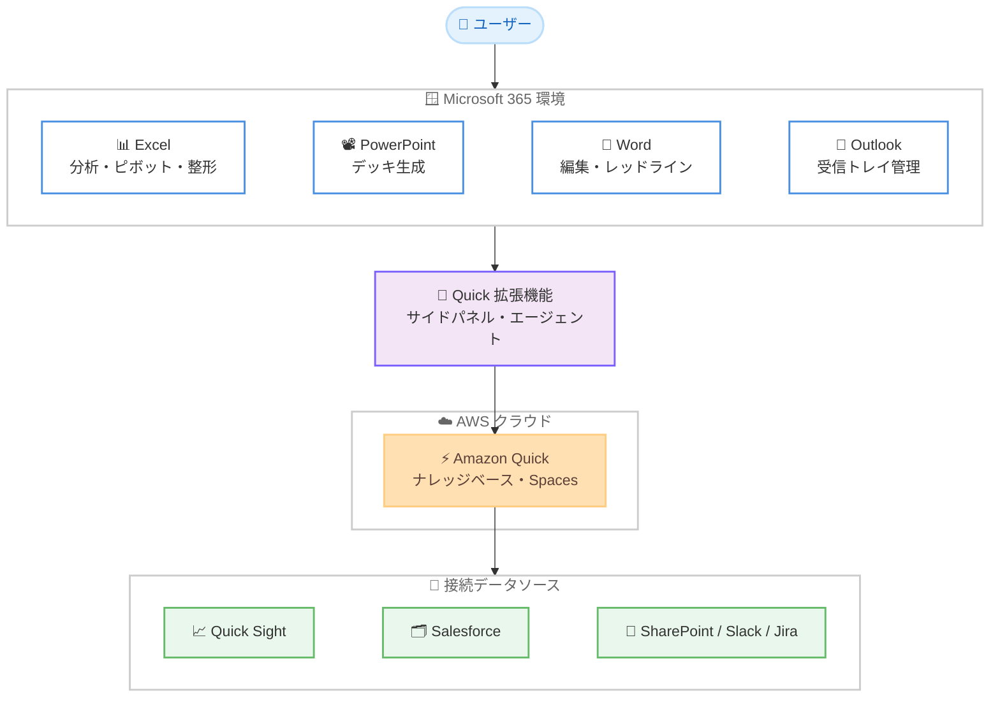

# Amazon Quick - Microsoft 365 拡張機能の一般提供開始

**リリース日**: 2026 年 8 月 17 日
**サービス**: Amazon Quick
**機能**: Microsoft 365 拡張機能 (Excel、PowerPoint、Word、Outlook)

📊 [このアップデートのインフォグラフィックを見る](https://takech9203.github.io/aws-news-summary/20260817-amazon-quick-microsoft-365-extensions-generally-available.html)

## 概要

Amazon Quick の Microsoft 365 拡張機能 (Excel、PowerPoint、Word、Outlook 向け) が一般提供 (GA) を開始しました。この拡張機能により、Quick がユーザーの Microsoft 365 環境内で直接タスクを実行できるようになり、ドキュメントのレッドライン (変更履歴付き修正)、財務モデルの構築、プレゼン資料の作成、Outlook 受信トレイの管理といった複雑なローカルタスクを AI が処理します。

各拡張機能は、単なるチャットボットの後付けではなく、アプリケーション内で直接アクションを実行する「エージェント型」として設計されています。リボンから開く常駐サイドパネルとして動作し、開いているドキュメントやメールのコンテキストを自動的に認識するため、タブの切り替えやコピー & ペーストは不要です。さらに、既存の Quick 環境 (ナレッジベース、データソース、Spaces、ダッシュボード、Salesforce / Jira / Slack / SharePoint などの統合) をそのまま継承するため、接続済みの企業データを活用した文書作成や分析が可能です。

財務、営業、マーケティング、法務、運用、IT といった幅広いチームの日常業務を対象としており、Microsoft 365 を業務の中心とする組織にとって、生成 AI を「普段仕事をしている場所」に持ち込むアップデートです。

**アップデート前の課題**

- 以前は Quick の分析結果や接続データを Excel や PowerPoint で利用する場合、Web ブラウザの Quick 画面と Office アプリの間で手動のコピー & ペーストや転記が必要だった
- Word 文書の大規模な編集やレビュー、契約書のレッドラインは手作業で行う必要があり、変更の追跡や監査に手間がかかった
- Outlook でのメールの優先順位付け、返信の下書き、会議調整は、CRM などの外部データを参照しながら手動で行う必要があった
- 組織のブランドガイドラインに準拠したプレゼン資料の作成には、テンプレートへの手動整形作業が必要だった

**アップデート後の改善**

- Excel、PowerPoint、Word、Outlook の各アプリ内サイドパネルから、Quick の AI エージェントが直接タスクを実行できるようになった
- Quick Sight、Salesforce、SharePoint、データウェアハウスなどの接続済みデータソースを、Office アプリ内から自然言語で参照・取り込みできるようになった
- Word では変更履歴 (track changes) を有効にした一括編集や、コメント欄でのレビュアーとしての参加が可能になり、すべての編集が before / after のスナップショットとして記録されるようになった
- 組織定義のスライドマスター・レイアウト・配色を使用した、ブランド準拠のプレゼン資料を自動生成できるようになった

## アーキテクチャ図



各 Microsoft 365 アプリ内のサイドパネルとして動作する Quick 拡張機能が、AWS クラウド上の Amazon Quick と連携し、接続済みデータソースの情報を活用してアプリ内で直接タスクを実行します。処理は完全にクラウド側で実行され、クライアント側への追加インストールは不要です。

## サービスアップデートの詳細

### 主要機能

1. **Excel 拡張機能**
   - 複雑なスプレッドシート分析、ピボットテーブルやグラフの作成、データのインポートとクリーニングを支援
   - Quick Sight、Salesforce、SharePoint、データウェアハウスなどの外部データを取り込み、不整合の検出・整形を行い、分析可能な形式へ変換
   - 「月次で 10% を超える異常値をフラグ」「Quick Sight から Q1 の地域別売上を新しいタブに取り込み」「複雑な数式の説明と依存関係の追跡」といった自然言語の指示に対応

2. **PowerPoint 拡張機能**
   - 組織定義のテンプレートを使用し、Quick のデータからプレゼン資料を作成・改善
   - 自社のスライドマスター・レイアウト・フォント・配色を使用するため、手動整形なしでブランドガイドラインに準拠
   - スライドをプログラム的に生成し、複数ステップの反復的なワークフローに対応

3. **Word 拡張機能**
   - Word のネイティブ要素 (プリミティブ) を使用した整形済みドキュメントの生成
   - 変更履歴 (track changes) を有効にした一括編集と、コメント欄でのレビュアーとしての参加
   - すべての編集を before / after のスナップショットとして記録し、チャットパネルで視覚的に比較できる監査証跡を提供
   - 既存のフォント・見出しスタイル・文書構造を尊重する「共同編集者」として動作

4. **Outlook 拡張機能**
   - メールの優先順位付け、受信トレイの整理、会議のスケジューリング、Quick データと受信トレイ全体のコンテキストを活用した返信の下書き作成
   - 件名・送受信者・スレッド履歴・タイムスタンプを自動的にコンテキストとして把握
   - 返信・新規メールの下書き、宛先追加、添付、送信スケジュール設定、フラグ・分類・移動、スレッド要約とアクションアイテム抽出に対応

5. **エージェント型の実行モデル**
   - 質問への回答だけでなく、ドキュメントやメールに対するアクションをアプリ内で直接実行
   - 会話履歴はセッション間で保持され、Outlook ではメールスレッドごとに独立した会話が維持される
   - 完全クラウド実行のため、クライアント側への追加インストールは不要

## 技術仕様

### 拡張機能の概要

| 項目 | 詳細 |
|------|------|
| 対象アプリ | Excel、PowerPoint、Word、Outlook (デスクトップ版・Web 版) |
| 動作形態 | リボンから起動する常駐サイドパネル (Office アドイン) |
| 実行環境 | 完全クラウド実行 (クライアント側インストール不要) |
| 認証 | Quick ネイティブ認証 (Microsoft Entra アプリの登録は不要) |
| データ連携 | Quick Sight、Salesforce、Jira、Slack、SharePoint、データウェアハウスなど既存の Quick 統合を継承 |
| 更新 | 自動配信 (IT 部門の介入不要) |
| データ所在 | 選択したリージョン内にデータが保持され、バックエンドはパブリックな外向き通信のない分離環境で稼働 |

### 配布・管理方法

| 方法 | 詳細 |
|------|------|
| 管理者による展開 | Microsoft 365 管理センターから標準マニフェストで対象ユーザー / グループへプッシュ配布 |
| セルフインストール | Microsoft アドインストアで「Quick」を検索して追加 |
| カスタマイズ | エージェント設定やカスタムブランディングは Office マニフェストまたはポリシー設定で構成可能 |

## 設定方法

### 前提条件

1. アクティブな Amazon Quick アプリケーション (既存の Quick 環境の拡張であり、独立した別製品ではない)
2. Microsoft 365 の利用環境 (デスクトップ版または Web 版)
3. Outlook 拡張機能のフル機能利用には、Microsoft Graph API 権限に関する管理者承認・管理者展開が必要な場合がある

### 手順

#### ステップ 1: 拡張機能の入手

Quick のダウンロードページ (https://aws.amazon.com/quick/download/) から拡張機能を入手するか、Microsoft アドインストアで「Quick」を検索して [Add] を選択します。Quick コンソールの Extensions メニューからも選択できます。

#### ステップ 2: 組織への展開 (管理者による一括配布の場合)

Microsoft 365 管理センターから、標準のアドインマニフェストを使用して対象ユーザーまたはグループへプッシュ配布します。通常の Office アドインと同じ仕組みで展開でき、以降の更新は自動配信されます。

#### ステップ 3: サインインと利用開始

Office アプリのリボンに表示された Quick アイコンからサイドパネルを開き、Quick のネイティブ認証でサインインします。Microsoft Entra アプリの登録は不要です。サインイン後は、開いているドキュメントやメールのコンテキストを認識した状態で、自然言語による指示でタスクを実行できます。

## メリット

### ビジネス面

- **業務時間の削減**: 財務モデル構築、提案書作成、契約書レビュー、メール処理といった日常業務を AI が代行し、手作業の時間を削減できる
- **ブランド一貫性の維持**: 組織定義のテンプレートとスライドマスターを使用するため、手動整形なしでブランド準拠の資料を作成できる
- **既存データ資産の活用**: CRM やダッシュボードなど接続済みの企業データを、Office アプリ内から直接参照して文書やメールに反映できる

### 技術面

- **導入・運用負荷の低さ**: 標準の Office アドインとして展開でき、Entra アプリの登録が不要。更新は自動配信されるため IT 部門の運用負荷が小さい
- **監査証跡の確保**: Word では全編集が before / after スナップショットとして記録され、変更箇所への参照リンク付きで追跡できる
- **セキュリティ境界の維持**: 既存の Quick の権限・セキュリティポリシーがそのまま適用され、データは選択リージョン内に保持される

## デメリット・制約事項

### 制限事項

- 利用可能リージョンは 6 リージョン (バージニア北部、オレゴン、シドニー、東京、アイルランド、フランクフルト) に限定される
- Outlook 拡張機能は、多くの組織で Microsoft Graph API 権限が制限されているため、管理者承認・管理者展開なしではフル機能を利用できない可能性がある
- アクティブな Quick アプリケーションが前提であり、Quick を利用していない組織は事前のセットアップが必要

### 考慮すべき点

- AI による文書編集やメール下書きの品質は利用前に検証し、重要文書では人間による最終確認プロセスを維持することが推奨される
- 拡張機能の価値は接続されたデータの広さに依存するため、Quick 側でのデータソース統合 (Salesforce、SharePoint など) の整備が効果を左右する
- 組織のアドイン管理ポリシーによっては、セルフインストールが制限されている場合がある

## ユースケース

### ユースケース 1: 財務チームによる財務モデルの構築

**シナリオ**: 財務アナリストが四半期レビュー用に、実績と予測を比較する財務モデルを Excel で構築する。

**実装例**:
```
Excel の Quick サイドパネルで以下を指示:
「Quick Sight から Q1 の地域別売上データを新しいタブに取り込んで、
月次で 10% を超える変動をフラグし、実績 vs 予測のチャートを作成して」
```

**効果**: データの取り込み・整形・異常値検出・可視化までを一括で実行でき、手動でのデータ転記と整形作業が不要になる。

### ユースケース 2: 法務チームによる契約書レビュー

**シナリオ**: 法務担当者が取引先から受領した契約書ドラフトをレビューし、自社の標準条項に合わせた修正案を作成する。

**実装例**:
```
Word の Quick サイドパネルで以下を指示:
「この契約書を自社の標準条項と比較し、変更履歴を有効にして
修正案を反映して。懸念点はコメントとして追加して」
```

**効果**: 変更履歴付きのレッドラインとコメントによるレビューが自動化され、すべての編集が監査証跡として記録されるため、レビューの効率と透明性が向上する。

### ユースケース 3: 営業チームによる顧客対応メールの効率化

**シナリオ**: 営業担当者が多数の顧客メールを処理しながら、CRM データを踏まえた返信と会議調整を行う。

**実装例**:
```
Outlook の Quick サイドパネルで以下を指示:
「このスレッドを要約してアクションアイテムを抽出し、
Salesforce のアカウントヘルス指標を踏まえた返信を下書きして。
参加者全員と 30 分の打ち合わせを設定して」
```

**効果**: スレッド全体のコンテキストと CRM データを活用した返信下書きと会議招集 (出席者・タイトル・議題込み) が自動生成され、メール処理時間を大幅に短縮できる。

## 料金

Amazon Quick の Plus、Professional、Enterprise プランの顧客は、追加ライセンスなしで Microsoft 365 拡張機能を利用できます。Quick を未利用の場合は、無料トライアルから開始できます。プランごとの詳細は Amazon Quick の料金ページを参照してください。

## 利用可能リージョン

以下の 6 リージョンで利用可能です。

- 米国東部 (バージニア北部)
- 米国西部 (オレゴン)
- アジアパシフィック (シドニー)
- アジアパシフィック (東京)
- 欧州 (アイルランド)
- 欧州 (フランクフルト)

東京リージョンで利用可能なため、日本のユーザーはデータを国内リージョンに保持したまま利用できます。

## 関連サービス・機能

- **Amazon Quick Suite**: 本拡張機能の基盤となるサービス。ナレッジベース、Spaces、ダッシュボード、各種データソース統合を提供し、拡張機能はこれらをそのまま継承する
- **Amazon Quick Sight**: BI ダッシュボードのデータを Excel や PowerPoint に直接取り込むデータソースとして連携
- **Salesforce / SharePoint / Jira / Slack 統合**: Quick の既存統合を通じて、CRM データやドキュメントを Office アプリ内から参照可能

## 参考リンク

- 📊 [インフォグラフィック](https://takech9203.github.io/aws-news-summary/20260817-amazon-quick-microsoft-365-extensions-generally-available.html)
- [公式発表 (What's New)](https://aws.amazon.com/about-aws/whats-new/2026/08/amazon-quick-microsoft-365-extensions-generally-available)
- [AWS Blog: Amazon Quick for Microsoft 365: Agentic AI where you work](https://aws.amazon.com/blogs/machine-learning/amazon-quick-for-microsoft-365-agentic-ai-where-you-work/)
- [Quick ダウンロードページ](https://aws.amazon.com/quick/download/)

## まとめ

Amazon Quick の Microsoft 365 拡張機能の GA により、Excel、PowerPoint、Word、Outlook という日常業務の中心となるアプリ内で、企業データに接続されたエージェント型 AI を直接利用できるようになりました。東京リージョンを含む 6 リージョンで提供され、Plus 以上のプランでは追加ライセンスも不要です。Quick を利用中の組織は、まずダウンロードページまたは Microsoft アドインストアから拡張機能を導入し、Excel での分析や Outlook のメール処理など効果の見えやすい業務から試すことを推奨します。
