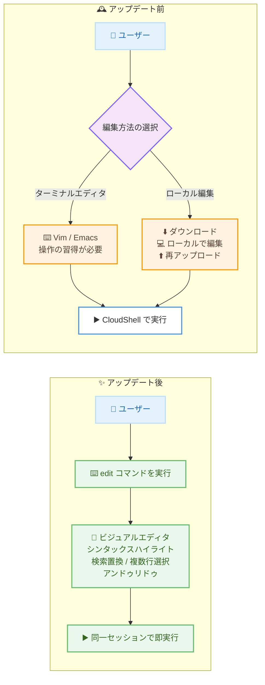

# AWS CloudShell - ビルトインビジュアルファイルエディタ

**リリース日**: 2026 年 8 月 17 日
**サービス**: AWS CloudShell
**機能**: ビルトインビジュアルファイルエディタ (edit コマンド)

📊 [このアップデートのインフォグラフィックを見る](https://takech9203.github.io/aws-news-summary/20260817-aws-cloudshell-visual-file-editor.html)

## 概要

AWS CloudShell に、ビジュアルファイルエディタがビルトイン機能として追加されました。シェルセッションから `edit` コマンドを 1 つ実行するだけでエディタが起動し、事前のセットアップは一切不要です。シンタックスハイライト、検索と置換、複数行選択、コピーアンドペースト、アンドゥとリドゥといった GUI エディタ相当の編集機能を、ブラウザ上の CloudShell セッション内でそのまま利用できます。

CloudShell は AWS Management Console の認証情報でそのまま利用できるブラウザベースのシェル環境であり、スクリプトの実行、Infrastructure as Code の操作、エージェント型ワークフロー、AWS Lambda 関連のタスクなどで、開発者、DevOps エンジニア、クラウド管理者に広く利用されています。今回のアップデートにより、ファイルの編集から実行までを単一のブラウザセッション内で完結できる、シームレスな「編集して実行」体験が実現します。

**アップデート前の課題**

このアップデート以前は、CloudShell 上のファイル編集に以下のような手間が発生していました。

- Vim や Emacs などのターミナルエディタの操作方法を習得する必要があった
- あるいはファイルをローカルにダウンロードし、手元で編集してから再アップロードする必要があった
- これらの往復作業が、デプロイスクリプトの更新や Lambda 関数の修正といった日常的なワークフローに摩擦を生んでいた

**アップデート後の改善**

今回のアップデートにより、以下が可能になりました。

- `edit` コマンド 1 つでビジュアルエディタを起動でき、セットアップやインストールが不要になった
- シンタックスハイライト、検索置換、複数行選択、コピーペースト、アンドゥリドゥを備えた GUI ライクな編集が CloudShell 内で完結するようになった
- ファイルのダウンロードと再アップロードの往復が不要になり、編集から実行までを単一のブラウザセッションで行えるようになった

## アーキテクチャ図



アップデート前はターミナルエディタの習得またはローカルとのファイル往復が必要でしたが、アップデート後は `edit` コマンドだけで編集から実行までが CloudShell 内で完結します。

## サービスアップデートの詳細

### 主要機能

1. **edit コマンドによる即時起動**
   - シェルセッションで `edit <ファイル名>` を実行するだけでエディタが開く
   - 事前のインストールや設定は一切不要
   - CloudShell にプリインストールされたネイティブ機能として提供

2. **GUI エディタ相当の編集機能**
   - シンタックスハイライト: ファイルの内容が言語に応じて色付け表示される
   - 検索と置換: ファイル内のテキストを効率的に検索、置換できる
   - 複数行選択: 複数行をまとめて選択して編集できる
   - コピーアンドペースト: GUI エディタと同様の操作で貼り付けできる
   - アンドゥとリドゥ: 編集操作の取り消しとやり直しができる

3. **シームレスな編集と実行の体験**
   - 編集から実行までを単一のブラウザセッション内で完結できる
   - デプロイスクリプトの更新、エージェントのステアリングファイルの修正、CloudFormation テンプレートの編集、Lambda 関数の修正などに活用できる

4. **Safe Paste による保護**
   - 複数行テキストの貼り付け時に警告を表示する Safe Paste 機能に対応
   - 悪意のあるスクリプトが含まれていないか、貼り付け前に全文を確認できる

## 技術仕様

### エディタの主な仕様

| 項目 | 詳細 |
|------|------|
| 起動方法 | シェルセッションで `edit <ファイル名>` を実行 |
| セットアップ | 不要 (プリインストール済み) |
| シンタックスハイライト | 対応 |
| 検索と置換 | 対応 |
| 複数行選択 | 対応 |
| コピーアンドペースト | 対応 (Safe Paste 機能あり) |
| アンドゥとリドゥ | 対応 |
| 従来の選択肢 | Vim / Emacs などのターミナルエディタも引き続き利用可能 |

## 設定方法

### 前提条件

1. AWS Management Console にサインインできる IAM ユーザーまたはロール
2. CloudShell の利用権限 (`AWSCloudShellFullAccess` ポリシーなど)
3. CloudShell が利用可能なリージョンを選択していること

### 手順

#### ステップ 1: CloudShell を起動する

AWS Management Console のナビゲーションバーにある CloudShell アイコンを選択するか、コンソール検索で「CloudShell」を検索して起動します。ブラウザ上でシェルセッションが開始されます。

#### ステップ 2: 編集したいファイルを用意する

```bash
# 例: 簡単な Python スクリプトを作成する
cat << 'EOF' > add_prog.py
import sys
x=int(sys.argv[1])
y=int(sys.argv[2])
sum=x+y
print("The sum is",sum)
EOF
```

ヒアドキュメントを使用して、2 つの数値を加算する Python スクリプト `add_prog.py` をホームディレクトリに作成しています。ローカルからのファイルアップロード ([Actions] メニューの [Upload file]) でも構いません。

#### ステップ 3: edit コマンドでファイルを開いて編集する

```bash
# ビジュアルエディタでファイルを開く
edit add_prog.py
```

`edit` コマンドにファイル名を渡すと、シンタックスハイライトが有効な状態でエディタが起動します。GUI エディタと同じ感覚で、検索置換や複数行選択、アンドゥリドゥを使いながら編集できます。

#### ステップ 4: 編集したファイルをそのまま実行する

```bash
# 編集後のスクリプトを同一セッションで実行する
python3 add_prog.py 4 5
```

編集を保存したら、同じシェルセッションでそのままプログラムを実行できます。ダウンロードや再アップロードは不要です。

## メリット

### ビジネス面

- **作業時間の短縮**: ローカルとのファイル往復やターミナルエディタの操作習得が不要になり、日常的な運用タスクの所要時間を削減できる
- **オンボーディングの容易化**: Vim / Emacs に不慣れなメンバーでも GUI ライクな操作で即座にファイル編集ができ、チーム全体の生産性が向上する
- **追加コスト不要**: CloudShell の標準機能として提供されるため、追加のツール導入やライセンス費用が発生しない

### 技術面

- **セットアップ不要**: `edit` コマンド 1 つで起動でき、エディタのインストールや設定管理が不要
- **編集と実行の一体化**: 単一のブラウザセッション内で編集から実行、AWS CLI によるデプロイまで完結できる
- **安全な貼り付け**: Safe Paste 機能により、複数行テキストに含まれる可能性のある悪意のあるスクリプトを貼り付け前に確認できる

## デメリット・制約事項

### 制限事項

- CloudShell のホームディレクトリ容量 (1 GB) や無操作タイムアウトなど、CloudShell 自体の制限は従来どおり適用される
- 本格的な IDE (デバッガ、拡張機能、Git 統合 UI など) の代替ではなく、あくまで軽量なファイル編集を目的とした機能である

### 考慮すべき点

- Vim / Emacs の高度な操作 (マクロ、プラグインなど) に依存したワークフローでは、引き続きターミナルエディタの利用が適する場合がある
- Safe Paste 機能が有効な場合、複数行テキストの貼り付け時に確認ステップが入るため、運用手順に組み込む際は挙動を把握しておく

## ユースケース

### ユースケース 1: デプロイスクリプトの迅速な修正

**シナリオ**: 運用担当者が CloudShell 上のデプロイスクリプトの一部を修正して即座に再実行したい。

**実装例**:
```bash
edit deploy.sh
# エディタ上で検索置換を使い対象リソース名を修正して保存
bash deploy.sh
```

**効果**: ローカルへのダウンロードと再アップロードが不要になり、修正から再実行までを数分から数十秒に短縮できる。

### ユースケース 2: CloudFormation テンプレートの編集とデプロイ

**シナリオ**: インフラ担当者が CloudFormation テンプレートのパラメータを変更してスタックを更新したい。

**実装例**:
```bash
edit template.yaml
# シンタックスハイライトを頼りに YAML のインデントを確認しながら編集
aws cloudformation deploy --template-file template.yaml --stack-name my-stack
```

**効果**: シンタックスハイライトにより YAML の構造を視認しながら安全に編集でき、そのまま AWS CLI でデプロイまで完結できる。

### ユースケース 3: Lambda 関数コードの修正

**シナリオ**: 開発者が Lambda 関数の不具合を発見し、関数コードを修正して更新したい。

**実装例**:
```bash
edit lambda_function.py
# 複数行選択とアンドゥリドゥを活用してロジックを修正
zip function.zip lambda_function.py
aws lambda update-function-code --function-name my-function --zip-file fileb://function.zip
```

**効果**: ブラウザだけで修正からデプロイまで完了し、ローカル開発環境がない状況でも迅速に障害対応できる。

## 料金

AWS CloudShell 自体は追加料金なしで利用でき、ビジュアルファイルエディタも同様に無料で利用できます。CloudShell から操作する他の AWS リソース (Amazon S3、AWS Lambda など) には各サービスの通常料金が適用されます。

## 利用可能リージョン

AWS CloudShell が利用可能なすべての AWS リージョンで提供されます。

## 関連サービス・機能

- **AWS Management Console**: CloudShell はコンソールの認証情報をそのまま利用するブラウザベースのシェルであり、コンソール操作と CLI 操作を組み合わせたワークフローを実現する
- **AWS CLI**: CloudShell にプリインストールされており、エディタで編集したスクリプトやテンプレートをそのままデプロイできる
- **AWS CloudFormation / AWS Lambda**: テンプレートや関数コードの編集と更新が、今回のエディタ追加により CloudShell 内で完結しやすくなった

## 参考リンク

- 📊 [インフォグラフィック](https://takech9203.github.io/aws-news-summary/20260817-aws-cloudshell-visual-file-editor.html)
- [公式発表 (What's New)](https://aws.amazon.com/about-aws/whats-new/2026/08/aws-cloudshell-visual-file-editor/)
- [ドキュメント: Getting started with AWS CloudShell (edit コマンドの使用手順)](https://docs.aws.amazon.com/cloudshell/latest/userguide/getting-started.html#edit-run)
- [AWS CloudShell ユーザーガイド](https://docs.aws.amazon.com/cloudshell/latest/userguide/welcome.html)

## まとめ

AWS CloudShell にビジュアルファイルエディタが標準搭載され、`edit` コマンド 1 つでセットアップ不要の GUI ライクな編集環境が利用できるようになりました。ターミナルエディタの習得やローカルとのファイル往復といった従来の摩擦が解消され、編集から実行までがブラウザ内で完結します。CloudShell を日常的に利用しているチームは、スクリプト修正やテンプレート編集のワークフローに `edit` コマンドを取り入れることを推奨します。
