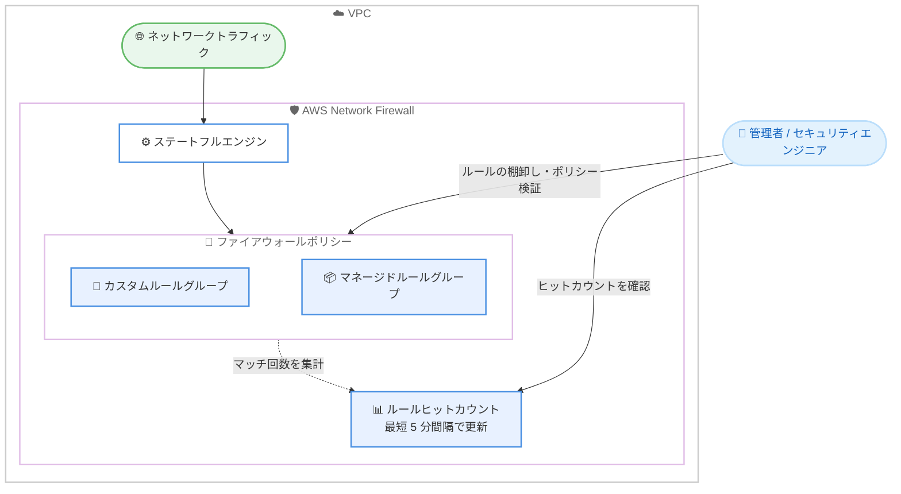

# AWS Network Firewall - ステートフルルールヒットカウントのサポート

**リリース日**: 2026 年 8 月 17 日
**サービス**: AWS Network Firewall
**機能**: Stateful Rule Hit Counts (ステートフルルールヒットカウント)

📊 [このアップデートのインフォグラフィックを見る](https://takech9203.github.io/aws-news-summary/20260817-aws-network-firewall-stateful-rule-hit-counts.html)

## 概要

AWS Network Firewall がステートフルルールのヒットカウント (rule hit counts) を提供するようになりました。これにより、ネットワーク管理者やセキュリティエンジニアは、ファイアウォールポリシー内の各ステートフルルールがネットワークトラフィックにどの程度の頻度でマッチしているかを可視化できます。AWS Network Firewall は、VPC トラフィックの検査と可視性を提供するマネージドネットワークファイアウォールサービスです。

ルールヒットカウントを活用することで、ファイアウォールルールのアクティビティを実用的なインテリジェンスに変換できます。トリガーされたルールを検出することでインシデント対応を加速し、シャドウルール・冗長ルール・陳腐化したルールといったポリシーの盲点を特定し、新しくデプロイしたルールが意図したトラフィックにマッチしているかを確認してポリシー変更を検証できます。

ルールヒットカウントはカスタムルールグループとマネージドルールグループの両方でデフォルトで有効化されており、メトリクスは最短 5 分の設定可能な間隔で更新されます。

**アップデート前の課題**

これまで、各ステートフルルールが実際にトラフィックへマッチしているかを直接確認する手段が限られていました。

- 各ルールがどの程度の頻度でトラフィックにマッチしているかを、ルール単位で直接確認できなかった
- 使われていないルール (シャドウルール、冗長ルール、陳腐化したルール) の特定には、フローログやアラートログの分析など間接的な調査が必要だった
- 新しくデプロイしたルールが意図どおりに機能しているかの検証に手間がかかった

**アップデート後の改善**

- 各ステートフルルールのヒットカウントをルール単位で確認できるようになった
- トリガーされたルールを迅速に検出でき、インシデント対応を加速できるようになった
- シャドウルール・冗長ルール・陳腐化したルールといったポリシーの盲点を特定しやすくなった
- 新規デプロイしたルールが意図したトラフィックにマッチしているかを確認し、ポリシー変更を検証できるようになった

## アーキテクチャ図



ステートフルエンジンがルールグループのルールとトラフィックを照合し、ルールごとのマッチ回数がヒットカウントとして集計されます。管理者はヒットカウントを確認して、インシデント対応やルールの棚卸し、ポリシー変更の検証に活用できます。

## サービスアップデートの詳細

### 主要機能

1. **ステートフルルール単位のヒットカウント**
   - ファイアウォールポリシー内の各ステートフルルールがトラフィックにマッチした頻度を可視化
   - カスタムルールグループとマネージドルールグループの両方に対応
   - デフォルトで有効化されており、追加の有効化作業は不要

2. **設定可能なメトリクス更新間隔**
   - メトリクスは設定可能な間隔で更新される
   - 最短 5 分間隔での更新に対応

3. **ルールアクティビティの実用的なインテリジェンス化**
   - トリガーされたルールの検出によるインシデント対応の加速
   - シャドウルール・冗長ルール・陳腐化したルールなどポリシーの盲点の特定
   - 新規デプロイルールが意図したトラフィックにマッチしているかの検証

## 技術仕様

### 機能仕様

| 項目 | 詳細 |
|------|------|
| 対象ルール | ステートフルルール (カスタムルールグループおよびマネージドルールグループ) |
| 有効化 | デフォルトで有効 |
| メトリクス更新間隔 | 設定可能 (最短 5 分) |
| 追加料金 | なし (ログデータの保存とクエリには標準料金が適用) |
| 利用可能リージョン | AWS Network Firewall がサポートされる全リージョン (中東 (UAE) と中東 (バーレーン) を除く) |

### 関連する監視機能

AWS Network Firewall のコンソールでは、ファイアウォール詳細ページの [Monitoring] タブから監視機能にアクセスできます。既存の監視機能には以下が含まれます。

| 監視機能 | 説明 | デフォルト有効 |
|------|------|------|
| Firewall requests | ステートレス / ステートフルエンジンで通過・ドロップ・拒否されたパケット数のグラフ | 有効 |
| Firewall monitoring dashboard | フローログとアラートログのリアルタイム分析 (S3 / CloudWatch ログが必要) | 無効 (詳細設定で有効化) |
| Traffic analysis mode and reports | 過去 30 日間の HTTP / HTTPS トラフィックの遡及分析とレポート生成 | 無効 (詳細設定で有効化) |

## 設定方法

### 前提条件

1. AWS Network Firewall のファイアウォールが作成済みであること
2. ファイアウォールポリシーにステートフルルールグループ (カスタムまたはマネージド) が関連付けられていること
3. コンソールで監視機能にアクセスするための IAM 権限があること

### 手順

#### ステップ 1: Network Firewall コンソールを開く

Amazon VPC コンソール (https://console.aws.amazon.com/vpc/) を開き、ナビゲーションペインの [Network Firewall] から [Firewalls] を選択します。

#### ステップ 2: ファイアウォールの監視情報を確認する

対象のファイアウォール名を選択して詳細ページへ移動し、[Monitoring] タブを選択します。ルールヒットカウントはデフォルトで有効化されているため、ステートフルルールのマッチ状況を確認できます。

#### ステップ 3: メトリクス更新間隔を調整する

必要に応じて、メトリクスの更新間隔を設定します。最短 5 分間隔まで短縮でき、より頻繁にヒットカウントを更新できます。

## メリット

### ビジネス面

- **インシデント対応の迅速化**: トリガーされたルールを即座に特定できるため、セキュリティインシデントの調査と対応にかかる時間を短縮できる
- **運用コストの削減**: 使われていないルールの特定と削除により、ポリシー管理の負荷を軽減できる
- **追加コストなし**: AWS Network Firewall の一部として追加料金なしで利用できる

### 技術面

- **ポリシーの盲点の可視化**: シャドウルール・冗長ルール・陳腐化したルールをヒットカウントに基づいて特定できる
- **ポリシー変更の検証**: 新規デプロイしたルールが意図したトラフィックにマッチしているかをデータで確認できる
- **デフォルト有効**: カスタム・マネージド両方のルールグループで自動的に有効化されるため、設定作業が不要

## デメリット・制約事項

### 制限事項

- 中東 (UAE) リージョンと中東 (バーレーン) リージョンでは利用できない
- ヒットカウントの対象はステートフルルールであり、ステートレスルールは対象として言及されていない
- メトリクスの更新間隔は最短 5 分であり、リアルタイムの反映ではない

### 考慮すべき点

- ログデータの保存とクエリには標準料金が適用されるため、ログ出力量に応じたコストを考慮する必要がある
- ヒットカウントはルールの利用状況を示す指標であり、ルール削除の判断には対象期間や季節性のあるトラフィックパターンも考慮することが望ましい

## ユースケース

### ユースケース 1: インシデント対応の加速

**シナリオ**: セキュリティインシデント発生時に、どのファイアウォールルールがトリガーされたかを迅速に特定したい。

**実装例**:
```text
1. Network Firewall コンソールで対象ファイアウォールを開く
2. ステートフルルールのヒットカウントを確認する
3. インシデント発生時間帯にヒットが増加したルールを特定する
4. 該当ルールに対応するアラートログ・フローログを詳細調査する
```

**効果**: トリガーされたルールの特定が容易になり、初動調査の時間を短縮できる。

### ユースケース 2: ルールの棚卸しとポリシー最適化

**シナリオ**: 長期運用しているファイアウォールポリシーに、使われていないルールや冗長なルールが蓄積している。

**実装例**:
```text
1. 一定期間のルールヒットカウントを確認する
2. ヒットカウントがゼロまたは極端に少ないルールを抽出する
3. シャドウルール (先行ルールに隠れてマッチしないルール) や
   陳腐化したルールを特定する
4. 不要と判断したルールを削除し、ポリシーをスリム化する
```

**効果**: ポリシーの盲点を解消し、ルールセットの保守性と可読性を向上できる。

### ユースケース 3: ポリシー変更の検証

**シナリオ**: 新しいステートフルルールをデプロイした後、意図したトラフィックに正しくマッチしているかを確認したい。

**実装例**:
```text
1. 新しいルールをファイアウォールポリシーにデプロイする
2. メトリクス更新間隔を最短の 5 分に設定して確認頻度を上げる
3. デプロイ後のヒットカウントを監視し、想定どおりに
   カウントが増加しているかを確認する
4. ヒットしない場合はルール定義や評価順序を見直す
```

**効果**: ポリシー変更の効果をデータで検証でき、設定ミスの早期発見につながる。

## 料金

ルールヒットカウント機能は、AWS Network Firewall の一部として追加料金なしで利用できます。ただし、ログデータの保存とクエリには標準料金が適用されます。

AWS Network Firewall 自体の料金 (エンドポイント時間課金およびトラフィック処理量課金) は従来どおり適用されます。詳細は [AWS Network Firewall の料金ページ](https://aws.amazon.com/network-firewall/pricing/) を参照してください。

## 利用可能リージョン

AWS Network Firewall がサポートされているすべての AWS リージョンで利用可能です。ただし、中東 (UAE) リージョンと中東 (バーレーン) リージョンは除きます。

## 関連サービス・機能

- **Amazon VPC**: Network Firewall は VPC トラフィックの検査と可視性を提供するサービスであり、VPC 内のトラフィックがルール評価の対象となる
- **Amazon CloudWatch**: ファイアウォールのメトリクスやログの送信先として利用でき、監視ダッシュボードのデータソースとなる
- **Amazon S3 / Amazon Athena**: フローログ・アラートログの保存先および分析基盤として、ファイアウォール監視ダッシュボードで利用される

## 参考リンク

- 📊 [インフォグラフィック](https://takech9203.github.io/aws-news-summary/20260817-aws-network-firewall-stateful-rule-hit-counts.html)
- [公式発表 (What's New)](https://aws.amazon.com/about-aws/whats-new/2026/08/aws-network-firewall-stateful-rule-hit-counts/)
- [AWS Network Firewall 製品ページ](https://aws.amazon.com/network-firewall/)
- [AWS Network Firewall ドキュメント](https://docs.aws.amazon.com/network-firewall/latest/developerguide/what-is-aws-network-firewall.html)
- [Monitoring and reporting in Network Firewall](https://docs.aws.amazon.com/network-firewall/latest/developerguide/nwfw-monitoring-reporting.html)
- [料金ページ](https://aws.amazon.com/network-firewall/pricing/)

## まとめ

AWS Network Firewall のステートフルルールヒットカウントにより、各ルールのマッチ状況をデータとして把握できるようになり、インシデント対応の加速、ポリシーの盲点の特定、ポリシー変更の検証が容易になりました。デフォルトで有効化され追加料金も不要なため、Network Firewall を利用中のすべてのユーザーは、まずコンソールでヒットカウントを確認し、ルールの棚卸しとポリシー最適化に着手することを推奨します。
