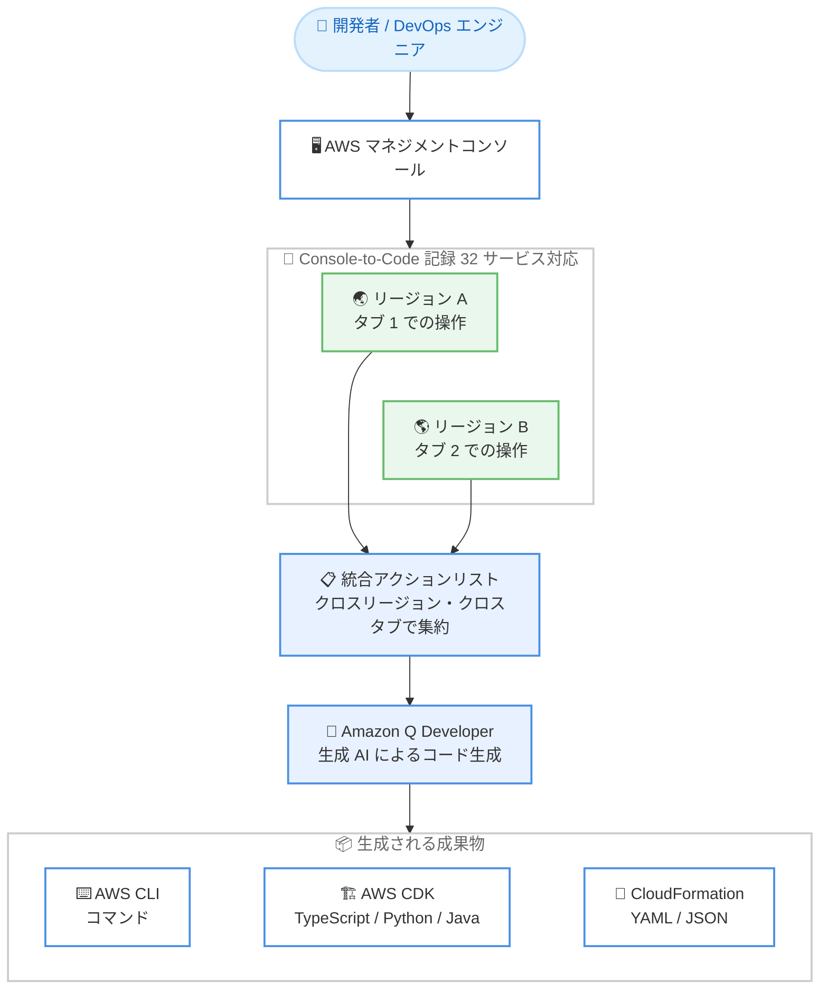

# AWS Console-to-Code - 26 サービス追加とクロスリージョン記録のサポート

**リリース日**: 2026 年 8 月 17 日
**サービス**: Amazon Q Developer (AWS Console-to-Code)
**機能**: 対応サービスの 26 サービス追加 (合計 32 サービス) およびクロスリージョン・クロスブラウザタブでのアクション記録

📊 [このアップデートのインフォグラフィックを見る](https://takech9203.github.io/aws-news-summary/20260817-console-to-code-adds-26-services.html)

## 概要

AWS Console-to-Code が新たに 26 の AWS サービスをサポートし、対応サービス数が従来の 6 サービスから 32 サービスに拡大しました。Console-to-Code は Amazon Q Developer の機能の 1 つで、AWS マネジメントコンソール上の操作を記録し、生成 AI を使用して同等の AWS CLI コマンドや Infrastructure as Code (IaC) を生成します。開発者、DevOps エンジニア、クラウドアーキテクトは、手作業によるコンソールワークフローを再利用可能で本番環境に対応した IaC へ、より簡単に変換できるようになります。

さらに、クロスリージョンおよびクロスブラウザタブでのアクション記録が導入されました。従来はリージョンを切り替えたり、複数のブラウザタブをまたいで作業したりすると、記録されたアクションリストがリセットまたは分断されていました。今回のアップデートにより、アクションは単一の統合されたリストに集約され、コンテキストを失うことなく複数リージョンにまたがる複雑なインフラストラクチャデプロイを記録・自動化できます。

**アップデート前の課題**

- 対応サービスが 6 サービスに限られており、S3、Lambda、EKS、ECS などの主要サービスの操作はコード生成の対象外だった
- リージョンを切り替えると記録済みのアクションリストがリセットされ、マルチリージョン構成の記録ができなかった
- 複数のブラウザタブをまたいで作業すると、記録が分断され、一連のワークフローとしてコード化できなかった

**アップデート後の改善**

- 対応サービスが 32 サービスに拡大し、コンピューティング、ストレージ、コンテナ、サーバーレス、セキュリティ、生成 AI など幅広いサービスの操作をコードに変換できるようになった
- リージョンをまたぐ操作が単一の統合アクションリストに記録され、マルチリージョンデプロイの IaC 化が可能になった
- 複数のブラウザタブでの操作も 1 つの記録として集約され、複雑なワークフローをコンテキストを失わずに自動化できるようになった

## アーキテクチャ図



複数リージョン・複数ブラウザタブでのコンソール操作が単一の統合アクションリストに記録され、生成 AI により AWS CLI コマンドや CDK / CloudFormation コードに変換される流れを示しています。

## サービスアップデートの詳細

### 主要機能

1. **対応サービスの拡大 (6 サービスから 32 サービスへ)**
   - 新たに 26 サービスが追加され、合計 32 サービスのコンソール操作を記録してコード生成が可能になった
   - ドキュメントに記載されている対応サービスは以下のとおり: Amazon EC2、Amazon VPC、Amazon DynamoDB、Amazon Cognito、AWS IoT、Amazon RDS、Amazon CloudWatch、AWS Batch、Amazon SQS、AWS CloudFormation、EC2 Image Builder、AWS Systems Manager、Amazon Athena、Amazon EventBridge、Amazon ECR、Amazon SNS、AWS Secrets Manager、Amazon ElastiCache、AWS Step Functions、Amazon EKS、AWS Lambda、Amazon ECS、Amazon API Gateway、Amazon S3、Amazon CloudFront、AWS WAF、AWS Shield、AWS Firewall Manager、Amazon Bedrock、AWS CodeCommit、AWS CodeDeploy、AWS CodeBuild
   - 複数サービスにまたがる操作 (例: VPC、EC2、RDS を組み合わせた Web サーバー構築) も 1 つの記録として扱われる

2. **クロスリージョン記録**
   - 従来はリージョンを切り替えると記録済みアクションリストがリセットされていた
   - 今回のアップデートにより、リージョンをまたぐ操作が単一の統合リストに集約される
   - マルチリージョンのインフラストラクチャデプロイをコンテキストを失わずに記録・自動化できる

3. **クロスブラウザタブ記録**
   - 従来は複数のブラウザタブをまたいで作業すると記録が分断されていた
   - 複数タブでの操作も統合アクションリストに集約されるようになった
   - 複雑なワークフローを並行して進めながら、一連の操作として記録できる

## 技術仕様

### 生成可能なコード形式

| 種別 | 形式 |
|------|------|
| AWS CLI | CLI コマンド (コピーまたは AWS CloudShell で直接実行可能) |
| AWS CDK | TypeScript、Python、Java |
| AWS CloudFormation | YAML、JSON |

### 利用手順の概要

| ステップ | 内容 |
|----------|------|
| 1. 記録開始 | 対応サービスのコンソールで Console-to-Code アイコンを選択し、[Start recording] を選択 |
| 2. 操作実行 | 対応サービスのコンソールで記録したい操作を実行 (リージョン・タブをまたいでも記録が継続) |
| 3. コード生成 | 記録されたアクションを確認・選択し、CLI コマンドの取得または希望言語でのコード生成を実行 |

### 必要な権限

Console-to-Code の利用には以下の IAM 権限が必要です。

```json
{
  "Version": "2012-10-17",
  "Statement": [
    {
      "Effect": "Allow",
      "Action": "q:GenerateCodeFromCommands",
      "Resource": "*"
    }
  ]
}
```

上記に加えて、記録対象の操作そのものを実行するための権限 (例: EC2 インスタンスの起動権限) が必要です。

## 設定方法

### 前提条件

1. AWS マネジメントコンソールにサインインできること
2. IAM 権限 `q:GenerateCodeFromCommands` が付与されていること
3. 記録する操作を実行するための各サービスの権限が付与されていること

### 手順

#### ステップ 1: 記録の開始

対応サービス (例: Amazon EC2、Amazon VPC、Amazon RDS) のコンソールを開き、Console-to-Code アイコンを選択します。サイドパネルが開いたら [Start recording] を選択します。

#### ステップ 2: コンソール操作の実行

記録したい操作をコンソール上で実行します。今回のアップデートにより、リージョンを切り替えたり、別のブラウザタブで操作したりしても、アクションは単一の統合リストに記録されます。操作が完了したら、Console-to-Code パネル上部の [Stop] を選択します。

#### ステップ 3: CLI コマンドの取得またはコード生成

記録されたアクションを確認し、コードに変換したいアクションを選択します。

- **CLI コマンドの場合**: コピーボタンでコマンドをコピーするか、CloudShell アイコンを選択して AWS CloudShell 上で直接実行できます
- **IaC コードの場合**: 言語メニューから CDK (TypeScript / Python / Java) または CloudFormation (YAML / JSON) を選択し、[Generate chosen language] を選択します

生成されたコードは、同等の CLI コマンドとともに表示されます。

## メリット

### ビジネス面

- **IaC 導入の加速**: コンソールで試行した構成をそのままコード化できるため、手動運用から IaC ベースの運用への移行を短期間で実現できる
- **学習コストの削減**: CDK や CloudFormation の記述に習熟していないメンバーでも、コンソール操作から本番品質のコードのたたき台を得られる
- **追加コストなし**: 記録機能自体に追加料金はなく、Free ティアでも CLI コマンド生成は回数無制限で利用できる

### 技術面

- **マルチリージョン構成の自動化**: DR 構成やグローバル展開など、複数リージョンにまたがるデプロイを 1 つの記録から IaC 化できる
- **幅広いサービスカバレッジ**: S3、Lambda、EKS、ECS、API Gateway、Bedrock など主要 32 サービスに対応し、実践的なアーキテクチャ全体を記録できる
- **再現性の向上**: 手動操作を CLI / CDK / CloudFormation に変換することで、環境の再現やレビュー可能な変更管理が可能になる

## デメリット・制約事項

### 制限事項

- 対応サービスは 32 サービスに限られ、対象外のサービスの操作は記録されない
- 記録のセッションはブラウザタブを閉じるか、AWS マネジメントコンソールのセッションが終了した時点で終了する
- Free ティアでは、CDK / CloudFormation コードの生成回数に月間上限がある (CLI コマンド生成は無制限)。上限到達後は Amazon Q Developer Pro への認証が必要

### 考慮すべき点

- 記録中に実行した操作は実際に AWS リソースを作成・変更するため、操作対象リソースの利用料金は通常どおり発生する (記録自体に追加料金はない)
- 生成されたコードは生成 AI による提案であるため、本番利用前に内容のレビューとテストを行うことが推奨される
- Pro ティアの利用には IAM Identity Center への登録と Amazon Q Developer Pro のサブスクリプションが必要

## ユースケース

### ユースケース 1: マルチリージョン DR 構成の IaC 化

**シナリオ**: 東京リージョンの本番環境と大阪リージョンの DR 環境を構築する際、両リージョンでのコンソール操作を 1 つの記録として IaC 化したい。

**実装例**:
```
1. 東京リージョンで VPC、EC2、RDS を作成 (記録中)
2. コンソール右上のリージョンセレクタで大阪リージョンに切り替え (記録は継続)
3. 大阪リージョンで DR 用のリソースを作成
4. 記録を停止し、CloudFormation YAML を生成
```

**効果**: 従来はリージョン切り替えで記録がリセットされていたが、単一の統合リストから両リージョンの構成をまとめてテンプレート化できる。

### ユースケース 2: サーバーレスアプリケーション構成の CDK 化

**シナリオ**: プロトタイピングとしてコンソールで構築した API Gateway、Lambda、DynamoDB、SQS の構成を、チームの標準である CDK TypeScript に変換して本番展開したい。

**実装例**:
```
1. Console-to-Code の記録を開始
2. API Gateway で REST API を作成
3. Lambda 関数を作成し API と統合
4. DynamoDB テーブルと SQS キューを作成
5. 記録を停止し、CDK TypeScript を生成してリポジトリに取り込む
```

**効果**: 今回のアップデートで API Gateway、Lambda、DynamoDB、SQS がすべて対応対象となったため、サーバーレス構成全体を一度の記録でコード化できる。

### ユースケース 3: 運用手順の CLI スクリプト化

**シナリオ**: 定期的に実施している ECR リポジトリ作成や Systems Manager のパラメータ設定などの運用作業を、CLI スクリプトとして標準化したい。

**実装例**:
```
1. Console-to-Code の記録を開始
2. 対象の運用操作をコンソールで一度実行
3. 記録されたアクションから CLI コマンドをコピー
4. CloudShell アイコンから AWS CloudShell で動作確認し、スクリプト化
```

**効果**: 手順書ベースの手動運用を CLI スクリプトに置き換え、作業の属人化とオペレーションミスを削減できる。

## 料金

Console-to-Code は Amazon Q Developer の一機能であり、Amazon Q Developer のサービスティアに従います。

| ティア | 内容 |
|--------|------|
| Free ティア | コンソール操作の記録と CLI コマンド生成は回数無制限。CDK / CloudFormation コードの生成には月間上限あり |
| Pro ティア | CDK / CloudFormation コードの生成も回数無制限。IAM Identity Center 経由で Amazon Q Developer Pro のサブスクリプションが必要 |

なお、記録中に実行した操作によって作成される AWS リソース (例: EC2 インスタンス) の料金は通常どおり発生します。記録機能自体に追加料金はありません。詳細は [Amazon Q Developer 料金ページ](https://aws.amazon.com/q/developer/pricing/) を参照してください。

## 利用可能リージョン

すべての AWS 商用リージョンで、32 の対応サービスと新しいクロスリージョン記録機能を利用できます。

## 関連サービス・機能

- **Amazon Q Developer**: Console-to-Code の基盤となる生成 AI アシスタント。コード生成やティア管理は Amazon Q Developer の仕組みに基づく
- **AWS CloudShell**: 生成された CLI コマンドをワンクリックで CloudShell に転送し、ブラウザ上で直接実行できる
- **AWS CDK / AWS CloudFormation**: Console-to-Code が生成する IaC の出力先。CDK は TypeScript、Python、Java、CloudFormation は YAML と JSON に対応

## 参考リンク

- 📊 [インフォグラフィック](https://takech9203.github.io/aws-news-summary/20260817-console-to-code-adds-26-services.html)
- [公式発表 (What's New)](https://aws.amazon.com/about-aws/whats-new/2026/08/console-to-code-adds-26-services)
- [ドキュメント (Amazon Q Developer Console-to-Code)](https://docs.aws.amazon.com/amazonq/latest/qdeveloper-ug/console-to-code.html)
- [料金ページ (Amazon Q Developer)](https://aws.amazon.com/q/developer/pricing/)

## まとめ

AWS Console-to-Code の対応サービスが 6 から 32 に大幅拡大し、クロスリージョン・クロスブラウザタブでの記録に対応したことで、実践的なマルチサービス・マルチリージョン構成をそのまま IaC 化できるようになりました。コンソールでの試行錯誤を CDK や CloudFormation のコードに変換する導線が大きく強化されたため、IaC 移行を検討しているチームは、まず Free ティアで対応サービスの記録とコード生成を試すことを推奨します。
