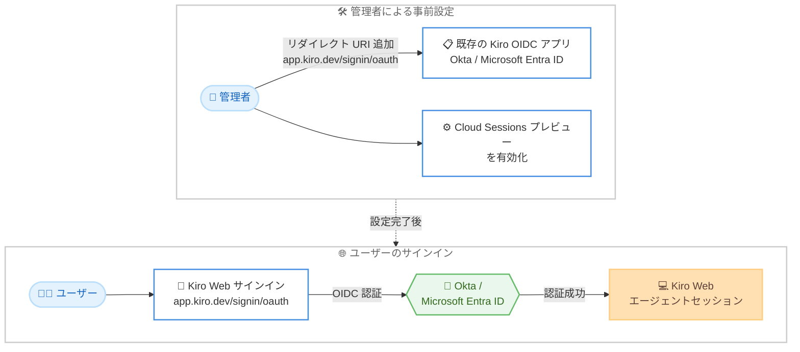

# Kiro - Okta / Microsoft Entra ID による Kiro Web へのアクセス

**リリース日**: 2026 年 8 月 17 日
**サービス**: Kiro (AWS が提供する AI 搭載 IDE)
**機能**: Okta / Microsoft Entra ID インテグレーションによる Kiro Web へのサインイン

📊 [このアップデートのインフォグラフィックを見る](https://takech9203.github.io/aws-news-summary/20260817-kiro-changelog-2026-08-17.html)

## 概要

2026 年 8 月 17 日、Kiro は組織が既に利用している **Okta または Microsoft Entra ID のインテグレーションを通じて Kiro Web にアクセスできる機能**を発表しました。管理者が一度アクセスを設定すれば、以降ユーザーはサインインするだけで Kiro Web を利用できます。本機能は Kiro Pro 以上のサブスクリプションで利用可能です。

設定はシンプルで、既存の Kiro 用 OpenID Connect (OIDC) アプリケーションにリダイレクト URI として `https://app.kiro.dev/signin/oauth` を追加し、Cloud Sessions (プレビュー) を有効化するだけです。Okta では Sign-in redirect URI として追加し、Microsoft Entra ID では Single-page application の下に (Mobile and desktop application のリダイレクトとは別に) 追加します。Cloud Sessions と API キー生成は独立して有効化できるため、組織のポリシーに応じた段階的な展開が可能です。

Kiro Web はブラウザから Kiro のエージェントセッションを利用できるアプリケーションであり、今回のアップデートにより、IDE や CLI と同様にエンタープライズの ID 基盤と統合された形でチーム全体に展開できるようになりました。エンタープライズの IT 管理者と、ブラウザベースで Kiro を利用したい開発チームが主な対象です。

**アップデート前の課題**

- 組織で Okta や Microsoft Entra ID を利用していても、Kiro Web へのアクセスにそのままの ID 基盤を利用できなかった
- チームで Kiro Web を展開する際に、既存のシングルサインオン (SSO) の運用フローに組み込むことが難しかった
- エンタープライズの ID ガバナンス (アカウントの一元管理、退職時のアクセス無効化など) を Kiro Web に適用しにくかった

**アップデート後の改善**

- 既存の Okta / Microsoft Entra ID インテグレーションを通じて Kiro Web にサインインできるようになった
- 管理者が一度アクセスを設定すれば、ユーザーはサインインするだけで利用を開始できるようになった
- 既存の Kiro 用 OIDC アプリケーションにリダイレクト URI を 1 つ追加するだけで設定が完了するようになった
- Cloud Sessions と API キー生成を独立して有効化でき、組織のポリシーに応じた制御が可能になった

## アーキテクチャ図



管理者が既存の Kiro 用 OIDC アプリケーションにリダイレクト URI を追加して Cloud Sessions を有効化すると、以降ユーザーは組織の ID プロバイダー経由でサインインするだけで Kiro Web を利用できます。

## サービスアップデートの詳細

### 主要機能

1. **Okta / Microsoft Entra ID 経由の Kiro Web サインイン**
   - 組織が既に利用している Okta または Microsoft Entra ID インテグレーションを通じて Kiro Web にアクセスできる
   - 管理者がアクセスを設定した後は、ユーザーはサインインするだけで利用を開始できる
   - Kiro Pro 以上のサブスクリプションで利用可能

2. **既存 OIDC アプリケーションへの追加のみで設定完了**
   - 既存の Kiro 用 OpenID Connect (OIDC) アプリケーションに `https://app.kiro.dev/signin/oauth` を追加する
   - Okta の場合: Sign-in redirect URI として追加
   - Microsoft Entra ID の場合: Single-page application の下に追加 (Mobile and desktop application のリダイレクトとは別枠)

3. **Cloud Sessions と API キー生成の独立した制御**
   - Kiro Web の利用には Cloud Sessions (プレビュー) の有効化が必要
   - Cloud Sessions と API キー生成は独立して有効化できるため、組織のポリシーに応じて必要な機能だけを開放できる

## 技術仕様

### 設定項目

| 項目 | 詳細 |
|------|------|
| 対象アプリケーション | Kiro Web |
| 対応 ID プロバイダー | Okta、Microsoft Entra ID |
| 認証プロトコル | OpenID Connect (OIDC) |
| 追加するリダイレクト URI | `https://app.kiro.dev/signin/oauth` |
| Okta での追加先 | Sign-in redirect URI |
| Microsoft Entra ID での追加先 | Single-page application (Mobile and desktop application とは別) |
| 必要な有効化設定 | Cloud Sessions (プレビュー) |
| 必要なサブスクリプション | Kiro Pro 以上 |

## 設定方法

### 前提条件

1. Kiro Pro 以上のサブスクリプションを契約していること
2. Okta または Microsoft Entra ID で Kiro 用の OpenID Connect (OIDC) アプリケーションを構成済みであること
3. ID プロバイダーの管理者権限を持っていること

### 手順

#### ステップ 1: 既存の Kiro OIDC アプリケーションにリダイレクト URI を追加する

```text
追加する URI: https://app.kiro.dev/signin/oauth
```

既存の Kiro 用 OIDC アプリケーションに上記の URI を追加します。Okta の場合は Sign-in redirect URI として追加します。Microsoft Entra ID の場合は Single-page application の下に追加します (Mobile and desktop application のリダイレクトとは別に設定します)。

#### ステップ 2: Cloud Sessions を有効化する

Kiro の管理設定で Cloud Sessions (プレビュー) を有効化します。Cloud Sessions と API キー生成は独立して有効化できるため、組織のポリシーに合わせて必要な機能のみを開放できます。

#### ステップ 3: ユーザーがサインインする

ユーザーは Kiro Web のサインインページから組織の Okta または Microsoft Entra ID の認証情報でサインインします。管理者による追加の操作は不要です。

## メリット

### ビジネス面

- **既存 ID 基盤の再利用**: 組織が既に運用している Okta / Microsoft Entra ID をそのまま利用でき、新たな認証基盤の構築やアカウントの二重管理が不要
- **展開コストの削減**: 管理者が一度設定すればユーザーはサインインするだけで利用開始でき、チームへの展開が容易
- **ガバナンスの一元化**: 入退社時のアカウント管理やアクセス制御を、既存の ID プロバイダー側のポリシーで一元的に運用できる

### 技術面

- **最小限の設定変更**: 既存の Kiro 用 OIDC アプリケーションへのリダイレクト URI 追加のみで対応でき、新規アプリケーション登録が不要
- **標準プロトコルの利用**: OpenID Connect という標準プロトコルに基づくため、IdP 側の監査ログや条件付きアクセスなどの既存機能と組み合わせられる
- **機能単位の制御**: Cloud Sessions と API キー生成を独立して有効化でき、組織のセキュリティ要件に応じた段階的な開放が可能

## デメリット・制約事項

### 制限事項

- Kiro Pro 以上のサブスクリプションが必要 (Free プランでは利用できない)
- 対応する ID プロバイダーとして案内されているのは Okta と Microsoft Entra ID
- Kiro Web の利用には Cloud Sessions (プレビュー) の有効化が必要

### 考慮すべき点

- Cloud Sessions は現在プレビュー段階のため、本番運用ポリシーに照らして有効化の可否を検討する必要がある
- Microsoft Entra ID ではリダイレクト URI を Single-page application の下に追加する必要があり、既存の Mobile and desktop application のリダイレクト設定と混同しないよう注意が必要
- 2026 年 8 月 14 日リリース以降、Cloud Sessions はオプトイン方式となっており、組織で明示的に有効化しない限り無効のままである点に留意する

## ユースケース

### ユースケース 1: エンタープライズでの Kiro Web の全社展開

**シナリオ**: 既に Okta で Kiro IDE / CLI 向けの OIDC アプリケーションを運用している企業が、ブラウザから使える Kiro Web を開発部門全体に展開したい。

**実装例**:
```text
1. Okta の既存 Kiro OIDC アプリに Sign-in redirect URI として
   https://app.kiro.dev/signin/oauth を追加
2. Cloud Sessions (プレビュー) を有効化
3. 開発者に Kiro Web のサインイン URL を案内
```

**効果**: 新規アカウントの発行や配布なしに、既存の SSO フローで全開発者が Kiro Web を利用開始できる。

### ユースケース 2: Microsoft Entra ID 環境での段階的な機能開放

**シナリオ**: Microsoft 365 を中心とした IT 環境の企業が、セキュリティポリシーに従い Kiro Web の Cloud Sessions のみを先行して開放し、API キー生成は当面無効にしたい。

**実装例**:
```text
1. Microsoft Entra ID の Kiro OIDC アプリで Single-page application に
   https://app.kiro.dev/signin/oauth を追加
2. Cloud Sessions (プレビュー) のみを有効化
3. API キー生成は無効のまま運用し、必要になった時点で個別に有効化
```

**効果**: Cloud Sessions と API キー生成を独立して制御できるため、組織のセキュリティ要件を満たしながら段階的に機能を開放できる。

### ユースケース 3: 退職者アクセス管理の一元化

**シナリオ**: 開発者の入退社が頻繁な組織で、Kiro Web へのアクセス権を人事イベントと連動して自動的に管理したい。

**実装例**:
```text
1. Okta / Microsoft Entra ID のグループで Kiro OIDC アプリへの
   割り当てを管理
2. 退職時は IdP 側でアカウントを無効化
3. Kiro Web へのサインインは IdP 認証を経由するため自動的に遮断
```

**効果**: Kiro 側での個別のアカウント操作なしに、既存の ID ライフサイクル管理だけでアクセス制御が完結する。

## 料金

本機能は Kiro Pro 以上のサブスクリプションで利用できます。機能自体への追加料金はありません。サブスクリプションの詳細は [Kiro の料金ページ](https://kiro.dev/pricing/) を参照してください。

## 利用可能リージョン

Kiro はグローバルに提供されており、リージョンの制約はありません。

## 関連サービス・機能

- **Kiro Web**: ブラウザから Kiro のエージェントセッションを利用できるアプリケーション。今回、Okta / Microsoft Entra ID 経由のサインインに対応した
- **Kiro Cloud Sessions**: マネージドクラウド環境でエージェントセッションを実行する機能 (プレビュー)。Kiro Web の利用に有効化が必要で、2026 年 8 月 14 日以降はオプトイン方式
- **Okta / Microsoft Entra ID**: 組織の ID プロバイダー。既存の Kiro 用 OIDC アプリケーションにリダイレクト URI を追加することで Kiro Web と統合できる
- **OpenID Connect (OIDC)**: 本統合で利用される標準認証プロトコル。IdP 側の条件付きアクセスや監査ログと組み合わせた運用が可能

## 参考リンク

- 📊 [インフォグラフィック](https://takech9203.github.io/aws-news-summary/20260817-kiro-changelog-2026-08-17.html)
- [Kiro Changelog](https://kiro.dev/changelog/)
- [Kiro Web サインイン](https://app.kiro.dev/signin/oauth)
- [Cloud Sessions ドキュメント](https://kiro.dev/docs/cloud-sessions/)
- [Kiro 料金ページ](https://kiro.dev/pricing/)

## まとめ

今回のアップデートにより、組織は既存の Okta / Microsoft Entra ID インテグレーションをそのまま使って Kiro Web をチームに展開できるようになりました。設定は既存の OIDC アプリケーションへのリダイレクト URI 追加と Cloud Sessions の有効化のみで完了し、Cloud Sessions と API キー生成を独立して制御できる点もエンタープライズ運用に適しています。Kiro Pro 以上を契約し Okta / Microsoft Entra ID を運用している組織は、まず既存の Kiro OIDC アプリケーションに `https://app.kiro.dev/signin/oauth` を追加して試験導入することを推奨します。
