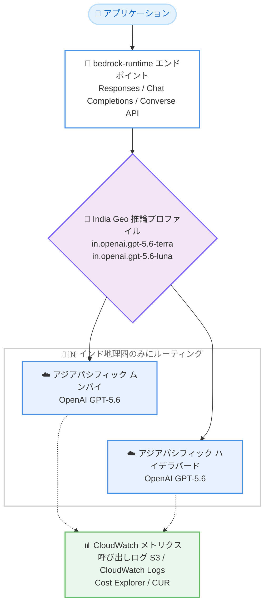

# Amazon Bedrock - OpenAI モデルのインド国内サポート (India Geo クロスリージョン推論)

**リリース日**: 2026 年 8 月 18 日
**サービス**: Amazon Bedrock
**機能**: OpenAI GPT-5.6 モデル (Terra / Luna) のインド国内提供と India Geo クロスリージョン推論

📊 [このアップデートのインフォグラフィックを見る](https://takech9203.github.io/aws-news-summary/20260818-amazon-bedrock-openai-india-v1.html)

## 概要

Amazon Bedrock が、OpenAI の GPT-5.6 モデル (Terra および Luna) をインドで利用可能にしました。あわせて、インド地域内でのみ推論リクエストをルーティングする「India Geo クロスリージョン推論」が提供されます。これにより、国内での推論処理 (in-country inferencing) が規制上求められるお客様も、データをインド国内で処理しながら OpenAI モデルを大規模に利用できます。

クロスリージョン推論は、推論リクエストを複数の AWS リージョンに自動的にルーティングすることで、ユーザーがリージョンごとのキャパシティを管理することなく高いスループットを実現する仕組みです。今回追加された India Geo 推論プロファイル (`in.openai.gpt-5.6-terra` および `in.openai.gpt-5.6-luna`) は、リクエストをアジアパシフィック (ムンバイ) やアジアパシフィック (ハイデラバード) といったインド地理圏内のリージョンのみにルーティングします。需要に応じてスケールしながら、データレジデンシー要件を満たすことができます。

モデルは `bedrock-runtime` エンドポイントで動作し、Responses API、Chat Completions API、Converse API をサポートします。また、モデル呼び出しログ (Amazon S3 または Amazon CloudWatch Logs への配信)、Amazon CloudWatch メトリクス、AWS Cost Explorer および AWS Cost and Usage Report でのコスト明細化など、Bedrock 上の他のモデルと同じアカウントレベルの管理機能がそのまま利用できます。

**アップデート前の課題**

- インド国内での推論処理が規制上求められる組織は、インド国外のリージョンで提供される OpenAI モデルを利用できなかった
- データレジデンシー要件を満たしつつ高いスループットを確保するには、リージョンごとのキャパシティ管理を自前で行う必要があった
- 生成 AI の利用にあたり、規制対応とスケーラビリティの両立が困難だった

**アップデート後の改善**

- OpenAI GPT-5.6 モデル (Terra / Luna) をインド国内リージョンで直接利用できるようになった
- India Geo 推論プロファイルにより、推論リクエストがインド地理圏内 (ムンバイ / ハイデラバード) のみにルーティングされ、データレジデンシー要件を満たしながらスケールできるようになった
- 既存の Bedrock の管理機能 (呼び出しログ、メトリクス、コスト明細) をそのまま適用できるため、追加のガバナンス整備が不要になった

## アーキテクチャ図



India Geo 推論プロファイルが推論リクエストをインド地理圏内の 2 リージョンのみに自動ルーティングし、データレジデンシーを維持したままスループットをスケールさせる構成です。

## サービスアップデートの詳細

### 主要機能

1. **OpenAI GPT-5.6 モデル (Terra / Luna) のインド提供**
   - OpenAI の GPT-5.6 モデル 2 種 (Terra、Luna) が Amazon Bedrock 経由でインドのリージョンから利用可能
   - アジアパシフィック (ムンバイ) およびアジアパシフィック (ハイデラバード) リージョンで提供
   - モデルカードで各モデルの詳細を確認可能

2. **India Geo クロスリージョン推論プロファイル**
   - `in.openai.gpt-5.6-terra` (Terra 用) と `in.openai.gpt-5.6-luna` (Luna 用) の 2 つの推論プロファイルを提供
   - 推論リクエストをインド地理圏内のリージョンのみにルーティングし、国外にデータが出ない構成を実現
   - 複数リージョンへの自動ルーティングにより、キャパシティ管理なしで高スループットを確保

3. **既存 API とガバナンス機能との統合**
   - `bedrock-runtime` エンドポイント上で Responses、Chat Completions、Converse の各 API をサポート
   - モデル呼び出しログを Amazon S3 または Amazon CloudWatch Logs に配信可能
   - Amazon CloudWatch メトリクスによる監視、AWS Cost Explorer と AWS Cost and Usage Report によるコスト明細化に対応

## 技術仕様

### 提供内容

| 項目 | 詳細 |
|------|------|
| 対象モデル | OpenAI GPT-5.6 Terra、GPT-5.6 Luna |
| 推論プロファイル ID | `in.openai.gpt-5.6-terra`、`in.openai.gpt-5.6-luna` |
| ルーティング範囲 | インド地理圏内のみ (アジアパシフィック ムンバイ、アジアパシフィック ハイデラバード など) |
| エンドポイント | `bedrock-runtime` |
| 対応 API | Responses API、Chat Completions API、Converse API |
| ログ | モデル呼び出しログ (Amazon S3 / Amazon CloudWatch Logs) |
| 監視 | Amazon CloudWatch メトリクス |
| コスト管理 | AWS Cost Explorer、AWS Cost and Usage Report でのコスト明細化 |

## 設定方法

### 前提条件

1. AWS アカウントを保有し、アジアパシフィック (ムンバイ) またはアジアパシフィック (ハイデラバード) リージョンで Amazon Bedrock を利用できること
2. Amazon Bedrock コンソールで対象の OpenAI モデルへのアクセスが有効化されていること
3. `bedrock-runtime` の呼び出しに必要な IAM 権限 (例: `bedrock:InvokeModel`) が付与されていること

### 手順

#### ステップ 1: モデルアクセスの有効化

Amazon Bedrock コンソールの [Model access] ページで、GPT-5.6 (Terra / Luna) へのアクセスをリクエストして有効化します。モデルカードで各モデルの仕様と利用条件を確認します。

#### ステップ 2: India Geo 推論プロファイルを指定して呼び出し

```bash
aws bedrock-runtime converse \
  --region ap-south-1 \
  --model-id in.openai.gpt-5.6-terra \
  --messages '[{"role": "user", "content": [{"text": "インドのデータレジデンシー要件について教えてください"}]}]'
```

Converse API で India Geo 推論プロファイル `in.openai.gpt-5.6-terra` をモデル ID として指定し、ムンバイリージョンのエンドポイントから推論を実行しています。リクエストはインド地理圏内のリージョンのみに自動ルーティングされます。

#### ステップ 3: ログとメトリクスの確認

```bash
aws bedrock put-model-invocation-logging-configuration \
  --region ap-south-1 \
  --logging-config '{"cloudWatchConfig": {"logGroupName": "bedrock-invocation-logs", "roleArn": "arn:aws:iam::123456789012:role/BedrockLoggingRole"}}'
```

モデル呼び出しログの配信先を Amazon CloudWatch Logs に設定しています。Amazon S3 への配信も選択可能です。あわせて CloudWatch メトリクスで呼び出し状況を監視し、Cost Explorer でコストを確認します。

## メリット

### ビジネス面

- **規制対応**: 国内での推論処理が求められる金融、公共、医療などの規制業種でも OpenAI モデルを採用できる
- **データレジデンシーの担保**: 推論データがインド地理圏外に出ないことをアーキテクチャレベルで保証できる
- **コストの可視化**: Cost Explorer と Cost and Usage Report により、モデル利用コストを部門やプロジェクト単位で明細化できる

### 技術面

- **キャパシティ管理の不要化**: クロスリージョン推論がリクエストを自動ルーティングするため、リージョンごとのキャパシティ設計が不要
- **高スループット**: 複数リージョンにまたがるルーティングにより、需要のピークに合わせてスケール可能
- **既存 API との互換性**: Responses、Chat Completions、Converse の各 API に対応し、既存アプリケーションからの移行が容易

## デメリット・制約事項

### 制限事項

- India Geo 推論プロファイルの対象は OpenAI GPT-5.6 の Terra と Luna の 2 モデル
- 提供リージョンはアジアパシフィック (ムンバイ) とアジアパシフィック (ハイデラバード) に限定される
- ルーティング先はインド地理圏内のリージョンに限定されるため、他 Geo のキャパシティは利用できない

### 考慮すべき点

- データレジデンシー要件がない場合は、より広い地理圏のクロスリージョン推論プロファイルの利用も比較検討する
- 推論プロファイル ID (`in.` プレフィックス) を正しく指定しないと、意図しないルーティング範囲になる可能性があるため、アプリケーション側のモデル ID 設定を確認する
- 呼び出しログの配信先 (S3 / CloudWatch Logs) やアクセス制御は、組織のコンプライアンス要件に合わせて事前に設計する

## ユースケース

### ユースケース 1: 金融機関のカスタマーサポート AI

**シナリオ**: インドの銀行が、顧客データを国外に出さずに生成 AI チャットボットを構築したい。

**実装例**:
```
Converse API + in.openai.gpt-5.6-terra を使用し、
ムンバイリージョンの bedrock-runtime エンドポイントから呼び出す。
モデル呼び出しログを S3 に保存し、監査証跡として保管する。
```

**効果**: 推論処理がインド国内で完結し、金融規制のデータレジデンシー要件を満たしながら高品質な応答を提供できる。

### ユースケース 2: 公共機関の文書処理基盤

**シナリオ**: 政府系機関が、市民からの申請文書の要約・分類を生成 AI で自動化したいが、データの国外処理が認められていない。

**実装例**:
```
Chat Completions API で in.openai.gpt-5.6-luna を指定し、
バッチ的な文書処理パイプラインに組み込む。
CloudWatch メトリクスで処理量とレイテンシーを監視する。
```

**効果**: 国内処理の制約を守りつつ、繁忙期にはムンバイとハイデラバードの両リージョンにまたがるルーティングで処理能力をスケールできる。

### ユースケース 3: マルチテナント SaaS のコスト配賦

**シナリオ**: インド市場向け SaaS 事業者が、テナントごとの生成 AI 利用コストを正確に把握して課金に反映したい。

**実装例**:
```
Responses API + India Geo 推論プロファイルでテナントごとにタグを付与し、
AWS Cost and Usage Report でモデル利用コストをテナント単位で明細化する。
```

**効果**: データレジデンシーを維持したまま、テナント別のコスト配賦と収益性分析が可能になる。

## 料金

料金は Amazon Bedrock の標準的な従量課金モデル (入出力トークン数に基づく課金) に従います。GPT-5.6 (Terra / Luna) の具体的な単価は Amazon Bedrock の料金ページで確認してください。コストは AWS Cost Explorer および AWS Cost and Usage Report で明細化されます。

## 利用可能リージョン

OpenAI モデルの India クロスリージョン推論は、以下のリージョンで利用可能です。

- アジアパシフィック (ムンバイ)
- アジアパシフィック (ハイデラバード)

India Geo 推論プロファイルは、リクエストをインド地理圏内のリージョンのみにルーティングします。

## 関連サービス・機能

- **Amazon Bedrock クロスリージョン推論**: 複数リージョンへの自動ルーティングでスループットを向上させる基盤機能。今回の India Geo プロファイルはその地理限定版
- **Amazon CloudWatch**: モデル呼び出しのメトリクス監視とログ配信先として利用
- **Amazon S3**: モデル呼び出しログの配信先として利用
- **AWS Cost Explorer / AWS Cost and Usage Report**: モデル利用コストの可視化と明細化

## 参考リンク

- 📊 [インフォグラフィック](https://takech9203.github.io/aws-news-summary/20260818-amazon-bedrock-openai-india-v1.html)
- [公式発表 (What's New)](https://aws.amazon.com/about-aws/whats-new/2026/08/amazon-bedrock-openai-india-v1/)
- [Amazon Bedrock ユーザーガイド - クロスリージョン推論](https://docs.aws.amazon.com/bedrock/latest/userguide/cross-region-inference.html)
- [Amazon Bedrock 料金ページ](https://aws.amazon.com/bedrock/pricing/)

## まとめ

Amazon Bedrock で OpenAI GPT-5.6 モデル (Terra / Luna) がインドで利用可能になり、India Geo クロスリージョン推論によりデータをインド国内に留めたままスケーラブルな推論が実現できます。インドのデータレジデンシー規制に対応しつつ OpenAI モデルを活用したい場合は、モデルカードと Bedrock ユーザーガイドのクロスリージョン推論セクションを確認し、`in.openai.gpt-5.6-terra` / `in.openai.gpt-5.6-luna` の推論プロファイルから検証を始めることを推奨します。
