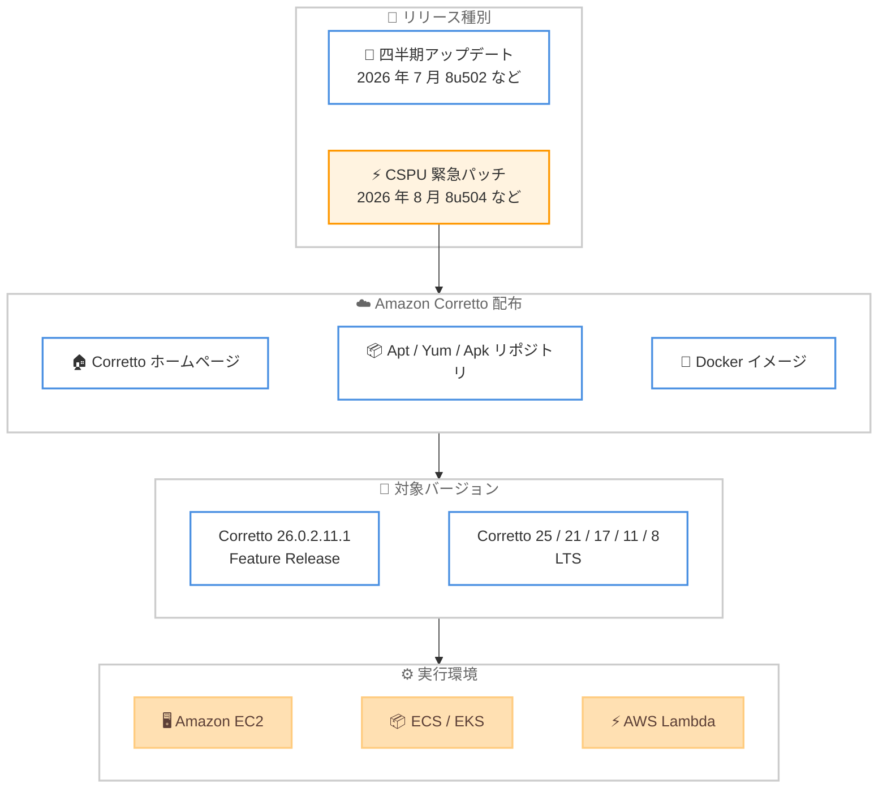

# Amazon Corretto - 2026 年 8 月クリティカルセキュリティパッチアップデート

**リリース日**: 2026年08月18日
**サービス**: Amazon Corretto
**機能**: クリティカルセキュリティパッチアップデート (CSPU)

📊 [このアップデートのインフォグラフィックを見る](https://takech9203.github.io/aws-news-summary/20260818-amazon-corretto-august-2026-security-updates.html)
<!-- INFOGRAPHIC_BASE_URL は環境変数から取得 -->

## 概要

2026 年 8 月 18 日、Amazon は Amazon Corretto の Long-Term Support (LTS) バージョンおよび Feature Release (FR) バージョンの OpenJDK に対するクリティカルセキュリティパッチアップデート (CSPU) を発表しました。Corretto 26.0.2.11.1、25.0.4.8.1、21.0.12.9.1、17.0.20.10.1、11.0.32.10.1、および 8u504 が[ダウンロード](https://aws.amazon.com/corretto/)可能になりました。Amazon Corretto は、無料で、マルチプラットフォームに対応した、本番環境対応の OpenJDK ディストリビューションです。

今回のアップデートは、四半期ごとの定期アップデート (直近は 2026 年 7 月) とは別に提供される、クリティカルな脆弱性に対応するための緊急性の高いパッチリリースです。CSPU は通常の四半期サイクルを待たずに提供されるため、対象となる脆弱性の影響を受ける環境では速やかな適用が推奨されます。

本番環境で Java アプリケーションを運用しているすべての組織が対象です。Corretto ホームページからのダウンロードに加えて、Linux システムでは Apt、Yum、または Apk リポジトリを設定することでアップデートを取得できます。

**アップデート前の課題**

- 直近の四半期アップデート (2026 年 7 月: 26.0.2、25.0.4、21.0.12、17.0.20、11.0.32、8u502) にはクリティカルなセキュリティ脆弱性が残存していた
- 四半期サイクルの定期アップデートだけでは、緊急性の高い脆弱性への迅速な対応ができなかった
- 脆弱性が修正されるまでの間、本番環境の Java アプリケーションがリスクにさらされる可能性があった

**アップデート後の改善**

- クリティカルなセキュリティ問題が修正され、より安全な Java 実行環境を利用可能になった
- LTS (25、21、17、11、8) と Feature Release (26) のすべてのサポート対象バージョンで修正版が提供された
- Corretto ホームページ、および Linux 向けの Apt / Yum / Apk リポジトリ経由で速やかにアップデートを取得できる

## アーキテクチャ図



四半期の定期アップデートとは別に提供される CSPU が、各配布チャネルを通じて全サポートバージョンに展開され、EC2、コンテナ、Lambda などの実行環境に適用される流れを示しています。

## サービスアップデートの詳細

### 主要機能

1. **クリティカルセキュリティパッチアップデート (CSPU)**
   - クリティカルなセキュリティ脆弱性を修正する緊急性の高いパッチリリース
   - 四半期ごとの定期アップデートサイクルとは別に提供
   - 本番環境での安全かつ信頼性の高い使用をサポート

2. **LTS および Feature Release の両方をサポート**
   - Corretto 26.0.2.11.1 (Feature Release)
   - Corretto 25.0.4.8.1 (最新 LTS)
   - Corretto 21.0.12.9.1 (LTS)
   - Corretto 17.0.20.10.1 (LTS)
   - Corretto 11.0.32.10.1 (LTS)
   - Corretto 8u504 (LTS)

3. **複数の配布チャネル**
   - [Corretto ホームページ](https://aws.amazon.com/corretto)からの直接ダウンロード
   - Linux 向けの [Apt、Yum、Apk リポジトリ](https://docs.aws.amazon.com/corretto/latest/corretto-26-ug/generic-linux-install.html)経由での取得
   - フィードバックは [GitHub](https://github.com/corretto) で受付

## 技術仕様

### 更新されたバージョン

| バージョン | アップデート | サポート状況 |
|-----------|------------|------------|
| Corretto 26 | 26.0.2.11.1 | Feature Release |
| Corretto 25 | 25.0.4.8.1 | LTS |
| Corretto 21 | 21.0.12.9.1 | LTS |
| Corretto 17 | 17.0.20.10.1 | LTS |
| Corretto 11 | 11.0.32.10.1 | LTS |
| Corretto 8 | 8u504 | LTS |

### 対応プラットフォーム

- Linux (x86_64、aarch64)
- Windows (x86_64)
- macOS (x86_64、aarch64)
- Docker コンテナイメージ

### 四半期アップデートとの違い

| 項目 | 四半期アップデート | CSPU |
|------|------------------|------|
| 提供タイミング | 四半期ごとの定期サイクル (1 月、4 月、7 月、10 月) | クリティカルな脆弱性発生時に随時 |
| 内容 | セキュリティ修正、クリティカルなバグ修正 | クリティカルなセキュリティ修正 |
| 適用の緊急度 | 計画的な適用を推奨 | 速やかな適用を推奨 |

## 設定方法

### 前提条件

1. Java アプリケーションまたは開発環境
2. 適切なプラットフォーム (Linux、Windows、macOS)
3. 管理者権限 (インストールに必要)

### 手順

#### ステップ1: Corretto のダウンロード

[Corretto ホームページ](https://aws.amazon.com/corretto) から適切なバージョンをダウンロードします。Corretto 26、25、21、17、11、8 の各プラットフォーム向けインストーラーやアーカイブを入手できます。

#### ステップ2: Linux での apt/yum/apk リポジトリの設定 (オプション)

Linux システムでは、Corretto の apt、yum、または apk リポジトリを設定することで、パッケージマネージャー経由でインストールおよびアップデートを受け取ることができます。

```bash
# apt の例 (Debian/Ubuntu)
wget -O- https://apt.corretto.aws/corretto.key | sudo gpg --dearmor -o /usr/share/keyrings/corretto-keyring.gpg
echo "deb [signed-by=/usr/share/keyrings/corretto-keyring.gpg] https://apt.corretto.aws stable main" | sudo tee /etc/apt/sources.list.d/corretto.list
sudo apt-get update
sudo apt-get install -y java-21-amazon-corretto-jdk
```

上記のコマンドは、Corretto の署名キーを登録し、apt リポジトリを追加したうえで、Corretto 21 の JDK をインストールしています。既にリポジトリを設定済みの場合は、`sudo apt-get update && sudo apt-get upgrade` で最新のパッチ版へ更新できます。

#### ステップ3: yum を使用したアップデート (Amazon Linux などの場合)

```bash
# yum の例 (Amazon Linux 2023)
sudo yum update java-21-amazon-corretto
```

このコマンドは、インストール済みの Corretto 21 パッケージを今回の CSPU を含む最新版へ更新しています。

#### ステップ4: バージョンの確認

インストールまたはアップデート後、Java バージョンを確認します。

```bash
java -version
```

このコマンドで、今回の CSPU バージョン (例: 21.0.12.9.1) が正しく反映されていることを確認できます。

## メリット

### ビジネス面

- **無料**: ライセンス費用なしで商用利用可能
- **迅速な脆弱性対応**: 四半期サイクルを待たずにクリティカルな脆弱性への修正を入手でき、セキュリティリスクを低減
- **コンプライアンス対応**: 既知のクリティカルな脆弱性への速やかなパッチ適用により、セキュリティ基準の維持を支援

### 技術面

- **全サポートバージョンをカバー**: Feature Release の Corretto 26 から LTS の Corretto 8 まで一斉に修正版を提供
- **複数の配布チャネル**: ホームページからのダウンロードと Apt / Yum / Apk リポジトリの両方に対応し、運用形態に合わせた適用が可能
- **本番環境対応**: AWS が本番環境での使用をサポートする OpenJDK ディストリビューション

## デメリット・制約事項

### 制限事項

- 今回の発表では、個別の CVE 識別子や具体的な脆弱性の内容は明示されていない
- 特定の商用 Java ディストリビューションの独自機能は含まれない

### 考慮すべき点

- CSPU はクリティカルな脆弱性への対応であるため、通常の四半期アップデートよりも優先度を上げて適用を検討する必要がある
- パッチ適用にあたっては、アプリケーションの互換性テストを実施したうえで本番環境へ展開することが推奨される
- コンテナ環境では、ベースイメージの更新と再ビルド、再デプロイが必要になる

## ユースケース

### ユースケース1: 本番環境での Java アプリケーションへの緊急パッチ適用

**シナリオ**: EC2 インスタンスで稼働する LTS バージョンの Java アプリケーションに、クリティカルな脆弱性修正を速やかに適用する

**実装例**:
- yum / apt リポジトリ経由で Corretto パッケージを最新の CSPU 版へ更新
- ステージング環境で動作確認後、本番環境へローリングアップデート
- `java -version` でパッチ版 (例: 17.0.20.10.1) の適用を確認

**効果**: 四半期サイクルを待たずにクリティカルな脆弱性を修正し、本番環境のセキュリティリスクを最小化できる

### ユースケース2: コンテナ化された Java アプリケーションの更新

**シナリオ**: Amazon ECS / EKS 上で稼働する Java マイクロサービスのベースイメージを更新する

**実装例**:
```dockerfile
FROM amazoncorretto:21
COPY target/myapp.jar /app.jar
ENTRYPOINT ["java", "-jar", "/app.jar"]
```

**効果**: 最新の Corretto イメージを取得して再ビルド・再デプロイすることで、コンテナ環境全体に CSPU を一括適用できる

### ユースケース3: レガシー環境 (Corretto 8 / 11) の継続的なセキュリティ維持

**シナリオ**: Corretto 8 や 11 で稼働する既存アプリケーションを、リスクを抑えながら継続運用する

**実装例**:
- Corretto 8u504 または 11.0.32.10.1 へアップデートしてクリティカルな修正を適用
- 互換性テストを実施したうえで本番環境へ展開

**効果**: レガシーな Java バージョンでも無料でクリティカルなセキュリティ修正を受け取り、安全に継続運用できる

## 料金

Amazon Corretto は完全に無料で、ライセンス費用は発生しません。

## 利用可能リージョン

Amazon Corretto は、すべての AWS リージョンおよびオンプレミス環境で利用可能です。

## 関連サービス・機能

- **AWS Lambda**: サーバーレス Java 関数の実行
- **Amazon EC2**: Java アプリケーションのホスティング
- **Amazon ECS/EKS**: コンテナ化された Java アプリケーションの実行
- **AWS CodeBuild**: Corretto を使用した Java アプリケーションのビルド
- **AWS Systems Manager Patch Manager**: EC2 フリートへのパッチ適用の自動化

## 参考リンク

- 📊 [インフォグラフィック](https://takech9203.github.io/aws-news-summary/20260818-amazon-corretto-august-2026-security-updates.html)
- [公式発表 (What's New)](https://aws.amazon.com/about-aws/whats-new/2026/08/amazon-corretto-august-2026-security-updates)
- [Corretto ホームページ](https://aws.amazon.com/corretto)
- [Corretto ダウンロード](https://aws.amazon.com/corretto/)
- [Corretto Linux インストールガイド](https://docs.aws.amazon.com/corretto/latest/corretto-26-ug/generic-linux-install.html)
- [GitHub - Corretto](https://github.com/corretto)

## まとめ

Amazon Corretto の 2026 年 8 月クリティカルセキュリティパッチアップデート (CSPU) により、Corretto 26.0.2.11.1、25.0.4.8.1、21.0.12.9.1、17.0.20.10.1、11.0.32.10.1、8u504 が提供されました。四半期の定期アップデートとは別に提供される緊急性の高いパッチであるため、Corretto を利用しているすべての環境で、互換性テストを実施したうえで速やかな適用を推奨します。Linux 環境では Apt / Yum / Apk リポジトリの設定により、アップデートの取得を効率化できます。
