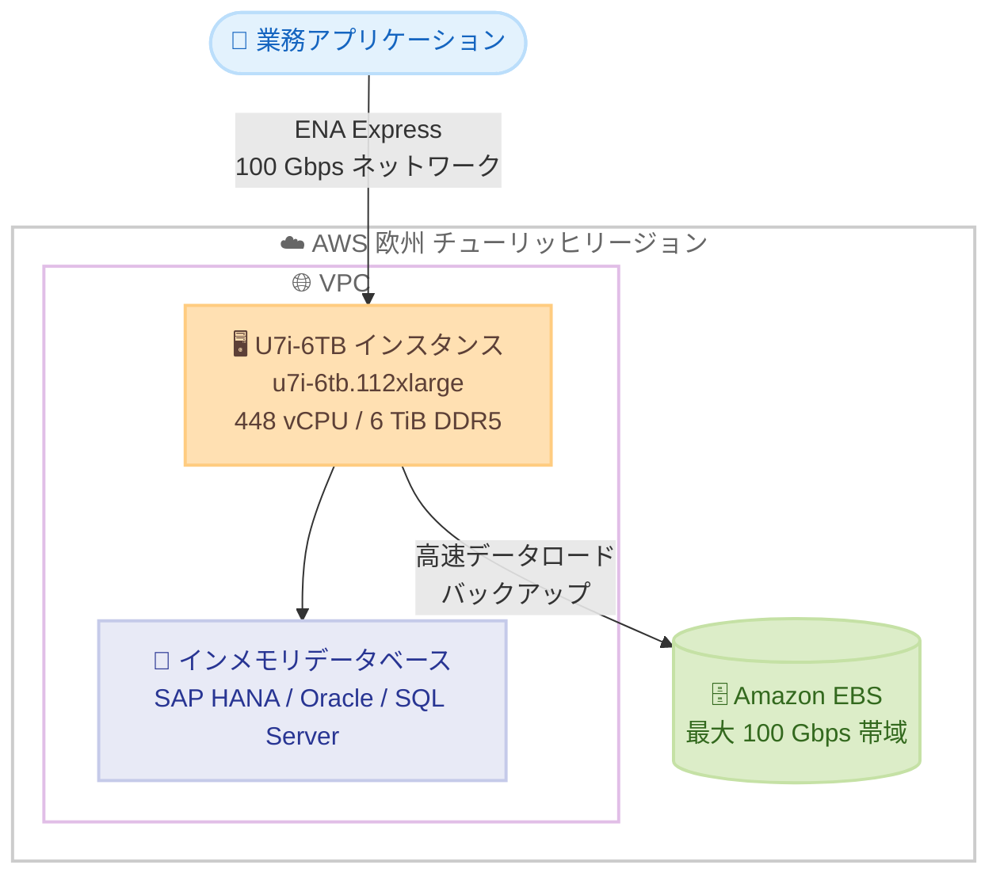

# Amazon EC2 - High Memory U7i インスタンスが AWS 欧州 (チューリッヒ) リージョンで利用可能に

**リリース日**: 2026 年 8 月 18 日
**サービス**: Amazon EC2
**機能**: High Memory U7i-6TB インスタンス (u7i-6tb.112xlarge) のリージョン拡大

📊 [このアップデートのインフォグラフィックを見る](https://takech9203.github.io/aws-news-summary/20260818-amazon-ec2-high-memory-u7i-aws-europe.html)

## 概要

Amazon EC2 High Memory U7i-6TB インスタンス (u7i-6tb.112xlarge) が、AWS 欧州 (チューリッヒ) リージョンで利用可能になりました。U7i インスタンスは AWS 第 7 世代インスタンスの一部であり、カスタム第 4 世代 Intel Xeon スケーラブルプロセッサ (Sapphire Rapids) を搭載しています。

U7i-6TB インスタンスは 6 TiB の DDR5 メモリを提供し、急速に拡大するデータ環境においてトランザクション処理のスループットをスケールできます。既存の U-1 インスタンスと比較して、最大 45% 優れた価格性能を実現します。SAP HANA、Oracle、SQL Server などのミッションクリティカルなインメモリデータベースを実行するユーザーに最適です。

**アップデート前の課題**

- 以前はチューリッヒリージョンで U7i-6TB インスタンスが利用できず、6 TiB クラスのインメモリデータベースをスイスのデータレジデンシー要件下で最新世代インスタンス上に構築することが困難だった
- チューリッヒリージョンで大容量メモリワークロードを実行する場合、旧世代の High Memory インスタンスや他リージョンの利用を検討する必要があった
- 旧世代 U-1 インスタンスでは、最新世代と比較して価格性能面で不利だった

**アップデート後の改善**

- チューリッヒリージョンで 6 TiB メモリ、448 vCPU の U7i-6TB インスタンスが利用可能になった
- スイス国内のデータレジデンシーや低レイテンシー要件を満たしながら、SAP HANA などの大規模インメモリデータベースを最新世代インスタンスで実行できるようになった
- U-1 インスタンスと比較して最大 45% 優れた価格性能により、コスト効率が改善された

## アーキテクチャ図



チューリッヒリージョンの U7i-6TB インスタンス上でミッションクリティカルなインメモリデータベースを実行する構成例です。最大 100 Gbps の EBS 帯域幅と ENA Express 対応の 100 Gbps ネットワーク帯域幅により、高速なデータロードとバックアップを実現します。

## サービスアップデートの詳細

### 主要機能

1. **6 TiB の DDR5 メモリ**
   - u7i-6tb.112xlarge は 6 TiB の DDR5 メモリを提供
   - 急速に拡大するデータ環境でトランザクション処理のスループットをスケール可能
   - インメモリデータベースの大規模なデータセットをメモリ上に保持できる

2. **高い価格性能**
   - カスタム第 4 世代 Intel Xeon スケーラブルプロセッサ (Sapphire Rapids) を搭載
   - 既存の U-1 インスタンスと比較して最大 45% 優れた価格性能を実現

3. **高帯域幅のストレージとネットワーク**
   - 最大 100 Gbps の Amazon EBS 帯域幅により、データロードとバックアップを高速化
   - 100 Gbps のネットワーク帯域幅と ENA Express をサポート

## 技術仕様

### u7i-6tb.112xlarge の仕様

| 項目 | 詳細 |
|------|------|
| インスタンスサイズ | u7i-6tb.112xlarge |
| プロセッサ | カスタム第 4 世代 Intel Xeon スケーラブルプロセッサ (Sapphire Rapids) |
| vCPU | 448 |
| メモリ | 6 TiB (DDR5) |
| EBS 帯域幅 | 最大 100 Gbps |
| ネットワーク帯域幅 | 100 Gbps |
| ネットワーク機能 | ENA Express 対応 |
| 世代 | AWS 第 7 世代 |
| 価格性能 | U-1 インスタンス比で最大 45% 向上 |

## 設定方法

### 前提条件

1. AWS 欧州 (チューリッヒ) リージョン (eu-central-2) を利用できる AWS アカウント
2. インスタンスを起動する VPC およびサブネットの準備
3. u7i-6tb.112xlarge の vCPU 数 (448) に対応した Service Quotas の確認

### 手順

#### ステップ1: チューリッヒリージョンでの利用可能状況を確認

```bash
aws ec2 describe-instance-type-offerings \
  --region eu-central-2 \
  --filters "Name=instance-type,Values=u7i-6tb.112xlarge" \
  --query "InstanceTypeOfferings[].InstanceType"
```

チューリッヒリージョン (eu-central-2) で u7i-6tb.112xlarge が提供されているかを確認します。

#### ステップ2: インスタンスタイプの詳細を確認

```bash
aws ec2 describe-instance-types \
  --region eu-central-2 \
  --instance-types u7i-6tb.112xlarge \
  --query "InstanceTypes[].{vCPU:VCpuInfo.DefaultVCpus,MemoryMiB:MemoryInfo.SizeInMiB,Network:NetworkInfo.NetworkPerformance}"
```

vCPU 数、メモリサイズ、ネットワーク性能などの仕様を確認します。

#### ステップ3: インスタンスを起動

```bash
aws ec2 run-instances \
  --region eu-central-2 \
  --instance-type u7i-6tb.112xlarge \
  --image-id ami-xxxxxxxxxxxxxxxxx \
  --subnet-id subnet-xxxxxxxxxxxxxxxxx \
  --key-name my-key-pair
```

チューリッヒリージョンのサブネット内に U7i-6TB インスタンスを起動します。SAP HANA などを実行する場合は、SAP 認定の AMI や構成ガイドに従ってセットアップします。

## メリット

### ビジネス面

- **データレジデンシー要件への対応**: スイス国内にデータを保持する必要がある金融機関や公共機関でも、大規模インメモリデータベースを最新世代インスタンスで運用できる
- **コスト効率の向上**: U-1 インスタンス比で最大 45% 優れた価格性能により、ミッションクリティカルワークロードの TCO を削減できる
- **地理的な選択肢の拡大**: 欧州内でのディザスタリカバリ構成やマルチリージョン展開の選択肢が増える

### 技術面

- **大容量メモリ**: 6 TiB の DDR5 メモリにより、大規模な SAP HANA や Oracle などのインメモリデータベースをメモリ上で実行できる
- **高速なデータ転送**: 最大 100 Gbps の EBS 帯域幅により、データロードやバックアップの時間を短縮できる
- **低レイテンシーネットワーク**: 100 Gbps ネットワーク帯域幅と ENA Express により、アプリケーションサーバーとの間で高スループット・低レイテンシーの通信が可能

## デメリット・制約事項

### 制限事項

- チューリッヒリージョンで発表されたのは U7i-6TB (u7i-6tb.112xlarge) であり、他のサイズの提供状況は High Memory インスタンスページで確認が必要
- 448 vCPU を消費するため、アカウントの vCPU クォータの引き上げが必要になる場合がある

### 考慮すべき点

- 大容量メモリインスタンスは時間単価が高額なため、リザーブドインスタンスや Savings Plans などの購入オプションの活用を検討する
- SAP HANA などの商用データベースを実行する場合は、ベンダーの認定状況とライセンス要件を事前に確認する

## ユースケース

### ユースケース1: SAP HANA 本番環境のスイス国内展開

**シナリオ**: スイスの金融機関が、データレジデンシー要件を満たしながら SAP S/4HANA の本番環境をクラウドに移行したい。

**実装例**:
```
- チューリッヒリージョンに u7i-6tb.112xlarge を配置し SAP HANA を稼働
- EBS 帯域幅 100 Gbps を活用した高速バックアップ
- 別 AZ にスタンバイを配置した高可用性構成
```

**効果**: スイス国内でデータを保持しつつ、6 TiB メモリで大規模な SAP HANA データベースを安定稼働できる。

### ユースケース2: 旧世代 High Memory インスタンスからの移行

**シナリオ**: 既存の U-1 インスタンスで運用中のインメモリデータベースのコストと性能を改善したい。

**実装例**:
```
- U-1 インスタンス上のワークロードを u7i-6tb.112xlarge へ移行
- 移行前に性能テストを実施し、価格性能の改善を検証
```

**効果**: 最大 45% 優れた価格性能により、同等以上の性能をより低いコストで実現できる。

### ユースケース3: 大規模 OLTP データベースのスケールアップ

**シナリオ**: データ量が急増する Oracle や SQL Server の OLTP システムで、トランザクション処理スループットの向上が必要になっている。

**実装例**:
```
- 6 TiB メモリの U7i-6TB へスケールアップし、バッファキャッシュを拡大
- ENA Express によりアプリケーション層との通信を低レイテンシー化
```

**効果**: メモリ上で処理できるデータ量が増え、ディスク I/O を削減してトランザクションスループットを向上できる。

## 料金

U7i インスタンスは、オンデマンドインスタンス、リザーブドインスタンス、Savings Plans、Dedicated Hosts などの購入オプションで利用できます。チューリッヒリージョンにおける u7i-6tb.112xlarge の具体的な料金は、Amazon EC2 料金ページで確認してください。

## 利用可能リージョン

今回のアップデートにより、AWS 欧州 (チューリッヒ) リージョン (eu-central-2) で U7i-6TB インスタンス (u7i-6tb.112xlarge) が利用可能になりました。U7i インスタンスの提供リージョンの全体像は、Amazon EC2 High Memory インスタンスページで確認できます。

## 関連サービス・機能

- **Amazon EBS**: 最大 100 Gbps の EBS 帯域幅により、データベースのデータロードやバックアップを高速化
- **ENA Express**: インスタンス間通信のレイテンシーを低減し、スループットを向上させるネットワーク機能
- **SAP on AWS**: SAP HANA 認定インスタンスとして、SAP ワークロードの移行・運用を支援するプログラムやガイドを提供

## 参考リンク

- 📊 [インフォグラフィック](https://takech9203.github.io/aws-news-summary/20260818-amazon-ec2-high-memory-u7i-aws-europe.html)
- [公式発表 (What's New)](https://aws.amazon.com/about-aws/whats-new/2026/08/amazon-ec2-high-memory-u7i-aws-europe/)
- [Amazon EC2 High Memory インスタンス](https://aws.amazon.com/ec2/instance-types/high-memory/)
- [Amazon EC2 料金ページ](https://aws.amazon.com/ec2/pricing/)

## まとめ

U7i-6TB インスタンスがチューリッヒリージョンに拡大したことで、スイス国内のデータレジデンシー要件を満たしながら、SAP HANA、Oracle、SQL Server などの大規模インメモリデータベースを最新世代のインスタンスで運用できるようになりました。旧世代の U-1 インスタンスを利用中の場合は、最大 45% の価格性能改善が見込めるため、移行の検討をおすすめします。
