# Amazon EC2 - R8i インスタンスがイスラエル (テルアビブ) リージョンで利用可能に

**リリース日**: 2026 年 8 月 18 日
**サービス**: Amazon EC2
**機能**: Amazon EC2 R8i インスタンス (イスラエル (テルアビブ) リージョン対応)

📊 [このアップデートのインフォグラフィックを見る](https://takech9203.github.io/aws-news-summary/20260818-amazon-ec2-r8i-israel-tel-aviv.html)

## 概要

Amazon EC2 のメモリ最適化インスタンスである R8i がイスラエル (テルアビブ) リージョンで利用可能になりました。これらのインスタンスは AWS 専用にカスタマイズされた Intel Xeon 6 プロセッサを搭載しており、クラウド上の同等 Intel プロセッサの中で最高のパフォーマンスと最速のメモリ帯域幅を提供します。

R8i は前世代の Intel ベースインスタンスと比較して最大 15% 優れた価格性能と 2.5 倍のメモリ帯域幅を実現します。R7i と比較すると全体で 20% 高いパフォーマンスを発揮し、ワークロードによってはさらに大きな効果が得られます。具体的には、PostgreSQL データベースで最大 30%、NGINX ウェブアプリケーションで最大 60%、AI 深層学習レコメンデーションモデルで最大 40% の高速化が確認されています。

イスラエル (テルアビブ) リージョンを利用するお客様は、SQL / NoSQL データベース、分散インメモリキャッシュ、SAP HANA などのインメモリデータベース、リアルタイムビッグデータ分析といったメモリ集約型ワークロードを、データレジデンシー要件を満たしながら最新世代のインスタンスで実行できるようになります。

**アップデート前の課題**

このアップデート以前に存在していた課題や制限は以下のとおりです。

- 以前はイスラエル (テルアビブ) リージョンで R8i を利用できず、メモリ集約型ワークロードには前世代のインスタンスを使用する必要があった
- イスラエル国内のデータレジデンシー要件を満たしつつ、最新世代の Intel ベースメモリ最適化インスタンスを利用することができなかった
- 大規模な SAP HANA などのワークロードで、最新世代の高い aSAPS 性能をテルアビブリージョンで活用できなかった

**アップデート後の改善**

今回のアップデートにより可能になったことは以下のとおりです。

- イスラエル (テルアビブ) リージョンで R8i インスタンスを起動できるようになった
- 前世代 Intel ベースインスタンス比で最大 15% 優れた価格性能と 2.5 倍のメモリ帯域幅を同リージョンで活用できるようになった
- イスラエル国内で稼働するデータベースやインメモリ分析、SAP ワークロードを、より高い性能とコスト効率で運用できるようになった

## アーキテクチャ図

```mermaid
flowchart TD
    Start(["👤 メモリ集約型ワークロード"]) --> R8i["🖥️ R8i インスタンス<br/>カスタム Intel Xeon 6<br/>13 サイズ<br/>large 〜 96xlarge + ベアメタル 2 種"]

    R8i --> Use1["📋 SQL / NoSQL データベース<br/>PostgreSQL 最大 30% 高速化"]
    R8i --> Use2["🧠 SAP HANA<br/>142,100 aSAPS の SAP 認定"]
    R8i --> Use3["🌐 NGINX ウェブアプリ<br/>最大 60% 高速化"]

    Use1 --> Region["🌍 イスラエル テルアビブ リージョン<br/>il-central-1 で利用可能に"]
    Use2 --> Region
    Use3 --> Region

    classDef start fill:#E3F2FD,stroke:#BBDEFB,stroke-width:2px,color:#1565C0
    classDef instance fill:#FFE0B2,stroke:#FFCC80,stroke-width:2px,color:#5D4037
    classDef usecase fill:#E9F7EC,stroke:#66BB6A,stroke-width:2px,color:#333333
    classDef region fill:#E8F1FF,stroke:#4A90E2,stroke-width:2px,color:#333333

    class Start start
    class R8i instance
    class Use1,Use2,Use3 usecase
    class Region region
```



R8i インスタンスの主なユースケースと、今回のイスラエル (テルアビブ) リージョンへの展開を示しています。R7i 比でワークロード別に大幅な性能向上が期待できます。

## サービスアップデートの詳細

### 主要機能

1. **カスタム Intel Xeon 6 プロセッサによる高性能**
   - AWS 専用にカスタマイズされた Intel Xeon 6 プロセッサを搭載し、クラウド上の同等 Intel プロセッサの中で最高のパフォーマンスと最速のメモリ帯域幅を実現
   - 前世代 Intel ベースインスタンス比で最大 15% 優れた価格性能と 2.5 倍のメモリ帯域幅を提供

2. **ワークロード別の大幅な性能向上 (R7i 比)**
   - 全体で 20% 高いパフォーマンス
   - PostgreSQL データベース: 最大 30% 高速
   - NGINX ウェブアプリケーション: 最大 60% 高速
   - AI 深層学習レコメンデーションモデル: 最大 40% 高速

3. **幅広いサイズ展開**
   - 13 サイズを提供し、2 種類のベアメタルサイズと最大規模アプリケーション向けの新しい 96xlarge (384 vCPU、3,072 GiB メモリ) を含む
   - 最大サイズが必要なワークロードや、継続的な高 CPU 使用率が必要なワークロードに最適

4. **SAP 認定による高い信頼性**
   - SAP 認定済みで 142,100 aSAPS を達成し、オンプレミス・クラウドを含む同等マシンの中で最高水準
   - ミッションクリティカルな SAP ワークロードに卓越したパフォーマンスを提供

## 技術仕様

### R8i インスタンスサイズ

| サイズ | vCPU | メモリ (GiB) | ネットワーク帯域 (Gbps) | EBS 帯域 (Gbps) |
|--------|------|--------------|-------------------------|-----------------|
| large | 2 | 16 | 最大 12.5 | 最大 10 |
| xlarge | 4 | 32 | 最大 12.5 | 最大 10 |
| 2xlarge | 8 | 64 | 最大 15 | 最大 10 |
| 4xlarge | 16 | 128 | 最大 15 | 最大 10 |
| 8xlarge | 32 | 256 | 15 | 10 |
| 12xlarge | 48 | 384 | 22.5 | 15 |
| 16xlarge | 64 | 512 | 30 | 20 |
| 24xlarge | 96 | 768 | 40 | 30 |
| 32xlarge | 128 | 1,024 | 50 | 40 |
| 48xlarge | 192 | 1,536 | 75 | 60 |
| 96xlarge | 384 | 3,072 | 100 | 80 |
| metal-48xl | 192 | 1,536 | 75 | 60 |
| metal-96xl | 384 | 3,072 | 100 | 80 |

### その他の技術的特徴

| 項目 | 詳細 |
|------|------|
| プロセッサ | AWS 専用カスタム Intel Xeon 6 |
| メモリ帯域幅 | 前世代 Intel ベースインスタンスの 2.5 倍 |
| SAP 認定 | あり (142,100 aSAPS) |
| 購入オプション | Savings Plans、オンデマンドインスタンス、スポットインスタンス |

## 設定方法

### 前提条件

1. AWS アカウントを保有していること
2. イスラエル (テルアビブ) リージョン (il-central-1) が有効化されていること (オプトインリージョンのため有効化が必要)
3. EC2 インスタンスを起動する IAM 権限を保有していること

### 手順

#### ステップ 1: 利用可能なインスタンスタイプの確認

```bash
aws ec2 describe-instance-type-offerings \
  --region il-central-1 \
  --filters "Name=instance-type,Values=r8i.*" \
  --query "InstanceTypeOfferings[].InstanceType" \
  --output table
```

イスラエル (テルアビブ) リージョンで利用可能な R8i のインスタンスタイプ一覧を表示します。

#### ステップ 2: インスタンスの起動

```bash
aws ec2 run-instances \
  --region il-central-1 \
  --instance-type r8i.xlarge \
  --image-id ami-xxxxxxxxxxxxxxxxx \
  --key-name my-key-pair \
  --subnet-id subnet-xxxxxxxxxxxxxxxxx \
  --security-group-ids sg-xxxxxxxxxxxxxxxxx
```

イスラエル (テルアビブ) リージョンで r8i.xlarge インスタンスを起動します。ワークロードの規模に応じて large から 96xlarge、ベアメタルまでのサイズを選択できます。

#### ステップ 3: 既存インスタンスからの移行

```bash
# インスタンスを停止
aws ec2 stop-instances --region il-central-1 --instance-ids i-xxxxxxxxxxxxxxxxx

# インスタンスタイプを変更
aws ec2 modify-instance-attribute \
  --region il-central-1 \
  --instance-id i-xxxxxxxxxxxxxxxxx \
  --instance-type "{\"Value\": \"r8i.xlarge\"}"

# インスタンスを起動
aws ec2 start-instances --region il-central-1 --instance-ids i-xxxxxxxxxxxxxxxxx
```

既存の R7i / R6i などのインスタンスを停止し、インスタンスタイプを R8i に変更してから再起動することで、最新世代へ移行できます。R8i は R7i と同じ x86-64 アーキテクチャのため、AMI やアプリケーションの変更は原則不要です。

## メリット

### ビジネス面

- **コスト効率の向上**: 前世代 Intel ベースインスタンス比で最大 15% 優れた価格性能により、同じ予算でより多くの処理が可能
- **データレジデンシー要件への対応**: イスラエル国内 (テルアビブ) で最新世代インスタンスを利用でき、規制要件を満たしながら性能を最大化できる
- **柔軟な購入オプション**: Savings Plans、オンデマンド、スポットインスタンスに対応し、ワークロード特性に応じたコスト最適化が可能

### 技術面

- **メモリ帯域幅の大幅向上**: 2.5 倍のメモリ帯域幅により、インメモリデータベースやリアルタイム分析の性能が向上
- **ワークロード別の顕著な高速化**: PostgreSQL 最大 30%、NGINX 最大 60%、AI 深層学習レコメンデーションモデル最大 40% の高速化 (R7i 比)
- **大規模 SAP ワークロード対応**: 142,100 aSAPS の SAP 認定と 96xlarge (384 vCPU、3,072 GiB) により、大規模な SAP HANA 環境にも対応

## デメリット・制約事項

### 制限事項

- 今回の発表は R8i のみが対象であり、R8i-flex のテルアビブリージョンでの提供は公式発表に含まれていない
- イスラエル (テルアビブ) はオプトインリージョンのため、利用前にリージョンの有効化が必要
- リージョンごとに利用可能なサイズが異なる場合があるため、事前に確認が必要

### 考慮すべき点

- 移行前に、現在のワークロードの CPU 使用パターンとメモリ要件を分析し、適切なサイズを選定することが推奨される
- 具体的な料金は Amazon EC2 料金ページでリージョンごとに確認が必要
- Reserved Instances / Savings Plans を利用中の場合は、インスタンスファミリー変更によるコミットメントへの影響を確認する

## ユースケース

### ユースケース 1: イスラエル国内向け PostgreSQL データベースの性能向上

**シナリオ**: イスラエルのデータレジデンシー要件により、テルアビブリージョンで PostgreSQL データベースを R7i インスタンスで運用している。トランザクション量の増加に伴い、性能向上が必要になっている。

**実装例**:
```bash
# R7i から R8i へインスタンスタイプを変更
aws ec2 modify-instance-attribute \
  --region il-central-1 \
  --instance-id i-xxxxxxxxxxxxxxxxx \
  --instance-type "{\"Value\": \"r8i.4xlarge\"}"
```

**効果**: PostgreSQL ワークロードで最大 30% の高速化が期待でき、スケールアップせずにトランザクション増加に対応できる。

### ユースケース 2: SAP HANA 環境の最新世代への移行

**シナリオ**: テルアビブリージョンで SAP HANA を運用しており、データ量の増加に伴いより大きなメモリと高い SAPS 性能が必要になっている。

**実装例**:
```bash
# SAP HANA 向けに r8i.96xlarge を起動
aws ec2 run-instances \
  --region il-central-1 \
  --instance-type r8i.96xlarge \
  --image-id ami-xxxxxxxxxxxxxxxxx \
  --key-name my-key-pair \
  --subnet-id subnet-xxxxxxxxxxxxxxxxx
```

**効果**: 142,100 aSAPS の SAP 認定性能と 3,072 GiB のメモリにより、大規模 SAP HANA 環境をイスラエル国内で高性能に運用できる。

### ユースケース 3: AI レコメンデーションモデルの推論基盤

**シナリオ**: テルアビブリージョンで EC サイト向けの深層学習レコメンデーションモデルの推論を CPU ベースで実行しており、応答時間の短縮とコスト効率の改善が求められている。

**実装例**:
```bash
# 推論用に r8i.8xlarge を起動
aws ec2 run-instances \
  --region il-central-1 \
  --instance-type r8i.8xlarge \
  --image-id ami-xxxxxxxxxxxxxxxxx \
  --key-name my-key-pair \
  --subnet-id subnet-xxxxxxxxxxxxxxxxx
```

**効果**: AI 深層学習レコメンデーションモデルで R7i 比最大 40% の高速化が期待でき、推論レイテンシーの短縮とコスト効率の改善を両立できる。

## 料金

R8i は従量課金制で、使用した分のみ支払います。購入オプションとして Savings Plans、オンデマンドインスタンス、スポットインスタンスを利用できます。

前世代の Intel ベースインスタンスと比較して最大 15% 優れた価格性能を提供します。イスラエル (テルアビブ) リージョンにおける具体的な料金は、[Amazon EC2 料金ページ](https://aws.amazon.com/ec2/pricing/) を参照してください。

## 利用可能リージョン

今回のアップデートにより、イスラエル (テルアビブ) リージョン (il-central-1) で R8i インスタンスが利用可能になりました。

R8i はこれまでに米国東部 (バージニア北部)、米国東部 (オハイオ)、米国西部 (オレゴン)、欧州 (スペイン) などのリージョンで提供されており、対応リージョンは順次拡大しています。最新の対応状況は [インスタンスタイプページ](https://aws.amazon.com/ec2/instance-types/r8i/) を参照してください。

## 関連サービス・機能

- **Amazon EC2 R7i インスタンス**: 前世代の Intel ベースメモリ最適化インスタンス。R8i への移行で最大 20% の性能向上が見込める
- **Amazon EC2 R8i-flex インスタンス**: CPU を常時フル活用しないワークロード向けの低価格な Flex バリアント。今回の発表には含まれていないため、テルアビブリージョンでの提供状況は別途確認が必要
- **Amazon EC2 M8i / C8i インスタンス**: 同じカスタム Intel Xeon 6 プロセッサを搭載した汎用 / コンピューティング最適化インスタンス。ワークロード特性に応じて選択可能
- **SAP on AWS**: R8i は SAP 認定済みであり、SAP HANA などのワークロードに利用可能

## 参考リンク

- 📊 [インフォグラフィック](https://takech9203.github.io/aws-news-summary/20260818-amazon-ec2-r8i-israel-tel-aviv.html)
- [公式発表 (What's New)](https://aws.amazon.com/about-aws/whats-new/2026/08/amazon-ec2-r8i-israel-tel-aviv/)
- [AWS Blog: Best performance and fastest memory with the new Amazon EC2 R8i and R8i-flex instances](https://aws.amazon.com/blogs/aws/best-performance-and-fastest-memory-with-the-new-amazon-ec2-r8i-and-r8i-flex-instances/)
- [Amazon EC2 R8i インスタンス](https://aws.amazon.com/ec2/instance-types/r8i/)
- [SAP 認定情報 (SAP HANA on AWS)](https://docs.aws.amazon.com/sap/latest/general/sap-hana-aws-ec2.html)
- [Amazon EC2 料金ページ](https://aws.amazon.com/ec2/pricing/)

## まとめ

カスタム Intel Xeon 6 プロセッサを搭載した最新世代のメモリ最適化インスタンス R8i が、イスラエル (テルアビブ) リージョンで利用可能になりました。前世代比で最大 15% 優れた価格性能と 2.5 倍のメモリ帯域幅を提供し、データベースやインメモリ分析、SAP HANA などのメモリ集約型ワークロードで大きな性能向上が期待できます。テルアビブリージョンで R7i / R6i などを利用中のお客様は、R8i への移行を検討することを推奨します。
