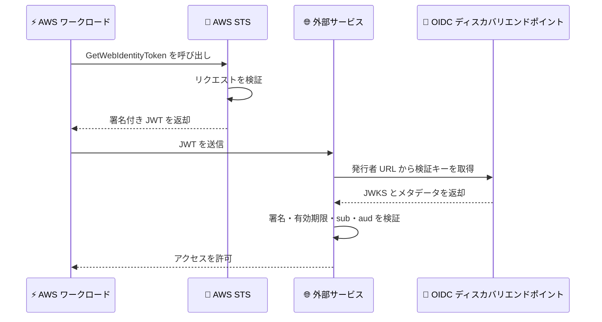

# AWS IAM - 外部サービスへの ID フェデレーションが AWS European Sovereign Cloud リージョンで利用可能に

**リリース日**: 2026 年 8 月 18 日
**サービス**: AWS Identity and Access Management (IAM) / AWS Security Token Service (STS)
**機能**: アウトバウンド ID フェデレーション (Outbound Identity Federation) の AWS European Sovereign Cloud 対応

📊 [このアップデートのインフォグラフィックを見る](https://takech9203.github.io/aws-news-summary/20260818-aws-iam-european-sovereign-cloud.html)

## 概要

AWS IAM のアウトバウンド ID フェデレーション機能が、AWS European Sovereign Cloud (ドイツ) リージョンで利用可能になりました。この機能により、AWS European Sovereign Cloud 上で稼働するワークロードは、有効期限の短い JSON Web Token (JWT) を使用して外部サービスに対して安全に認証できます。

AWS European Sovereign Cloud は、完全に欧州連合 (EU) 域内に配置された、欧州のための独立したクラウドであり、お客様のソブリンティ (主権) 要件への対応を支援するために構築されています。今回のアップデートにより、ソブリンティ要件を持つ組織でも、サードパーティのクラウドプロバイダー、SaaS プラットフォーム、セルフホスト型アプリケーションとの安全な連携が、長期認証情報や複雑な回避策なしに実現できるようになりました。

ワークロードは IAM 認証情報を暗号学的に署名された短期間有効な JWT と交換し、この JWT にはワークロードに関する豊富なコンテキスト情報がクレームとして含まれます。外部サービスはこの情報を利用して、きめ細かなアクセス制御を実装できます。管理者は IAM ポリシーを通じてトークンの生成を統制し、トークンの有効期間、オーディエンス、署名アルゴリズムなどのプロパティを制御できます。また、AWS CloudTrail のログによりトークンの利用状況を監査し、セキュリティおよびコンプライアンス要件を満たすことができます。

**アップデート前の課題**

- AWS European Sovereign Cloud 上のワークロードから外部サービスに認証する際、API キーやパスワードなどの長期認証情報をアプリケーションコードや環境変数に保存する必要があった
- 長期認証情報は漏洩リスクやローテーション運用の負担が大きく、セキュリティポスチャの低下要因となっていた
- ソブリンティ要件を満たしながらマルチクラウドやハイブリッド構成の認証を実現するには、複雑な回避策が必要だった

**アップデート後の改善**

- AWS European Sovereign Cloud 上のワークロードが、STS の `GetWebIdentityToken` API を呼び出して短期間有効な JWT を取得し、外部サービスへ安全に認証できるようになった
- 長期認証情報の保存が不要になり、認証情報の漏洩リスクとローテーション運用の負担が軽減された
- IAM ポリシーによるトークン生成の統制と、CloudTrail による監査証跡の取得が可能になり、コンプライアンス報告に活用できるようになった

## アーキテクチャ図



AWS European Sovereign Cloud 上のワークロードが STS から JWT を取得し、外部サービスがアカウント固有の OIDC ディスカバリエンドポイントで公開される検証キーを用いてトークンを検証する流れを示しています。

## サービスアップデートの詳細

### 主要機能

1. **短期間有効な JWT による外部サービス認証**
   - ワークロードが STS の `GetWebIdentityToken` API を呼び出し、暗号学的に署名された JWT を取得
   - トークンは公開検証可能であり、外部サービスは well-known エンドポイントで公開される AWS の検証キーを使用して真正性を確認
   - サードパーティクラウド、SaaS プラットフォーム、セルフホスト型アプリケーションなど幅広い外部サービスで利用可能

2. **豊富なコンテキスト情報を含むトークンクレーム**
   - `sub` (ロール ARN など)、`aud`、`iss` (アカウント固有の発行者 URL)、`exp`、`iat`、`jti` などの標準 OIDC クレームを含む
   - アカウント ID、ソースリージョン、プリンシパル ID などの AWS 固有メタデータも付与
   - タグをカスタムクレームとして追加でき、外部サービス側で属性ベースのきめ細かなアクセス制御を実装可能

3. **IAM ポリシーによる統制と監査**
   - アイデンティティポリシー、SCP、RCP、VPC エンドポイントポリシーでトークン生成を制御
   - 条件キー `sts:SigningAlgorithm`、`sts:IdentityTokenAudience`、`sts:DurationSeconds` により、署名アルゴリズム、オーディエンス、有効期間を強制可能
   - すべてのトークンリクエストは CloudTrail に記録され、セキュリティモニタリングとコンプライアンス報告のための完全な監査証跡を提供

## 技術仕様

### GetWebIdentityToken API の主要パラメータ

| 項目 | 詳細 |
|------|------|
| API | `sts:GetWebIdentityToken` |
| Audience | JWT の `aud` クレームに設定される値 |
| DurationSeconds | 60〜3,600 秒 (デフォルト 300 秒) |
| SigningAlgorithm | ES384 または RS256 |
| Tags | カスタムクレームとして JWT に追加されるキーと値のペア (オプション) |
| 発行者 URL | アカウントごとに一意。`/.well-known/openid-configuration` と `/.well-known/jwks.json` を公開 |

### IAM ポリシー例

```json
{
  "Version": "2012-10-17",
  "Statement": [
    {
      "Effect": "Allow",
      "Action": "sts:GetWebIdentityToken",
      "Resource": "*",
      "Condition": {
        "StringEquals": {
          "sts:IdentityTokenAudience": "my-external-service"
        },
        "NumericLessThanEquals": {
          "sts:DurationSeconds": "300"
        }
      }
    }
  ]
}
```

## 設定方法

### 前提条件

1. AWS European Sovereign Cloud リージョンのアカウントを利用していること
2. トークンを取得するワークロードに IAM ロールなどの AWS 認証情報が設定されていること
3. 連携先の外部サービスが OIDC 準拠の JWT 検証 (発行者 URL の登録とクレーム検証) をサポートしていること

### 手順

#### ステップ 1: アウトバウンド ID フェデレーションの有効化

IAM コンソールの [アカウント設定] からアウトバウンド ID フェデレーションを有効化します。有効化すると、AWS がアカウント固有の発行者 URL を生成し、OIDC ディスカバリエンドポイントを公開します。

#### ステップ 2: IAM ポリシーで権限を付与

```json
{
  "Version": "2012-10-17",
  "Statement": [
    {
      "Effect": "Allow",
      "Action": "sts:GetWebIdentityToken",
      "Resource": "*"
    }
  ]
}
```

トークンを取得するワークロードのプリンシパル (実行ロールなど) に `sts:GetWebIdentityToken` の許可を付与します。必要に応じて条件キーでオーディエンスや有効期間を制限します。

#### ステップ 3: 外部サービスに発行者 URL を登録

外部サービス側で、アカウント固有の発行者 URL を信頼できる発行者として登録し、`sub` や `aud` などのクレーム検証ルールと権限マッピングを設定します。

#### ステップ 4: ワークロードから JWT を取得

```python
import boto3

sts_client = boto3.client('sts')
response = sts_client.get_web_identity_token(
    Audience=['my-external-service'],
    SigningAlgorithm='ES384',
    DurationSeconds=300
)
jwt_token = response['WebIdentityToken']
```

ワークロードが既存の AWS 認証情報を使用して `GetWebIdentityToken` を呼び出し、取得した JWT を外部サービスへの認証に使用します。

## メリット

### ビジネス面

- **ソブリンティ要件との両立**: EU 域内に完全に配置された AWS European Sovereign Cloud を利用しながら、外部サービスとの安全な連携が可能になる
- **コンプライアンス対応の強化**: CloudTrail による完全な監査証跡と IAM ポリシーによる統制で、規制の厳しい業界の要件に対応しやすくなる
- **運用コストの削減**: API キーの発行、保管、ローテーションといった長期認証情報の管理業務が不要になる

### 技術面

- **セキュリティポスチャの向上**: 有効期限の短い署名付きトークンにより、認証情報漏洩時の影響範囲を最小化できる
- **きめ細かなアクセス制御**: トークンに含まれる豊富なクレームとカスタムタグを利用し、外部サービス側で属性ベースのアクセス制御を実装できる
- **標準技術による相互運用性**: OIDC 準拠の JWT と JWKS エンドポイントを利用するため、幅広い外部サービスと標準的な方法で連携できる

## デメリット・制約事項

### 制限事項

- トークンの有効期間は 60〜3,600 秒の範囲に制限される
- 署名アルゴリズムは ES384 と RS256 のみサポートされる
- 連携先の外部サービスが OIDC 準拠の JWT 検証 (外部発行者の登録とクレーム検証) に対応している必要がある

### 考慮すべき点

- 発行者 URL はアカウントごとに一意であるため、複数アカウント構成では外部サービス側に各アカウントの発行者を登録する必要がある
- 外部サービス側のクレーム検証設定 (特に `aud` と `sub` の検証) が不十分だと、意図しないワークロードにアクセスを許可するリスクがある
- トークン生成を許可するプリンシパルの範囲は、SCP や条件キーを用いて最小権限に統制することが推奨される

## ユースケース

### ユースケース 1: 外部クラウドプロバイダーのリソースへのアクセス

**シナリオ**: AWS European Sovereign Cloud 上の Lambda 関数がデータを処理し、結果を外部クラウドプロバイダーのストレージサービスに書き込む。

**実装例**:
```python
response = sts_client.get_web_identity_token(
    Audience=['external-cloud-storage'],
    SigningAlgorithm='ES384',
    DurationSeconds=300
)
# 取得した JWT を外部クラウドの認証エンドポイントに送信し、
# 外部クラウドの一時認証情報と交換してストレージに書き込む
```

**効果**: 外部クラウドの API キーを保存することなく、マルチクラウド構成のデータ連携を安全に実現できる。

### ユースケース 2: SaaS 型オブザーバビリティプラットフォームとの統合

**シナリオ**: ソブリンティ要件を持つ企業が、AWS European Sovereign Cloud 上のワークロードのメトリクスを外部のオブザーバビリティ SaaS に送信する。

**実装例**:
```python
response = sts_client.get_web_identity_token(
    Audience=['observability-saas'],
    Tags=[{'Key': 'environment', 'Value': 'production'}],
    SigningAlgorithm='RS256',
    DurationSeconds=600
)
# JWT を SaaS の API に提示してメトリクスを送信する
```

**効果**: カスタムクレームにより SaaS 側で環境ごとのアクセス制御が可能になり、監視基盤との連携を安全に自動化できる。

### ユースケース 3: オンプレミス Kubernetes クラスターとのハイブリッド連携

**シナリオ**: AWS European Sovereign Cloud 上のワークロードが、オンプレミスデータセンターの Kubernetes クラスターで稼働するコンテナアプリケーションと通信する。

**実装例**:
```
1. オンプレミス側の認証基盤に、アカウント固有の発行者 URL を信頼済み発行者として登録
2. ワークロードが GetWebIdentityToken で JWT を取得
3. JWT をオンプレミスアプリケーションへの API リクエストに添付
4. アプリケーションが JWKS エンドポイントで署名を検証しアクセスを許可
```

**効果**: 長期認証情報の配布なしに、EU 域内のクラウドとオンプレミス間で安全なハイブリッドアーキテクチャを構築できる。

## 料金

アウトバウンド ID フェデレーション機能は無料で利用できます。IAM および STS の利用自体に追加料金は発生しません。

## 利用可能リージョン

今回のアップデートにより、AWS European Sovereign Cloud (ドイツ) リージョンで利用可能になりました。

本機能は 2025 年 11 月の発表時点で、すべての AWS 商用リージョン、AWS GovCloud (US) リージョン、中国リージョンで利用可能となっており、今回 AWS European Sovereign Cloud にも拡大されました。

## 関連サービス・機能

- **AWS Security Token Service (STS)**: `GetWebIdentityToken` API を提供し、署名付き JWT を発行する
- **AWS CloudTrail**: すべてのトークンリクエストを記録し、監査証跡を提供する
- **AWS Organizations (SCP / RCP)**: 組織全体でトークン生成のガードレールを設定できる
- **AWS European Sovereign Cloud**: EU 域内に完全に配置された独立したクラウドで、ソブリンティ要件への対応を支援する

## 参考リンク

- 📊 [インフォグラフィック](https://takech9203.github.io/aws-news-summary/20260818-aws-iam-european-sovereign-cloud.html)
- [公式発表 (What's New)](https://aws.amazon.com/about-aws/whats-new/2026/08/aws-iam-european-sovereign-cloud/)
- [AWS Blog: Simplify access to external services using AWS IAM outbound identity federation](https://aws.amazon.com/blogs/aws/simplify-access-to-external-services-using-aws-iam-outbound-identity-federation/)
- [ドキュメント: Federating AWS Identities to external services](https://docs.aws.amazon.com/IAM/latest/UserGuide/id_roles_providers_outbound.html)
- [製品ページ: Outbound identity federation](https://aws.amazon.com/identity/federation/outbound-federation/)

## まとめ

AWS European Sovereign Cloud 上のワークロードから外部サービスへの認証が、長期認証情報なしで実現できるようになりました。EU のソブリンティ要件とマルチクラウド・ハイブリッド連携のセキュリティを両立できる重要なアップデートです。AWS European Sovereign Cloud の利用を検討している組織は、外部サービス連携の認証方式としてアウトバウンド ID フェデレーションの採用を検討することを推奨します。
