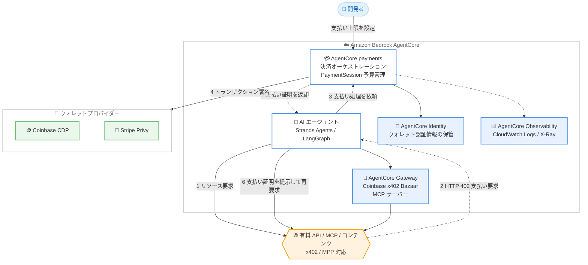

# Amazon Bedrock AgentCore - AgentCore payments の一般提供開始

**リリース日**: 2026 年 8 月 18 日
**サービス**: Amazon Bedrock AgentCore
**機能**: AgentCore payments (一般提供開始)

📊 [このアップデートのインフォグラフィックを見る](https://takech9203.github.io/aws-news-summary/20260818-bedrock-agentcore-payments-ga.html)

## 概要

AWS は、Amazon Bedrock AgentCore の新機能である AgentCore payments の一般提供 (GA) を発表しました。AgentCore payments は、AI エージェントが有料の API、MCP サーバー、コンテンツを数行のコードで自律的に発見・アクセス・支払いできるようにするフルマネージド機能です。エンタープライズが取引を行うエージェントを本番環境で大規模に展開するために必要なセキュリティ、ガードレール、可観測性を提供します。

AI エージェントによる取引は多くの場合 1 ドル未満、時には 1 セント未満のマイクロトランザクションであり、最低取引手数料が課されるクレジットカードなどの従来の決済手段ではコスト面で成立しませんでした。AgentCore payments は、ステーブルコインと x402 や Machine Payments Protocol (MPP) などのオープンな HTTP ネイティブプロトコルを活用することで、コスト効率の高いマイクロトランザクションを実現します。Coinbase CDP および Stripe Privy のウォレットと統合し、複数プロトコルにまたがる決済オーケストレーション、インフラレイヤーで強制される設定可能な支払い上限、AgentCore Observability によるエンドツーエンドの可観測性を提供します。

GA 時点では、AgentCore コンソール内で Coinbase 認証情報を直接プロビジョニングできる Quick Create、AgentCore Gateway 経由で従量課金型 x402 エンドポイントを公開するキュレーション済みの Coinbase Bazaar MCP サーバー、Machine Payment Protocol (MPP) のサポート、推論ごとの課金や動的価格設定のユースケースに対応する x402 プロトコルの「upto」スキームが含まれます。

**アップデート前の課題**

- エージェントがアクセスする外部サービスプロバイダーごとに個別の課金関係を確立・管理する必要があり、運用負荷が高かった
- 個々の API 呼び出しの価値がセント単位であるのに対し、従来の決済手段は最低取引手数料を課すため、マイクロトランザクションが経済的に成立しなかった
- サードパーティウォレットの統合、決済オーケストレーションの構築、新興のエージェントプロトコルへの対応、可観測性の確立に数か月のエンジニアリング工数が必要だった
- 自律的に動作するエージェントの暴走的な支出を防ぐためのガバナンスフレームワークや予算管理を独自に構築する必要があった

**アップデート後の改善**

- 数行のコードでエージェントに決済機能を追加でき、開発工数を数か月から数日に短縮できる
- x402 と MPP のオープンプロトコルにより、リアルタイムのエージェント対マーチャントのマイクロトランザクションが可能になった
- PaymentSession ごとの予算上限 (maxSpendAmount) と有効期限により、インフラレイヤーで支出を制御できるようになった
- Coinbase x402 Bazaar MCP サーバーを通じて、10,000 以上の従量課金型 x402 エンドポイントを AgentCore Gateway 経由で発見・利用できるようになった

## アーキテクチャ図



AI エージェントが有料リソースにアクセスすると、マーチャントは HTTP 402 ステータスコードで支払いを要求します。AgentCore payments が設定済みウォレットプロバイダーによるトランザクション署名から支払い証明の返却までのライフサイクル全体を管理し、エージェントは支払い証明を提示してリソースへのアクセスを完了します。

## サービスアップデートの詳細

### 主要機能

1. **決済オーケストレーション**
   - x402 プロトコルと Machine Payments Protocol (MPP) というオープンな HTTP ネイティブ標準を使用した決済を調整
   - 両プロトコルとも HTTP 402 Payment Required ステータスコードを使用してプログラマティックな支払いを実現
   - マーチャントからの支払い要求の受信、設定済みウォレットプロバイダーによるトランザクション署名、エージェントがマーチャントに提出する支払い証明の返却まで、エージェント側のライフサイクル全体を管理
   - マルチステップフローと例外処理を自動的に処理

2. **支払い上限 (Payment limits)**
   - ユーザーレベルとエージェントレベルの両方で詳細な予算管理を設定可能
   - 各 PaymentSession に予算上限 (maxSpendAmount、通貨) と有効期限を設定
   - セッションの期限切れまたは予算到達時に、以降の支払い要求を拒否
   - 予算控除後に支払い署名が失敗した場合、失敗した支払い分の予算は控除されない

3. **サードパーティウォレット統合**
   - Coinbase CDP と Stripe (Privy) の 2 プロバイダーによる組み込みステーブルコインウォレット操作をサポート
   - API キーやウォレットシークレットなどの機密認証情報は AgentCore Identity に PaymentCredentialProvider として安全に保管
   - どのエージェントがウォレットリソースにアクセスできるかを制限可能
   - GA で追加された Quick Create により、AgentCore コンソール内で直接 Coinbase 認証情報をプロビジョニング可能

4. **エンドポイントの発見性 (Coinbase x402 Bazaar)**
   - すぐに利用可能な Coinbase x402 Bazaar MCP サーバーを提供
   - AgentCore Gateway を通じて 10,000 以上の従量課金型 x402 エンドポイントを公開
   - コンソールまたは CLI から x402 対応サービスを検索し、Gateway のターゲットとして追加可能

5. **x402「upto」スキームのサポート**
   - 推論ごとの課金 (pay-per-inference) や動的価格設定のユースケースに対応
   - 事前に確定できない金額の取引に上限額を指定して支払いを承認可能

6. **可観測性**
   - Amazon CloudWatch による決済ライフサイクル全体のエンドツーエンドの可視化
   - すべてのデータプレーン API 呼び出しについて、vended logs (CloudWatch ロググループへの自動出力) と vended spans (AWS X-Ray で閲覧可能なトレースレコード) を提供
   - トランザクション成功率の監視、支出パターンの追跡、エラー診断が可能

## 技術仕様

### 対応プロトコルと統合

| 項目 | 詳細 |
|------|------|
| 対応プロトコル | x402 (upto スキーム含む)、Machine Payments Protocol (MPP) |
| ウォレットプロバイダー | Coinbase CDP、Stripe (Privy) |
| 決済手段 | ステーブルコインによるマイクロトランザクション |
| 予算管理 | PaymentSession 単位の maxSpendAmount、通貨、有効期限 |
| 認証情報管理 | AgentCore Identity (PaymentCredentialProvider) |
| エンドポイント発見 | Coinbase x402 Bazaar MCP サーバー (10,000 以上のエンドポイント) |
| 対応エージェントフレームワーク | Strands Agents、LangGraph など |
| アクセス方法 | AWS CLI、AWS SDK、AgentCore SDK、AgentCore CLI、AWS Management Console |
| コーディングアシスタント | Claude Code、Kiro、Codex 用のスキルを提供 (AWS agent toolkit の AgentCore Payments skill) |
| 可観測性 | CloudWatch Logs (vended logs)、AWS X-Ray (vended spans) |

### API 変更履歴

| 日付 | サービス | 変更内容 |
|------|----------|----------|
| 2026/08/14 | [bedrock-agentcore-control](https://awsapichanges.com/archive/changes/6e07fe-bedrock-agentcore-control.html) | 9 updated api methods - MPP と x402 upto スキームのサポートを AgentCore Payments に追加 |
| 2026/08/14 | [bedrock-agentcore](https://awsapichanges.com/archive/changes/6e07fe-bedrock-agentcore.html) | 5 updated api methods - MPP ゲート付きリソースへの支払いと x402 upto スキームを必要とするサービスへの支払いに対応 |

## 設定方法

### 前提条件

1. AWS アカウントと Amazon Bedrock AgentCore が利用可能なリージョンへのアクセス
2. Coinbase CDP または Stripe (Privy) のウォレットアカウント (Coinbase は GA で追加された Quick Create によりコンソールから直接プロビジョニング可能)
3. AgentCore payments の API を呼び出すための IAM 権限

### 手順

#### ステップ 1: ウォレット認証情報のプロビジョニング

AgentCore コンソールの Quick Create を使用して Coinbase 認証情報をプロビジョニングします。認証情報は AgentCore Identity に PaymentCredentialProvider として安全に保管されます。既存の Coinbase API キーや Stripe/Privy ウォレット認証情報を登録することも可能です。

#### ステップ 2: 支払いリソースのスキャフォールディング

```bash
# AWS agent toolkit の AgentCore Payments skill を使用して
# 支払いリソースを作成し、エージェントに支払い処理ツールを追加
# コーディングアシスタント (Claude Code、Kiro、Codex) のスキル、
# または AgentCore CLI から実行
agentcore payments --help
```

AWS agent toolkit の AgentCore Payments skill を使用すると、支払いリソースのスキャフォールディングと process payment ツールのエージェントへの追加を自動化できます。サンプルコードは [awslabs/agentcore-samples](https://github.com/awslabs/agentcore-samples/tree/main/01-features/08-agents-that-transact) リポジトリで提供されています。

#### ステップ 3: PaymentSession の作成と支払い上限の設定

PaymentSession を作成し、予算上限 (maxSpendAmount、通貨) と有効期限を設定します。セッションの予算に達するか有効期限が切れると、以降の支払い要求はインフラレイヤーで拒否されます。

#### ステップ 4: 有料エンドポイントの発見と接続

AgentCore Gateway で Coinbase x402 Bazaar MCP サーバーを設定し、コンソールまたは CLI から x402 対応サービスを検索して Gateway のターゲットとして追加します。Strands Agents や LangGraph などのエージェントフレームワークと統合し、ランタイムで支払い処理を実行します。

## メリット

### ビジネス面

- **新しいビジネスモデルへの対応**: サブスクリプション契約なしで、有料 API やペイウォール付きコンテンツへの従量課金アクセスが可能になり、エージェントの活用範囲が拡大する
- **開発期間の大幅短縮**: ウォレット統合や決済オーケストレーションの独自構築に必要だった数か月の工数を数日に短縮できる
- **コスト管理の強化**: PaymentSession 単位の予算上限により、エージェントの支出をインフラレイヤーで確実に制御でき、暴走的な支出を防止できる

### 技術面

- **オープンプロトコル準拠**: x402 と MPP という HTTP ネイティブのオープン標準に準拠し、特定ベンダーへのロックインを回避しつつ幅広いマーチャントと相互運用できる
- **マイクロトランザクションの実現**: ステーブルコインの活用により、従来の決済手段では手数料負けしていた 1 セント未満の取引が経済的に成立する
- **エンドツーエンドの可観測性**: vended logs と vended spans により、決済ライフサイクル全体のトランザクション成功率、支出パターン、エラーを CloudWatch と X-Ray で監視できる

## デメリット・制約事項

### 制限事項

- ウォレットプロバイダーは Coinbase CDP と Stripe (Privy) の 2 社に限定される
- 決済手段はステーブルコインベースであり、従来の法定通貨決済 (クレジットカードなど) には対応しない
- 東京リージョンを含むアジアパシフィックの多くのリージョンでは未提供 (シンガポール、シドニーのみ対応)
- マーチャント側が x402 または MPP プロトコルに対応している必要がある

### 考慮すべき点

- ステーブルコインを利用するため、組織のコンプライアンス要件や暗号資産の取り扱いポリシーとの整合性を事前に確認する必要がある
- ウォレット操作ごとにプロバイダーの手数料が発生するため、大量のトランザクションを行う場合はコスト試算が必要
- エージェントに支払い権限を付与するため、AgentCore Identity によるアクセス制御と PaymentSession の予算設計を慎重に行う必要がある

## ユースケース

### ユースケース 1: 予算制約付きリサーチエージェント

**シナリオ**: 調査エージェントに月次予算を割り当て、必要に応じて専門的な有料データソースへのアクセスを購入させ、コスト制約内でインサイトを提供させる。

**実装例**:
```text
1. PaymentSession を作成し、maxSpendAmount に月次予算を設定
2. Coinbase x402 Bazaar MCP サーバーから有料データソースを検索
3. エージェントが調査タスクに最適なデータソースを選択し、
   従量課金でアクセスを購入
4. 予算到達時は支払いが自動的に拒否され、超過を防止
```

**効果**: 人手による課金契約なしで、エージェントがコスト制約を守りながら最適な有料データソースを自律的に活用できる。

### ユースケース 2: リアルタイム市場データを活用した金融分析

**シナリオ**: 金融アナリストがエージェントを使用し、ペイウォールの背後にあるリアルタイム市場データ (専有金融データベースや取引プラットフォームなど) への支払いを行い、投資判断のための分析を実行する。

**実装例**:
```text
1. x402 対応の金融データ API を AgentCore Gateway のターゲットに追加
2. エージェントが分析に必要なデータをリクエスト
3. HTTP 402 応答に対して AgentCore payments が自動的に支払いを処理
4. CloudWatch でデータ取得コストと支出パターンを監視
```

**効果**: 複数のデータプロバイダーと個別に年間契約を結ぶことなく、必要なデータのみを従量課金で取得し、分析コストを最適化できる。

### ユースケース 3: 推論ごとの課金による動的なモデルルーティング

**シナリオ**: エージェントがタスクごとに最適な AI モデルへ動的にルーティングし、複数のモデルプロバイダーとのサブスクリプション契約を維持することなく、実際のトークン使用量分のみを支払う。

**実装例**:
```text
1. x402 の upto スキームを使用し、推論リクエストごとに支払い上限を指定
2. エージェントがタスクの特性に応じて最適なモデルエンドポイントを選択
3. 実際のトークン使用量に基づく動的価格で支払いが確定
4. vended spans で各モデルへの支出をトレース
```

**効果**: pay-per-inference モデルにより、複数プロバイダーのサブスクリプション費用を削減しつつ、タスクごとに最適なモデルを利用できる。

## 料金

AgentCore payments 自体に AWS の追加料金はなく、前払いや最低料金も不要です。課金対象はウォレット操作を伴う 2 つの API (CreateInstrument と ProcessPayment) のみで、料金は選択したウォレットプロバイダーのウォレット操作手数料として発生します。それ以外の API 呼び出しは無料です。

| API | Coinbase CDP | Stripe Privy |
|------|------|------|
| CreateInstrument (ウォレットアドレス生成) | ウォレット操作 1 回分の手数料 | 無料 |
| ProcessPayment (トランザクション署名) | ウォレット操作 1 回分の手数料 | ウォレット操作 1 回分の手数料 |
| その他の API | 無料 | 無料 |

### 料金例

料金ページの例では、Coinbase CDP のウォレット操作手数料を 1 回あたり $0.005 として計算されています。

| 使用量 | 月額料金 (概算) |
|--------|------------------|
| ProcessPayment 270,000 回 (Coinbase CDP) | $1,350 |

なお、エージェントがマーチャントに支払うマイクロトランザクション自体 (コンテンツや API の利用料) は、上記とは別にマーチャントへの支払いとして発生します。最新の料金は [AgentCore 料金ページ](https://aws.amazon.com/bedrock/agentcore/pricing/) を参照してください。

## 利用可能リージョン

AgentCore payments は以下の 12 リージョンで利用可能です (2026 年 8 月 18 日時点のドキュメントに基づく)。

- 米国東部 (バージニア北部、オハイオ)
- 米国西部 (オレゴン)
- 欧州 (フランクフルト、アイルランド、ロンドン、ミラノ、パリ、スペイン、ストックホルム)
- アジアパシフィック (シンガポール、シドニー)

東京リージョンおよび AWS GovCloud (US) では現時点で利用できません。最新のリージョン対応状況は [AgentCore リージョン一覧](https://docs.aws.amazon.com/bedrock-agentcore/latest/devguide/agentcore-regions.html) を参照してください。

## 関連サービス・機能

- **AgentCore Identity**: Coinbase API キーや Stripe/Privy ウォレット認証情報を PaymentCredentialProvider として安全に保管し、最小権限の原則に基づくアクセス制御を実現する
- **AgentCore Gateway**: 有料 MCP サーバーへの安全な接続を提供し、Coinbase x402 Bazaar との事前統合により数千の有料 MCP ツールを発見できる
- **AgentCore Browser**: AgentCore payments と組み合わせることで、x402 対応のペイウォール付き Web サイトへ自律的かつ安全にアクセスできる
- **AgentCore Observability**: 本番環境における AI エージェントのトレース、デバッグ、パフォーマンス監視を支援し、AgentCore payments のメトリクスとトレースを可視化する

## 参考リンク

- 📊 [インフォグラフィック](https://takech9203.github.io/aws-news-summary/20260818-bedrock-agentcore-payments-ga.html)
- [公式発表 (What's New)](https://aws.amazon.com/about-aws/whats-new/2026/08/bedrock-agentcore-payments-ga/)
- [AWS Blog: Amazon Bedrock AgentCore payments is now generally available](https://aws.amazon.com/blogs/machine-learning/amazon-bedrock-agentcore-payments-is-now-generally-available-enabling-agents-to-transact-safely-and-autonomously-at-scale/)
- [ドキュメント: AgentCore payments](https://docs.aws.amazon.com/bedrock-agentcore/latest/devguide/payments.html)
- [サンプルコード: agents-that-transact (GitHub)](https://github.com/awslabs/agentcore-samples/tree/main/01-features/08-agents-that-transact)
- [料金ページ](https://aws.amazon.com/bedrock/agentcore/pricing/)
- [利用可能リージョン一覧](https://docs.aws.amazon.com/bedrock-agentcore/latest/devguide/agentcore-regions.html)

## まとめ

AgentCore payments の GA により、AI エージェントが有料 API、MCP サーバー、コンテンツへ自律的に支払いを行う「取引するエージェント」を、エンタープライズグレードのガードレールと可観測性のもとで本番展開できるようになりました。x402 や MPP といったオープンプロトコルとステーブルコインによるマイクロトランザクションは、エージェントエコノミーの基盤となる重要な技術トレンドです。エージェントによる従量課金型の外部リソース活用を検討している場合は、awslabs のサンプルコードと Coinbase x402 Bazaar MCP サーバーから評価を開始することを推奨します。ただし、東京リージョンは未対応である点と、暗号資産 (ステーブルコイン) の取り扱いに関する組織のコンプライアンス要件を事前に確認してください。
