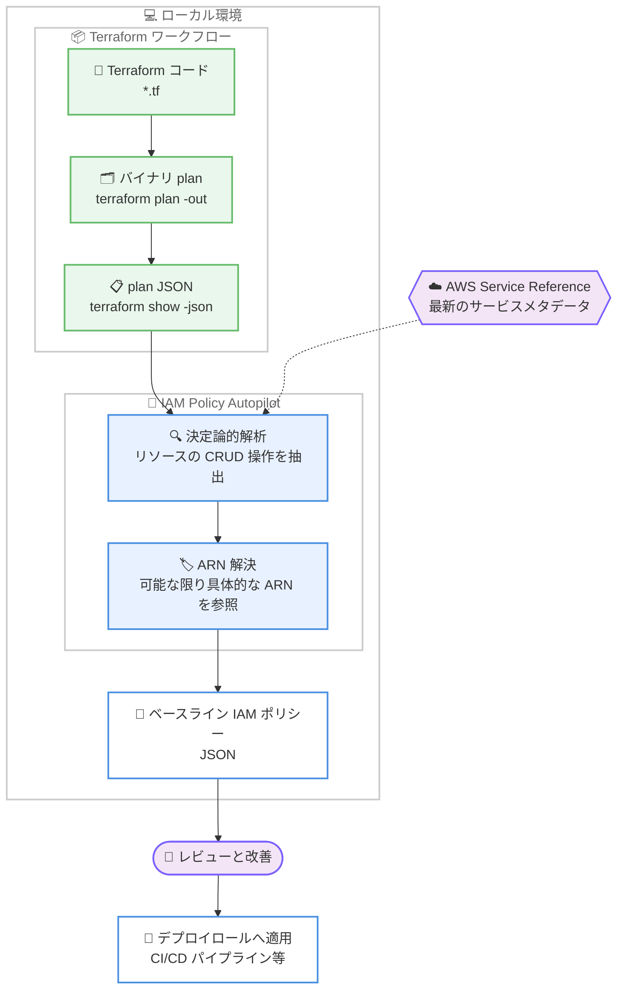

# AWS IAM - IAM Policy Autopilot による Terraform plan ファイルのサポート

**リリース日**: 2026 年 8 月 18 日
**サービス**: AWS Identity and Access Management (IAM) / IAM Policy Autopilot (オープンソースツール)
**機能**: Terraform plan ファイルからの IAM ポリシー自動生成

📊 [このアップデートのインフォグラフィックを見る](https://takech9203.github.io/aws-news-summary/20260818-iam-policy-autopilot-now-supports-terraform-plan-files.html)

## 概要

IAM Policy Autopilot が、Terraform plan ファイルを入力として、インフラデプロイ用のベースライン IAM ポリシーを直接生成できるようになりました。IAM Policy Autopilot は re:Invent 2025 で発表されたオープンソースツールで、コードを決定論的 (deterministic) に解析し、スコープを絞り込んだ IAM ポリシーを生成します。生成されたポリシーはアプリケーションの進化に合わせて改善していくベースラインとして利用でき、IAM ポリシーの作成やアクセス許可のトラブルシューティングにかかる時間を削減します。

これまで IAM Policy Autopilot はアプリケーションのソースコード (AWS SDK 呼び出し) の解析のみに対応しており、Infrastructure as Code (IaC) で定義された AWS インフラを「デプロイするため」のポリシーを生成することはできませんでした。今回のアップデートにより、Terraform plan ファイル (JSON 形式) を入力として渡すと、plan に含まれるリソースの CRUD 操作にスコープされたポリシーが決定論的解析によって生成されます。生成されるポリシーは、可能な場合はワイルドカードではなく具体的なリソース ARN を参照します。

Terraform によるインフラデプロイ用のポリシー生成は、IAM Policy Autopilot のローンチ以来最も要望の多かった機能です。既存の Terraform 対応解析 (Terraform リソース定義とアプリケーションコード内の SDK 呼び出しを相互参照して ARN を解決する機能) を補完する位置づけとなります。対象ユーザーは、Terraform で AWS インフラを管理する開発者、DevOps エンジニア、プラットフォームチーム、そして CI/CD パイプライン用のデプロイロールを設計するセキュリティ担当者です。

**アップデート前の課題**

- 以前はアプリケーションソースコードの解析のみに対応しており、Terraform で定義したインフラをデプロイするためのポリシーは生成できなかった
- Terraform のデプロイロール (CI/CD パイプラインが引き受けるロールなど) のポリシーは手動で作成する必要があり、`AdministratorAccess` のような過剰な権限を付与しがちだった
- デプロイ時の AccessDenied エラーを試行錯誤で解決する必要があり、権限の絞り込みに時間がかかっていた

**アップデート後の改善**

- Terraform plan ファイル (JSON 形式) を入力として渡すだけで、plan 内のリソースの CRUD 操作にスコープされたベースラインポリシーを生成できるようになった
- 可能な場合はワイルドカードではなく具体的なリソース ARN を参照するポリシーが生成され、最小権限の原則に近づけやすくなった
- 決定論的解析のため、同じ plan からは常に一貫した結果が得られ、生成 AI の推測に依存しないポリシー作成が可能になった

## アーキテクチャ図



Terraform plan を JSON 形式に変換して IAM Policy Autopilot に渡すと、plan 内のリソースに対する CRUD 操作にスコープされたベースライン IAM ポリシーがローカルで生成される流れを示しています。

## サービスアップデートの詳細

### 主要機能

1. **Terraform plan ファイルからのポリシー生成**
   - `terraform show -json` で JSON 形式に変換した plan ファイルを `generate-policies` コマンドの入力として指定可能
   - plan に含まれるリソースの作成・読み取り・更新・削除 (CRUD) 操作にスコープされたポリシーを生成
   - 入力の種類 (ソースコードか Terraform plan か) は自動検出される。ただし 1 回の実行で両者を混在させることはできない

2. **具体的な ARN を参照するポリシー**
   - 可能な場合、ワイルドカード (`*`) ではなく具体的なリソース ARN を Resource 要素に指定
   - `--region` と `--account` オプションで ARN 構築に使用するリージョンとアカウント ID を指定可能
   - 最小権限の原則に沿ったベースラインを短時間で用意できる

3. **決定論的解析**
   - 生成 AI の推測ではなく、静的かつ決定論的な解析によりポリシーを生成
   - 同じ plan からは常に一貫した結果が得られ、再現性がある
   - AWS Service Reference エンドポイントから最新のサービスメタデータを取得し、新しいサービスやアクションにも追随

4. **既存の Terraform 対応解析との補完関係**
   - 既存機能: Terraform リソース定義とアプリケーションコード内の SDK 呼び出しを相互参照し、アプリケーション実行ロール用ポリシーの ARN を解決
   - 新機能: Terraform plan そのものを入力として、インフラを「デプロイするロール」用のポリシーを生成
   - アプリケーション実行時の権限とデプロイ時の権限の両方をカバーできるようになった

## 技術仕様

### IAM Policy Autopilot の概要

| 項目 | 詳細 |
|------|------|
| 提供形態 | オープンソース (Apache 2.0 ライセンス)、awslabs GitHub リポジトリで公開 |
| 実行環境 | ローカルマシン上で実行 (Rust 製 CLI / MCP サーバー、PyPI パッケージ `iam-policy-autopilot` としても配布) |
| 入力 (既存) | アプリケーションソースコード (Python、Go、TypeScript、JavaScript、Java) |
| 入力 (新規) | Terraform plan ファイル (JSON 形式、`terraform show -json` で生成) |
| 出力 | IAM アイデンティティベースポリシー (JSON) |
| ネットワーク要件 | `servicereference.us-east-1.amazonaws.com` への HTTPS アクセス (サービスメタデータ取得用) |
| 利用方法 | CLI (`generate-policies`、`fix-access-denied`)、MCP サーバー (AI コーディングアシスタント連携)、Kiro Power |

### generate-policies コマンドの主なオプション

| オプション | 説明 |
|------|------|
| `--region <REGION>` | リソース ARN に使用する AWS リージョン |
| `--account <ACCOUNT>` | リソース ARN に使用する AWS アカウント ID |
| `--service-hints <SERVICES>` | 解析対象のサービスを限定し、不要な権限を削減 (ソースコード解析時) |
| `--upload-policies <PREFIX>` | 生成したポリシーを指定プレフィックス付きで AWS IAM にアップロード |
| `--explain <PATTERN>` | 特定のアクションが含まれた理由を表示 (例: `--explain 's3:*'`) |
| `--pretty` | JSON 出力を整形して表示 |

## 設定方法

### 前提条件

1. Terraform がインストールされ、対象の Terraform 構成が初期化済みであること (`terraform init`)
2. IAM Policy Autopilot がインストールされていること (uv / pip / インストールスクリプトのいずれか)
3. インターネット経由で AWS Service Reference エンドポイントにアクセスできること

### 手順

#### ステップ 1: IAM Policy Autopilot のインストール

```bash
# pip でインストールする場合
pip install iam-policy-autopilot

# uv を利用する場合はインストール不要で直接実行可能
# uvx iam-policy-autopilot --version
```

pip または uv を使用して IAM Policy Autopilot をインストールします。uv を使用する場合は `uvx` コマンドで直接実行できるため、事前インストールは不要です。

#### ステップ 2: Terraform plan の作成と JSON への変換

```bash
# バイナリ形式の plan ファイルを出力
terraform plan -out=plan.tfplan

# plan を JSON 形式に変換
terraform show -json plan.tfplan > plan.json
```

`terraform plan -out` でバイナリ形式の plan ファイルを保存し、`terraform show -json` で IAM Policy Autopilot が解析できる JSON 形式に変換しています。

#### ステップ 3: plan ファイルからポリシーを生成

```bash
iam-policy-autopilot generate-policies plan.json --pretty
```

JSON 形式の plan ファイルを入力として渡し、plan 内のリソースの CRUD 操作にスコープされた IAM ポリシーを生成しています。入力の種類は自動検出されるため、専用のフラグ指定は不要です。`--region` や `--account` を指定すると、ARN の構築に使用されます。

#### ステップ 4: 生成されたポリシーのレビューと適用

生成されたポリシーはベースラインです。組織のセキュリティ要件に沿っているかレビューし、必要に応じて条件キーの追加や権限の絞り込みを行ったうえで、CI/CD パイプラインのデプロイロールなどに適用します。

## メリット

### ビジネス面

- **デプロイロール作成の時間短縮**: Terraform デプロイ用の IAM ポリシーを手動で書き起こす作業が不要になり、インフラ構築の立ち上げが加速する
- **セキュリティリスクの低減**: `AdministratorAccess` のような広すぎる権限をデプロイロールに付与する慣行を減らし、最小権限の原則に近づけられる
- **追加コストなし**: オープンソースで無料。ローカルマシン上で動作するため、追加の AWS 利用料金も発生しない

### 技術面

- **決定論的で再現性のある解析**: 生成 AI の推測に依存せず、同じ plan から常に一貫したポリシーが得られる
- **具体的な ARN の参照**: 可能な場合はワイルドカードではなくリソース ARN を指定したポリシーが生成され、スコープの絞り込みが容易
- **既存ワークフローとの親和性**: `terraform plan` / `terraform show -json` という標準的な Terraform ワークフローの出力をそのまま利用でき、CI/CD への組み込みも容易

## デメリット・制約事項

### 制限事項

- Terraform plan は JSON 形式である必要があり、バイナリ形式の plan をそのまま入力することはできない (`terraform show -json` での変換が必要)
- 1 回の実行でソースコードと Terraform plan を混在させて入力することはできない
- 生成されるのはアイデンティティベースポリシーのみで、リソースベースポリシー (S3 バケットポリシー、KMS キーポリシーなど)、SCP、RCP、Permissions Boundary には対応していない

### 考慮すべき点

- 生成されるポリシーはあくまでベースラインであり、デプロイ前に必ずレビューして組織のセキュリティ要件に適合させる必要がある
- 実行時に AWS Service Reference エンドポイント (`servicereference.us-east-1.amazonaws.com`) への HTTPS アクセスが必要なため、プロキシ環境では `HTTPS_PROXY` の設定などが必要になる場合がある

## ユースケース

### ユースケース 1: CI/CD パイプライン用デプロイロールの権限設計

**シナリオ**: GitHub Actions や AWS CodePipeline から Terraform を実行する際、デプロイロールに広すぎる権限を付与している。監査で指摘を受け、plan の内容に即した最小限の権限に絞り込みたい。

**実装例**:
```bash
terraform plan -out=plan.tfplan
terraform show -json plan.tfplan > plan.json
iam-policy-autopilot generate-policies plan.json \
  --region ap-northeast-1 --account 123456789012 --pretty
```

**効果**: plan に含まれるリソースの CRUD 操作に限定されたポリシーが得られ、デプロイロールの権限を大幅に絞り込める。

### ユースケース 2: 新規 Terraform プロジェクト立ち上げ時の初期ポリシー作成

**シナリオ**: 新しいワークロードを Terraform で構築する。デプロイに必要な権限が事前にわからず、AccessDenied エラーの試行錯誤に時間を取られたくない。

**実装例**:
```bash
# plan を JSON 化してポリシーを生成し、ファイルに保存
iam-policy-autopilot generate-policies plan.json --pretty > deploy-policy.json
```

**効果**: デプロイ前に必要な権限の全体像を把握でき、AccessDenied エラーによる手戻りを削減できる。

### ユースケース 3: アプリケーション実行ロールとデプロイロールの一貫した管理

**シナリオ**: アプリケーションコードと Terraform 定義が同じリポジトリにあり、アプリケーション実行時の権限とインフラデプロイ時の権限の両方を管理したい。

**実装例**:
```bash
# アプリケーション実行ロール用 (ソースコード解析)
iam-policy-autopilot generate-policies ./src/app.py \
  --service-hints s3 dynamodb --pretty

# デプロイロール用 (Terraform plan 解析)
iam-policy-autopilot generate-policies plan.json --pretty
```

**効果**: 同一ツールで実行時権限とデプロイ時権限の両方をカバーでき、IAM ポリシー管理のワークフローを統一できる。

## 料金

IAM Policy Autopilot はオープンソースツールであり、追加コストなしで利用できます。ユーザー自身のマシン上で動作するため、AWS 側の利用料金も発生しません。

## 利用可能リージョン

リージョンに依存しないローカル実行型のオープンソースツールです。GitHub リポジトリおよび PyPI から誰でも入手できます。なお、実行時に AWS Service Reference エンドポイント (`servicereference.us-east-1.amazonaws.com`) へのアクセスが必要です。

## 関連サービス・機能

- **AWS IAM**: 生成されたアイデンティティベースポリシーを適用する対象サービス。IAM Access Analyzer と組み合わせて未使用権限の検出・絞り込みも可能
- **Terraform**: plan ファイル (`terraform plan` / `terraform show -json`) が今回の新しい入力ソース。デプロイロールの権限設計を自動化できる
- **AI コーディングアシスタント (Kiro、Claude Code など)**: IAM Policy Autopilot は MCP サーバーとしても動作し、コーディングアシスタントからポリシー生成を呼び出せる。Kiro 向けには Kiro Power も提供

## 参考リンク

- 📊 [インフォグラフィック](https://takech9203.github.io/aws-news-summary/20260818-iam-policy-autopilot-now-supports-terraform-plan-files.html)
- [公式発表 (What's New)](https://aws.amazon.com/about-aws/whats-new/2026/08/iam-policy-autopilot-now-supports-terraform-plan-files)
- [AWS Security Blog: IAM Policy Autopilot ローンチ記事](https://aws.amazon.com/blogs/security/iam-policy-autopilot-an-open-source-tool-that-brings-iam-policy-expertise-to-builders-and-ai-coding-assistants/)
- [AWS News Blog: Simplify IAM policy creation with IAM Policy Autopilot](https://aws.amazon.com/blogs/aws/simplify-iam-policy-creation-with-iam-policy-autopilot-a-new-open-source-mcp-server-for-builders/)
- [IAM Policy Autopilot GitHub リポジトリ](https://github.com/awslabs/iam-policy-autopilot)
- [PyPI: iam-policy-autopilot](https://pypi.org/project/iam-policy-autopilot/)

## まとめ

IAM Policy Autopilot が Terraform plan ファイルに対応したことで、アプリケーション実行時の権限に加えて、インフラを「デプロイするための」IAM ポリシーも決定論的に生成できるようになりました。ローンチ以来最も要望の多かった機能であり、Terraform を利用するチームはデプロイロールの過剰な権限付与を減らす実用的な手段を得られます。まずは既存の Terraform プロジェクトで `terraform show -json` から plan を生成し、現在のデプロイロールの権限と生成されたベースラインポリシーを比較してみることをお勧めします。
