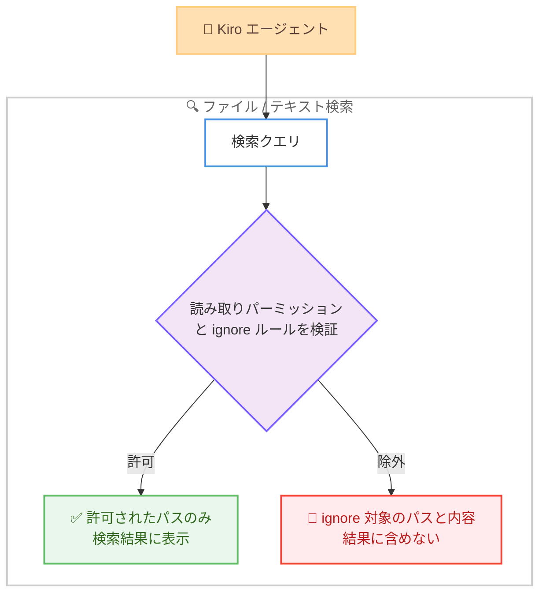
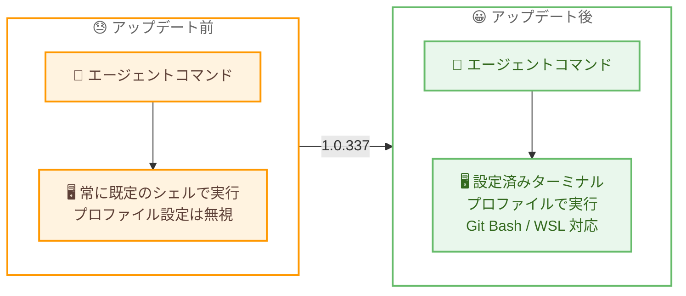

# Kiro - パーミッション改善と Windows 設定シェルのサポート

**リリース日**: 2026 年 8 月 18 日
**サービス**: Kiro (AWS が提供する AI 搭載 IDE)
**機能**: 検索結果からの ignore 対象ファイルの除外、ファイルシステム / コマンドパーミッションルールの改善、Windows での設定済みターミナルプロファイルの利用

📊 [このアップデートのインフォグラフィックを見る](https://takech9203.github.io/aws-news-summary/20260818-kiro-changelog-2026-08-18.html)

## 概要

2026 年 8 月 18 日、Kiro IDE 1.0.337 がリリースされました。本バージョンはエージェントのパーミッション制御とセキュリティ境界の強化に焦点を当てたアップデートです。ファイル検索とテキスト検索のすべての結果が読み取りパーミッションと ignore ルールに照らして検証されるようになり、ignore 対象のパスやその内容が検索結果に表示されなくなりました。

ファイルシステムパーミッションルールも改善され、`src/` や `src/**` のようなディレクトリパターンがディレクトリ本体と配下すべてをカバーするようになったほか、絶対パスや `~/` で始まるパターンが正しくマッチするようになりました。また、保存したルールが確実に機能するか検証できないコマンドについては [Always allow] / [Always deny] の選択肢を非表示にして理由を説明する動作になり、意図しない永続ルールの作成を防ぎます。

さらに、Windows ではエージェントコマンドが Git Bash や WSL を含むデフォルトのターミナルプロファイルで実行されるようになりました。PowerShell 以外のシェルを日常的に使う Windows ユーザーにとって、エージェントの挙動が普段のターミナル環境と一致する重要な改善です。

**アップデート前の課題**

- ファイル検索やテキスト検索の結果に、ignore ルールで除外したはずのパスや内容が表示されることがあった
- ディレクトリパターンの解釈が不完全で、`src/` のような指定がディレクトリ配下を意図どおりカバーしないことがあった
- 絶対パスや `~/` で始まるパーミッションパターンが正しくマッチしないことがあった
- 解析できないコマンドに対しても [Always allow] / [Always deny] を選択でき、実際にはマッチしない永続ルールが作成されることがあった
- 連結された `cmd.exe` コマンドの解析が不正確で、不要な確認プロンプトが発生することがあった
- Windows でエージェントコマンドが常に既定のシェルで実行され、Git Bash や WSL を設定していてもユーザーのターミナルプロファイルが反映されなかった

**アップデート後の改善**

- 検索のすべての結果が読み取りパーミッションと ignore ルールで検証され、ignore 対象のパスと内容が検索結果に現れなくなった
- `src/` と `src/**` のディレクトリパターンが、ディレクトリ本体とその配下すべてをカバーするようになった
- 絶対パスと `~/` で始まるパターンが正しくマッチし、ファイルを変更するコードアクションには書き込みパーミッションが適用されるようになった
- 保存ルールの動作を検証できないコマンドでは [Always allow] / [Always deny] が非表示になり、その理由が説明されるようになった
- 連結された `cmd.exe` コマンドの解析精度が向上し、不要なプロンプトとマッチしないルールが削減された
- Windows でエージェントコマンドが設定済みのターミナルプロファイル (Git Bash、WSL を含む) で実行され、シェルがプロファイルと一致する場合のみエージェントターミナルが再利用されるようになった

## アーキテクチャ図



検索結果のフィルタリングフローを示しています。ファイル検索とテキスト検索のすべての結果が読み取りパーミッションと ignore ルールに照らして検証され、ignore 対象のパスとマッチした内容は結果に表示されません。



Windows でのエージェントコマンド実行の Before/After を示しています。アップデート後は、ユーザーが設定したデフォルトのターミナルプロファイルでエージェントコマンドが実行されます。

## サービスアップデートの詳細

### 主要機能 (Improvements)

1. **ignore 対象ファイルの検索結果からの除外**
   - ファイル検索とテキスト検索が、すべての結果を読み取りパーミッションと ignore ルールに照らして検証するようになった
   - ignore 対象のパスと、それらにマッチする内容が検索結果に表示されなくなった
   - `.kiroignore` などで秘匿したファイルが、検索経由でエージェントのコンテキストに混入するリスクを低減する

2. **ファイルシステムパーミッションルールの改善**
   - `src/` と `src/**` のようなディレクトリパターンが、ディレクトリ本体とその配下すべてをカバーするようになった
   - 絶対パスと `~/` で始まるパターンが正しくマッチするようになった
   - ファイルを変更するコードアクションに書き込みパーミッションが適用されるようになった

3. **解析できないコマンドに対する永続選択の抑止**
   - 保存したルールが機能するか検証できない場合、Kiro は [Always allow] / [Always deny] を非表示にし、その理由を説明する
   - 連結された `cmd.exe` コマンドの解析精度が向上した
   - 不要な確認プロンプトと、実際にはマッチしないルールの作成が削減された

4. **Windows での設定済みシェルの利用**
   - エージェントコマンドが Windows のデフォルトターミナルプロファイルで実行されるようになった (Git Bash、WSL を含む)
   - エージェントターミナルは、シェルがユーザーのプロファイルと一致する場合にのみ再利用される

## 技術仕様

### 各機能の対象と要件

| 項目 | 詳細 |
|------|------|
| 対象バージョン | Kiro IDE 1.0.337 |
| 検索結果の検証対象 | ファイル検索およびテキスト検索のすべての結果 |
| 検証に使用されるルール | 読み取りパーミッションと ignore ルール |
| ディレクトリパターンの解釈 | `src/` と `src/**` はディレクトリ本体と配下すべてをカバー |
| パスパターンのサポート | 絶対パス、`~/` で始まるパターンが正しくマッチ |
| コードアクションの扱い | ファイルを変更するコードアクションは書き込みパーミッションを使用 |
| Windows シェルサポート | デフォルトターミナルプロファイル (Git Bash、WSL を含む) |
| ターミナル再利用条件 | シェルがユーザーのプロファイルと一致する場合のみ |

### パーミッションルールの記述例

```text
# ディレクトリパターン: どちらも src ディレクトリと配下すべてをカバー
src/
src/**

# 絶対パスと ~/ で始まるパターンも正しくマッチ
/home/user/projects/app/config.json
~/projects/app/**
```

## 設定方法

### 前提条件

1. Kiro IDE 1.0.337 以降にアップデートしていること
2. Windows でシェルを切り替える場合は、ターミナルプロファイルを設定できる環境であること

### 手順

#### ステップ 1: Kiro IDE を最新バージョンにアップデートする

Kiro IDE を 1.0.337 以降にアップデートします。検索結果の検証、パーミッションルールの改善、`cmd.exe` コマンド解析の向上は追加の設定なしで適用されます。

#### ステップ 2: ignore ルールとパーミッションルールを確認する

```text
# .kiroignore の例: エージェントから秘匿したいパスを記述
secrets/
*.pem
.env*
```

`.kiroignore` などの ignore ルールと、ファイルシステムパーミッションのディレクトリパターンを確認します。今回のアップデートで `src/` のようなパターンが配下すべてをカバーするようになったため、既存ルールが意図どおりのスコープになっているかを見直します。

#### ステップ 3: Windows のターミナルプロファイルを設定する

```json
// settings.json の例: Git Bash をデフォルトプロファイルに設定
{
  "terminal.integrated.defaultProfile.windows": "Git Bash"
}
```

Windows でエージェントコマンドを実行するシェルを変更したい場合は、ターミナルのデフォルトプロファイルを設定します。エージェントコマンドは設定したプロファイル (Git Bash や WSL など) で実行されるようになります。

## メリット

### ビジネス面

- **情報漏えいリスクの低減**: ignore ルールで秘匿したファイルが検索結果に現れなくなり、認証情報や機密設定がエージェントのコンテキストへ混入するリスクを抑えられる
- **ガバナンスの強化**: 動作を検証できないルールの永続化が抑止されるため、形骸化したパーミッションルールの蓄積を防ぎ、組織のポリシー運用が健全に保たれる
- **Windows 環境での導入障壁の低下**: Git Bash や WSL を標準とする開発チームでも、普段のシェル環境のままエージェントを利用できる

### 技術面

- **パーミッション境界の一貫性**: 検索という迂回経路でも読み取りパーミッションと ignore ルールが適用され、ファイルアクセス制御と検索の挙動が一致する
- **直感的なパターンマッチング**: `src/` と `src/**` が同じスコープをカバーし、絶対パスや `~/` パターンも機能するため、意図どおりのルールを記述しやすい
- **プロンプト疲れの軽減**: 連結された `cmd.exe` コマンドの解析精度向上により、不要な確認プロンプトとマッチしないルールが削減される

## デメリット・制約事項

### 制限事項

- 本アップデートは Kiro IDE (1.0.337) が対象で、Kiro CLI は含まれない
- 解析できないコマンドでは [Always allow] / [Always deny] が非表示になるため、該当コマンドは実行のたびに個別の許可が必要になる
- Windows のエージェントターミナルは、シェルがユーザーのプロファイルと一致する場合にのみ再利用される

### 考慮すべき点

- ignore 対象のファイルが検索結果に表示されなくなるため、これまで検索でヒットしていたパスが見つからない場合は ignore ルールの内容を確認する必要がある
- ディレクトリパターンのカバー範囲が広がったことで、既存のパーミッションルールが従来より広いスコープに適用される可能性があるため、アップデート後にルールの意図を見直すことを推奨

## ユースケース

### ユースケース 1: 機密ファイルを含むリポジトリでのエージェント利用

**シナリオ**: リポジトリ内に環境変数ファイルや証明書などの機密ファイルがあり、エージェントの検索経由でも内容を参照させたくない。

**実装例**:
```text
# .kiroignore
.env*
certs/
*.pem
```

**効果**: ignore 対象のパスとマッチする内容が検索結果に表示されず、機密ファイルがエージェントのコンテキストに混入しない。

### ユースケース 2: ディレクトリ単位の書き込み制御

**シナリオ**: エージェントによるファイル変更を `src/` 配下に限定し、設定ファイルやインフラ定義には書き込ませたくない。

**実装例**:
```text
1. ファイルシステムパーミッションで src/ への書き込みを許可
2. その他のディレクトリは確認プロンプトまたは拒否に設定
3. ファイルを変更するコードアクションにも書き込みパーミッションが適用される
```

**効果**: `src/` の指定がディレクトリ配下すべてをカバーし、コードアクション経由の変更も含めて書き込み範囲を意図どおりに制御できる。

### ユースケース 3: Git Bash / WSL を標準とする Windows 開発チーム

**シナリオ**: Windows 環境で Git Bash や WSL を標準シェルとして開発しており、エージェントが実行するコマンドも同じシェルで動かしたい。

**実装例**:
```json
{
  "terminal.integrated.defaultProfile.windows": "Git Bash"
}
```

**効果**: エージェントコマンドが普段のシェル環境で実行されるため、シェル固有のコマンドやスクリプトがそのまま動作し、手元での再現性が高まる。

## 利用可能リージョン

Kiro はグローバルに提供されており、リージョンの制約はありません。

## 関連サービス・機能

- **.kiroignore / ignore ルール**: エージェントから秘匿するパスを定義する仕組み。今回、検索結果にも一貫して適用されるようになった
- **Kiro パーミッション**: エージェントのファイルシステムアクセスとコマンド実行を制御する仕組み。今回ディレクトリパターンとパスマッチングが改善された
- **Kiro エージェントターミナル**: エージェントがコマンドを実行するターミナル。今回 Windows で設定済みプロファイルを使用するようになった
- **Kiro CLI**: ターミナルから利用できるエージェント型コーディングアシスタント。本アップデートの対象外だが、パーミッション体系を共有する関連プロダクト

## 参考リンク

- 📊 [インフォグラフィック](https://takech9203.github.io/aws-news-summary/20260818-kiro-changelog-2026-08-18.html)
- [Kiro Changelog](https://kiro.dev/changelog/)
- [Kiro IDE 1.0.337 Changelog](https://kiro.dev/changelog/ide/1-0-337/)
- [.kiroignore ドキュメント](https://kiro.dev/docs/kiroignore)
- [パーミッションドキュメント](https://kiro.dev/docs/permissions)
- [ターミナルドキュメント](https://kiro.dev/docs/ide/chat/terminal)

## まとめ

Kiro IDE 1.0.337 は、検索結果への ignore ルール適用、ディレクトリパターンとパスマッチングの改善、検証できないルールの永続化抑止という 3 つの改善により、エージェントのパーミッション境界を一貫性のあるものにするアップデートです。加えて、Windows でのエージェントコマンドが設定済みターミナルプロファイル (Git Bash、WSL を含む) で実行されるようになり、Windows 開発者の体験が大きく向上します。アップデート後は、既存の ignore ルールとパーミッションルールが新しいパターン解釈のもとで意図どおりのスコープになっているかを確認することを推奨します。
