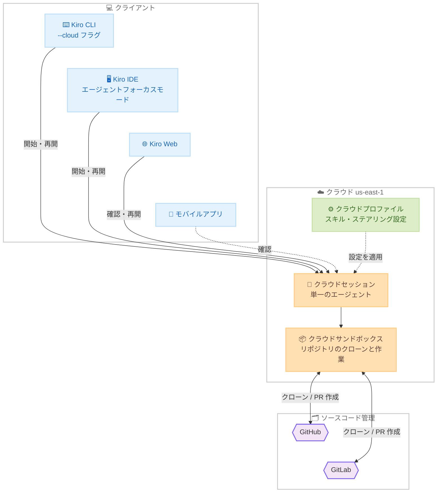

# Kiro - クラウドセッション (プレビュー)

**リリース日**: 2026年8月18日
**サービス**: Kiro (AWS が提供する AI 搭載 IDE)
**機能**: Cloud Sessions (Preview) - CLI / IDE からのクラウドセッション対応

📊 [このアップデートのインフォグラフィックを見る](https://takech9203.github.io/aws-news-summary/20260818-kiro-cloud-sessions.html)

## 概要

Kiro がクラウドセッション (プレビュー) を発表しました。エージェントをローカルマシン上ではなく、クラウド上のサンドボックスで実行できる機能です。エージェントはサンドボックス内にリポジトリをクローンして作業を行い、開発者がラップトップを閉じたり、移動したり、別のマシンに切り替えたりしても、セッションは中断されることなく実行を継続します。

Kiro Web ではすでに同様の体験が提供されていましたが、今回のアップデートにより、この仕組みが CLI と IDE (エージェントフォーカスモード) にも拡張されました。同一のエージェントとセッションがクラウド上に存在するため、CLI、IDE、ブラウザ、モバイルアプリのどのクライアントからでも進捗の確認やセッションの再開が可能です。長時間かかるタスクをエージェントに任せて席を離れる、といった非同期の開発ワークフローを実現します。

**アップデート前の課題**

エージェントの実行がローカルマシンに依存していたため、以下の課題がありました。

- 長時間のタスク中はラップトップをスリープさせられず、`caffeinate` コマンドの実行や画面を開いたままの移動など、マシンを維持する工夫が必要だった
- エージェントの実行状態が特定のマシンに紐付いており、別のマシンやモバイルから進捗を確認したり作業を引き継いだりできなかった
- クラウドで動作するエージェント体験は Kiro Web に限られており、CLI や IDE を好む開発者は利用できなかった

**アップデート後の改善**

- エージェントがクラウドサンドボックスで実行されるため、ラップトップを閉じてもタスクが継続する
- CLI (`--cloud` フラグ)、IDE (エージェントフォーカスモード)、Web、モバイルアプリのいずれからでも同一セッションの確認・再開が可能になった
- 完了した作業はレビュー可能な PR として受け取れるため、非同期のタスク委任ワークフローが確立できる

## アーキテクチャ図



エージェントとセッションはクラウド上に一元的に存在し、CLI・IDE・Web・モバイルのどのクライアントからでも同一セッションにアクセスできます。サンドボックスがリポジトリをクローンして作業し、成果は PR として出力されます。

## サービスアップデートの詳細

### 主要機能

1. **クラウドサンドボックスでのエージェント実行**
   - エージェントがローカルマシンではなくクラウド上のサンドボックスで実行される
   - サンドボックスがリポジトリをクローンし、コード変更から PR 作成までを実施
   - ラップトップのスリープ、ネットワーク切断、マシンの切り替えに影響されず実行が継続する

2. **CLI / IDE からのクラウドセッション対応**
   - CLI: `kiro-cli --cloud` フラグでクラウドセッションを開始。再開も同じコマンドで可能
   - IDE: エージェントフォーカスモードのサイドバーに「Cloud Session」セクションが追加され、実行中および過去のセッション一覧から再開できる
   - Kiro Web と同一のハーネス・エージェント・セッションを共有しており、どのクライアントからでも同じセッションにアクセス可能

3. **マルチリポジトリ・マルチプロバイダー対応**
   - セッション内で `/repo` コマンドにより作業対象リポジトリを選択
   - 複数リポジトリの同時選択が可能で、複数プロジェクトにまたがる変更に対応
   - GitHub と GitLab の両方をサポートし、同一セッション内でプロバイダーの混在も可能

4. **クラウドプロファイルによる設定管理**
   - クラウドセッションはローカルマシンの設定 (`~/.kiro/skills/` などの個人プロファイル) にアクセスできない
   - リポジトリ内の `.kiro/skills` などワークスペース設定はクローンとともに引き継がれる
   - 個人のスキル、ステアリングファイル、カスタムエージェントは Kiro Web (app.kiro.dev) のクラウドプロファイルで管理し、セッションに適用する

5. **音声入力によるプロンプト作成**
   - `/voice` コマンドで音声入力を開始し、Kiro が発話をテキストに変換
   - 長い意図説明をキーボード入力なしでプロンプト化できる

## 技術仕様

### クライアント別の操作方法

| クライアント | 開始方法 | 確認・再開 |
|------|------|------|
| CLI | `kiro-cli --cloud` | 同じコマンドで同一セッションを再開 |
| IDE | エージェントフォーカスモードの Cloud Session セクション | セッション一覧からクリックで再開 |
| Kiro Web | app.kiro.dev | 進捗確認、作業サマリーの閲覧 |
| モバイルアプリ | - | 進捗確認 |

### ローカル実行とクラウドセッションの設定の違い

| 設定 | ローカル実行 | クラウドセッション |
|------|------|------|
| ワークスペーススキル (`.kiro/skills`) | 適用される | 適用される (リポジトリとともにクローン) |
| 個人プロファイル (`~/.kiro/skills/`) | 適用される | 適用されない |
| クラウドプロファイル (Kiro Web で管理) | - | 適用される |

## 設定方法

### 前提条件

1. 組織で IAM Identity Center を使用している場合、管理者による Cloud Sessions (Preview) の有効化が必要
2. クラウドセッションで個人のスキルやステアリングを使う場合、Kiro Web (app.kiro.dev) でクラウドプロファイルを設定しておく
3. GitHub または GitLab のリポジトリへのアクセス

### 手順

#### ステップ1: 管理者による機能の有効化

Kiro プロファイルが設定されている AWS アカウントで、管理者が Settings > Kiro Settings から Cloud Sessions (Preview) を有効化します。組織で以前に Kiro Web (Preview) を有効化済みの場合、クラウドセッションはすでに有効になっており追加の操作は不要です。同一のトグルで Kiro Web、エージェントフォーカスモード、CLI クラウドセッションのすべてが制御されます。

#### ステップ2: クラウドプロファイルの設定

app.kiro.dev にアクセスし、クラウドセッションで使用するスキル、ステアリングファイル、カスタムエージェントをクラウドプロファイルに登録します。ローカルの個人プロファイルはクラウドセッションに引き継がれないため、クラウドでの作業に必要な設定はここで管理します。

#### ステップ3: クラウドセッションの開始

```bash
kiro-cli --cloud
```

`--cloud` フラグ付きで CLI を起動すると、クラウドセッションが開始されます。IDE の場合はエージェントフォーカスモードを開き、サイドバーの Cloud Session セクションから開始します。

#### ステップ4: リポジトリの選択とタスクの依頼

```
/repo
```

`/repo` コマンドで作業対象のリポジトリを選択します (複数選択、GitHub / GitLab の混在が可能)。Kiro がサンドボックスにリポジトリをクローンした後、プロンプトでタスクを依頼します。`/voice` コマンドを使えば音声での入力も可能です。

#### ステップ5: 任意のクライアントから確認・再開

タスク実行中はラップトップを閉じても問題ありません。Kiro Web やモバイルアプリから進捗を確認し、CLI (`kiro-cli --cloud`) や IDE のセッション一覧から同一セッションを再開して、作業サマリーと PR を確認します。

## メリット

### ビジネス面

- **開発者の時間の有効活用**: エージェントの実行を待つ間、開発者は別の作業や移動が可能になり、非同期のタスク委任による生産性向上が見込める
- **場所やデバイスに縛られない開発**: オフィス、移動中、自宅など、どこからでもセッションの確認・再開ができ、柔軟な働き方を支援する
- **組織的なガバナンス**: IAM Identity Center 環境では管理者が一元的に機能の有効化を制御でき、Kiro Web と共通のトグルで管理できる

### 技術面

- **セッションの耐障害性**: ローカルマシンのスリープや切断がタスク実行に影響しない
- **クライアント間のシームレスな連携**: CLI、IDE、Web、モバイルが同一のハーネス・エージェント・セッションを共有する
- **マルチリポジトリ対応**: 複数プロジェクトにまたがる変更を単一セッションで処理でき、GitHub と GitLab を混在させられる
- **成果物が PR として出力**: 変更内容がレビュー可能なプルリクエストとして提供され、既存のコードレビュープロセスに自然に組み込める

## デメリット・制約事項

### 制限事項

- プレビュー段階の機能であり、今後仕様が変更される可能性がある
- クラウドセッションは米国東部 (バージニア北部) us-east-1 リージョンのみで利用可能
- ローカルマシンの個人プロファイル (`~/.kiro/skills/` など) はクラウドセッションに引き継がれず、クラウドプロファイルでの再設定が必要

### 考慮すべき点

- IAM Identity Center を使用する組織では、管理者による事前の有効化が必要 (Kiro Web 有効化済みの場合は不要)
- クラウドセッションで必要なスキル、ステアリングファイル、カスタムエージェントは Kiro Web のクラウドプロファイルに登録しておく必要がある
- エージェントはローカルマシンのファイルにはアクセスできないため、作業対象はリポジトリにコミットされている内容に限られる

## ユースケース

### ユースケース1: 長時間タスクの非同期実行

**シナリオ**: 既存の EC アプリケーションに Payments API を追加するなど、実装に時間のかかるタスクをエージェントに委任し、その間に別の作業を行いたい。

**実装例**:
```
kiro-cli --cloud
/repo で対象リポジトリを選択
プロンプト: 「EC アプリケーションに Payments API を追加。顧客が保留中の注文を支払えるようにし、
支払いには金額・支払い方法・タイムスタンプを記録。支払い成功後に注文ステータスを confirmed に遷移させる」
```

**効果**: エージェントがクラウドで実装を進める間、開発者はラップトップを閉じて移動や別作業が可能。完了後はレビュー可能な PR として成果を受け取れる。

### ユースケース2: デバイスをまたいだ作業の継続

**シナリオ**: オフィスのデスクトップで開始したタスクを、移動中はモバイルで確認し、帰宅後に自宅のラップトップで仕上げたい。

**実装例**:
```
デスクトップ: kiro-cli --cloud でセッション開始
移動中: モバイルアプリまたは Kiro Web で進捗確認
自宅: IDE のエージェントフォーカスモードのセッション一覧から同一セッションを再開
```

**効果**: セッションがクラウドに存在するため、デバイスを切り替えても文脈を失わずに作業を継続できる。

### ユースケース3: 複数リポジトリにまたがる変更

**シナリオ**: フロントエンドとバックエンドが別リポジトリに分かれており、API 変更に伴って両方を同時に修正したい。GitHub と GitLab にリポジトリが分散している。

**実装例**:
```
kiro-cli --cloud
/repo で GitHub のバックエンドリポジトリと GitLab のフロントエンドリポジトリを両方選択
プロンプトで API 変更と、それに対応するフロントエンドの修正を依頼
```

**効果**: 単一のクラウドセッションで複数リポジトリ・複数プロバイダーにまたがる一貫した変更を実施できる。

## 料金

クラウドセッション自体の追加料金に関する記載はありません。Kiro は Free (50 クレジット)、Pro (月額 $20、1,000 クレジット)、Pro+ (月額 $40、2,000 クレジット)、Pro Max (月額 $100、5,000 クレジット)、Power (月額 $200、10,000 クレジット) のクレジットベースの料金体系で提供されています。詳細は [Kiro Pricing](https://kiro.dev/pricing/) を参照してください。

## 利用可能リージョン

Kiro はグローバルに利用可能な IDE ですが、クラウドセッション (プレビュー) のバックエンドは米国東部 (バージニア北部) us-east-1 リージョンのみで利用可能です。

## 関連サービス・機能

- **Kiro Web**: クラウドセッションの先行実装。クラウドプロファイル (スキル、ステアリング、カスタムエージェント) の管理も Kiro Web (app.kiro.dev) で行う
- **エージェントフォーカスモード (IDE)**: IDE からクラウドセッションを開始・再開するためのモード
- **Kiro CLI 音声入力 (/voice)**: 音声でプロンプトを入力する機能。クラウドセッションと組み合わせて利用可能
- **IAM Identity Center**: 組織利用時のユーザー管理基盤。管理者はここに紐付く AWS アカウントの設定でクラウドセッションを有効化する

## 参考リンク

- 📊 [インフォグラフィック](https://takech9203.github.io/aws-news-summary/20260818-kiro-cloud-sessions.html)
- [Kiro Blog: Close the laptop, keep the agent: building with cloud sessions](https://kiro.dev/blog/cloud-sessions/)
- [Kiro Changelog](https://kiro.dev/changelog/)
- [ドキュメント: Cloud sessions](https://kiro.dev/docs/cloud-sessions/)
- [ドキュメント: Cloud sessions governance](https://kiro.dev/docs/enterprise/governance/#cloud-sessions-governance)
- [ドキュメント: CLI voice](https://kiro.dev/docs/cli/voice/)
- [Kiro Pricing](https://kiro.dev/pricing/)

## まとめ

クラウドセッションにより、Kiro のエージェントはローカルマシンで見守るプロセスから、クラウドで自律的に動き続けるワーカーへと変わります。CLI・IDE・Web・モバイルのどこからでも同一セッションにアクセスできるため、タスクを委任して別の作業に移る非同期ワークフローが現実的になります。IAM Identity Center 環境の管理者はコンソールで機能を有効化し、開発者はクラウドプロファイルを設定のうえ `kiro-cli --cloud` で試してみることを推奨します。
