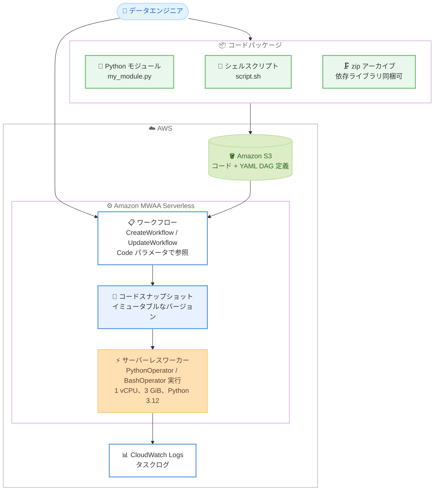

# Amazon MWAA - MWAA Serverless での PythonOperator と BashOperator サポート

**リリース日**: 2026 年 8 月 18 日
**サービス**: Amazon Managed Workflows for Apache Airflow (Amazon MWAA) Serverless
**機能**: PythonOperator および BashOperator のサポート

📊 [このアップデートのインフォグラフィックを見る](https://takech9203.github.io/aws-news-summary/20260818-mwaa-serverless-pythonoperator-bashoperator.html)

## 概要

Amazon MWAA Serverless が、Apache Airflow の標準プロバイダーパッケージに含まれる `PythonOperator` と `BashOperator` をサポートしました。これにより、カスタム Python 関数やシェルスクリプトを、追加のインフラストラクチャをプロビジョニングすることなく、サーバーレスランタイム上で直接実行できるようになります。

使い方はシンプルで、Python モジュールやシェルスクリプトをコードパッケージとしてまとめて Amazon S3 にアップロードし、ワークフローの作成時または更新時に `Code` パラメータで参照するだけです。サービスはワークフロー作成時点のコードをスナップショットとして保存し、以降のすべての実行でそのスナップショットを使用するため、実行間の一貫性が保証されます。

データエンジニアリングチームは、データ変換、フォーマット変換、データ品質チェックといった日常的に利用するコードパターンを、MWAA Serverless 上でそのまま実行できるようになります。

**アップデート前の課題**

MWAA Serverless では、ワークフロー定義 (YAML DAG) で宣言できるタスクに制約がありました。

- 課題 1: カスタム Python コードやシェルスクリプトを MWAA Serverless のランタイム内で直接実行できなかった
- 課題 2: データ変換やデータ品質チェックなどの独自ロジックを実行するには、AWS Lambda や AWS Glue など別のコンピューティングサービスを用意し、そこに処理をオフロードする必要があった
- 課題 3: 追加インフラの管理により、シンプルな処理でも構成が複雑化し、運用負荷が増加していた

**アップデート後の改善**

今回のアップデートにより、以下が可能になりました。

- 改善 1: `PythonOperator` で Python の呼び出し可能関数を、`BashOperator` で Bash コマンドやスクリプトを、サーバーレスワーカー上で直接実行できるようになった
- 改善 2: コードを S3 にアップロードして `Code` パラメータで参照するだけで利用でき、追加インフラのプロビジョニングが不要になった
- 改善 3: ワークフロー作成・更新時にコードがスナップショットされ、S3 上のオブジェクトを後から変更しても実行中のワークフローに影響しないため、実行の再現性と一貫性が向上した

## アーキテクチャ図



コードパッケージを S3 にアップロードし、ワークフロー作成時に `Code` パラメータで参照すると、MWAA Serverless がコードをスナップショットし、サーバーレスワーカー上で PythonOperator / BashOperator のタスクとして実行する流れを示しています。

## サービスアップデートの詳細

### 主要機能

1. **PythonOperator のサポート**
   - Python の呼び出し可能関数 (python_callable) をタスクとして実行できる
   - オペレータの指定形式は Apache Airflow 3 の現行形式 `airflow.providers.standard.operators.python.PythonOperator` と、従来形式 `airflow.operators.python.PythonOperator` の両方をサポート
   - `python_callable` の値は `{{module_name}}.{{function_name}}` 形式で指定する

2. **BashOperator のサポート**
   - Bash コマンドやシェルスクリプトをタスクとして実行できる
   - オペレータの指定形式は `airflow.providers.standard.operators.bash.BashOperator` と `airflow.operators.bash.BashOperator` の両方をサポート
   - `bash_command` タスクパラメータが必須
   - スクリプトは `/usr/local/airflow/dags` を作業ディレクトリとして実行される

3. **コードパッケージの S3 参照とスナップショット**
   - 単一の `.py` ファイル、単一の `.sh` ファイル、または複数ファイルを含む `.zip` アーカイブをコードパッケージとして S3 にアップロードできる
   - `CreateWorkflow` / `UpdateWorkflow` API の `Code` パラメータ (`S3Location` 構造の `Bucket`、`ObjectKey`、`VersionId`) で参照する
   - ワークフローの作成・更新のたびに、ワークフロー定義とコードの両方がイミュータブルなワークフローバージョンとしてキャプチャされ、以降の実行で一貫して使用される
   - `GetWorkflow` のレスポンスに `Code` オブジェクトと `CodeSnapshottedAt` タイムスタンプが追加され、使用中のコードバージョンを追跡できる

4. **サードパーティ依存ライブラリの同梱**
   - 依存ライブラリは zip アーカイブのルートに配置して同梱できる
   - `pip install --target` で Linux x86_64、Python 3.12 向けのホイールをインストールしてパッケージングする
   - boto3、apache-airflow-providers-amazon などの事前インストール済みパッケージは同梱不要

## 技術仕様

### 実行環境

| 項目 | 詳細 |
|------|------|
| OS / アーキテクチャ | Linux / x86_64 |
| CPU / メモリ | 1 vCPU / 3 GiB |
| ランタイム | Python 3.12 |
| Apache Airflow バージョン | 3.0.6 |
| コード展開先 | /usr/local/airflow/dags (Airflow の DAGs ディレクトリ) |
| AWS 認証情報 | ワークフロー実行ロールの認証情報が自動解決される (boto3 の設定不要) |

### コードパッケージの制限

| 項目 | 制限値 |
|------|--------|
| 受け付けるファイル形式 | 単一の .py、単一の .sh、または .zip アーカイブ |
| コードファイルの最大サイズ | 250 MB |
| zip アーカイブの展開後最大サイズ | 250 MB |
| アカウント内の全ワークフローの合計コードストレージ | 75 GB |

### 主な事前インストール済みパッケージ

| パッケージ | バージョン |
|-----------|-----------|
| apache-airflow | 3.0.6 |
| apache-airflow-providers-amazon | 9.32.0 |
| boto3 / botocore | 1.43.1 |
| dag-factory | 1.0.0 |
| lz4 | 4.4.4 |
| aws-encryption-sdk | 4.0.3 以降 |

**注意**: 事前インストール済みパッケージは、コードパッケージに同梱した同名パッケージより優先されます。異なるバージョンを同梱してもインポートされないため、上記バージョンを前提にコードを設計する必要があります。

### API 変更履歴

| 日付 | サービス | 変更内容 |
|------|----------|----------|
| 2026/08/14 | [AmazonMWAAServerless](https://awsapichanges.com/archive/changes/6e07fe-airflow-serverless.html) | 3 updated api methods - CreateWorkflow / UpdateWorkflow に `Code` パラメータ (S3Location) が追加、GetWorkflow のレスポンスに `Code` と `CodeSnapshottedAt` が追加 |

## 設定方法

### 前提条件

1. コードと DAG ファイルを保存する Amazon S3 バケット
2. S3 バケットへのアクセス権限を持つワークフロー実行ロール
3. AWS CLI (mwaa-serverless コマンドをサポートするバージョン)

### 手順

#### ステップ 1: コードパッケージの作成

```bash
# 依存ライブラリがない場合: モジュールをルートに配置して zip 化
zip my_package.zip my_module.py helper.py

# 依存ライブラリがある場合: ステージングディレクトリにまとめて zip 化
mkdir my_package
cp my_module.py my_package/
pip install -r requirements.txt --target my_package \
    --platform manylinux2014_x86_64 \
    --python-version 3.12 \
    --only-binary=:all:
cd my_package
zip -r ../my_package.zip . -x "*__pycache__*" "*.pyc"
```

Python モジュールと依存ライブラリを zip アーカイブのルートに配置してパッケージングしています。`--platform`、`--python-version`、`--only-binary` フラグにより、ワーカー環境 (Linux x86_64、Python 3.12) 互換のホイールを取得します。これらのフラグを省略するとローカルマシン向けのパッケージがインストールされ、実行時にインポートエラーになります。`-x` オプションで互換性問題の原因となる `__pycache__` とバイトコードを除外しています。

#### ステップ 2: S3 へのアップロードと YAML DAG 定義の作成

```bash
# コードパッケージと DAG 定義を S3 にアップロード
aws s3 cp my_package.zip s3://DOC-EXAMPLE-BUCKET/code/my_package.zip
aws s3 cp my_dag.yaml s3://DOC-EXAMPLE-BUCKET/dags/my_dag.yaml
```

```yaml
# my_dag.yaml: PythonOperator と BashOperator を使用する DAG 定義
my_dag:
  start_date: "2024-01-01"
  schedule: null
  tasks:
    python_task:
      operator: airflow.providers.standard.operators.python.PythonOperator
      python_callable: my_module.hello_world
    bash_task:
      operator: airflow.providers.standard.operators.bash.BashOperator
      bash_command: "echo 'Hello from bash' && date"
```

コードパッケージと YAML 形式のワークフロー定義を S3 にアップロードしています。`python_callable` は `モジュール名.関数名` の形式で、コードパッケージ内のモジュールを参照します。本番ワークフローでは S3 バージョニングの有効化が推奨されています。

#### ステップ 3: ワークフローの作成と実行

```bash
# Code パラメータを指定してワークフローを作成
aws mwaa-serverless create-workflow \
    --name my-workflow \
    --definition-s3-location '{"Bucket": "DOC-EXAMPLE-BUCKET", "ObjectKey": "dags/my_dag.yaml"}' \
    --code '{"S3Location": {"Bucket": "DOC-EXAMPLE-BUCKET", "ObjectKey": "code/my_package.zip"}}' \
    --role-arn arn:aws:iam::111122223333:role/MyMWAAServerlessRole \
    --region us-east-1

# ワークフローの実行を開始
aws mwaa-serverless start-workflow-run \
    --workflow-arn arn:aws:airflow-serverless:us-east-1:111122223333:workflow/my-workflow-a1b2c3d4e5 \
    --region us-east-1
```

`--code` パラメータでコードパッケージの S3 ロケーションを指定してワークフローを作成し、オンデマンドで実行を開始しています。`VersionId` を含めると特定の S3 オブジェクトバージョンに固定でき、省略すると作成・更新時点の最新バージョンがスナップショットされます。タスクログは CloudWatch Logs の `/aws/mwaa-serverless/{ワークフロー名}/` ロググループで確認でき、実行状態は `get-workflow-run` コマンドで確認できます。

## メリット

### ビジネス面

- **インフラ管理コストの削減**: カスタムコード実行のために Lambda や Glue などの追加サービスを用意・管理する必要がなくなり、運用負荷とコストを削減できる
- **既存資産の再利用**: データエンジニアリングチームが日常的に使用している Python スクリプトやシェルスクリプトをほぼそのまま移行でき、開発期間を短縮できる
- **デプロイの信頼性向上**: コードスナップショットにより、意図しないコード変更が本番ワークフローに影響するリスクを排除できる

### 技術面

- **イミュータブルなバージョニング**: ワークフロー定義とコードが一体でバージョン管理され、S3 バージョニングと組み合わせることで再現可能なデプロイと決定論的な実行結果を実現できる
- **認証情報の自動解決**: ワークフロー実行ロールの認証情報がデフォルトの認証情報プロバイダーチェーンで自動解決されるため、コード内での認証設定が不要
- **Airflow 3 標準への準拠**: Apache Airflow 3 の標準プロバイダーパッケージのオペレータ形式をサポートし、OSS Airflow との互換性を維持できる

## デメリット・制約事項

### 制限事項

- コードパッケージは最大 250 MB (zip の展開後サイズも 250 MB)、アカウント全体のコードストレージは 75 GB まで
- ワーカーのスペックは 1 vCPU、3 GiB メモリ、Python 3.12、Linux x86_64 に固定されており、大規模なメモリを要する処理には向かない
- タスクはデフォルトでインターネットアクセスなしで実行される。外部 API の呼び出しや実行時のパッケージダウンロードが必要な場合は、`NetworkConfiguration` パラメータでインターネットアクセス可能な VPC を指定する必要がある
- 事前インストール済みパッケージが同梱パッケージより優先されるため、apache-airflow や boto3 などのバージョンを独自に変更することはできない

### 考慮すべき点

- 依存ライブラリは Linux x86_64、Python 3.12 互換のホイールとしてパッケージングする必要があり、ローカル環境でビルドしたパッケージをそのまま含めると実行時エラーになる
- コードはワークフローの作成・更新時にスナップショットされるため、S3 上のコードを更新しただけでは反映されず、`update-workflow` の実行が必要
- コードパッケージの展開に失敗した場合や破損した Python 環境が含まれる場合、ワークフロー実行は失敗する。CloudWatch Logs でエラーメッセージの確認が必要
- ロググループ名にはサービスが付与する一意の識別子を含む完全なワークフロー名 (WorkflowArn の workflow/ 以降の部分) を使用する必要がある

## ユースケース

### ユースケース 1: ETL パイプラインでのデータ変換

**シナリオ**: S3 上の生データを取り込み、Python でフォーマット変換やクレンジングを行い、変換結果を別のバケットに出力する日次 ETL パイプラインを、追加インフラなしで構築したい。

**実装例**:
```yaml
etl_dag:
  start_date: "2026-08-01"
  schedule: "0 2 * * *"
  tasks:
    transform_data:
      operator: airflow.providers.standard.operators.python.PythonOperator
      python_callable: transform.convert_csv_to_parquet
```

**効果**: 事前インストール済みの boto3 を使って S3 との入出力を行う変換ロジックをサーバーレスで実行でき、Lambda のタイムアウトやメモリ制限を意識した分割設計や、Glue ジョブの別途管理が不要になる。

### ユースケース 2: データ品質チェックの組み込み

**シナリオ**: 下流の分析処理に進む前に、取り込んだデータの欠損値、レコード数、スキーマ整合性を Python でチェックし、問題があればタスクを失敗させてパイプラインを停止したい。

**実装例**:
```yaml
quality_dag:
  start_date: "2026-08-01"
  schedule: null
  tasks:
    ingest:
      operator: airflow.providers.standard.operators.bash.BashOperator
      bash_command: "sh ingest.sh"
    quality_check:
      operator: airflow.providers.standard.operators.python.PythonOperator
      python_callable: checks.validate_record_counts
      dependencies: [ingest]
```

**効果**: データ品質チェックをワークフローのタスクとして直接組み込むことで、不正なデータが下流に流れることを防ぎ、CloudWatch Logs で失敗原因を追跡できる。

### ユースケース 3: 既存シェルスクリプト資産の移行

**シナリオ**: オンプレミスや自己管理の Airflow 環境で運用してきたファイル操作・フォーマット変換用のシェルスクリプト群を、大きな書き換えなしにサーバーレス環境へ移行したい。

**実装例**:
```yaml
migration_dag:
  start_date: "2026-08-01"
  schedule: "0 6 * * 1"
  tasks:
    convert_files:
      operator: airflow.providers.standard.operators.bash.BashOperator
      bash_command: "sh convert_format.sh && sh archive_old_files.sh"
```

**効果**: 既存のシェルスクリプトを zip にまとめて S3 にアップロードするだけで移行でき、Airflow 環境のプロビジョニングやスケーリングの管理から解放される。

## 料金

MWAA Serverless の料金体系に追加費用はなく、ワークフロー実行に応じた従量課金が適用されます。コードパッケージの保存には Amazon S3 の標準料金、タスクログの保存・クエリには CloudWatch Logs の標準料金が適用されます。詳細は [Amazon MWAA 料金ページ](https://aws.amazon.com/managed-workflows-for-apache-airflow/pricing/) を参照してください。

## 利用可能リージョン

Amazon MWAA Serverless が利用可能なすべての AWS リージョンで利用できます。

## 関連サービス・機能

- **Amazon S3**: コードパッケージとワークフロー定義 (YAML DAG) の保存先。バージョニングを有効化することで再現可能なデプロイを実現
- **Amazon CloudWatch Logs**: タスクログの出力先。`LoggingConfiguration` でカスタムロググループも指定可能
- **AWS IAM**: ワークフロー実行ロールの認証情報がタスク内で自動解決され、boto3 から AWS リソースにアクセス可能
- **Amazon VPC**: 外部ネットワーク接続が必要なタスク向けに、`NetworkConfiguration` パラメータで VPC を指定可能
- **Amazon MWAA (プロビジョンド)**: 従来型の MWAA 環境。フルカスタマイズが必要な場合の選択肢として補完関係にある

## 参考リンク

- 📊 [インフォグラフィック](https://takech9203.github.io/aws-news-summary/20260818-mwaa-serverless-pythonoperator-bashoperator.html)
- [公式発表 (What's New)](https://aws.amazon.com/about-aws/whats-new/2026/08/mwaa-serverless-pythonoperator-bashoperator/)
- [ドキュメント: Using Python and Bash operators](https://docs.aws.amazon.com/mwaa/latest/mwaa-serverless-userguide/operators-python-bash-detail.html)
- [ドキュメント: Get started with Amazon MWAA Serverless](https://docs.aws.amazon.com/mwaa/latest/mwaa-serverless-userguide/get-started.html)
- [API リファレンス: CreateWorkflow](https://docs.aws.amazon.com/mwaa-serverless/latest/APIReference/API_CreateWorkflow.html)
- [料金ページ](https://aws.amazon.com/managed-workflows-for-apache-airflow/pricing/)

## まとめ

MWAA Serverless で PythonOperator と BashOperator が利用可能になったことで、データ変換やデータ品質チェックなどのカスタムロジックを、追加インフラなしにサーバーレスワークフローへ直接組み込めるようになりました。コードスナップショットによるイミュータブルなバージョニングにより、本番環境でも再現性の高い実行が保証されます。MWAA Serverless の利用を検討しているチームは、Lambda や Glue へのオフロードが必要だった処理をワークフロー内に統合できないか、既存のコード資産の移行と合わせて評価することを推奨します。
