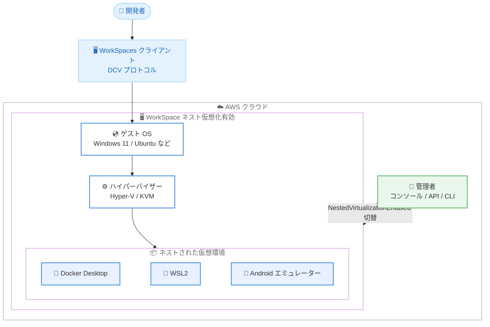

# Amazon WorkSpaces - Nested Virtualization (ネスト仮想化) サポート

**リリース日**: 2026 年 8 月 18 日
**サービス**: Amazon WorkSpaces (WorkSpaces Personal / WorkSpaces Core Managed Bundles)
**機能**: Nested Virtualization (ネスト仮想化)

📊 [このアップデートのインフォグラフィックを見る](https://takech9203.github.io/aws-news-summary/20260818-nested-virtualization-workspaces.html)

## 概要

Amazon WorkSpaces が Nested Virtualization (ネスト仮想化) のサポートを発表しました。WorkSpaces Personal および WorkSpaces Core Managed Bundles で、WorkSpace 内部に Hyper-V や KVM などのハイパーバイザーを実行できるようになり、ハードウェア仮想化支援を必要とする開発ツールやワークフローを仮想デスクトップ上でそのまま利用できます。

Windows WorkSpaces では Docker Desktop、Windows Subsystem for Linux 2 (WSL2) などのハイパーバイザー依存ツールを、Linux WorkSpaces では KVM ベースのワークロード、Android エミュレーター、ネストされたコンテナを実行できます。これまでこれらのツールを使う開発者は物理マシンや回避策となる構成を用意する必要がありましたが、今回のアップデートにより仮想デスクトップ環境 (VDI) だけで開発環境を完結できるようになります。

管理者は WorkSpace の作成時、または既存 WorkSpace のプロパティ変更により、コンソール・API・CLI から WorkSpace 単位で有効化 / 無効化を切り替えられます。追加料金は不要です。

**アップデート前の課題**

- WorkSpaces はネスト仮想化に対応しておらず、Docker Desktop や WSL2、Android エミュレーターなどハードウェア仮想化を前提とするツールが WorkSpace 上で動作しなかった
- これらのツールを必要とする開発者には、専用の物理 PC を配布するか、リモートの EC2 ベアメタルインスタンスへ接続するなどの回避策が必要だった
- VDI 環境と物理環境が混在することで、セキュリティ統制や運用管理が複雑になっていた

**アップデート後の改善**

- WorkSpace 内で Hyper-V / KVM などのハイパーバイザーを直接実行できるようになり、Docker Desktop、WSL2、Android Studio エミュレーター、QEMU などが利用可能になった
- 開発者向けにも物理ハードウェアを用意することなく、仮想デスクトップに開発環境を統一できるようになった
- コンソール・API・CLI から WorkSpace 単位でオン / オフを切り替えられ、必要なユーザーにのみ機能を提供する柔軟な運用が可能になった

## アーキテクチャ図



ネスト仮想化を有効にした WorkSpace では、ゲスト OS 上でハイパーバイザーが動作し、その中で Docker Desktop や WSL2 などの仮想マシンベースのツールを実行できます。管理者は `NestedVirtualizationEnabled` プロパティで WorkSpace 単位に機能を制御します。

## サービスアップデートの詳細

### 主要機能

1. **WorkSpace 内でのハイパーバイザー実行**
   - WorkSpace にプロセッサレベルの仮想化支援が提供され、Hyper-V や KVM などのハイパーバイザーを WorkSpace 内部で実行可能
   - Windows WorkSpaces では Docker Desktop、WSL2 などのハイパーバイザー依存ツールをサポート
   - Linux WorkSpaces では KVM ベースのワークロード、Android エミュレーター、ネストされたコンテナをサポート
   - QEMU などの仮想化ツールも利用可能

2. **WorkSpace 単位の柔軟な有効化 / 無効化**
   - WorkSpace 作成時に「Customization」セクションから有効化可能
   - 既存 WorkSpace に対してもコンソールのアクション、`ModifyWorkspaceProperties` API、AWS CLI、PowerShell から切り替え可能
   - コンソールの Summary セクションや `DescribeWorkspaces` API で現在の状態 (`Enabled` / `Disabled`) を確認可能

3. **幅広いバンドルとライセンスモデルのサポート**
   - パブリック (AWS 提供) バンドル、カスタムバンドル、BYOL (Bring Your Own License)、BYOP (Bring Your Own Protocol) に対応
   - GPU 以外の主要バンドルサイズ (Standard、Performance、Power、PowerPro、GeneralPurpose) をサポート
   - 追加料金なしで利用可能

4. **ライフサイクル操作での設定保持**
   - Restore (復元)、Rebuild (再構築) 時にネスト仮想化設定が保持される
   - Migrate (バンドル移行) 時も、移行先バンドルが互換性を持つ限り設定が引き継がれる

## 技術仕様

### サポート構成

| 項目 | 詳細 |
|------|------|
| 対象サービス | WorkSpaces Personal、WorkSpaces Core Managed Bundles |
| ライセンスモデル | パブリックバンドル、カスタムバンドル、BYOL、BYOP |
| 対応 OS (Windows) | Windows Server 2019 / 2022 / 2025、Windows 11 |
| 対応 OS (Linux) | Ubuntu 22.04 以降、Red Hat Enterprise Linux 8 以降、Rocky Linux 8 以降 |
| 非対応 OS | Windows Server 2016、Windows 10、Amazon Linux 2 |
| プロトコル | DCV (WSP)、BYOP のみ (PCoIP は非対応) |
| バンドルサイズ | Standard、Performance、Power、PowerPro、GeneralPurpose (Value と GPU バンドルは非対応) |
| 推奨サイズ | Power (4 vCPU) 以上 |
| 追加料金 | なし |

### API変更履歴

| 日付 | サービス | 変更内容 |
|------|----------|----------|
| 2026/08/18 | [Amazon WorkSpaces](https://awsapichanges.com/archive/changes/4c9ef8-workspaces.html) | 3 updated api methods - `CreateWorkspaces`、`DescribeWorkspaces`、`ModifyWorkspaceProperties` に `NestedVirtualizationEnabled` プロパティと `NESTED_VIRTUALIZATION` 変更ステートが追加 |

### WorkspaceProperties の変更点

`DescribeWorkspaces` のレスポンス例 (関連フィールド抜粋)。

```json
{
    "Workspaces": [
        {
            "WorkspaceId": "ws-example123456",
            "State": "STOPPED",
            "WorkspaceProperties": {
                "RunningMode": "AUTO_STOP",
                "ComputeTypeName": "POWER",
                "Protocols": ["WSP"],
                "NestedVirtualizationEnabled": true
            },
            "ModificationStates": []
        }
    ]
}
```

## 設定方法

### 前提条件

1. WorkSpace が DCV (WSP) または BYOP プロトコルを使用していること (PCoIP は非対応)
2. GPU 以外のバンドルであり、Value バンドルサイズではないこと
3. サポート対象の OS (Windows Server 2019 以降、Windows 11、Ubuntu 22.04 以降、RHEL 8 以降、Rocky 8 以降) を使用していること

### 手順

#### ステップ1: 現在の状態を確認する

```bash
aws workspaces describe-workspaces \
    --workspace-id ws-example123456 \
    --region us-west-2
```

`describe-workspaces` コマンドで対象 WorkSpace の情報を取得します。レスポンスの `WorkspaceProperties.NestedVirtualizationEnabled` に `true` / `false` で現在の状態が表示されます。

#### ステップ2: ネスト仮想化を有効化する

```bash
aws workspaces modify-workspace-properties \
    --workspace-id ws-example123456 \
    --region us-west-2 \
    --workspace-properties NestedVirtualizationEnabled=true
```

`modify-workspace-properties` コマンドで `NestedVirtualizationEnabled` プロパティを `true` に設定し、ネスト仮想化を有効化します。無効化する場合は `false` を指定します。変更には数分かかる場合があり、変更中は WorkSpace の状態が `Modifying` と表示されます。

#### ステップ3: 変更完了を確認して WorkSpace を起動する

```bash
aws workspaces describe-workspaces \
    --workspace-id ws-example123456 \
    --region us-west-2 \
    --query "Workspaces[0].WorkspaceProperties.NestedVirtualizationEnabled"
```

再度 `describe-workspaces` で `NestedVirtualizationEnabled` が期待どおりの値になったことを確認します。変更完了後、WorkSpace を起動するとネスト仮想化を利用できます。なお、新規作成時はコンソールの「Customization」セクションで「Enable Nested Virtualization」を選択するか、`CreateWorkspaces` API で同プロパティを指定できます。

## メリット

### ビジネス面

- **開発者向け VDI の適用範囲拡大**: Docker Desktop や WSL2 を必要とする開発者にも WorkSpaces を提供できるようになり、物理 PC の調達・管理コストを削減できる
- **追加コストなし**: ネスト仮想化の利用に追加料金は発生せず、既存の WorkSpaces 料金体系のまま利用できる
- **セキュリティ統制の一元化**: 開発環境を VDI に統一することで、データの持ち出し防止やアクセス制御などの統制を一貫して適用できる

### 技術面

- **WorkSpace 単位の細かな制御**: コンソール・API・CLI・PowerShell から WorkSpace ごとに有効化 / 無効化でき、必要なユーザーにのみ提供可能
- **ライフサイクル操作での設定保持**: Restore、Rebuild、Migrate 時に設定が自動的に引き継がれ、運用負荷が少ない
- **幅広い OS とライセンスモデルに対応**: Windows / Linux の主要 OS、BYOL、BYOP まで広くカバーし、既存環境に導入しやすい

## デメリット・制約事項

### 制限事項

- GPU バンドルでは利用できない
- PCoIP プロトコルの WorkSpaces では利用できない (DCV または BYOP が必要)
- Windows Server 2016、Windows 10、Amazon Linux 2 の WorkSpaces では利用できない
- Value バンドルサイズでは利用できない
- Standby WorkSpaces では利用できない
- 中国 (寧夏) リージョンとイスラエル (テルアビブ) リージョンでは利用できない

### 考慮すべき点

- **AutoStop モードでの休止動作**: Windows Server 2025 および Windows 11 24H2 / 25H2 でネスト仮想化を有効にした AutoStop モードの WorkSpace は、タイムアウト時に休止 (ハイバネート) ではなくフル再起動となる。再開時間が長くなり、未保存の作業を含む以前のセッションが失われるため、高速な再開やセッション永続化が必要な場合は AlwaysOn モードを使用する
- **リソース消費**: ハイパーバイザーとネストされた VM は追加のコンピューティングリソースを消費するため、Power (4 vCPU) 以上のバンドルサイズが推奨される
- **性能検証**: ネスト仮想化を有効にした状態でワークロードをテストし、性能要件を満たすことを確認することが推奨される

## ユースケース

### ユースケース1: Docker Desktop を使ったコンテナ開発環境の VDI 化

**シナリオ**: 開発チームがローカルの物理 PC で Docker Desktop を使用しているが、セキュリティポリシー強化のため開発環境を WorkSpaces に統一したい。

**実装例**:
```bash
# Power バンドルの Windows 11 WorkSpace を作成し、ネスト仮想化を有効化
aws workspaces create-workspaces \
    --workspaces '[{
        "DirectoryId": "d-example12345",
        "UserName": "developer1",
        "BundleId": "wsb-examplebundle",
        "WorkspaceProperties": {
            "RunningMode": "ALWAYS_ON",
            "ComputeTypeName": "POWER",
            "Protocols": ["WSP"],
            "NestedVirtualizationEnabled": true
        }
    }]'
```

**効果**: 開発者は WorkSpace 上で Docker Desktop と WSL2 をそのまま利用でき、ソースコードやコンテナイメージが VDI 環境内に留まるため、セキュリティ統制と開発生産性を両立できる。

### ユースケース2: モバイルアプリ開発での Android エミュレーター利用

**シナリオ**: モバイルアプリ開発チームが Android Studio のエミュレーターを使用したいが、エミュレーターはハードウェア仮想化支援を必要とするため、これまで WorkSpaces では動作しなかった。

**実装例**:
```bash
# 既存の Ubuntu 24.04 WorkSpace でネスト仮想化を有効化
aws workspaces modify-workspace-properties \
    --workspace-id ws-mobile-dev01 \
    --workspace-properties NestedVirtualizationEnabled=true
```

**効果**: KVM ベースの Android エミュレーターが WorkSpace 内で動作し、モバイル開発チームも VDI 環境でビルドから実機相当のテストまで完結できる。

### ユースケース3: 検証用の仮想マシンサンドボックス

**シナリオ**: インフラエンジニアや QA チームが、OS の検証やマルチ VM 構成のテストのために使い捨ての仮想マシン環境を必要としている。

**実装例**:
```bash
# PowerPro バンドルの WorkSpace でネスト仮想化を有効化し、
# WorkSpace 内で QEMU / KVM を使用して検証用 VM を起動
aws workspaces modify-workspace-properties \
    --workspace-id ws-qa-sandbox01 \
    --workspace-properties NestedVirtualizationEnabled=true
```

**効果**: EC2 インスタンスを個別に払い出すことなく、WorkSpace 内で QEMU / KVM や Hyper-V を使った検証環境を自由に構築・破棄でき、検証作業の俊敏性が向上する。

## 料金

ネスト仮想化の利用に追加料金は発生しません。通常の WorkSpaces の料金 (バンドルタイプ、実行モードに基づく月額または時間課金) のみが適用されます。

なお、ハイパーバイザーとネストされた VM は追加のコンピューティングリソースを消費するため、快適に利用するには Power (4 vCPU) 以上のバンドルが推奨されます。バンドルサイズを上げる場合は、その分の WorkSpaces 料金が増加する点に留意してください。詳細は [Amazon WorkSpaces 料金ページ](https://aws.amazon.com/workspaces/pricing/) を参照してください。

## 利用可能リージョン

WorkSpaces Personal が利用可能なすべての AWS リージョンで利用できます。ただし、以下のリージョンは除きます。

- 中国 (寧夏) リージョン
- イスラエル (テルアビブ) リージョン

東京リージョンを含む日本のリージョンでも利用可能です。

## 関連サービス・機能

- **Amazon EC2 Nested Virtualization**: WorkSpaces のネスト仮想化は EC2 のインフラレベルのネスト仮想化技術を基盤としている。2026 年 2 月に EC2 仮想化インスタンスでのネスト仮想化サポートが発表されており、今回のアップデートはその WorkSpaces への展開といえる
- **Amazon DCV (WSP)**: ネスト仮想化の利用には DCV プロトコルが必須。PCoIP から DCV への移行を検討するきっかけにもなる
- **Amazon WorkSpaces Core**: サードパーティ VDI ソリューションと組み合わせる WorkSpaces Core の Managed Bundles でも本機能を利用可能
- **AppStream 2.0**: アプリケーション単位の配信が適するケースでは AppStream 2.0 も選択肢となるが、ハイパーバイザー依存の開発ツール一式を提供する場合は本機能を有効化した WorkSpaces が適する

## 参考リンク

- 📊 [インフォグラフィック](https://takech9203.github.io/aws-news-summary/20260818-nested-virtualization-workspaces.html)
- [公式発表 (What's New)](https://aws.amazon.com/about-aws/whats-new/2026/08/nested-virtualization-workspaces/)
- [ドキュメント: Nested virtualization for WorkSpaces Personal](https://docs.aws.amazon.com/workspaces/latest/adminguide/nested-virtualization.html)
- [ドキュメント: Use nested virtualization to run hypervisors in Amazon EC2 instances](https://docs.aws.amazon.com/AWSEC2/latest/UserGuide/amazon-ec2-nested-virtualization.html)
- [料金ページ](https://aws.amazon.com/workspaces/pricing/)

## まとめ

Amazon WorkSpaces のネスト仮想化サポートにより、Docker Desktop、WSL2、Android エミュレーターなどハードウェア仮想化を必要とするツールを仮想デスクトップ上で直接実行できるようになり、これまで VDI 化が難しかった開発者ワークロードにも WorkSpaces を適用できます。追加料金なしで WorkSpace 単位に有効化できるため、DCV プロトコルと対応 OS・バンドルの要件を確認のうえ、開発者向け WorkSpaces での有効化を検討することを推奨します。AutoStop モードにおける Windows Server 2025 / Windows 11 24H2 以降の休止制限には注意が必要です。
