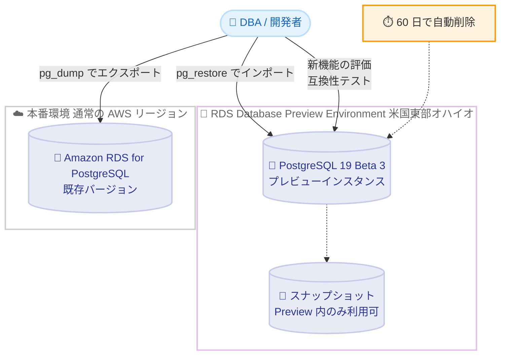

# Amazon RDS for PostgreSQL - PostgreSQL 19 Beta 3 が RDS Database Preview Environment で利用可能に

**リリース日**: 2026 年 8 月 18 日
**サービス**: Amazon RDS for PostgreSQL
**機能**: Amazon RDS Database Preview Environment での PostgreSQL 19 Beta 3 サポート

📊 [このアップデートのインフォグラフィックを見る](https://takech9203.github.io/aws-news-summary/20260818-postgresql-19-beta-3-amazon-rds-database-preview-environment.html)

## 概要

Amazon RDS for PostgreSQL において、PostgreSQL 19 Beta 3 が Amazon RDS Database Preview Environment で利用可能になりました。これにより、正式リリース前の PostgreSQL 19 をマネージドサービスである Amazon RDS 上で評価できます。

PostgreSQL 19 Beta 3 には、クエリパフォーマンスと autovacuum 管理に関する新機能が含まれています。autovacuum の優先度付けを監視・チューニングするための pg_stat_autovacuum_scores ビュー、大規模テーブルのメンテナンスを高速化する並列 autovacuum、効率的なクエリプランを固定して予期しない性能低下を防ぐ pg_plan_advice モジュール、集約を早い段階で実行して分析クエリを高速化する Eager Aggregation などが追加されています。また、Beta 2 のテスト期間中に報告されたバグ修正と安定性の改善も含まれています (PostgreSQL コミュニティの発表によると、Beta 3 は 2026 年 8 月 13 日にリリースされ、GROUP BY ALL 機能の取り下げや論理レプリケーションのシーケンス同期の修正などが含まれます)。

このアップデートは、PostgreSQL 19 の正式リリース (GA) に先立ち、既存アプリケーションとの互換性検証や新機能の評価を行いたいデータベース管理者や開発者を対象としています。

**アップデート前の課題**

このアップデート以前に存在していた課題や制限は以下のとおりです。

- PostgreSQL 19 のベータ版を試すには、EC2 やオンプレミスにセルフマネージドでインストールする必要があった
- セルフマネージド環境では、RDS 特有の動作 (パラメータグループ、マネージドバックアップなど) を考慮した検証ができなかった
- 新メジャーバージョンの GA 後に初めて互換性問題が発覚すると、アップグレード計画に遅れが生じるリスクがあった

**アップデート後の改善**

今回のアップデートにより可能になったことは以下のとおりです。

- マネージドサービスである Amazon RDS 上で PostgreSQL 19 Beta 3 を数クリックで起動し、評価できるようになった
- pg_stat_autovacuum_scores、並列 autovacuum、pg_plan_advice、Eager Aggregation などの新機能を GA 前に検証できるようになった
- pg_dump / pg_restore を使用して既存データベースを Preview Environment に取り込み、実ワークロードに近い形で互換性テストができるようになった

## アーキテクチャ図



RDS Database Preview Environment 上に PostgreSQL 19 Beta 3 のインスタンスを作成し、pg_dump / pg_restore で既存データベースを持ち込んで評価する流れを示しています。プレビューインスタンスは最大 60 日で自動削除され、スナップショットは Preview Environment 内でのみ利用できます。

## サービスアップデートの詳細

### 主要機能

1. **pg_stat_autovacuum_scores ビュー**
   - autovacuum の優先度付け (どのテーブルが優先的に vacuum されるか) を可視化する新しい統計ビュー
   - autovacuum の挙動を監視し、チューニングの判断材料として活用できる
   - 大規模環境で「なぜこのテーブルの vacuum が遅れるのか」という調査が容易になる

2. **並列 autovacuum**
   - autovacuum が複数のワーカーを使用して単一の大規模テーブルのメンテナンスを高速化
   - テーブル肥大化 (bloat) の解消やトランザクション ID 周回対策の処理時間短縮が期待できる

3. **pg_plan_advice モジュール**
   - 効率的なクエリプランを固定 (ロックイン) し、統計情報の変化などによる予期しないプラン変更と性能低下を回避
   - プランの安定性が重要なミッションクリティカルなワークロードに有効
   - Beta 3 では数値リテラル内のアンダースコア (例: 1_000_000) のパースに関する修正が含まれる

4. **Eager Aggregation**
   - 集約 (GROUP BY) をクエリ実行のより早い段階で適用し、後続の処理が扱う行数を削減
   - 結合前に部分集約を行うことで、分析クエリの実行時間を短縮

5. **Beta 2 からのバグ修正と安定性改善**
   - PostgreSQL コミュニティの発表によると、GROUP BY ALL 機能の取り下げ、FOR PORTION OF (テンポラルテーブル構文) の修正、論理レプリケーションのシーケンス同期の競合状態の修正、postgres_fdw の配列比較プッシュダウンの修正などが含まれる

## 技術仕様

### Preview Environment の制約

| 項目 | 詳細 |
|------|------|
| 提供リージョン | 米国東部 (オハイオ) リージョンのみ |
| インスタンス保持期間 | 最大 60 日間 (期間経過後は自動削除) |
| スナップショット | Preview Environment 内でのみ作成・復元が可能 |
| データの持ち込み / 持ち出し | pg_dump / pg_restore (dump and load) を使用 |
| 料金 | 米国東部 (オハイオ) リージョンの通常の RDS for PostgreSQL 料金に準拠 |
| 本番利用 | 不可 (ベータ版のため評価・テスト用途のみ) |

### PostgreSQL 19 Beta 3 の主な新機能

| 機能 | カテゴリ | 概要 |
|------|----------|------|
| pg_stat_autovacuum_scores | 運用管理 | autovacuum の優先度スコアを監視するビュー |
| 並列 autovacuum | 運用管理 | 複数ワーカーによる大規模テーブルのメンテナンス高速化 |
| pg_plan_advice | クエリ性能 | クエリプランの固定による性能の安定化 |
| Eager Aggregation | クエリ性能 | 早期の集約による分析クエリの高速化 |

## 設定方法

### 前提条件

1. AWS アカウントを保有していること
2. Amazon RDS Database Preview Environment は米国東部 (オハイオ) リージョンで提供されるため、同リージョンを使用すること
3. 評価用データを持ち込む場合は、pg_dump / pg_restore が利用できるクライアント環境があること

### 手順

#### ステップ 1: Preview Environment コンソールへアクセス

```text
https://console.aws.amazon.com/rds-preview/
```

Amazon RDS Database Preview Environment は通常の RDS コンソールとは別の専用コンソールから利用します。上記 URL にアクセスし、データベース作成画面を開きます。

#### ステップ 2: PostgreSQL 19 Beta 3 インスタンスの作成

```bash
# Preview Environment のエンドポイントを指定して DB インスタンスを作成
aws rds create-db-instance \
  --db-instance-identifier pg19-beta3-test \
  --engine postgres \
  --engine-version 19.0-beta3 \
  --db-instance-class db.m7g.large \
  --allocated-storage 100 \
  --master-username postgres \
  --master-user-password <パスワード> \
  --region us-east-2 \
  --endpoint-url https://rds-preview.us-east-2.amazonaws.com
```

Preview Environment 専用のエンドポイント URL を指定して、PostgreSQL 19 Beta 3 の DB インスタンスを作成します。エンジンバージョンの正確な表記はコンソールまたは `describe-db-engine-versions` で確認してください。

#### ステップ 3: 既存データベースのインポートと評価

```bash
# 既存データベースをエクスポート
pg_dump -h <本番エンドポイント> -U postgres -Fc mydb > mydb.dump

# Preview Environment のインスタンスへインポート
pg_restore -h <プレビューエンドポイント> -U postgres -d mydb mydb.dump

# 新機能の確認例: autovacuum スコアビューの参照
psql -h <プレビューエンドポイント> -U postgres -d mydb \
  -c "SELECT * FROM pg_stat_autovacuum_scores;"
```

pg_dump で既存データベースを論理バックアップとしてエクスポートし、pg_restore で Preview Environment 上の PostgreSQL 19 Beta 3 インスタンスにインポートします。その後、実際のクエリやアプリケーションを接続して互換性と新機能を評価します。

## メリット

### ビジネス面

- **アップグレード計画の前倒し**: GA 前に互換性検証を開始できるため、PostgreSQL 19 GA 後の本番アップグレードを迅速かつ低リスクに計画できる
- **インフラ構築コストの削減**: ベータ版評価のためにセルフマネージド環境を構築・運用する必要がなく、評価にかかる工数を削減できる
- **コミュニティへの貢献**: ベータ期間中に発見した問題を PostgreSQL コミュニティへ報告することで、GA 品質の向上に貢献できる

### 技術面

- **マネージド環境での検証**: パラメータグループなど RDS 特有の構成を含めた形でベータ版を検証できる
- **運用機能の事前評価**: pg_stat_autovacuum_scores や並列 autovacuum など、運用に直結する新機能を実データで試せる
- **性能改善の定量評価**: Eager Aggregation や pg_plan_advice による分析クエリの性能変化を、GA 前に自社ワークロードで測定できる

## デメリット・制約事項

### 制限事項

- ベータ版のため本番利用は不可であり、評価・テスト用途に限定される
- Preview Environment は米国東部 (オハイオ) リージョンでのみ提供される
- DB インスタンスの保持期間は最大 60 日間で、期間経過後は自動削除される
- Preview Environment で作成したスナップショットは、Preview Environment 内でのみ作成・復元に使用できる (本番環境への復元は不可)
- Preview Environment から本番環境へのデータ移行は pg_dump / pg_restore による論理的な方法に限られる

### 考慮すべき点

- ベータ版の機能は GA までに変更・削除される可能性がある (実際に GROUP BY ALL は Beta 3 で取り下げられた)
- PostgreSQL 19 の GA 時期は未定であり、コミュニティのテスト状況によって決定される
- 評価期間中も通常の RDS 料金 (米国東部オハイオリージョンの料金) が発生するため、評価完了後は速やかにインスタンスを削除することが望ましい

## ユースケース

### ユースケース 1: 既存アプリケーションの互換性検証

**シナリオ**: PostgreSQL 16 で稼働中の基幹システムを、将来的に PostgreSQL 19 へアップグレードする計画がある。GA 後すぐにアップグレードできるよう、事前に互換性を確認したい。

**実装例**:
```bash
# 本番データベースのスキーマとデータをエクスポート
pg_dump -h prod-db.xxxx.ap-northeast-1.rds.amazonaws.com -Fc mydb > mydb.dump

# Preview Environment の PostgreSQL 19 Beta 3 へリストア
pg_restore -h preview-db.xxxx.us-east-2.rds-preview.amazonaws.com -d mydb mydb.dump

# アプリケーションのテストスイートを Preview 環境に向けて実行
```

**効果**: 非互換の SQL や拡張機能の問題を GA 前に発見でき、アップグレード時の手戻りを防止できる。

### ユースケース 2: autovacuum 運用の改善検証

**シナリオ**: 数 TB 規模のテーブルを持つデータベースで vacuum の遅延と肥大化が課題になっており、PostgreSQL 19 の並列 autovacuum と pg_stat_autovacuum_scores による改善効果を確認したい。

**実装例**:
```sql
-- autovacuum の優先度スコアを確認
SELECT * FROM pg_stat_autovacuum_scores;

-- 大規模テーブルに更新負荷をかけた状態で
-- 並列 autovacuum の処理時間を従来バージョンと比較
```

**効果**: メンテナンスウィンドウの短縮効果を定量的に把握し、PostgreSQL 19 へのアップグレードの費用対効果を判断できる。

### ユースケース 3: 分析クエリの性能改善評価

**シナリオ**: 集計処理を多用するレポーティングワークロードにおいて、Eager Aggregation による性能改善と、pg_plan_advice によるプラン安定化の効果を確認したい。

**実装例**:
```sql
-- 代表的な分析クエリの実行計画を確認
EXPLAIN (ANALYZE, BUFFERS)
SELECT customer_id, SUM(amount)
FROM orders o JOIN customers c ON o.customer_id = c.id
GROUP BY customer_id;

-- pg_plan_advice で効率的なプランを固定し、
-- 統計情報更新後もプランが安定することを確認
```

**効果**: 主要な分析クエリの実行時間短縮を事前に確認でき、GA 後のアップグレード判断の根拠となるデータを取得できる。

## 料金

Amazon RDS Database Preview Environment の DB インスタンスは、米国東部 (オハイオ) リージョンにおける Amazon RDS for PostgreSQL の通常料金に準拠して課金されます。Preview Environment 自体への追加料金はありませんが、インスタンス稼働時間、ストレージ、バックアップなどに対して標準の RDS 料金が発生します。

詳細は [Amazon RDS for PostgreSQL 料金ページ](https://aws.amazon.com/rds/postgresql/pricing/) を参照してください。

## 利用可能リージョン

Amazon RDS Database Preview Environment は米国東部 (オハイオ) リージョンで提供されます。

## 関連サービス・機能

- **Amazon RDS for PostgreSQL**: 本アップデートの対象サービス。PostgreSQL 19 の GA 後は通常環境でも新バージョンが提供される見込み
- **Amazon Aurora PostgreSQL 互換エディション**: PostgreSQL 互換のクラウドネイティブデータベース。メジャーバージョン対応の動向を併せて確認したい関連サービス
- **AWS Database Migration Service (DMS)**: 本番環境への移行やバージョン間のデータ移行を支援するサービス。ただし Preview Environment との間のデータ移動は pg_dump / pg_restore の利用が案内されている

## 参考リンク

- 📊 [インフォグラフィック](https://takech9203.github.io/aws-news-summary/20260818-postgresql-19-beta-3-amazon-rds-database-preview-environment.html)
- [公式発表 (What's New)](https://aws.amazon.com/about-aws/whats-new/2026/08/postgresql-19-beta-3-amazon-rds-database-preview-environment/)
- [Amazon RDS Database Preview Environment ドキュメント](https://docs.aws.amazon.com/AmazonRDS/latest/UserGuide/create-db-instance-in-preview-environment.html)
- [PostgreSQL コミュニティ発表 (19 Beta 3)](https://www.postgresql.org/about/news/postgresql-186-1711-1615-1519-1424-and-19-beta-3-released-3365/)
- [Amazon RDS for PostgreSQL](https://aws.amazon.com/rds/postgresql/)
- [料金ページ](https://aws.amazon.com/rds/postgresql/pricing/)

## まとめ

PostgreSQL 19 Beta 3 が Amazon RDS Database Preview Environment で利用可能になり、autovacuum 管理やクエリ性能に関する新機能を GA 前にマネージド環境で評価できるようになりました。PostgreSQL 19 へのアップグレードを検討している場合は、60 日間の保持期間内に既存ワークロードの互換性検証と性能評価を実施し、GA 後の円滑な移行に備えることを推奨します。ベータ版のため本番利用は避け、評価結果に基づいて問題があれば PostgreSQL コミュニティへ報告してください。
