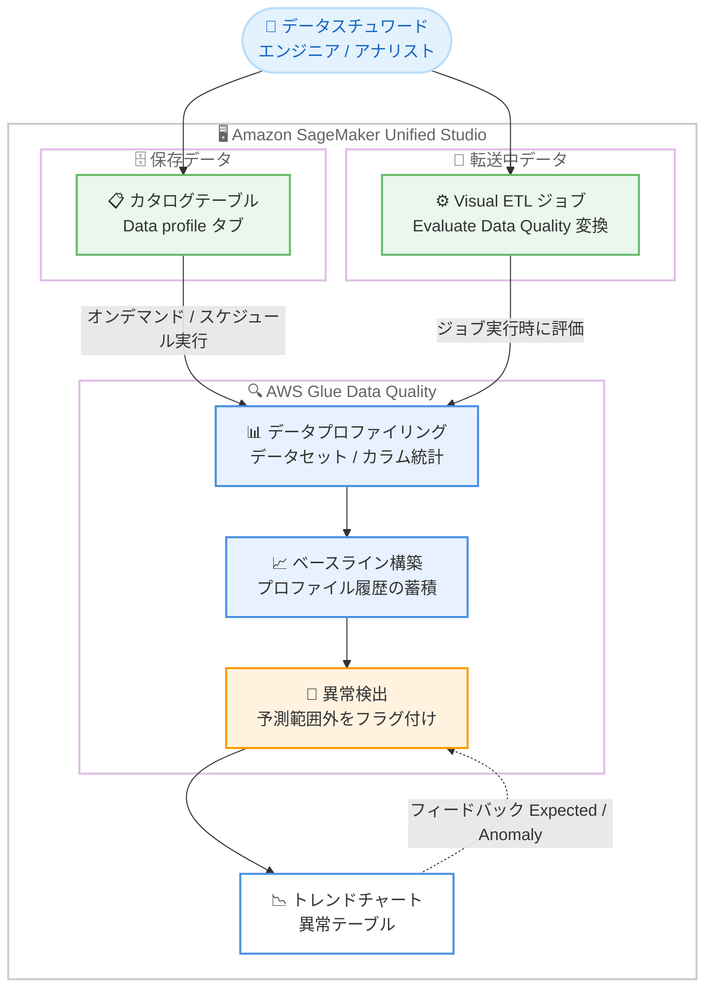

# Amazon SageMaker Unified Studio - データプロファイリングと異常検出のサポート

**リリース日**: 2026 年 8 月 18 日
**サービス**: Amazon SageMaker Unified Studio
**機能**: データプロファイリングと異常検出 (Data profiling and anomaly detection)

📊 [このアップデートのインフォグラフィックを見る](https://takech9203.github.io/aws-news-summary/20260818-smus-data-profiling.html)

## 概要

Amazon SageMaker Unified Studio が、AWS Glue Data Quality を基盤とするデータプロファイリングと異常検出をサポートしました。データスチュワード、データエンジニア、アナリストは、データの統計プロファイルを生成してデータの形状や完全性 (completeness) を把握し、これらの統計が時間の経過とともにどのように変化するかを追跡できます。

異常検出は、事前定義されたしきい値やカスタムルールを必要とせずに、データポイントが過去のパターンから逸脱したことを特定します。プロファイル履歴が蓄積されるにつれて、システムは期待される動作のベースラインを構築し、予測範囲から外れたデータポイントにフラグを立てます。これらの機能は、カタログテーブル内の保存データ (data at rest) と、Visual ETL ジョブ内の転送中データ (data in transit) の両方で利用できます。

今回のリリースにより、カタログテーブルに専用の「Data profile」タブが追加され、オンデマンドおよびスケジュール実行によるプロファイリングで、データセットレベルとカラムレベルの統計を計算できるようになりました。転送中データについては、Evaluate Data Quality 変換を含む Visual ETL ジョブの結果ページで、同じプロファイリング統計と異常検出を利用できます。

**アップデート前の課題**

- SageMaker Unified Studio 内でカタログテーブルの統計プロファイルを確認するには、別途パイプラインを構築するか、AWS Glue Data Quality を個別に設定する必要があった
- データ品質の監視には、事前にしきい値やカスタムルールを定義する必要があり、適切なしきい値が不明な場合や期待値が時間とともに変化する場合には、固定ルールが陳腐化するリスクがあった
- 行数や NULL 値の割合などの統計が過去のパターンから逸脱しても、自動的に検知する仕組みがなく、データ品質の問題に気付くのが遅れる可能性があった

**アップデート後の改善**

- カタログテーブルの「Data profile」タブから、パイプラインを構築することなくオンデマンドまたはスケジュール実行で統計プロファイルを生成できるようになった
- しきい値やルールを事前定義しなくても、プロファイル履歴から構築されたベースラインに基づき、異常なデータポイントが自動的にフラグ付けされるようになった
- 保存データ (カタログテーブル) と転送中データ (Visual ETL ジョブ) の両方で、一貫したプロファイリング統計と異常検出を利用できるようになった
- トレンドチャートで統計の推移を可視化し、フィードバック (Expected / Anomaly の分類) により異常検出モデルを改善できるようになった

## アーキテクチャ図



カタログテーブル (保存データ) と Visual ETL ジョブ (転送中データ) の両方から AWS Glue Data Quality によるプロファイリングが実行され、蓄積された履歴からベースラインを構築して異常を自動検出します。ユーザーのフィードバックにより検出精度が継続的に改善されます。

## サービスアップデートの詳細

### 主要機能

1. **カタログテーブルの Data profile タブ**
   - カタログ内の任意のテーブルアセットで「Data profile」タブを開き、パイプラインを構築せずに統計サマリーを生成可能
   - プロファイル範囲を柔軟に設定可能: 全行またはパーセンテージベースのサンプリング、全カラムまたは特定カラムの選択
   - 前処理クエリ (オプション) として読み取り専用の SELECT 文を指定し、プロファイリング前にデータをフィルタリング / 変換可能
   - プロファイルは非同期で実行され、進行状況の確認や実行中のキャンセルが可能

2. **データセットレベルとカラムレベルの統計**
   - データセットレベル: 行数、カラム数、カラム型数、完全性 (全カラムの非 NULL 値の割合)
   - カラムレベル (全カラム型共通): 名前、データ型、完全性
   - 数値カラム: 最小値、最大値、平均、標準偏差
   - 文字列カラム: 最小長、最大長
   - 複数回のプロファイル実行により、統計の推移をトレンドチャートで可視化

3. **異常検出**
   - プロファイル実行とデータ品質ルール評価が生成する統計をもとに、期待される動作のベースラインを構築
   - データセットレベル (例: 行数の急激な変化) とカラムレベル (例: 特定カラムの NULL 値の急増) の両方で動作
   - 事前定義のしきい値やカスタムルールが不要で、期待値が時間とともに変化するケースにも対応
   - 異常なデータポイントはトレンドチャート上に赤色でハイライトされ、実際の値と期待範囲をツールチップで確認可能
   - 異常テーブルには、メトリクス、履歴、実際の値、期待範囲、推奨ルール (期待範囲に基づくデータ品質チェックの提案)、分類が表示される

4. **フィードバックによるモデル改善**
   - フラグ付けされたデータポイントを「Expected」(正常な値としてベースラインに含める) または「Anomaly」(真の異常としてベースラインから除外) に分類可能
   - トレンドチャートと異常テーブルは同期しており、一方での変更が即座に他方へ反映される

5. **スケジュール実行**
   - プロファイル実行を定期的なスケジュールで自動実行可能 (初回設定時のデフォルトは One Time スケジュール)
   - スケジュールタイプ、頻度、タイムゾーン、柔軟な時間ウィンドウ (オプション) を設定可能
   - スケジュール実行の結果は Data profile タブに自動的に表示され、トレンドチャートが更新される

6. **Visual ETL ジョブでの転送中データのプロファイリング**
   - Evaluate Data Quality 変換を含む任意の Visual ETL ジョブの結果ページで、同じプロファイリング統計と異常検出を利用可能
   - 異常は Visual ETL ジョブのデータ品質変換結果の「Anomalies」タブで確認可能

## 技術仕様

### 統計の種類

| レベル | 統計 |
|------|------|
| データセットレベル | 行数、カラム数、カラム型数、完全性 (非 NULL 割合) |
| カラムレベル (共通) | 名前、データ型、完全性 |
| 数値カラム | 最小値、最大値、平均、標準偏差 |
| 文字列カラム | 最小長、最大長 |
| boolean / timestamp カラム | 完全性のみ (現時点) |

### 権限モデル

| 操作 | プロジェクトオーナー / 編集権限メンバー | 読み取り専用メンバー |
|------|------|------|
| プロファイルの実行 / 再実行 / 設定編集 / キャンセル | 可能 | 不可 |
| スケジュールの作成 | 可能 | 不可 |
| 異常の分類 (Expected / Anomaly) | 可能 | 不可 |
| プロファイル結果 / 実行履歴 / トレンドチャートの閲覧 | 可能 | 可能 |

### 基盤エンジン

- プロファイリングエンジン: AWS Glue Data Quality の [Data quality analyzers](https://docs.aws.amazon.com/glue/latest/dg/dqdl-analyzers.html)
- 異常検出エンジン: [AWS Glue Data Quality の異常検出と動的ルール](https://docs.aws.amazon.com/glue/latest/dg/data-quality-anomaly-detection.html)

## 設定方法

### 前提条件

1. Amazon SageMaker Unified Studio のドメインとプロジェクトが作成済みであること
2. プロファイリング対象のテーブルがカタログに登録されていること
3. プロファイルを実行するユーザーがプロジェクトオーナーまたは編集権限を持つメンバーであること

### 手順

#### ステップ 1: データプロファイルの実行

1. SageMaker Unified Studio のデータカタログでテーブルアセットを開く
2. 「Data profile」タブを選択し、「Run data profile」を選択
3. プロファイル範囲を設定する
   - Rows: 全行またはパーセンテージベースのサンプリング
   - Columns: 全カラムまたは特定カラムの選択
   - Preprocessing query (オプション): 読み取り専用の SELECT 文でデータをフィルタリング / 変換
4. 「Run data profile」を選択して実行

プロファイルは非同期で実行され、Data profile タブで進行状況を確認できます。

#### ステップ 2: スケジュールの設定

1. 「Data profile」タブでカレンダーアイコンまたは「Edit Scheduled Run」を選択
2. スケジュールタイプ、頻度、タイムゾーン、柔軟な時間ウィンドウ (オプション) を設定
3. 「Create schedule」を選択

スケジュール実行により、手動操作なしで統計を継続的に追跡し、異常検出に必要なプロファイル履歴を蓄積できます。

#### ステップ 3: 異常の確認とフィードバック

1. プロファイル履歴が蓄積されると、トレンドチャート上で異常なデータポイントが赤色でハイライトされる
2. データポイントにカーソルを合わせ、実際の値と期待範囲を確認
3. ツールチップまたは異常テーブルの分類カラムで「Expected」または「Anomaly」を選択し、モデルにフィードバックを提供

フィードバックにより、フラグ付けされた値が真の異常か正当なビジネス変化かをモデルに学習させ、将来の予測精度を向上させます。

## メリット

### ビジネス面

- **データ品質問題の早期発見**: 行数の急変や NULL 値の急増などを自動検出し、下流の分析や ML モデルへの影響を未然に防止できる
- **運用負荷の削減**: しきい値やルールの事前定義とメンテナンスが不要になり、データ品質監視の運用コストを削減できる
- **データへの信頼性向上**: データスチュワードやアナリストがデータの形状と完全性を素早く把握でき、データ活用の意思決定を加速できる

### 技術面

- **ノーコードでのプロファイリング**: パイプラインを構築せずに、カタログ UI から数クリックで統計プロファイルを生成できる
- **適応的な異常検出**: 期待値が時間とともに変化するデータでも、ベースラインが動的に更新されるため固定ルールの陳腐化を回避できる
- **保存データと転送中データの一貫した監視**: カタログテーブルと Visual ETL ジョブの両方で同じ統計と異常検出を利用でき、監視の一貫性を確保できる
- **フィードバックループ**: Expected / Anomaly の分類により、検出モデルを組織のデータ特性に合わせて継続的に改善できる

## デメリット・制約事項

### 制限事項

- boolean 型と timestamp 型のカラムは、現時点で完全性 (completeness) の統計のみサポートされる
- 異常検出はプロファイル履歴の蓄積が前提となるため、初回実行直後はベースラインが構築されておらず、異常のフラグ付けは履歴が蓄積されてから機能する
- 異常の分類 (Expected / Anomaly) やプロファイルの実行は、プロジェクトオーナーまたは編集権限を持つメンバーのみが実施できる

### 考慮すべき点

- 異常検出の精度を高めるには、スケジュール実行で定期的にプロファイル履歴を蓄積することが推奨される
- 大規模テーブルでは、パーセンテージベースのサンプリングやカラム選択、前処理クエリを活用してプロファイル範囲を調整することを検討する
- What's New およびユーザーガイドに本機能固有の料金の記載はないため、基盤となる AWS Glue Data Quality の課金体系を含め、利用前に料金ページで確認することを推奨する

## ユースケース

### ユースケース 1: 日次バッチ取り込みデータの品質監視

**シナリオ**: 毎日基幹システムからカタログテーブルにデータを取り込んでいるが、上流システムの変更により行数や NULL 値の割合が変動することがあり、固定しきい値では検知が難しい。

**実装例**:
```
1. 対象テーブルの Data profile タブで日次スケジュールのプロファイル実行を設定
2. 数日間の履歴蓄積後、異常検出がベースラインを構築
3. 行数の急減や特定カラムの NULL 急増が発生するとトレンドチャート上でフラグ付け
4. 月末の正常な増加は Expected として分類し、モデルに学習させる
```

**効果**: しきい値の設計・保守なしで取り込みデータの品質劣化を早期に検知し、下流のレポートや ML パイプラインへの影響を防止できる。

### ユースケース 2: 新規データソースのオンボーディング時の把握

**シナリオ**: データアナリストが新しく共有されたカタログテーブルを分析に使う前に、データの形状、完全性、値の分布を素早く把握したい。

**実装例**:
```
1. カタログテーブルの Data profile タブで「Run data profile」を実行
2. 必要に応じて前処理クエリで対象期間のデータに絞り込み
   例: SELECT * FROM table WHERE order_date >= '2026-01-01'
3. データセットレベルの完全性と、数値カラムの最小 / 最大 / 平均 / 標準偏差を確認
```

**効果**: パイプラインを構築することなく、分析着手前にデータの品質と特性を短時間で評価できる。

### ユースケース 3: Visual ETL ジョブでの転送中データの異常検出

**シナリオ**: Visual ETL ジョブで変換したデータをデータレイクにロードしているが、変換ロジックや入力データの変化による品質劣化をジョブ実行のたびに確認したい。

**実装例**:
```
1. Visual ETL ジョブに Evaluate Data Quality 変換を追加
2. ジョブ実行後、結果ページでプロファイリング統計を確認
3. Anomalies タブで、過去の実行と比較して逸脱したメトリクスを確認
4. 異常テーブルの Suggested rules をもとにデータ品質ルールを追加
```

**効果**: パイプラインの実行ごとに転送中データの品質を自動監視し、推奨ルールを活用してデータ品質チェックを段階的に強化できる。

## 料金

What's New および SageMaker Unified Studio ユーザーガイドには、本機能固有の料金に関する記載はありません。本機能は AWS Glue Data Quality を基盤としているため、利用にあたっては AWS Glue の料金ページおよび Amazon SageMaker の料金ページで最新の課金体系を確認してください。

## 利用可能リージョン

Amazon SageMaker Unified Studio が利用可能なすべての AWS リージョンで利用できます。

## 関連サービス・機能

- **AWS Glue Data Quality**: 本機能の基盤となるプロファイリング / 異常検出エンジン。Data quality analyzers と異常検出アルゴリズムを提供
- **Amazon SageMaker Lakehouse / データカタログ**: プロファイリング対象となるカタログテーブルを管理し、Data profile タブを提供
- **Visual ETL (SageMaker Unified Studio)**: Evaluate Data Quality 変換により、転送中データに対して同じプロファイリングと異常検出を適用

## 参考リンク

- 📊 [インフォグラフィック](https://takech9203.github.io/aws-news-summary/20260818-smus-data-profiling.html)
- [公式発表 (What's New)](https://aws.amazon.com/about-aws/whats-new/2026/05/smus-data-profiling)
- [ドキュメント: Data profiling in the catalog](https://docs.aws.amazon.com/sagemaker-unified-studio/latest/userguide/data-profiling-catalog.html)
- [ドキュメント: Run a data profile](https://docs.aws.amazon.com/sagemaker-unified-studio/latest/userguide/dq-profile-run.html)
- [ドキュメント: View profile results](https://docs.aws.amazon.com/sagemaker-unified-studio/latest/userguide/dq-profile-view-results.html)
- [ドキュメント: Anomaly detection](https://docs.aws.amazon.com/sagemaker-unified-studio/latest/userguide/dq-anomaly-detection.html)
- [ドキュメント: Schedule profile runs](https://docs.aws.amazon.com/sagemaker-unified-studio/latest/userguide/dq-profile-schedule.html)
- [AWS Glue Data Quality の異常検出と動的ルール](https://docs.aws.amazon.com/glue/latest/dg/data-quality-anomaly-detection.html)

## まとめ

Amazon SageMaker Unified Studio に AWS Glue Data Quality を基盤とするデータプロファイリングと異常検出が統合され、しきい値やルールの事前定義なしにデータ品質の変化を自動検知できるようになりました。カタログテーブルの保存データと Visual ETL ジョブの転送中データの両方を一貫して監視できるため、データ基盤の信頼性向上に直結するアップデートです。まずは重要なカタログテーブルでスケジュール実行を設定し、プロファイル履歴を蓄積して異常検出の効果を確認することを推奨します。
