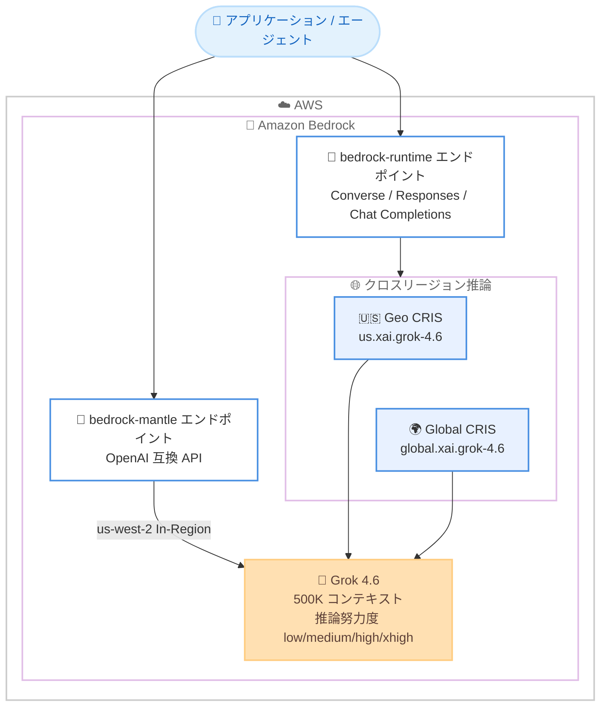

# Amazon Bedrock - SpaceXAI Grok 4.6 のサポート開始

**リリース日**: 2026 年 8 月 19 日
**サービス**: Amazon Bedrock
**機能**: SpaceXAI (xAI) Grok 4.6 モデルのサポート

📊 [このアップデートのインフォグラフィックを見る](https://takech9203.github.io/aws-news-summary/20260819-amazon-bedrock-grok-4-6.html)

## 概要

Amazon Bedrock で SpaceXAI の最新フラッグシップモデル Grok 4.6 が利用可能になりました。Grok 4.6 は、長時間動作するエージェントや、より野心的なインタラクティブ / ビジュアルな作業のために構築されたフロンティアモデルで、コーディング、エージェントタスク、ナレッジワークに焦点を当てています。500K トークンのコンテキストウィンドウと、設定可能な推論努力度 (low、medium、high、xhigh) を備えています。

SpaceXAI によると、Grok 4.6 はエージェンティックコーディングおよびナレッジワークのベンチマークにおいて、コーディング特化型のフロンティアモデルに匹敵するフロンティアレベルの性能を達成しています。トピックの調査、情報の分析、コードベース横断の作業、アイデアから完成したアプリケーションへの変換といった、持続的なマルチステップの作業向けに設計されています。

Amazon Bedrock 経由で利用することで、エンタープライズグレードのセキュリティとプライバシー、モニタリングとロギング、クロスリージョン推論による AWS リージョン間でのスケーリングといった Bedrock の利点をそのまま活用できます。なお、モデルカード上のプロバイダー表記は xAI で、モデル ID は `xai.grok-4.6` です。

**アップデート前の課題**

- Amazon Bedrock 上で Grok 4.6 を利用できず、最新の Grok モデルを使うには xAI の API を直接利用する必要があった
- xAI の API を直接利用する場合、AWS の IAM、CloudWatch、請求などの統合的なガバナンスの外側で管理する必要があった
- 長時間動作するエージェントワークロードに適した大規模コンテキストと推論制御を、Bedrock の既存モデルの選択肢の中から選ぶ必要があった

**アップデート後の改善**

- Bedrock の統一 API (Converse、Responses、Chat Completions) から Grok 4.6 を呼び出せるようになった
- クロスリージョン推論 (Geo / Global CRIS) により、大規模なワークロードを複数リージョンにまたがってスケールできるようになった
- 推論努力度を low / medium / high / xhigh の 4 段階で制御し、コストと性能のバランスを調整できるようになった
- プロンプトキャッシュに対応し、繰り返しの長いコンテキストを低コストで再利用できるようになった

## アーキテクチャ図



Grok 4.6 へのアクセス経路を示しています。`bedrock-runtime` エンドポイントではクロスリージョン推論プロファイル (`us.xai.grok-4.6` または `global.xai.grok-4.6`) を指定して呼び出し、`bedrock-mantle` エンドポイントでは us-west-2 の In-Region 推論として OpenAI 互換 API で呼び出します。

## サービスアップデートの詳細

### 主要機能

1. **500K トークンのコンテキストウィンドウ**
   - 大規模なコードベースの横断的な分析や、長大なドキュメントの処理に対応
   - 長時間動作するエージェントのマルチステップ作業で、履歴やツール結果を保持したまま処理を継続可能
   - プロンプトキャッシュと組み合わせることで、長いコンテキストの再利用コストを削減

2. **設定可能な推論努力度 (Reasoning Effort)**
   - 推論はデフォルトで常時有効。`reasoning` パラメータで `low` (デフォルト)、`medium`、`high`、`xhigh` の 4 段階を指定可能
   - 推論内容は暗号化されており、Responses API で `include: ["reasoning.encrypted_content"]` を指定すると取得可能
   - 暗号化された推論内容を後続ターンに送り返すことで、マルチターン会話に推論コンテキストを引き継げる
   - Chat Completions API では推論トークンは返却されない

3. **複数の API とエンドポイントに対応**
   - `bedrock-runtime` エンドポイント: Converse API、Responses API、Chat Completions API に対応 (Invoke API は非対応)
   - `bedrock-mantle` エンドポイント: OpenAI 互換のベース URL (`https://bedrock-mantle.{region}.api.aws/openai/v1`) 経由で利用可能
   - レスポンスストリーミング、呼び出しログ、プロンプトキャッシュに対応

4. **クロスリージョン推論によるスケーリング**
   - Geo CRIS (`us.xai.grok-4.6`) と Global CRIS (`global.xai.grok-4.6`) に対応
   - Global CRIS は東京 (ap-northeast-1)、大阪 (ap-northeast-3) を含む世界中の多数のリージョンから利用可能
   - データレジデンシー要件に応じて、地理的境界内ルーティング (Geo) とグローバルルーティング (Global) を選択可能

## 技術仕様

### モデル仕様

| 項目 | 詳細 |
|------|------|
| モデル ID | `xai.grok-4.6` |
| 推論プロファイル ID | `us.xai.grok-4.6` (Geo) / `global.xai.grok-4.6` (Global) |
| プロバイダー | xAI (発表上の表記は SpaceXAI) |
| モデル公開日 | 2026 年 8 月 18 日 |
| コンテキストウィンドウ | 500K トークン |
| 入力モダリティ | テキスト、画像 |
| 出力モダリティ | テキスト |
| 推論 (Reasoning) | 対応 (low / medium / high / xhigh、デフォルトは low) |
| 対応 API | Converse、Responses、Chat Completions (Invoke は非対応) |
| 対応エンドポイント | bedrock-runtime、bedrock-mantle |
| プロンプトキャッシュ | 対応 |
| レスポンスストリーミング | 対応 |
| サービスティア | Standard のみ (Priority / Flex / Reserved は非対応) |
| 非対応機能 (bedrock-runtime) | サーバーサイドツール使用、インテリジェントプロンプトルーティング、トークンカウント、構造化出力、アプリケーション推論プロファイル |

### 推論努力度の設定例

```python
from openai import OpenAI

client = OpenAI()

response = client.responses.create(
    model="us.xai.grok-4.6",
    reasoning={"effort": "high"},
    include=["reasoning.encrypted_content"],
    input="Explain quantum entanglement simply."
)
print(response.output_text)
```

Responses API で推論努力度を `high` に設定し、暗号化された推論内容をレスポンスに含める例です。

## 設定方法

### 前提条件

1. AWS アカウントを保有していること
2. Amazon Bedrock コンソールで Grok 4.6 へのモデルアクセスが有効であること
3. IAM アイデンティティに、推論プロファイルに加えてアカウントのデフォルトプロジェクト (`arn:aws:bedrock:{region}:{account-id}:project/default`) への `bedrock:InvokeModel` 権限があること

### 手順

#### ステップ 1: Bedrock API キーの作成 (OpenAI 互換 API を使う場合)

Amazon Bedrock コンソールの API キー画面から長期 API キーを生成します。Converse API (boto3) を使う場合は通常の AWS 認証情報で問題ありません。

#### ステップ 2: SDK のインストールと環境変数の設定

```bash
pip install openai

export OPENAI_API_KEY="<Bedrock API キー>"
export OPENAI_BASE_URL="https://bedrock-runtime.us-east-1.amazonaws.com/openai/v1"
```

OpenAI SDK をインストールし、Bedrock の OpenAI 互換エンドポイントを指すように環境変数を設定します。`bedrock-mantle` を使う場合はベース URL を `https://bedrock-mantle.us-west-2.api.aws/openai/v1` に変更します。

#### ステップ 3: 推論リクエストの実行

```python
import boto3

client = boto3.client("bedrock-runtime", region_name="us-east-1")

response = client.converse(
    modelId="us.xai.grok-4.6",
    messages=[
        {"role": "user", "content": [{"text": "Can you explain the features of Amazon Bedrock?"}]}
    ]
)
print(response["output"]["message"]["content"][0]["text"])
```

Converse API でクロスリージョン推論プロファイル `us.xai.grok-4.6` を指定して推論を実行します。`bedrock-runtime` エンドポイントでは In-Region 推論は利用できないため、必ず `us.xai.grok-4.6` または `global.xai.grok-4.6` をモデルとして指定します。

## メリット

### ビジネス面

- **モデル選択肢の拡大**: Anthropic、Amazon、Meta などに加えて xAI の最新フラッグシップモデルを同一プラットフォームで比較・選択できる
- **統合ガバナンス**: エンタープライズグレードのセキュリティとプライバシー、モニタリング、ロギングを AWS の枠組み内で一元管理できる
- **調達の簡素化**: 既存の AWS 契約・請求の範囲内で利用でき、xAI との個別契約や API キー管理が不要

### 技術面

- **長時間エージェントへの適合**: 500K コンテキストと推論努力度の制御により、調査・分析・コードベース横断作業などの持続的なマルチステップ作業に対応
- **コスト最適化の柔軟性**: 推論努力度 (low〜xhigh) とプロンプトキャッシュ、Global CRIS の低単価を組み合わせてコストを調整可能
- **OpenAI 互換 API**: Responses API / Chat Completions API に対応しており、既存の OpenAI SDK ベースのコードからの移行が容易

## デメリット・制約事項

### 制限事項

- `bedrock-runtime` エンドポイントでは In-Region 推論は利用できず、クロスリージョン推論 (Geo / Global) のみ
- In-Region 推論は `bedrock-mantle` エンドポイントの us-west-2 (オレゴン) のみ
- Invoke API は非対応 (Converse / Responses / Chat Completions を使用)
- `bedrock-runtime` ではサーバーサイドツール使用、構造化出力、トークンカウント、インテリジェントプロンプトルーティング、アプリケーション推論プロファイルが非対応
- サービスティアは Standard のみで、Priority / Flex / Reserved は選択不可
- Chat Completions API では推論トークンが返却されない

### 考慮すべき点

- Geo CRIS は米国地理内 (`us.` プロファイル) のみの提供のため、データを特定地域内に留めたい米国外のワークロードでは要件を満たせない場合がある。Global CRIS はレジデンシー制約がないワークロード向け
- 推論内容は暗号化されて返却されるため、推論過程をそのまま参照するユースケースには向かない
- 推論努力度を高く設定すると出力トークン消費が増え、コストとレイテンシーが増加する可能性がある
- サードパーティモデルのため、利用前に [第三者モデルの利用規約](https://aws.amazon.com/legal/bedrock/third-party-models/) の確認が必要

## ユースケース

### ユースケース 1: コードベース横断のエージェンティックコーディング

**シナリオ**: 大規模なモノレポ全体を対象に、リファクタリングや機能追加を自律的に行うコーディングエージェントを構築したい。

**実装例**:
```python
response = client.responses.create(
    model="global.xai.grok-4.6",
    reasoning={"effort": "xhigh"},
    include=["reasoning.encrypted_content"],
    input=f"次のコードベースを分析し、認証モジュールのリファクタリング計画を作成して実装してください。\n{codebase_context}"
)
```

**効果**: 500K コンテキストにリポジトリの主要部分を収め、xhigh の推論努力度で複雑な依存関係を考慮した実装が可能。暗号化推論内容の引き継ぎにより、マルチターンでの一貫した作業を継続できる。

### ユースケース 2: 長時間動作するリサーチエージェント

**シナリオ**: 複数の情報源を調査・分析し、レポートを生成する長時間動作のナレッジワークエージェントを運用したい。

**実装例**:
```python
response = client.converse(
    modelId="us.xai.grok-4.6",
    messages=conversation_history + [
        {"role": "user", "content": [{"text": "これまでの調査結果を統合し、市場分析レポートを作成してください。"}]}
    ]
)
```

**効果**: 大量の調査結果やツール実行履歴をコンテキスト内に保持したまま、多段階の分析と統合を実行できる。Geo / Global CRIS によりトラフィック増加時も安定してスケールする。

### ユースケース 3: 既存 OpenAI SDK アプリケーションの移行

**シナリオ**: OpenAI SDK で構築済みのアプリケーションを、AWS のガバナンス下で Grok 4.6 に切り替えたい。

**実装例**:
```python
from openai import OpenAI

client = OpenAI(
    api_key=BEDROCK_API_KEY,
    base_url="https://bedrock-mantle.us-west-2.api.aws/openai/v1"
)
response = client.chat.completions.create(
    model="xai.grok-4.6",
    messages=[{"role": "user", "content": "..."}]
)
```

**効果**: ベース URL とモデル ID の変更のみで移行でき、コード変更を最小限に抑えつつ AWS の IAM、ロギング、請求の統合管理下に置ける。

## 料金

トークン数に基づく従量課金です。以下はモデルカードに記載の Standard ティアの料金 (100 万トークンあたり、米ドル) です。

| 推論オプション | 入力 | 出力 | キャッシュ読み取り |
|----------------|------|------|--------------------|
| In-Region | $2.20 | $6.60 | $0.55 |
| Geo CRIS | $2.20 | $6.60 | $0.55 |
| Global CRIS | $2.00 | $6.00 | $0.50 |

Global CRIS は In-Region / Geo CRIS より約 9% 低い単価で利用できます。プロンプトキャッシュのヒット部分は入力単価の 25% で課金されます。最新の料金は [Amazon Bedrock 料金ページ](https://aws.amazon.com/bedrock/pricing/) を参照してください。

## 利用可能リージョン

Amazon Bedrock が提供されているすべての AWS リージョンで利用可能です。

- **In-Region 推論**: us-west-2 (オレゴン、`bedrock-mantle` エンドポイントのみ)
- **Geo CRIS (`us.xai.grok-4.6`)**: us-east-1、us-east-2、us-west-1、us-west-2
- **Global CRIS (`global.xai.grok-4.6`)**: 東京 (ap-northeast-1)、大阪 (ap-northeast-3) を含む、米国、カナダ、欧州、アジアパシフィック、中東、アフリカ、南米の 30 以上のリージョン

## 関連サービス・機能

- **Amazon Bedrock クロスリージョン推論**: Geo / Global の推論プロファイルにより、トラフィックを複数リージョンに分散してスループットと可用性を向上
- **Amazon Bedrock プロンプトキャッシュ**: 繰り返し利用される長いコンテキストをキャッシュし、コストとレイテンシーを削減
- **Amazon Bedrock モデル呼び出しログ**: CloudWatch Logs / S3 への呼び出しログ記録により、監査とデバッグを支援
- **AWS Cost Anomaly Detection**: Bedrock のサードパーティモデル利用コストの異常検知と組み合わせた運用が可能

## 参考リンク

- 📊 [インフォグラフィック](https://takech9203.github.io/aws-news-summary/20260819-amazon-bedrock-grok-4-6.html)
- [公式発表 (What's New)](https://aws.amazon.com/about-aws/whats-new/2026/08/amazon-bedrock-grok-4-6/)
- [Grok 4.6 モデルカード (Amazon Bedrock User Guide)](https://docs.aws.amazon.com/bedrock/latest/userguide/model-card-xai-grok-4-6.html)
- [Amazon Bedrock 料金ページ](https://aws.amazon.com/bedrock/pricing/)
- [第三者モデルの利用規約](https://aws.amazon.com/legal/bedrock/third-party-models/)

## まとめ

Amazon Bedrock に xAI の最新フラッグシップモデル Grok 4.6 が追加され、500K コンテキストと 4 段階の推論努力度を備えたフロンティアモデルを AWS のガバナンス下で利用できるようになりました。長時間動作するエージェントやエージェンティックコーディングのワークロードを構築している場合は、既存モデルとの性能・コスト比較を行う価値があります。まずはモデルカードで対応機能と制約 (In-Region 推論の制限、Standard ティアのみなど) を確認し、Converse API または OpenAI 互換 API で評価を開始することを推奨します。
