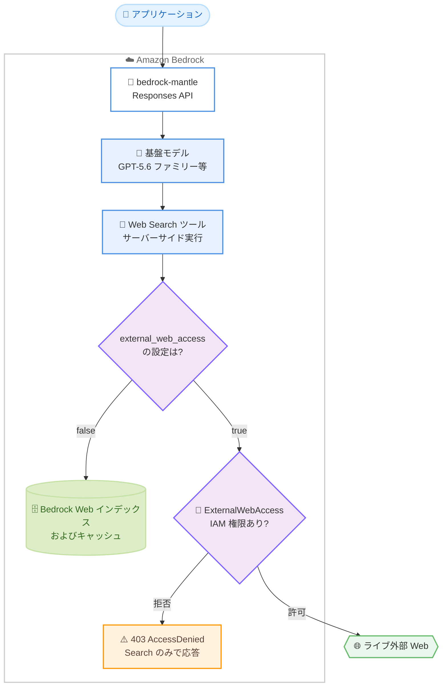

# Amazon Bedrock - Web Search の外部 Web アクセス制御機能

**リリース日**: 2026 年 8 月 19 日
**サービス**: Amazon Bedrock
**機能**: Web Search の External Web Access (external_web_access パラメータと IAM 権限による外部 Web アクセス制御)

📊 [このアップデートのインフォグラフィックを見る](https://takech9203.github.io/aws-news-summary/20260819-amazon-bedrock-web-access-web-search.html)

## 概要

Amazon Bedrock の Web Search ツールに、外部 Web アクセスを制御する **External Web Access** 機能が追加されました。Web Search は、モデルの応答を最新の Web 情報でグラウンディング (根拠付け) するためのサーバーサイド組み込みツールで、2026 年 8 月上旬に発表されました。今回のアップデートにより、新しい `external_web_access` パラメータと `bedrock-websearch:ExternalWebAccess` IAM 権限を組み合わせて、検索・取得処理がパブリックインターネットに到達できるかどうかをきめ細かく制御できるようになりました。

デフォルトでは、Web Search は AWS 内部に構築された Amazon Bedrock の Web インデックスとキャッシュから結果を返すため、リクエストデータが AWS の境界外に出ることはありません。一方、最新のスポーツスコア、リアルタイム価格、公開直後のドキュメントなど、ライブ Web コンテンツが必要な場合は、IAM で `bedrock-websearch:ExternalWebAccess` 権限を明示的に許可することで、外部 Web からの直接取得が可能になります。

このアップデートは、生成 AI アプリケーションで最新情報のグラウンディングを利用しつつ、データガバナンス要件 (機密データを AWS 境界内に保持する等) を満たしたい企業ユーザーにとって重要な機能です。

**アップデート前の課題**

Web Search の初回リリース時点では、外部 Web アクセスの可否を組織のポリシーとして制御する仕組みが十分ではありませんでした。

- ライブ Web コンテンツの取得可否をリクエスト単位と IAM ポリシー単位の両方で制御する手段がなかった
- 機密データを扱うワークロードで、リクエストデータが AWS 境界外に出ないことを IAM ポリシーレベルで強制できなかった
- エージェントがクエリデータを URL にエンコードして外部サイトに送信するデータ漏洩 (data exfiltration) リスクへの対策を、アプリケーション側で個別に実装する必要があった

**アップデート後の改善**

- `external_web_access` パラメータ (デフォルト: `true`) により、リクエスト単位で外部 Web アクセスの有効・無効を指定できるようになった
- `bedrock-websearch:ExternalWebAccess` IAM 権限により、外部 Web アクセスを組織のポリシーとして明示的に許可・禁止できるようになった (デフォルトでは不許可)
- `external_web_access: false` を設定すると、Web Search は AWS 内部の Web インデックスとナレッジグラフのみから結果を返し、リクエストデータが AWS 境界外に出ないことを保証できるようになった

## アーキテクチャ図



`external_web_access` パラメータと IAM 権限の 2 段階の制御により、外部 Web への到達可否が決まります。`false` の場合は AWS 内部のインデックスのみを使用し、`true` の場合は IAM 権限の許可がある場合に限りライブ Web へ直接アクセスします。

## サービスアップデートの詳細

### 主要機能

1. **external_web_access パラメータによるリクエスト単位の制御**
   - Responses API の `web_search` ツール定義に `external_web_access` パラメータを指定する
   - デフォルト値は `true` で、OpenAI Responses API との互換性を維持するため既存の呼び出しコードの変更は不要
   - `false` に設定すると、検索 (Search) と取得 (Fetch) の両方が AWS 内部の Bedrock Web インデックスとキャッシュのみから提供され、リクエストデータが AWS 境界外に出ない

2. **bedrock-websearch:ExternalWebAccess IAM 権限によるポリシーレベルの制御**
   - 外部 Web アクセスは IAM 権限としてデフォルトで不許可であり、明示的に許可した場合のみ有効になる
   - `AmazonBedrockFullAccess` マネージドポリシーは基本の Web Search アクション (`bedrock-websearch:InvokeSearch`、`bedrock-websearch:InvokeFetch`) を許可するが、`ExternalWebAccess` は許可しない (セーフバイデフォルト)
   - 権限がない ID から `external_web_access: true` のままリクエストすると、認可チェックで `403 AccessDenied` が返る。ただしリクエスト全体は失敗せず、モデルは Search の結果のみでグラウンディングし、外部 Web アクセスができなかったことを応答内で報告する

3. **AWS 内部インデックスによる安全なグラウンディング**
   - Search 操作は Amazon が構築・管理する Bedrock Web インデックスとナレッジグラフから、タイトル・URL・スニペットを返す
   - Fetch 操作は Bedrock キャッシュから特定 URL のページコンテンツを取得する。キャッシュに存在しない場合、モデルはその旨を通知するか、手元の情報で最善の応答を構成する
   - 応答には `url_citation` アノテーションとして引用元の情報が付与される

## 技術仕様

### Web Search External Web Access の仕様

| 項目 | 詳細 |
|------|------|
| パラメータ名 | `external_web_access` (ツール定義内、デフォルト: `true`) |
| 関連 IAM アクション | `bedrock-websearch:InvokeSearch`、`bedrock-websearch:InvokeFetch`、`bedrock-websearch:ExternalWebAccess` |
| IAM サービスプレフィックス | `bedrock-websearch` |
| 対応エンドポイント | `bedrock-mantle` (Responses API)。`bedrock-runtime` エンドポイントではサーバーサイドツールは利用不可 |
| 対応モデル | OpenAI GPT-5.6 ファミリー (`openai.gpt-5.6-sol`、`openai.gpt-5.6-terra`、`openai.gpt-5.6-luna`)、`openai.gpt-5.4`、`openai.gpt-5.5` |
| リージョン境界 | 各リージョンが独立した検索・取得基盤を運用し、クエリ・インデックスデータ・結果はリージョン間でルーティングされない |
| 監査 | AWS CloudTrail データイベントとして Web Search の API アクティビティを記録可能 |

### IAM 権限とパラメータの組み合わせによる動作

| external_web_access | ExternalWebAccess 権限 | 動作 |
|------|------|------|
| `false` | 不要 | AWS 内部インデックスとキャッシュのみ使用。データは AWS 境界内に留まる |
| `true` | 許可あり | Search と Fetch がライブ外部 Web に直接到達可能 |
| `true` (デフォルト) | 許可なし | 認可チェックで `403 AccessDenied`。モデルは Search のみで応答を構成し、外部アクセス不可を報告 |

### リクエスト例

```json
{
  "model": "openai.gpt-5.6-terra",
  "input": "Summarize recent guidance on AWS Lambda cold starts.",
  "tools": [
    {
      "type": "web_search",
      "external_web_access": false
    }
  ]
}
```

## 設定方法

### 前提条件

1. Amazon Bedrock で対応モデル (GPT-5.6 ファミリー等) へのアクセスが有効化されていること
2. リクエストに使用する IAM ID に `bedrock-websearch:InvokeSearch` と `bedrock-websearch:InvokeFetch` が許可されていること (`AmazonBedrockFullAccess` で付与可能)
3. 外部 Web アクセスを利用する場合は、`bedrock-websearch:ExternalWebAccess` を明示的に許可すること
4. Amazon Bedrock API キーを取得していること

### 手順

#### ステップ 1: 環境変数の設定

```bash
export OPENAI_API_KEY="your-amazon-bedrock-api-key"
export OPENAI_BASE_URL="https://bedrock-mantle.us-west-2.api.aws/openai/v1"
```

Amazon Bedrock の API キーと `bedrock-mantle` エンドポイントの URL を環境変数に設定します。Web Search はサーバーサイドツールのため、`bedrock-runtime` ではなく `bedrock-mantle` エンドポイントを使用する必要があります。

#### ステップ 2: AWS 境界内に限定したリクエストの実行

```bash
curl "https://bedrock-mantle.us-west-2.api.aws/openai/v1/responses" \
  -H "Authorization: Bearer $OPENAI_API_KEY" \
  -H "Content-Type: application/json" \
  -d '{
    "model": "openai.gpt-5.6-terra",
    "input": "Summarize recent guidance on AWS Lambda cold starts.",
    "tools": [{"type": "web_search", "external_web_access": false}]
  }'
```

`external_web_access` を `false` に設定して Responses API を呼び出します。この構成では `ExternalWebAccess` 権限は不要で、取得は AWS 内部の Bedrock Web インデックスとキャッシュのみから行われ、リクエストデータが AWS 境界外に出ることはありません。

#### ステップ 3: 外部 Web アクセスの有効化

```json
{
  "Version": "2012-10-17",
  "Statement": [
    {
      "Effect": "Allow",
      "Action": [
        "bedrock-websearch:InvokeSearch",
        "bedrock-websearch:InvokeFetch",
        "bedrock-websearch:ExternalWebAccess"
      ],
      "Resource": "*"
    }
  ]
}
```

ライブ Web コンテンツが必要な場合は、上記のように `bedrock-websearch:ExternalWebAccess` を含む IAM ポリシーをリクエスト ID に付与し、`external_web_access` をデフォルトの `true` のままリクエストします。この構成では Search と Fetch がライブ外部 Web に直接到達でき、リクエストデータが AWS 境界外に出る可能性があります。

## メリット

### ビジネス面

- **データガバナンスの強化**: 機密データを扱うワークロードで、リクエストデータが AWS 境界外に出ないことを IAM ポリシーレベルで強制でき、コンプライアンス要件への対応が容易になる
- **セーフバイデフォルト設計**: 外部 Web アクセスはデフォルトで不許可のため、管理者が明示的に許可しない限り意図しない外部アクセスは発生しない
- **最新情報の活用**: 必要なワークロードに限定して、最新のスポーツスコア、リアルタイム価格、公開直後のドキュメントなどライブ Web 情報をグラウンディングに利用できる

### 技術面

- **2 段階の制御モデル**: リクエスト単位のパラメータと IAM 権限の組み合わせにより、アプリケーション開発者とセキュリティ管理者がそれぞれの層で制御を実装できる
- **OpenAI Responses API との互換性**: `external_web_access` のデフォルト値が `true` であるため、OpenAI API から移行する既存コードを変更せずに利用できる
- **データ漏洩リスクの低減**: エージェントがクエリデータを URL にエンコードして外部に送信する data exfiltration 攻撃を、`external_web_access: false` の設定で防止できる
- **監査性**: CloudTrail データイベントにより、誰がいつどこから Web Search を呼び出したかを監査できる

## デメリット・制約事項

### 制限事項

- 利用可能リージョンは米国の 3 リージョン (us-east-1、us-east-2、us-west-2) に限定される
- 対応モデルは `bedrock-mantle` エンドポイント経由の OpenAI GPT モデル (GPT-5.6 ファミリー、GPT-5.4、GPT-5.5) に限られ、他の基盤モデルでは利用できない
- Web Search はサーバーサイドツールのため、`bedrock-runtime` エンドポイントの Responses API では利用できない
- `external_web_access: false` の場合、Fetch は Bedrock キャッシュに存在するコンテンツに限定され、キャッシュにない最新ページは取得できない

### 考慮すべき点

- `external_web_access: true` はデータ漏洩リスクを伴う。エージェントがクエリデータを URL にエンコードして外部インターネットから取得を試みる可能性があるため、機密データを扱う場合は `false` に設定することが推奨される
- `ExternalWebAccess` 権限がない ID がデフォルト値 `true` のままリクエストすると `403 AccessDenied` が発生し、Fetch がすべて失敗する。エラーを避けるには、権限を付与するかパラメータを `false` に明示設定する必要がある
- 検索結果の引用とリンクは、エンドユーザーに提示する出力内で保持・表示する義務がある (利用規約上の要件)
- Web Search はリージョンごとに独立しており、リージョン間で結果は共有されない

## ユースケース

### ユースケース 1: 金融機関での機密データを扱う AI アシスタント

**シナリオ**: 金融機関が顧客データを含むプロンプトを処理する社内 AI アシスタントを構築する。最新の制度情報でグラウンディングしたいが、データを AWS 境界外に出せない。

**実装例**:
```python
response = client.responses.create(
    model="openai.gpt-5.6-terra",
    input=f"以下の顧客の状況に適用される最新の制度を説明してください: {customer_context}",
    tools=[{"type": "web_search", "external_web_access": False}],
)
```

**効果**: Bedrock Web インデックスとナレッジグラフのみから情報を取得するため、顧客データが外部インターネットに送信されるリスクを排除しつつ、Web 知識によるグラウンディングと引用付き応答を実現できる。

### ユースケース 2: リアルタイム情報が必要なコンシューマー向けアプリ

**シナリオ**: スポーツの最新スコアや商品のライブ価格など、キャッシュでは鮮度が不足する情報を提供するチャットアプリケーションを構築する。

**実装例**:
```python
# IAM で bedrock-websearch:ExternalWebAccess を許可した上で実行
response = client.responses.create(
    model="openai.gpt-5.6-terra",
    input="今夜の試合の最新スコアと、注目選手の直近の成績を教えてください。",
    tools=[{"type": "web_search", "external_web_access": True}],
)
```

**効果**: ライブ外部 Web から最新コンテンツを直接取得し、鮮度の高い応答を引用付きで提供できる。アクセスは IAM 権限を付与したワークロードに限定されるため、組織全体の統制は維持される。

### ユースケース 3: 環境別のポリシー分離によるガバナンス運用

**シナリオ**: 開発環境では外部 Web アクセスを許可して検証し、本番環境では AWS 境界内に限定する運用を IAM ポリシーで強制する。

**実装例**:
```json
{
  "Version": "2012-10-17",
  "Statement": [
    {
      "Sid": "DenyExternalWebAccessInProduction",
      "Effect": "Deny",
      "Action": "bedrock-websearch:ExternalWebAccess",
      "Resource": "*"
    }
  ]
}
```

**効果**: 本番環境のロールに明示的な Deny を付与することで、アプリケーションコードの設定ミス (`external_web_access: true` のまま) があっても外部 Web アクセスを確実に防止でき、ガバナンスをコードではなくポリシーで担保できる。

## 料金

今回の発表では External Web Access に固有の追加料金は示されていません。Web Search の料金は Amazon Bedrock の料金ページを参照してください。

- [Amazon Bedrock 料金ページ](https://aws.amazon.com/bedrock/pricing/)

## 利用可能リージョン

Web Search は以下の 3 リージョンで利用可能です。クエリは各リージョン内で処理され、リージョン間でルーティングされません。

| リージョン | リージョンコード |
|------|------|
| 米国東部 (バージニア北部) | us-east-1 |
| 米国東部 (オハイオ) | us-east-2 |
| 米国西部 (オレゴン) | us-west-2 |

## 関連サービス・機能

- **Amazon Bedrock Responses API (bedrock-mantle エンドポイント)**: Web Search ツールを利用するための API。OpenAI SDK 互換のインターフェースを提供する
- **AWS IAM**: `bedrock-websearch` サービスプレフィックスのアクションで、Web Search の呼び出しと外部 Web アクセスを制御する
- **AWS CloudTrail**: Web Search の API アクティビティをデータイベントとして記録し、監査を可能にする
- **Amazon Bedrock Guardrails**: 生成 AI アプリケーションの安全性制御として併用が想定される
- **Codex**: OpenAI のコーディングエージェント。`bedrock-mantle` 経由で Web Search を利用でき、各リクエストで `external_web_access` を `false` に設定してデータを AWS 境界内に保持する

## 参考リンク

- 📊 [インフォグラフィック](https://takech9203.github.io/aws-news-summary/20260819-amazon-bedrock-web-access-web-search.html)
- [公式発表 (What's New)](https://aws.amazon.com/about-aws/whats-new/2026/08/amazon-bedrock-web-access-web-search/)
- [AWS Blog: Introducing Web Search on Amazon Bedrock for foundation model grounding](https://aws.amazon.com/blogs/machine-learning/introducing-web-search-on-amazon-bedrock-for-foundation-model-grounding/)
- [ドキュメント: Web Search - Controlling external web access](https://docs.aws.amazon.com/bedrock/latest/userguide/web-search.html#web-search-controlling-external)
- [料金ページ](https://aws.amazon.com/bedrock/pricing/)

## まとめ

Amazon Bedrock の Web Search に External Web Access 制御が追加され、`external_web_access` パラメータと `bedrock-websearch:ExternalWebAccess` IAM 権限の 2 段階で外部 Web アクセスを管理できるようになりました。外部アクセスはデフォルトで不許可のセーフバイデフォルト設計であり、機密データを扱うワークロードは `external_web_access: false` で AWS 境界内に閉じた運用が可能です。Web 知識によるグラウンディングを検討しているチームは、まず境界内モードで評価を開始し、ライブ情報が必要なワークロードに限定して IAM 権限を付与する段階的な導入を推奨します。
