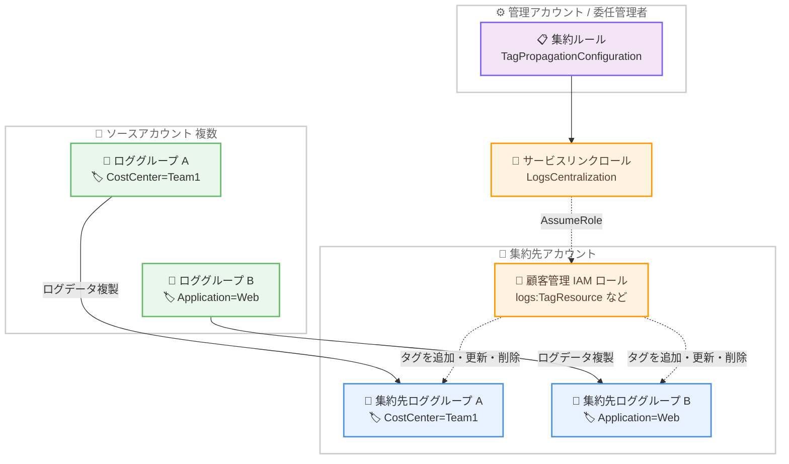

# Amazon CloudWatch - ログ集約機能のロググループタグ伝播サポート

**リリース日**: 2026 年 8 月 19 日
**サービス**: Amazon CloudWatch (CloudWatch Logs)
**機能**: CloudWatch Logs Centralization のロググループタグ伝播 (Tag Propagation)

📊 [このアップデートのインフォグラフィックを見る](https://takech9203.github.io/aws-news-summary/20260819-amazon-cloudwatch-centralization-tag-propogation.html)

## 概要

Amazon CloudWatch のログ集約機能 (CloudWatch Logs Centralization) が、ロググループタグの伝播 (Tag Propagation) をサポートしました。ログ集約機能は、AWS Organizations と連携して複数のアカウント・リージョンのログデータを単一の集約先アカウントに複製する機能です。今回のアップデートにより、集約ルールが作成する集約先ロググループに対して、ソースロググループのタグが自動的にコピーされるようになります。

コスト配分、所有者管理、コンプライアンスなどの目的でソースアカウントのロググループに付与されたタグが、集約先ロググループにも引き継がれ、集約ルールで選択したタグ伝播の動作設定に基づいて同期が維持されます。タグ伝播は集約ルールごとにオプトインで有効化でき、CloudWatch コンソール、AWS CLI、AWS SDK から設定できます。

組織全体のログを一元管理するプラットフォームチームや、集約されたログのコストをチーム別に配分したい FinOps 担当者、タグベースのアクセス制御 (ABAC) を運用するセキュリティチームにとって有用なアップデートです。

**アップデート前の課題**

- 集約ルールが集約先アカウントに作成するロググループには、ソースロググループのタグが引き継がれず、タグ情報が失われていた
- 集約先ロググループのコストをアプリケーションやコストセンター別に配分するには、タグを手動で再付与する仕組みを別途構築する必要があった
- タグ条件を使用した IAM によるアクセス制御 (ABAC) を集約先ロググループに適用することが困難だった
- ソース側でタグが変更された場合、集約先のタグを同期し続ける運用負荷が発生していた

**アップデート後の改善**

- ソースロググループのタグが集約先ロググループへ自動的にコピーされ、伝播設定に基づいて同期が維持されるようになった
- Application や CostCenter などのタグを AWS Cost Explorer で利用し、集約ログのコストをチーム別に分析できるようになった
- 集約先ロググループに対して、タグ条件による IAM アクセス制御をそのまま適用できるようになった
- タグの競合解決戦略 (IN_SYNC / ADD_ONLY / UPDATE_SYNC) を選択でき、運用ポリシーに合わせた同期動作を構成できるようになった

## アーキテクチャ図



集約ルールに `TagPropagationConfiguration` を設定すると、ログ集約サービスのサービスリンクロールが集約先アカウントの顧客管理 IAM ロールを引き受け、ソースロググループのタグを集約先ロググループに追加・更新・削除して同期します。

## サービスアップデートの詳細

### 主要機能

1. **ソースから集約先へのタグ自動コピー**
   - 集約ルールが作成する集約先ロググループに、対応するソースロググループのタグを自動的にコピー
   - ソース側のタグ変更は、選択したタグ伝播の動作設定に基づいて集約先へ同期
   - コスト追跡、所有者管理、コンプライアンス用途のタグをログ集約後も維持可能

2. **タグ競合解決戦略の選択**
   - ソースと集約先の両方に同じタグキーが存在する場合の動作を 3 つの戦略から選択可能
   - `ADD_ONLY`: 新規タグの追加のみを行い、既存の集約先タグは変更しない
   - `UPDATE_SYNC`: 新規タグの追加と既存タグの更新を行う。ソースに存在しない集約先タグは削除しない (デフォルト)
   - `IN_SYNC`: 集約先タグをソースタグと完全に同期する。ソースに存在しない集約先タグは削除される

3. **顧客管理 IAM ロールによる権限分離**
   - タグ操作は集約先アカウントに作成した顧客管理 IAM ロールを介して実行
   - サービスリンクロール `AWSServiceRoleForObservabilityAdmin_LogsCentralization` がこのロールを引き受ける構成
   - `sts:ExternalId` に AWS Organizations の組織 ID を使用した混乱した代理問題への対策を実装

4. **独立したタグ伝播ヘルスステータス**
   - タグ伝播のヘルス (`TagPropagationStatus`) はログ配信全体のヘルス (`RuleHealth`) とは独立して管理
   - ロールの設定ミスがあってもログ配信自体には影響せず、タグ伝播のみが Unhealthy として報告される
   - `TagPropagationFailureReason` により、`RoleNotAssumable` (信頼ポリシーの問題) と `RoleLacksPermissions` (権限不足) を切り分け可能

## 技術仕様

### TagPropagationConfiguration の構造

| 項目 | 詳細 |
|------|------|
| `DestinationRoleArn` (必須) | 集約先アカウントの顧客管理 IAM ロールの ARN。サービスがこのロールを引き受けてタグ操作を実行 |
| `TagConflictResolutionStrategy` (任意) | タグキー競合時の解決戦略。`IN_SYNC` / `ADD_ONLY` / `UPDATE_SYNC` から選択。未指定時は `UPDATE_SYNC` |

### タグ競合解決戦略の比較

| 戦略 | 新規タグの追加 | 既存タグの更新 | ソースにないタグの削除 |
|------|----------------|----------------|------------------------|
| `ADD_ONLY` | ○ | × | × |
| `UPDATE_SYNC` (デフォルト) | ○ | ○ | × |
| `IN_SYNC` | ○ | ○ | ○ |

### ヘルスステータス

| 項目 | 値 | 説明 |
|------|-----|------|
| `TagPropagationStatus` | `Healthy` / `Unhealthy` | 直近のタグ伝播試行の成否。`RuleHealth` とは独立 |
| `TagPropagationFailureReason` | `RoleNotAssumable` | 信頼ポリシーまたは ExternalId の設定不備によりロールを引き受けられない |
| | `RoleLacksPermissions` | ロールは引き受けられたが、タグ API 呼び出しが権限ポリシーで拒否された |

### API 変更履歴

| 日付 | サービス | 変更内容 |
|------|----------|----------|
| 2026/08/14 | [CloudWatch Observability Admin Service](https://awsapichanges.com/archive/changes/6e07fe-observabilityadmin.html) | 4 updated api methods - `CreateCentralizationRuleForOrganization`、`UpdateCentralizationRuleForOrganization` に `TagPropagationConfiguration` が追加。`GetCentralizationRuleForOrganization`、`ListCentralizationRulesForOrganization` のレスポンスに `TagPropagationStatus` と `TagPropagationFailureReason` が追加 |

### 顧客管理 IAM ロールの信頼ポリシー例

```json
{
  "Version": "2012-10-17",
  "Statement": [{
    "Effect": "Allow",
    "Principal": {
      "AWS": "arn:aws:iam::<destination-account-id>:role/aws-service-role/logs-centralization.observabilityadmin.amazonaws.com/AWSServiceRoleForObservabilityAdmin_LogsCentralization"
    },
    "Action": "sts:AssumeRole",
    "Condition": {
      "StringEquals": {
        "sts:ExternalId": "<organization-id>"
      }
    }
  }]
}
```

### 顧客管理 IAM ロールの権限ポリシー例

```json
{
  "Version": "2012-10-17",
  "Statement": [{
    "Effect": "Allow",
    "Action": [
      "logs:ListTagsForResource",
      "logs:TagResource",
      "logs:UntagResource"
    ],
    "Resource": "arn:aws:logs:*:<destination-account-id>:log-group:*"
  }]
}
```

## 設定方法

### 前提条件

1. AWS Organizations がセットアップされており、ソースアカウントと集約先アカウントの両方が同一組織に所属していること
2. CloudWatch の信頼されたアクセスが組織で有効化されていること (コンソール経由での有効化を推奨。サービスリンクロールが自動作成される)
3. 集約先アカウントに、タグ操作用の顧客管理 IAM ロール (上記の信頼ポリシーと権限ポリシー) が作成されていること
4. 集約ルールを作成・更新する IAM プリンシパルに、`iam:PassedToService` を `logs-centralization.observabilityadmin.amazonaws.com` に限定した `iam:PassRole` 権限があること
5. タグ伝播を有効にする場合、集約先ロググループ名のパターンに `${source.logGroup}`、`${source.accountId}`、`${source.region}` の 3 つの属性がすべて含まれていること (ソースと集約先のロググループを 1 対 1 で対応させるため)

### 手順

#### ステップ 1: 集約先アカウントにタグ操作用 IAM ロールを作成

```bash
# 信頼ポリシーを指定してロールを作成
aws iam create-role \
  --role-name LogsCentralizationTagRole \
  --assume-role-policy-document file://trust-policy.json

# タグ操作の権限ポリシーをアタッチ
aws iam put-role-policy \
  --role-name LogsCentralizationTagRole \
  --policy-name TagPropagationPolicy \
  --policy-document file://permissions-policy.json
```

集約先アカウントで、サービスリンクロールからの `sts:AssumeRole` を許可する信頼ポリシーと、`logs:ListTagsForResource`、`logs:TagResource`、`logs:UntagResource` を許可する権限ポリシーを持つロールを作成します。

#### ステップ 2: タグ伝播を含む集約ルールを作成

```bash
aws observabilityadmin create-centralization-rule-for-organization \
  --rule-name "org-logs-centralization" \
  --rule '{
    "Source": {
      "Regions": ["ap-northeast-1", "us-east-1"],
      "Scope": "OrganizationId = o-example12345",
      "SourceLogsConfiguration": {
        "LogGroupSelectionCriteria": "*",
        "EncryptedLogGroupStrategy": "ALLOW"
      }
    },
    "Destination": {
      "Region": "ap-northeast-1",
      "Account": "111122223333",
      "DestinationLogsConfiguration": {
        "LogGroupNameConfiguration": {
          "LogGroupNamePattern": "/centralized/${source.accountId}/${source.region}${source.logGroup}"
        },
        "TagPropagationConfiguration": {
          "DestinationRoleArn": "arn:aws:iam::111122223333:role/LogsCentralizationTagRole",
          "TagConflictResolutionStrategy": "UPDATE_SYNC"
        }
      }
    }
  }'
```

管理アカウントまたは委任管理者アカウントから、`TagPropagationConfiguration` ブロックを含む集約ルールを作成します。`LogGroupNamePattern` にはソースのロググループ名、アカウント ID、リージョンの 3 属性をすべて含めます。コンソールの場合は CloudWatch の [設定] から [Organization] タブで集約ルールを構成します。

#### ステップ 3: タグ伝播のヘルスステータスを確認

```bash
aws observabilityadmin get-centralization-rule-for-organization \
  --rule-identifier "org-logs-centralization" \
  --query '{RuleHealth: RuleHealth, TagStatus: TagPropagationStatus, TagFailure: TagPropagationFailureReason}'
```

作成した集約ルールの詳細を取得し、`TagPropagationStatus` が `Healthy` であることを確認します。`Unhealthy` の場合は `TagPropagationFailureReason` を確認し、`RoleNotAssumable` であれば信頼ポリシーと ExternalId を、`RoleLacksPermissions` であれば権限ポリシーを見直します。

## メリット

### ビジネス面

- **コスト配分の精度向上**: CostCenter や Application などのタグが集約先ロググループに引き継がれるため、AWS Cost Explorer でチーム別・アプリケーション別に集約ログのコストを分析・配分できる
- **ガバナンスとコンプライアンスの維持**: ソースで定義したタグ付けポリシーがログ集約後も維持され、組織全体のリソース管理基準を一貫して適用できる
- **運用負荷の削減**: タグを手動で再付与したり、独自の同期スクリプトを構築・運用したりする必要がなくなる

### 技術面

- **タグベースのアクセス制御 (ABAC) の適用**: IAM ポリシーのタグ条件を集約先ロググループにそのまま適用でき、チームごとのアクセス制限を実現できる
- **柔軟な同期戦略**: 3 つの競合解決戦略により、集約先で独自タグを維持したいケースから完全同期まで、運用ポリシーに合わせた挙動を選択できる
- **障害の切り分けが容易**: タグ伝播のヘルスがログ配信のヘルスと独立しており、ロール設定の問題がログ配信に影響しない設計。失敗理由コードにより原因を迅速に特定できる

## デメリット・制約事項

### 制限事項

- タグ伝播はオプトイン機能であり、集約ルールごとに顧客管理 IAM ロールの作成と設定が必要
- タグ伝播を有効にする場合、集約先ロググループ名のパターンに `${source.logGroup}`、`${source.accountId}`、`${source.region}` の 3 属性をすべて含める必要がある (複数ソースを 1 つの集約先ロググループにマージする構成ではタグ伝播を利用できない)
- ログ集約機能自体の制約として、ルール作成後に到着した新しいログデータのみが集約対象であり、既存の履歴ログは集約されない

### 考慮すべき点

- `IN_SYNC` 戦略を選択すると、集約先ロググループに手動で付与したタグがソースに存在しない場合に削除されるため、集約先で独自タグを管理する場合は `ADD_ONLY` または `UPDATE_SYNC` を選択する
- 顧客管理 IAM ロールの信頼ポリシーでは `sts:ExternalId` に組織 ID を指定する必要があり、設定を誤ると `RoleNotAssumable` となる
- 集約ルールを作成・更新するプリンシパルには、`iam:PassedToService` 条件付きの `iam:PassRole` 権限を identity ポリシー側に付与する必要がある

## ユースケース

### ユースケース 1: チーム別のログコスト配分

**シナリオ**: プラットフォームチームが組織全体のログを集約アカウントに一元化しているが、集約ロググループのストレージコストを各チームに配分したい。

**実装例**:
```
1. 各チームのソースロググループに CostCenter タグを付与 (例: CostCenter=team-a)
2. 集約ルールに TagPropagationConfiguration を設定 (戦略: UPDATE_SYNC)
3. AWS Billing でコスト配分タグとして CostCenter を有効化
4. Cost Explorer で CostCenter タグによるフィルタリング・グルーピングを実施
```

**効果**: 集約先ロググループのコストがソースのタグ情報に基づいてチーム別に可視化され、正確なチャージバック・ショーバックが可能になる。

### ユースケース 2: タグ条件による集約ログへのアクセス制御

**シナリオ**: セキュリティチームが、集約アカウント内のログに対して、各チームが自チームのアプリケーションのログのみ閲覧できるように制御したい。

**実装例**:
```json
{
  "Effect": "Allow",
  "Action": ["logs:GetLogEvents", "logs:FilterLogEvents"],
  "Resource": "arn:aws:logs:*:111122223333:log-group:*",
  "Condition": {
    "StringEquals": {
      "aws:ResourceTag/Application": "web-frontend"
    }
  }
}
```

**効果**: ソースで付与された Application タグが集約先に伝播されるため、タグベースのアクセス制御 (ABAC) を集約ログにそのまま適用でき、最小権限の原則を維持できる。

### ユースケース 3: コンプライアンス分類タグの組織全体での維持

**シナリオ**: 金融サービス企業が、データ分類 (例: DataClassification=Confidential) のタグ付けポリシーを運用しており、集約後のログにも分類情報を維持する必要がある。

**実装例**:
```
1. AWS Organizations のタグポリシーでソースロググループのタグ付けを強制
2. 集約ルールのタグ伝播戦略に IN_SYNC を設定し、ソースと集約先を完全同期
3. GetCentralizationRuleForOrganization で TagPropagationStatus を定期監査
```

**効果**: ソースの分類タグが集約先と完全に同期され、監査時に集約ログの分類状態をタグで証明できる。タグ伝播のヘルスステータスにより同期の失敗を早期に検知できる。

## 料金

タグ伝播機能自体に関する追加料金の記載は公式発表にはありません。CloudWatch Logs Centralization の利用料金については、CloudWatch の料金ページを参照してください。

ログ集約では、ソースから集約先へのログデータの複製に伴い、集約先アカウントでの取り込み・保存コストが発生する点に留意してください。詳細は [CloudWatch 料金ページ](https://aws.amazon.com/cloudwatch/pricing/) を参照してください。

## 利用可能リージョン

CloudWatch Centralization が利用可能なすべての AWS リージョンで利用できます。対象リージョンの一覧は [AWS リージョン別サービス表](https://aws.amazon.com/about-aws/global-infrastructure/regional-product-services/) を参照してください。

## 関連サービス・機能

- **AWS Organizations**: ログ集約機能の前提となるサービス。ソース・集約先アカウントは同一組織に所属する必要があり、タグ伝播の ExternalId にも組織 ID を使用する
- **AWS Cost Explorer / コスト配分タグ**: 伝播されたタグをコスト配分タグとして有効化することで、集約ログのコストをタグ別に分析可能
- **AWS IAM**: タグ伝播は顧客管理 IAM ロール経由で実行され、伝播されたタグは ABAC によるアクセス制御にも活用できる
- **AWS KMS**: ログ集約では顧客管理 KMS キーで暗号化されたロググループの取り扱いを制御可能。タグ伝播と組み合わせてセキュアな集約構成を実現できる

## 参考リンク

- 📊 [インフォグラフィック](https://takech9203.github.io/aws-news-summary/20260819-amazon-cloudwatch-centralization-tag-propogation.html)
- [公式発表 (What's New)](https://aws.amazon.com/about-aws/whats-new/2026/08/amazon-cloudwatch-centralization-tag-propogation/)
- [ドキュメント: Cross-account cross-Region log centralization](https://docs.aws.amazon.com/AmazonCloudWatch/latest/logs/CloudWatchLogs_Centralization.html)
- [API 変更詳細 (awsapichanges.com)](https://awsapichanges.com/archive/changes/6e07fe-observabilityadmin.html)
- [料金ページ](https://aws.amazon.com/cloudwatch/pricing/)

## まとめ

CloudWatch Logs Centralization のタグ伝播サポートにより、組織全体のログ集約においてソースロググループのタグが集約先に自動的に引き継がれるようになり、コスト配分・アクセス制御・コンプライアンス管理をログ集約後も一貫して運用できるようになりました。ログ集約を利用中または検討中の組織は、集約先アカウントにタグ操作用の IAM ロールを作成し、集約ルールに `TagPropagationConfiguration` を追加することを推奨します。その際、運用ポリシーに応じて競合解決戦略 (IN_SYNC / ADD_ONLY / UPDATE_SYNC) を選択してください。
