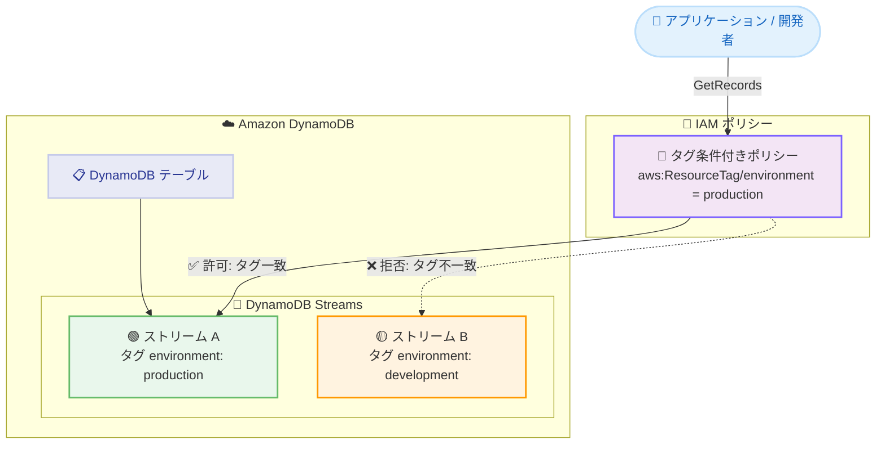

# Amazon DynamoDB Streams - 属性ベースアクセス制御 (ABAC) のサポート

**リリース日**: 2026 年 8 月 19 日
**サービス**: Amazon DynamoDB (DynamoDB Streams)
**機能**: DynamoDB Streams における属性ベースアクセス制御 (ABAC)

📊 [このアップデートのインフォグラフィックを見る](https://takech9203.github.io/aws-news-summary/20260819-amazon-dynamodb-streams-abac.html)

## 概要

Amazon DynamoDB Streams が属性ベースアクセス制御 (ABAC) をサポートしました。ABAC は、リソースに付与したタグを IAM ポリシーの条件として使用し、アクセスを許可または拒否する認可戦略です。今回のアップデートにより、DynamoDB Streams のストリームリソースに対して直接タグを付与し、タグベースの条件で GetRecords などのストリーム操作へのアクセスを制御できるようになりました。

ストリームには 1 つあたり最大 50 個のタグを付与でき、IAM ポリシーの条件でタグを参照して特定のアクションを許可または拒否できます。たとえば、`environment: production` タグが付いたストリームからのみレコードの読み取りを許可し、他の環境のストリームへのアクセスをブロックするといった制御が可能です。ストリームのタグは親テーブルのタグとは独立して管理されるため、環境の分離、チーム単位のアクセス分離、コンプライアンス統制を、個別の IAM ポリシーを大量に作成することなく実現できます。

この機能は、複数のアプリケーションや環境にまたがって DynamoDB Streams へのアクセスを管理するチーム向けに設計されています。追加料金なしで利用できます。

**アップデート前の課題**

以前は、DynamoDB Streams へのアクセス制御はリソース ARN ベースでしか行えず、以下の課題がありました。

- ストリームリソースにタグを付与して IAM ポリシーの条件として利用することができなかった
- 環境やチームごとにアクセスを分離するには、ストリーム ARN を個別に指定した IAM ポリシーを多数作成・管理する必要があった
- テーブル側では ABAC が利用可能でも、ストリームには適用できず、アクセス制御の一貫性が欠けていた

**アップデート後の改善**

今回のアップデートにより、以下が可能になりました。

- ストリームに最大 50 個のタグを付与し、`aws:ResourceTag`、`aws:RequestTag`、`aws:TagKeys` 条件キーでアクセスを制御できるようになった
- タグベースの共通ポリシーを 1 つ定義するだけで、新規作成されるストリームにも自動的にアクセス制御が適用され、ポリシーの数と管理負荷を削減できるようになった
- 環境分離 (本番/開発)、チーム単位の分離、コンプライアンス統制をスケーラブルに実装できるようになった

## アーキテクチャ図



IAM ポリシーのタグ条件により、`environment: production` タグが付与されたストリームへの GetRecords のみが許可され、タグが一致しないストリームへのアクセスは拒否される様子を示しています。

## サービスアップデートの詳細

### 主要機能

1. **ストリームへの独立したタグ付与**
   - ストリームリソースに 1 つあたり最大 50 個のタグを付与可能
   - ストリーム全体のタグの最大サイズは 10 KB
   - ストリームのタグは親テーブルのタグを継承せず、独立して管理される
   - `tag-resource`、`untag-resource`、`list-tags-of-resource` の CLI/SDK 操作をストリーム ARN に対して実行可能

2. **タグベースの IAM 条件キーによるアクセス制御**
   - `aws:ResourceTag/tag-key`: ストリームに付与されたタグに基づいてアクセスを許可/拒否
   - `aws:RequestTag/tag-key`: タグ付与リクエスト時のタグ値を制御
   - `aws:TagKeys`: 使用できるタグキーを制限
   - 条件キーは GetRecords などの読み取り API や、TagResource、UntagResource などストリームを操作する API に適用される

3. **アカウント単位・リージョン単位の有効化**
   - 新規アカウントの多くではデフォルトで有効
   - 既存アカウントではデフォルトで無効になっており、ポリシーの監査後に有効化する方式
   - DynamoDB コンソールの Settings ページから現在のリージョンに対して有効化
   - 有効化には `dynamodb:UpdateAbacStatus`、状態確認には `dynamodb:GetAbacStatus` 権限が必要
   - 有効化後 7 日以内であればオプトアウト (無効化) が可能

## 技術仕様

### DynamoDB Streams ABAC の仕様

| 項目 | 詳細 |
|------|------|
| ストリームあたりの最大タグ数 | 50 個 |
| タグの最大合計サイズ | 10 KB |
| タグの継承 | 親テーブルからの継承なし (独立管理) |
| 対応条件キー | `aws:ResourceTag/tag-key`、`aws:RequestTag/tag-key`、`aws:TagKeys` |
| 対象 API | GetRecords などの読み取り API、TagResource、UntagResource、ListTagsOfResource |
| 有効化の単位 | アカウント x リージョン単位 |
| テーブル ABAC との関係 | 別設定 (テーブル ABAC を有効にしてもストリーム ABAC は自動で有効にならない) |
| オプトアウト | 有効化後 7 日以内は無効化可能 |
| 追加料金 | なし |

### IAM ポリシー例

以下は、`environment` タグキーの値が `production` であるストリームに対してのみ `GetRecords` アクションを許可するポリシー例です。

```json
{
  "Version": "2012-10-17",
  "Statement": [
    {
      "Effect": "Allow",
      "Action": [
        "dynamodb:GetRecords"
      ],
      "Resource": "arn:aws:dynamodb:*:*:table/*/stream/*",
      "Condition": {
        "StringEquals": {
          "aws:ResourceTag/environment": "production"
        }
      }
    }
  ]
}
```

## 設定方法

### 前提条件

1. DynamoDB Streams が有効なテーブルが存在すること
2. Streams ABAC の有効化に必要な `dynamodb:UpdateAbacStatus` および `dynamodb:GetAbacStatus` 権限を持つこと
3. 既存アカウントの場合、有効化前に既存の IAM ポリシーを監査すること (ストリーム ARN に対する `aws:ResourceTag` 条件や、ワイルドカード ARN にタグ条件が意図せず適用されないかを確認)

### 手順

#### ステップ 1: 既存ポリシーの監査

有効化の前に、以下の観点でアカウント内のポリシーを確認します。

- ストリーム ARN (`arn:aws:dynamodb:*:*:table/*/stream/*`) に対して `aws:ResourceTag` 条件を使用しているポリシー
- ストリームリソースへの `dynamodb:TagResource` / `dynamodb:UntagResource` アクションに `aws:RequestTag` や `aws:TagKeys` 条件を使用しているポリシー
- ワイルドカード ARN (`arn:aws:dynamodb:*:*:*`) とタグ条件の組み合わせが、意図せずストリームに適用される可能性のあるポリシー

ABAC が無効な間は、`aws:ResourceTag` 条件はストリームにタグが付いていないものとして評価されるため、有効化により認可の挙動が変わる可能性があります。監査により、有効化後の予期しない認可変更を防止します。

#### ステップ 2: Streams ABAC の有効化

DynamoDB コンソールで対象リージョンを選択し、左ナビゲーションの [Settings] ページを開きます。[Attribute-based access control for Streams] カードで [Enable] を選択し、確認ダイアログで再度 [Enable] を選択します。

ステータス更新は非同期処理であり、タグ評価の変更は結果整合性で反映されます。反映されない場合は数分待ってから再確認します。有効化後 7 日以内であれば、同じカードの [Disable] から無効化できます。

#### ステップ 3: ストリームへのタグ付与

```bash
aws dynamodb tag-resource \
  --resource-arn arn:aws:dynamodb:ap-northeast-1:123456789012:table/MyTable/stream/2026-08-19T00:00:00.000 \
  --tags Key=environment,Value=production
```

このコマンドは、指定したストリーム ARN に `environment: production` タグを付与します。タグの確認は `list-tags-of-resource`、削除は `untag-resource` を使用します。なお、親テーブルが削除された後もストリームは 24 時間存続し、その間は CLI または SDK でタグ操作が可能です (コンソールと CloudFormation からは不可)。

#### ステップ 4: タグ条件付き IAM ポリシーの適用

技術仕様セクションのポリシー例のように、`aws:ResourceTag` 条件を含む IAM ポリシーを作成し、対象のユーザーやロールにアタッチします。これにより、タグが一致するストリームに対してのみ操作が許可されます。

## メリット

### ビジネス面

- **管理コストの削減**: 個別リソースごとの IAM ポリシー作成が不要になり、タグベースの共通ポリシーで大規模環境のアクセス管理を効率化できる
- **コンプライアンス強化**: 環境やデータ分類に応じたタグでアクセス境界を明確化し、監査要件への対応が容易になる
- **追加費用なし**: ABAC の利用に追加料金は発生しない

### 技術面

- **スケーラブルな認可**: 新しいストリームが作成されても、適切なタグを付与するだけで既存ポリシーが自動的に適用される
- **テーブルと独立した制御**: ストリームのタグはテーブルと独立して管理できるため、テーブルへの書き込み権限とストリームの読み取り権限を別々のきめ細かさで設計できる
- **一貫した ABAC 戦略**: DynamoDB テーブルの ABAC と同じ条件キー (`aws:ResourceTag`、`aws:RequestTag`、`aws:TagKeys`) を使用でき、他の AWS サービスと統一されたタグ戦略を採用できる

## デメリット・制約事項

### 制限事項

- ストリーム 1 つあたりのタグは最大 50 個、合計サイズは最大 10 KB
- テーブルの ABAC とストリームの ABAC は別設定であり、それぞれ独立して有効化する必要がある
- 既存アカウントではデフォルトで無効のため、明示的な有効化 (オプトイン) が必要
- 有効化後のオプトアウトは 7 日以内に限られる
- 親テーブル削除後のストリームへのタグ操作は CLI/SDK のみで、コンソールや CloudFormation からは実行できない

### 考慮すべき点

- ABAC が無効の間、`aws:ResourceTag` 条件はストリームにタグがないものとして評価されるため、有効化により既存ポリシーの認可結果が変化する可能性がある。有効化前のポリシー監査が強く推奨される
- ストリームは親テーブルのタグを継承しないため、テーブルと同じタグでアクセス制御したい場合はストリームにも明示的にタグを付与する必要がある
- CloudFormation で DynamoDB リソースを管理している場合、サービスロールにストリームリソースへの `dynamodb:TagResource`、`dynamodb:UntagResource`、`dynamodb:ListTagsOfResource` 権限が必要
- ABAC ステータスの更新とタグ評価は結果整合性であり、反映に数分かかる場合がある

## ユースケース

### ユースケース 1: 本番環境と開発環境のアクセス分離

**シナリオ**: 同一アカウント内に本番用と開発用の DynamoDB テーブルとストリームが混在しており、開発者には開発環境のストリームのみ読み取りを許可したい。

**実装例**:
```json
{
  "Version": "2012-10-17",
  "Statement": [
    {
      "Effect": "Allow",
      "Action": [
        "dynamodb:GetRecords",
        "dynamodb:GetShardIterator",
        "dynamodb:DescribeStream"
      ],
      "Resource": "arn:aws:dynamodb:*:*:table/*/stream/*",
      "Condition": {
        "StringEquals": {
          "aws:ResourceTag/environment": "development"
        }
      }
    }
  ]
}
```

**効果**: ストリームごとに ARN を列挙することなく、タグだけで環境分離を実現できる。新しい開発用ストリームが追加されてもポリシー変更は不要。

### ユースケース 2: チーム単位のストリームアクセス分離

**シナリオ**: 複数チームが共有する AWS アカウントで、各チームが所有するアプリケーションのストリームのみ、そのチームの Lambda 実行ロールから消費できるようにしたい。

**実装例**:
```json
{
  "Version": "2012-10-17",
  "Statement": [
    {
      "Effect": "Allow",
      "Action": [
        "dynamodb:GetRecords"
      ],
      "Resource": "arn:aws:dynamodb:*:*:table/*/stream/*",
      "Condition": {
        "StringEquals": {
          "aws:ResourceTag/team": "${aws:PrincipalTag/team}"
        }
      }
    }
  ]
}
```

**効果**: プリンシパルタグとリソースタグの一致条件により、1 つの共通ポリシーで全チームのアクセス分離を実現でき、チーム追加時のポリシー作成が不要になる。

### ユースケース 3: タグ改ざんの防止によるガバナンス強化

**シナリオ**: アクセス制御に使用する `environment` タグが、権限のないユーザーによって変更・削除されることを防ぎたい。

**実装例**:
```json
{
  "Version": "2012-10-17",
  "Statement": [
    {
      "Effect": "Deny",
      "Action": [
        "dynamodb:TagResource",
        "dynamodb:UntagResource"
      ],
      "Resource": "arn:aws:dynamodb:*:*:table/*/stream/*",
      "Condition": {
        "ForAnyValue:StringEquals": {
          "aws:TagKeys": "environment"
        }
      }
    }
  ]
}
```

**効果**: `aws:TagKeys` 条件により、アクセス制御に使用する重要なタグキーの変更を管理者以外に禁止し、ABAC の信頼性を担保できる。

## 料金

DynamoDB Streams の ABAC 利用に追加料金は発生しません。DynamoDB Streams 自体の料金 (読み取りリクエスト単位) は従来どおり適用されます。

## 利用可能リージョン

DynamoDB Streams が提供されているすべての AWS 商用リージョンおよび AWS GovCloud (US) リージョンで利用可能です。東京リージョン、大阪リージョンを含みます。

## 関連サービス・機能

- **AWS IAM**: ABAC の条件キー (`aws:ResourceTag`、`aws:RequestTag`、`aws:TagKeys`) を IAM ポリシーで評価し、タグベースの認可を実現する
- **Amazon DynamoDB (テーブルの ABAC)**: DynamoDB テーブルは先行して ABAC をサポートしており、今回のアップデートでストリームにも同じ認可戦略を拡張できる
- **AWS Lambda**: DynamoDB Streams の代表的なコンシューマーであり、Lambda 実行ロールにタグ条件付きポリシーを適用することでイベントソースへのアクセスを制御できる
- **AWS CloudFormation**: ストリームのタグを IaC で管理する場合、サービスロールにストリームへのタグ操作権限が必要

## 参考リンク

- 📊 [インフォグラフィック](https://takech9203.github.io/aws-news-summary/20260819-amazon-dynamodb-streams-abac.html)
- [公式発表 (What's New)](https://aws.amazon.com/about-aws/whats-new/2026/08/amazon-dynamodb-streams-abac/)
- [ドキュメント: Using attribute-based access control with DynamoDB Streams](https://docs.aws.amazon.com/amazondynamodb/latest/developerguide/abac-streams.html)
- [ドキュメント: Enabling ABAC for DynamoDB Streams](https://docs.aws.amazon.com/amazondynamodb/latest/developerguide/abac-enable-streams.html)
- [Amazon DynamoDB 製品ページ](https://aws.amazon.com/dynamodb/)
- [料金ページ](https://aws.amazon.com/dynamodb/pricing/)

## まとめ

DynamoDB Streams の ABAC サポートにより、タグベースのスケーラブルなアクセス制御をストリームにも適用できるようになり、マルチ環境・マルチチーム構成での IAM ポリシー管理が大幅に簡素化されます。既存アカウントではデフォルトで無効のため、まず既存ポリシーのタグ条件を監査し、影響を確認した上でリージョンごとに有効化することを推奨します。追加料金は不要であり、環境分離やコンプライアンス要件を持つ組織は早期の導入検討が有効です。
