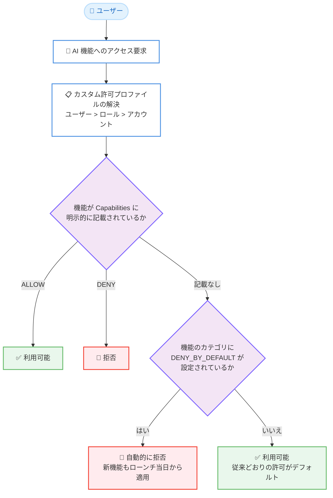

# Amazon Quick - カスタム許可の Deny by Default (デフォルト拒否)

**リリース日**: 2026 年 8 月 19 日
**サービス**: Amazon Quick
**機能**: Custom permissions - Deny by Default

📊 [このアップデートのインフォグラフィックを見る](https://takech9203.github.io/aws-news-summary/20260819-amazon-quick-deny-by-default.html)

## 概要

Amazon Quick のカスタム許可 (custom permissions) に、新しいガバナンス設定「Deny by Default (デフォルト拒否)」が追加されました。この設定を有効にすると、Amazon Quick が今後リリースする新しい AI 機能が、ユーザーに届く前に自動的に制限されます。管理者が各機能を評価し、明示的に許可した機能のみがユーザーに提供されます。

これまで、Amazon Quick の新しい AI 機能はリリースと同時にすべてのユーザーが利用可能になり、管理者はリリース後に事後対応として制限を設定する必要がありました。Deny by Default により、カスタム許可プロファイルで AI 機能カテゴリを制限し、そのプロファイルをユーザー、ロール、またはアカウント全体に割り当てることで、新しい AI 機能はローンチ当日から自動的に拒否されます。

金融サービスにおけるモデルリスク管理 (MRM) ポリシーや、ヘルスケアのコンプライアンス評価など、新機能の採用前に明示的な承認プロセスを必要とする規制産業の組織に特に有用なアップデートです。

**アップデート前の課題**

- 新しい AI 機能はリリースと同時にすべてのユーザーが利用可能になり、管理者は事後的に制限する必要があった
- リリースのたびに管理者が手動で各新機能を制限する対応が必要だった
- 規制環境では、管理者が評価する前に未承認の機能がユーザーに公開されるリスクがあった

**アップデート後の改善**

- 制限したカテゴリ内の新しい AI 機能は、ローンチ当日から管理者の操作なしで自動的に拒否される
- 管理者は各機能を評価し、準備ができた時点で明示的に許可するという承認ベースの運用が可能になった
- カテゴリを制限すると既存の機能も制限されるため、許可リスト方式による一貫したガバナンスを実現できる

## アーキテクチャ図



ユーザーが AI 機能にアクセスするたびに、Amazon Quick はプロファイルの明示的な設定とカテゴリの Deny by Default 設定を順に評価します。制限カテゴリに属し明示的に許可されていない機能は、将来の新機能を含めて自動的に拒否されます。

## サービスアップデートの詳細

### 主要機能

1. **カテゴリ単位の Deny by Default**
   - カスタム許可プロファイル内で機能カテゴリ (ローンチ時点では AI カテゴリ) を制限できる
   - 制限カテゴリ内の機能は、明示的に許可 (ALLOW) されていない限りすべて拒否される
   - 将来 Amazon Quick がそのカテゴリでリリースする新機能も、ローンチ当日から自動的に拒否される

2. **明示的な許可による段階的な開放**
   - 管理者は各機能を評価した後、プロファイルの Capabilities に ALLOW として追加することで個別に許可できる
   - カテゴリを制限すると既存の機能も制限されるため、ユーザーに必要な機能のみを許可リストに登録する運用となる

3. **プロファイルスコープと優先順位**
   - 制限は設定したプロファイルにのみ適用され、既存の他のカスタム許可プロファイルには継承されない
   - プロファイルはユーザー、ロール、アカウントの各レベルに割り当て可能で、ユーザー > ロール > アカウントの順に最も具体的なレベルが優先される

4. **コンソールと AWS CLI の両方に対応**
   - Amazon Quick の Manage account (アカウント管理) 画面の「Restrict capabilities」セクションのトグルで設定可能
   - AWS CLI では `--governance` パラメータの `DefaultCategoryEffects` フィールドで設定可能

## 技術仕様

### 主要な概念

| 項目 | 詳細 |
|------|------|
| カスタム許可プロファイル | 制限する機能を定義する名前付き設定オブジェクト。ユーザー、ロール、アカウントレベルで割り当て可能 |
| 機能カテゴリ | Deny by Default の制御単位となる機能のグループ。ローンチ時点では AI カテゴリをサポート |
| DefaultCategoryEffects | カテゴリごとの Deny by Default 動作を指定する API フィールド。省略時は従来どおり許可がデフォルト |
| DENY_BY_DEFAULT | カテゴリ内の現在および将来のすべての機能を、明示的に許可されたものを除いて拒否する設定値 |
| 優先順位 | ユーザー > ロール > アカウントの順で最初にマッチしたプロファイルが適用される |
| 競合解決 | あるレベルで拒否され別のレベルで明示的に許可されている場合、最も具体的なレベルの設定が優先される |

### サポートされるカテゴリ

| カテゴリ | 対象 |
|----------|------|
| AI | Amazon Quick のすべての AI / LLM 搭載機能。チャットエージェント、フロー、スペース、ナレッジベース、アプリの AI 推論、Q 分析、Quick デスクトップの AI 機能などを含む |

カテゴリシステムはタグでモデル化されており、1 つの機能が複数のカテゴリタグを持つ場合、複数のカテゴリで Deny by Default が有効な場合は最も制限の厳しい設定が適用されます。

### 機能の評価ルール

以下のルールが順に評価されます。

1. 機能が `DENY_BY_DEFAULT` の制限カテゴリに属し、Capabilities に記載されていない場合、拒否される
2. 機能が Capabilities に `ALLOW` として明示的に記載されている場合、その機能のみ許可される
3. 機能が Capabilities に `DENY` として明示的に記載されている場合、拒否される
4. 機能が記載されておらず制限カテゴリにも属さない場合、従来どおり許可される

評価はユーザーが機能にアクセスするたびに、その時点でのカテゴリ所属に基づいて行われます。このため、後から追加された新機能も制限カテゴリの対象となります。

### 必要な IAM 権限

Deny by Default の設定には、Quick 管理者として以下のような IAM 権限が必要です (API 操作は Amazon QuickSight の命名規則を使用し、権限文字列は `quicksight:` プレフィックスを使用します)。

- `quicksight:CreateCustomPermissions`
- `quicksight:UpdateCustomPermissions`
- `quicksight:DescribeCustomPermissions`
- `quicksight:ListCustomPermissions`
- `quicksight:UpdateAccountCustomPermission` / `UpdateRoleCustomPermission` / `UpdateUserCustomPermission` など

## 設定方法

### 前提条件

1. Quick 管理者権限と、上記の `quicksight:*CustomPermissions*` 系の IAM 権限を持っていること
2. Quick アカウントが IAM Identity Center、Active Directory、または Quick 管理ユーザーで構成されていること
3. 本番適用前に開発またはステージングアカウントで動作を検証すること (AWS 公式ドキュメントで推奨)

### 手順

#### ステップ1: コンソールで Deny by Default を有効化

1. Quick コンソールを開き、[Manage Quick] を選択
2. 左ナビゲーションで [Permissions] → [Custom permissions] を選択
3. [Create profile] で新規プロファイルを作成、または既存プロファイルを編集
4. [Restrict capabilities] セクションで制限したいカテゴリのトグル (例: Restrict AI capabilities) をオンにする
5. [Capabilities & features] セクションで、ユーザーに残したい機能を明示的に許可する
6. 右側のライブプレビューで設定内容を確認し、[Create] または [Update] で保存

#### ステップ2: AWS CLI でプロファイルを作成

```bash
aws quicksight create-custom-permissions \
  --aws-account-id AWSACCOUNTID \
  --custom-permissions-name "RestrictAI-Finance" \
  --capabilities '{"ChatAgent": "ALLOW"}' \
  --governance '{"DefaultCategoryEffects": {"AI": "DENY_BY_DEFAULT"}}'
```

AI カテゴリを `DENY_BY_DEFAULT` に設定し、`ChatAgent` のみを明示的に許可するカスタム許可プロファイルを作成します。これにより、`ChatAgent` 以外のすべての AI 機能 (将来の新機能を含む) が拒否されます。

#### ステップ3: プロファイルをアカウントレベルで割り当て

```bash
aws quicksight update-account-custom-permission \
  --aws-account-id AWSACCOUNTID \
  --custom-permissions-name "RestrictAI-Finance"
```

作成したプロファイルをアカウントレベルで割り当て、アカウント内のすべてのユーザーに適用します。ユーザーレベルやロールレベルの割り当ても可能で、より具体的なレベルが優先されます。

#### ステップ4: 新機能を評価後に個別許可

```bash
aws quicksight update-custom-permissions \
  --aws-account-id AWSACCOUNTID \
  --custom-permissions-name "RestrictAI-Finance" \
  --capabilities '{"ChatAgent": "ALLOW", "NewAIFeature": "ALLOW"}' \
  --governance '{"DefaultCategoryEffects": {"AI": "DENY_BY_DEFAULT"}}'
```

評価が完了した新機能を許可リストに追加します。`UpdateCustomPermissions` は完全置換で動作するため、既存の許可済み機能と `--governance` 設定をすべて含めて指定する必要があります。

## メリット

### ビジネス面

- **コンプライアンス対応の強化**: 新機能の採用前にレビューを義務付ける規制要件 (金融の MRM ポリシー、ヘルスケアのコンプライアンス評価など) に対応できる
- **事後対応から事前統制への転換**: リリースのたびに慌てて制限を設定する運用から、承認ベースの計画的なロールアウトに移行できる
- **統制されたロールアウト**: 新機能を段階的に導入するエンタープライズの変更管理プロセスと整合する

### 技術面

- **自動的な将来対応**: 制限カテゴリに属する新機能はローンチ当日から管理者の操作なしで自動的に拒否される
- **柔軟なスコープ制御**: プロファイル単位で設定でき、ユーザー / ロール / アカウントの優先順位により部門やロールごとに異なるポリシーを適用できる
- **許可リスト方式の明確さ**: 拒否リストの追いかけ更新ではなく、許可した機能のみが利用可能という明確なモデルで管理できる

## デメリット・制約事項

### 制限事項

- ローンチ時点でサポートされるカテゴリは AI カテゴリのみ
- カテゴリを制限すると、そのプロファイルで以前許可されていた機能を含む既存機能もすべて制限されるため、必要な機能を明示的に許可し直す必要がある
- 制限は設定したプロファイルにのみ適用され、既存の他のプロファイルには自動的に継承されない

### 考慮すべき点

- `UpdateCustomPermissions` は完全置換で動作するため、更新時に省略した機能や設定はプロファイルから削除される。更新前に `DescribeCustomPermissions` で現在の状態を確認することが重要
- ユーザーレベルで許可がデフォルトのプロファイルが割り当てられているユーザーには、アカウントレベルの Deny by Default プロファイルが適用されない (最も具体的なレベルが優先されるため)。割り当てレベルの設計に注意が必要
- 本番環境に適用する前に、開発またはステージングアカウントで動作検証を行うことが公式に推奨されている

## ユースケース

### ユースケース1: 金融機関のモデルリスク管理

**シナリオ**: モデルリスク管理 (MRM) ポリシーにより、AI 機能の採用前にリスク評価が必須の金融機関。評価済みの機能のみを利用者に提供したい。

**実装例**:
```bash
aws quicksight update-custom-permissions \
  --aws-account-id AWSACCOUNTID \
  --custom-permissions-name "RestrictAI-Finance" \
  --capabilities '{"Research": "ALLOW", "Topic": "ALLOW", "KnowledgeBase": "ALLOW", "Space": "ALLOW"}' \
  --governance '{"DefaultCategoryEffects": {"AI": "DENY_BY_DEFAULT"}}'
```

**効果**: 評価済みの 4 機能のみが利用可能になり、未評価の既存機能や将来リリースされる AI 機能はすべて自動的に拒否される。MRM プロセスを経た機能だけを段階的に開放できる。

### ユースケース2: 新規アカウントの初期ロックダウン

**シナリオ**: 新しく Amazon Quick アカウントをオンボーディングする組織。チームが各機能を個別に評価するまで、すべての AI 機能を制限したい。

**実装例**:
```bash
aws quicksight create-custom-permissions \
  --aws-account-id AWSACCOUNTID \
  --custom-permissions-name "DenyAllAI-NewAccount" \
  --governance '{"DefaultCategoryEffects": {"AI": "DENY_BY_DEFAULT"}}'

aws quicksight update-account-custom-permission \
  --aws-account-id AWSACCOUNTID \
  --custom-permissions-name "DenyAllAI-NewAccount"
```

**効果**: アカウント内の全ユーザーに対してすべての AI 機能が拒否された状態で運用を開始できる。評価と承認が完了した機能から順次、許可リストに追加して開放できる。

### ユースケース3: ロール別の段階的な権限設計

**シナリオ**: 一般ユーザーは AI 機能を厳しく制限しつつ、Author ロールにはより多くの機能を許可し、特定のデータサイエンティストには全 AI 機能へのアクセスを許可したい。

**実装例**:
```bash
# アカウントレベル: すべての AI を拒否
aws quicksight create-custom-permissions \
  --aws-account-id AWSACCOUNTID \
  --custom-permissions-name "Account-DenyAllAI" \
  --governance '{"DefaultCategoryEffects": {"AI": "DENY_BY_DEFAULT"}}'

aws quicksight update-account-custom-permission \
  --aws-account-id AWSACCOUNTID \
  --custom-permissions-name "Account-DenyAllAI"

# ロールレベルやユーザーレベルには、許可を追加した別プロファイルを割り当てる
```

**効果**: ユーザー > ロール > アカウントの優先順位を利用して、組織階層に応じた多層的な AI ガバナンスを構築できる。

## 料金

Deny by Default は Amazon Quick のカスタム許可機能の一部として提供されるガバナンス設定であり、公式発表においてこの機能自体に対する追加料金の記載はありません。Amazon Quick の利用料金については料金ページを参照してください。

## 利用可能リージョン

Amazon Quick が利用可能なすべての AWS リージョンで利用できます。

## 関連サービス・機能

- **Amazon Quick (旧 Amazon QuickSight)**: 本機能の対象サービス。API 操作と権限文字列は `quicksight:` プレフィックスの QuickSight 命名規則を使用する
- **AWS IAM Identity Center / Active Directory**: Quick アカウントのアイデンティティ構成として利用可能。Deny by Default の前提条件のひとつ
- **AWS IAM**: カスタム許可プロファイルの作成・更新・割り当てに必要な `quicksight:*CustomPermissions*` 権限を管理

## 参考リンク

- 📊 [インフォグラフィック](https://takech9203.github.io/aws-news-summary/20260819-amazon-quick-deny-by-default.html)
- [公式発表 (What's New)](https://aws.amazon.com/about-aws/whats-new/2026/08/amazon-quick-deny-by-default/)
- [ドキュメント: Custom permissions - Deny by Default](https://docs.aws.amazon.com/quick/latest/userguide/custom-permissions-governance.html)
- [ドキュメント: Amazon Quick の利用可能リージョン](https://docs.aws.amazon.com/quick/latest/userguide/regions.html)

## まとめ

Amazon Quick の Deny by Default は、新しい AI 機能がユーザーに届く前に自動的に制限し、管理者の明示的な承認を経て開放するという事前統制型のガバナンスを実現するアップデートです。規制産業や統制されたロールアウトを必要とする組織は、まず開発環境でプロファイルの動作を検証したうえで、AI カテゴリの制限と許可リストの設計を進めることを推奨します。特に `UpdateCustomPermissions` が完全置換で動作する点と、ユーザー / ロール / アカウントの優先順位には注意が必要です。
