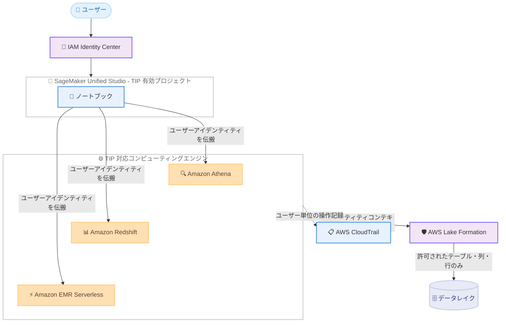

# Amazon SageMaker - ノートブックの Trusted Identity Propagation 対応

**リリース日**: 2026 年 8 月 19 日
**サービス**: Amazon SageMaker (SageMaker Unified Studio)
**機能**: SageMaker ノートブックにおける Trusted Identity Propagation (TIP) サポート

📊 [このアップデートのインフォグラフィックを見る](https://takech9203.github.io/aws-news-summary/20260819-amazon-sagemaker.html)

## 概要

Amazon SageMaker のノートブックが、Amazon Athena、Amazon Redshift、Amazon EMR Serverless との組み合わせで Trusted Identity Propagation (TIP) をサポートしました。TIP は AWS IAM Identity Center の機能で、ユーザーの識別情報 (アイデンティティコンテキスト) を IAM ロールに付加し、AWS サービス間で伝搬させる仕組みです。

今回のアップデートにより、TIP が有効なプロジェクト内のノートブックから TIP 対応のコンピューティングエンジンに接続すると、各ユーザーの IAM Identity Center アイデンティティが AWS Lake Formation まで伝搬されます。その結果、ユーザーは自身の権限で許可されたテーブル、列、行のみを参照でき、共有の広範な実行ロールを使用する必要がなくなります。追加のログイン、トークン管理、ロール管理は不要で、既存のコンピューティング接続を通じてアイデンティティが自動的に伝搬されます。

データ分析基盤で行レベル・列レベルのきめ細かなアクセス制御と監査証跡を求める組織、特に複数ユーザーが同一プロジェクトでノートブックを共有して分析を行うチームにとって重要なアップデートです。

**アップデート前の課題**

- ノートブックからのデータアクセスはプロジェクトの共有実行ロールで行われるため、同一プロジェクトのユーザー全員が同じデータアクセス権限を持っていた
- ユーザー単位でテーブル、列、行レベルのアクセス制御を適用することができなかった
- CloudTrail のログにはロール単位のアクセスしか記録されず、「どのユーザーが」データにアクセスしたかの監査証跡の把握が困難だった

**アップデート後の改善**

- ノートブックから Athena、Redshift、EMR Serverless に接続する際、ユーザーごとの IAM Identity Center アイデンティティに基づく Lake Formation のアクセス制御が適用されるようになった
- ユーザーは自身の権限で許可されたテーブル、列、行のみを参照でき、ユーザー単位のデータ境界を実現できるようになった
- CloudTrail に実際にアクセスしたユーザーが記録され、完全な監査帰属 (audit attribution) が可能になった
- 追加のログイン、トークン、ロール管理が不要で、管理者の運用負荷が軽減された

## アーキテクチャ図



ノートブックから各エンジンへの接続時に IAM Identity Center のユーザーアイデンティティが伝搬され、Lake Formation がユーザー単位できめ細かなアクセス制御を適用します。CloudTrail にはユーザー単位の操作が記録されます。

## サービスアップデートの詳細

### 主要機能

1. **ユーザー単位のデータアクセス制御**
   - TIP が有効なプロジェクト内のノートブックから TIP 対応エンジンに接続すると、クエリを実行したユーザー個人の IAM Identity Center アイデンティティが Lake Formation まで伝搬される
   - Lake Formation の権限設定に基づき、ユーザーごとに許可されたテーブル、列、行のみが参照可能
   - 共有の広範な実行ロールに依存しないデータ境界を実現

2. **完全な監査帰属**
   - CloudTrail に「どのユーザーが」データにアクセスしたかが記録される
   - ロール単位ではなくユーザー単位の監査証跡により、コンプライアンス要件への対応が容易になる

3. **運用負荷の軽減**
   - アイデンティティは既存のコンピューティング接続を通じて自動的に伝搬される
   - 追加のログイン、トークン管理、ロール管理は不要

## 技術仕様

### ノートブックからの TIP 対応状況

| コンピューティングエンジン | ノートブックからの TIP | 用途 |
|------|------|------|
| Amazon Athena | 対応 | SQL 分析 |
| Amazon Redshift | 対応 | SQL 分析 |
| Amazon EMR Serverless | 対応 | インタラクティブ Spark セッション |
| AWS Glue | 非対応 (互換性権限モードを使用) | - |
| Amazon EMR on EC2 | 非対応 (互換性権限モードを使用) | - |

### TIP の有効化に関する仕様

| 項目 | 詳細 |
|------|------|
| ドメイン要件 | 2025 年 9 月 30 日以降に作成された SageMaker unified domain は標準で TIP をサポート。それ以前のドメインは詳細ページの更新通知バナーから更新が必要 |
| プロジェクト設定 | プロジェクトプロファイルの Tooling ブループリントで `enableTrustedIdentityPropagationPermissions` パラメータを `True` に設定 |
| アイデンティティソース | IAM Identity Center |
| 権限管理 | AWS Lake Formation |
| 監査 | AWS CloudTrail (ユーザー単位の記録) |

## 設定方法

### 前提条件

1. IAM Identity Center が設定済みで、ユーザーが IAM Identity Center 経由で SageMaker Unified Studio にサインインしていること
2. SageMaker unified domain が TIP をサポートしていること (2025 年 9 月 30 日以降に作成、または既存ドメインを更新済み)
3. Lake Formation でユーザーまたはグループに対するテーブル、列、行レベルの権限が設定されていること

### 手順

#### ステップ1: ドメインの TIP サポートを確認・更新

SageMaker マネジメントコンソール (https://console.aws.amazon.com/datazone) で対象ドメインの詳細ページを開きます。2025 年 9 月 30 日より前に作成されたドメインの場合は、更新通知バナーの [Update now] を選択してドメインを更新します。

#### ステップ2: プロジェクトプロファイルで TIP を有効化

1. ドメインの [Project profiles] タブから対象のプロジェクトプロファイルを選択し、[Edit] を選択
2. [Tooling blueprint parameters] セクションで `enableTrustedIdentityPropagationPermissions` パラメータを選択し、[Edit] を選択
3. パラメータ値を `True` に設定して保存

TIP によるデータ認可を強制したい場合は、[Editable value] の [Editable] チェックボックスを外してパラメータを編集不可にすることも可能です。TIP 対応ツール専用のプロジェクトプロファイルを作成することが推奨されています。

#### ステップ3: ノートブックから TIP 対応エンジンに接続して実行

TIP が有効なプロジェクト内でノートブックを開き、Athena、Redshift、または EMR Serverless に接続してクエリや Spark セッションを実行します。ユーザーのアイデンティティが自動的に伝搬され、Lake Formation の権限に基づいた結果のみが返されます。追加の認証操作は不要です。

## メリット

### ビジネス面

- **コンプライアンス対応の強化**: ユーザー単位の監査証跡により、金融・医療など規制業界の監査要件に対応しやすくなる
- **データガバナンスの向上**: 同一プロジェクト内でも職務に応じたデータアクセス境界を維持でき、最小権限の原則を実現できる
- **コラボレーションの促進**: データアクセス権限の異なるメンバーが安心して同一プロジェクトを共有できる

### 技術面

- **ロール管理の簡素化**: ユーザーごとに実行ロールを分ける複雑な設計が不要になり、Lake Formation の権限設定に一元化できる
- **透過的なアイデンティティ伝搬**: 追加のログイン、トークン、ロール管理なしで、既存の接続を通じて自動的に伝搬される
- **一貫したアクセス制御**: SQL 分析 (Athena、Redshift) とインタラクティブ Spark (EMR Serverless) で同じユーザー単位の制御を適用できる

## デメリット・制約事項

### 制限事項

- ノートブックからの TIP は Amazon Athena、Amazon Redshift、Amazon EMR Serverless のみ対応。AWS Glue と Amazon EMR on EC2 はノートブックからの TIP に非対応で、互換性権限モード (compatibility permission mode) が使用される
- 現行リリースの SageMaker unified domain における TIP は、SQL 分析、インタラクティブ Spark セッション、エンドツーエンドの機械学習ライフサイクルタスクに限定される
- TIP を利用するには IAM Identity Center によるアイデンティティ管理が前提となる

### 考慮すべき点

- 2025 年 9 月 30 日より前に作成された既存ドメインでは、ドメインの更新作業が必要
- `enableTrustedIdentityPropagationPermissions` はプロジェクトプロファイル単位の設定のため、TIP 対応ツール専用のプロファイルを作成して運用を明確化することが推奨されている
- 共有実行ロールベースの運用から移行する場合、Lake Formation でのユーザー・グループ単位の権限設計を事前に整備する必要がある

## ユースケース

### ユースケース1: 部門横断データ分析プロジェクトでの行レベルアクセス制御

**シナリオ**: 営業、マーケティング、財務の各部門メンバーが同一の SageMaker Unified Studio プロジェクトでノートブックを共有し、全社データレイクを分析する。ただし、各部門は自部門に関連する行・列のみ参照可能にしたい。

**実装例**:
```
1. Lake Formation で部門ごとの IAM Identity Center グループに
   行フィルタ・列フィルタ付きの権限を付与
2. プロジェクトプロファイルで
   enableTrustedIdentityPropagationPermissions = True を設定
3. 各ユーザーがノートブックから Athena でクエリを実行
```

**効果**: 単一プロジェクト・単一ノートブック環境を共有しながら、各ユーザーには自部門のデータのみが表示され、データ境界を維持できる。

### ユースケース2: 規制業界における監査証跡の確保

**シナリオ**: 金融機関のデータサイエンスチームが顧客データを Redshift で分析する。監査要件として「誰がいつどのデータにアクセスしたか」をユーザー単位で記録する必要がある。

**実装例**:
```
1. TIP 有効プロジェクトのノートブックから Redshift に接続
2. ユーザーごとの IAM Identity Center アイデンティティで
   クエリが実行される
3. CloudTrail のログをユーザー単位で分析・保管
```

**効果**: 共有ロールでは不可能だったユーザー単位の完全な監査帰属が実現し、監査対応の工数を削減できる。

### ユースケース3: EMR Serverless によるインタラクティブ Spark 分析の権限統制

**シナリオ**: データエンジニアリングチームがノートブックから EMR Serverless のインタラクティブ Spark セッションで大規模データを処理する。機密度の高いテーブルへのアクセスは特定メンバーに限定したい。

**実装例**:
```
1. Lake Formation で機密テーブルへのアクセスを
   特定の IAM Identity Center ユーザーのみに許可
2. ノートブックから EMR Serverless の Spark セッションを起動
3. 各ユーザーの権限に基づいて Spark からのデータ読み取りが制御される
```

**効果**: Spark ワークロードでもユーザー単位のきめ細かなアクセス制御が適用され、権限外のデータ読み取りを防止できる。

## 料金

Trusted Identity Propagation 自体に追加料金は発生しません。ノートブックの実行環境、および接続先の Amazon Athena、Amazon Redshift、Amazon EMR Serverless の利用に応じた各サービスの標準料金が適用されます。

## 利用可能リージョン

Amazon SageMaker Unified Studio が利用可能なすべての AWS リージョンで利用できます。最新のリージョン一覧は [Supported Regions](https://docs.aws.amazon.com/sagemaker-unified-studio/latest/adminguide/supported-regions.html) を参照してください。

## 関連サービス・機能

- **AWS IAM Identity Center**: TIP の基盤となるアイデンティティソース。ユーザー・グループの管理とアイデンティティコンテキストの発行を担う
- **AWS Lake Formation**: 伝搬されたユーザーアイデンティティに基づき、テーブル・列・行レベルのきめ細かなアクセス制御を実施する
- **Amazon Athena / Amazon Redshift / Amazon EMR Serverless**: ノートブックからの TIP に対応した分析エンジン
- **AWS CloudTrail**: ユーザー単位のデータアクセスを記録し、監査証跡を提供する

## 参考リンク

- 📊 [インフォグラフィック](https://takech9203.github.io/aws-news-summary/20260819-amazon-sagemaker.html)
- [公式発表 (What's New)](https://aws.amazon.com/about-aws/whats-new/2026/08/amazon-sagemaker/)
- [Trusted identity propagation - SageMaker Unified Studio 管理者ガイド](https://docs.aws.amazon.com/sagemaker-unified-studio/latest/adminguide/trusted-identity-propagation.html)
- [Notebooks - SageMaker Unified Studio ユーザーガイド](https://docs.aws.amazon.com/sagemaker-unified-studio/latest/userguide/notebooks.html)
- [Supported Regions - SageMaker Unified Studio 管理者ガイド](https://docs.aws.amazon.com/sagemaker-unified-studio/latest/adminguide/supported-regions.html)

## まとめ

SageMaker ノートブックの TIP 対応により、共有実行ロールに依存せず、ユーザー単位のきめ細かなデータアクセス制御と完全な監査帰属が実現しました。複数ユーザーでプロジェクトを共有する分析チームや規制業界のデータ基盤では、ドメインの TIP 対応状況を確認のうえ、プロジェクトプロファイルでの有効化と Lake Formation の権限設計を検討することを推奨します。
