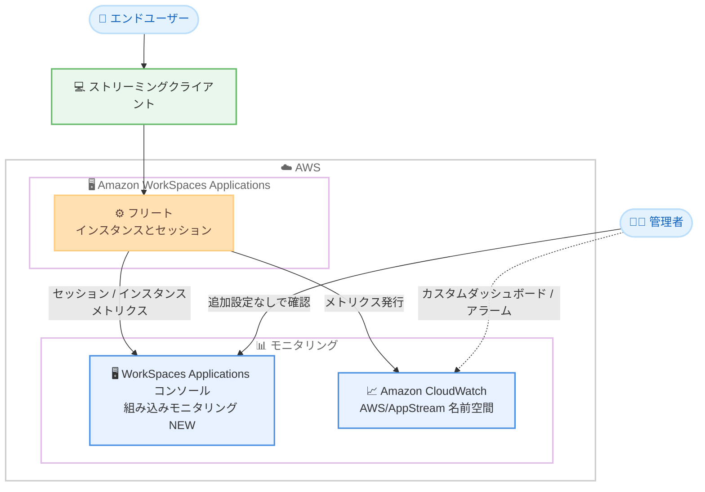

# Amazon WorkSpaces Applications - コンソール内モニタリング機能

**リリース日**: 2026 年 8 月 19 日
**サービス**: Amazon WorkSpaces Applications (旧 Amazon AppStream 2.0)
**機能**: コンソール内モニタリング (In-console Monitoring)

📊 [このアップデートのインフォグラフィックを見る](https://takech9203.github.io/aws-news-summary/20260819-amazon-workspaces-applications-console-monitoring.html)

## 概要

Amazon WorkSpaces Applications (旧 Amazon AppStream 2.0) に、サービスコンソールに組み込まれたモニタリング機能が追加されました。管理者は WorkSpaces Applications コンソール上で、リアルタイムのセッションレベルメトリクス、インスタンスレベルのリソースデータ、ネットワークパフォーマンスメトリクスを直接確認できるようになります。

これまでフリートやセッションの詳細なパフォーマンス分析には、CloudWatch のカスタムダッシュボード構築やサードパーティー製ツールの導入が必要でした。今回のアップデートにより、追加設定なし (ゼロコンフィグレーション) でフリートのキャパシティ状況やユーザーセッションのストリーミング品質を可視化でき、エンドユーザーからのパフォーマンス問い合わせに対するトラブルシューティングが大幅に効率化されます。

対象ユーザーは、アプリケーションストリーミング環境を運用する IT 管理者、VDI / EUC 環境の運用チーム、ヘルプデスク担当者です。なお、同じメトリクスは引き続き Amazon CloudWatch でも利用できるため、既存のダッシュボードやアラームとの併用も可能です。

**アップデート前の課題**

- フリートやセッションの詳細なモニタリングには、CloudWatch のカスタムダッシュボードを自作するか、サードパーティー製の監視ソリューションを導入する必要があった
- セッションレベルの分析には CloudWatch のメトリクス、ディメンション、クエリに関する深い知識が必要だった
- ユーザーからの「動作が遅い」といった問い合わせに対し、フレームレート・レイテンシー・リソース使用率を横断的に確認する手段がコンソール内になく、原因切り分けに時間がかかった

**アップデート後の改善**

- WorkSpaces Applications コンソール内で、追加設定なしにフリートおよびセッションのメトリクスを確認できるようになった
- フリートレベルでアクティブセッション数とリソース使用率を一覧でき、キャパシティ状況を即座に把握できるようになった
- ユーザー ID、パフォーマンスメトリクス、インスタンス ID でフィルタリング可能なセッションテーブルにより、特定ユーザーのセッションを素早く特定できるようになった
- フレームレート、入力レイテンシー、帯域幅、CPU / メモリ / GPU 使用率などのメトリクスを共通のタイムライン上で相関表示し、パフォーマンス問題の原因を視覚的に分析できるようになった

## アーキテクチャ図



フリートのインスタンスとセッションのメトリクスが WorkSpaces Applications コンソールに直接表示され、管理者は追加設定なしで確認できます。同じメトリクスは CloudWatch にも発行されるため、既存の監視基盤との併用が可能です。

## サービスアップデートの詳細

### 主要機能

1. **ゼロコンフィグレーションのモニタリング体験**
   - サービスコンソールに組み込まれており、事前のダッシュボード構築や設定作業が不要
   - CloudWatch のメトリクスやクエリに関する専門知識がなくても利用可能
   - サードパーティー製監視ツールの導入なしでセッション分析を開始できる

2. **フリートレベルのキャパシティ可視化**
   - フリートの詳細画面で、アクティブセッション数とリソース使用率を一覧表示
   - フリート全体の利用状況を「Sessions on fleet」で確認可能
   - キャパシティの逼迫やスケーリング要否の判断材料として活用できる

3. **カスタマイズ可能なセッションテーブル**
   - 「Instances with sessions」でアクティブセッションの一覧を表示
   - ユーザー ID、パフォーマンスメトリクス、インスタンス ID でソート・フィルタリングが可能
   - 問い合わせのあった特定ユーザーのセッションを素早く特定できる

4. **相関表示によるグラフィカルビュー**
   - フレームレート、入力レイテンシー、帯域幅、CPU / メモリ / GPU 使用率を共通のタイムラインで表示
   - 複数メトリクスの時間軸をそろえて比較することで、パフォーマンス低下の原因 (ネットワーク起因かリソース起因か) を切り分けやすくなる

5. **CloudWatch との併用**
   - 同じメトリクスは引き続き Amazon CloudWatch (`AWS/AppStream` 名前空間) で利用可能
   - 既存のカスタムダッシュボード、アラーム、自動ダッシュボードとの使い分けができる

## 技術仕様

### 主なインスタンス / セッションパフォーマンスメトリクス

| カテゴリ | メトリクス例 | 単位 |
|------|------|------|
| インスタンスリソース | `CpuUtilizationInstance`, `MemoryUtilizationInstance`, `GpuUtilizationInstance`, `DiskUtilizationInstance`, `PagingFileUtilizationInstance` | Percent |
| インスタンス負荷 | `CpuQueueLength`, `DiskIoQueueLength`, `MemoryPageHardFaults`, `DiskReadOperations`, `DiskWriteOperations` | Count, Count/Second |
| セッションリソース | `CpuUtilizationSession`, `MemoryUtilizationSession` | Percent |
| ストリーミング品質 | `FramesPerSecond`, `InSessionLatency`, `Bandwidth`, `BandwidthInbound` | Count, Milliseconds, Kilobits/Second |
| ネットワーク品質 | `UDPPacketLossRate`, `TCPRetransmissionRate`, `CongestionWindow`, `ConnectionDuration` | Percent, Bytes, Seconds |

### メトリクス収集の仕様

| 項目 | 詳細 |
|------|------|
| 収集間隔 | 5 分間隔 (新規セッションは開始から 5 分以内に最初のデータポイントが出現) |
| CloudWatch 名前空間 | `AWS/AppStream` (Fleet Instance Metrics / Fleet Session Metrics) |
| ディメンション | Fleet、UserId、FleetName + InstanceId、FleetName + InstanceId + SessionId + UserId など |
| 対応フリートタイプ | シングルセッションおよびマルチセッションフリート |
| OS 対応 | Windows Server は全メトリクス対応。その他の OS はネットワーク系メトリクス (`UDPPacketLossRate`, `TCPRetransmissionRate`, `BandwidthInbound`, `CongestionWindow`, `ConnectionDuration` など) のみ |

### バージョン要件 (全メトリクスを利用する場合)

| コンポーネント | 要件 |
|------|------|
| バンドルベースイメージ (Windows) | LATEST バンドルまたは 2025-02-07 以降のバージョン |
| マネージドイメージ更新 (Windows) | 2025-02-07 以降 |
| マネージドイメージ更新 (RHEL / Rocky Linux) | 2025-09-05 以降 |
| Windows ネイティブクライアント | 1.2.1581 以降 |
| Mac ネイティブクライアント | 1.2.0 以降 |
| Web クライアント | 常に最新版が自動配信されるため対応不要 |

## 設定方法

### 前提条件

1. Amazon WorkSpaces Applications のフリートが作成済みであること
2. コンソールへアクセスできる IAM 権限があること
3. 全メトリクスを取得するには、イメージおよびクライアントが上記バージョン要件を満たしていること

### 手順

#### ステップ 1: コンソールでフリートを開く

[WorkSpaces Applications コンソール](https://console.aws.amazon.com/appstream2/home) を開き、左側のナビゲーションペインで **Fleets** を選択します。対象のフリートを選択し、**View Details** を選択します。

追加の設定作業は不要で、組み込みのモニタリングビューがそのまま表示されます。

#### ステップ 2: フリート使用状況とアクティブセッションを確認する

**Sessions on fleet** でフリートの利用状況 (アクティブセッション数、リソース使用率) を確認し、**Instances with sessions** でアクティブセッションの一覧を表示します。テーブルはユーザー ID、パフォーマンスメトリクス、インスタンス ID でソート・フィルタリングできます。

#### ステップ 3: セッションを選択してメトリクスを分析する

一覧から特定のセッションを選択すると、フレームレート、レイテンシー、帯域幅、CPU / メモリ / GPU 使用率などのメトリクスが共通タイムラインのグラフで表示されます。時間軸をそろえた相関表示により、パフォーマンス低下の発生時刻と原因メトリクスを特定します。

#### ステップ 4: (任意) CloudWatch で同じメトリクスを利用する

```bash
# 例: 特定フリートのセッションレイテンシーを CloudWatch CLI で取得
aws cloudwatch get-metric-statistics \
  --namespace AWS/AppStream \
  --metric-name InSessionLatency \
  --dimensions Name=Fleet,Value=my-fleet \
  --start-time 2026-08-19T00:00:00Z \
  --end-time 2026-08-19T23:59:59Z \
  --period 300 \
  --statistics Average Maximum
```

このコマンドは、`AWS/AppStream` 名前空間からフリート `my-fleet` のセッションレイテンシー (往復時間) を 5 分間隔で取得します。既存の CloudWatch ダッシュボードやアラームと組み合わせる場合に利用します。

## メリット

### ビジネス面

- **運用コストの削減**: サードパーティー製監視ツールやカスタムダッシュボード構築・保守の工数が不要になり、監視基盤の TCO を削減できる
- **ヘルプデスク対応の迅速化**: ユーザーからのパフォーマンス問い合わせに対し、コンソールで即座にセッション状況を確認でき、解決までの時間を短縮できる
- **エンドユーザー体験の向上**: ストリーミング品質の問題を早期に検知・対処することで、業務アプリケーション利用者の満足度を維持できる

### 技術面

- **ゼロコンフィグレーション**: CloudWatch の専門知識やダッシュボード構築なしで、すぐに詳細なモニタリングを開始できる
- **相関分析による原因切り分け**: フレームレート、レイテンシー、リソース使用率を共通タイムラインで比較でき、ネットワーク起因かインスタンスリソース起因かを視覚的に判断できる
- **CloudWatch との一貫性**: 同一メトリクスが CloudWatch にも発行されるため、アラームや長期分析など既存の監視ワークフローと矛盾なく併用できる

## デメリット・制約事項

### 制限事項

- メトリクスの収集間隔は 5 分であり、秒単位のリアルタイム分析には向かない
- 全メトリクスが利用できるのは Windows Server ベースのフリートのみで、その他の OS ではネットワーク系メトリクスに限定される
- イメージやクライアントのバージョンが要件 (Windows イメージ 2025-02-07 以降、RHEL / Rocky Linux 2025-09-05 以降など) を満たさない場合、一部メトリクスが報告されない

### 考慮すべき点

- コンソールビューは主にアクティブセッションの確認・分析向けであり、長期トレンド分析やアラート通知には引き続き CloudWatch の利用が推奨される
- 全メトリクスを活用するには、イメージと接続クライアントを最新バージョンへ更新する運用が必要
- Elastic フリートで利用できる CloudWatch メトリクスは限定的 (`InUseCapacity`, `InsufficientCapacityError`) である点に注意が必要

## ユースケース

### ユースケース 1: ヘルプデスクでのパフォーマンス問い合わせ対応

**シナリオ**: エンドユーザーから「CAD アプリケーションの画面がカクつく」という問い合わせを受けたヘルプデスク担当者が、原因を切り分ける。

**実装例**:
```
1. コンソールで Fleets → 対象フリート → View Details を開く
2. Instances with sessions テーブルをユーザー ID でフィルタリング
3. 該当セッションを選択し、FramesPerSecond / InSessionLatency /
   GpuUtilizationInstance を共通タイムラインで比較
```

**効果**: フレームレート低下のタイミングと GPU 使用率やレイテンシーの推移を突き合わせることで、ネットワーク起因かインスタンススペック不足かを数分で判断できる。

### ユースケース 2: フリートキャパシティの日次確認

**シナリオ**: VDI 運用チームが、業務開始時間帯のフリート利用状況を毎朝確認し、スケーリング設定の妥当性を検証する。

**実装例**:
```
1. コンソールで対象フリートの Sessions on fleet を確認
2. アクティブセッション数とリソース使用率を把握
3. 使用率が継続的に高い場合はスケーリングポリシーや
   インスタンスタイプの見直しを実施
```

**効果**: カスタムダッシュボードを構築せずにキャパシティ状況を日常的に把握でき、セッション不足によるユーザー接続失敗を未然に防止できる。

### ユースケース 3: マルチセッションフリートのリソース競合分析

**シナリオ**: マルチセッションフリートで特定インスタンス上のユーザーだけ動作が遅いという報告があり、セッション間のリソース競合を調査する。

**実装例**:
```
1. Instances with sessions をインスタンス ID でフィルタリング
2. 同一インスタンス上の各セッションの CpuUtilizationSession /
   MemoryUtilizationSession を比較
3. リソースを大量消費しているセッションを特定し、
   セッション上限やインスタンスタイプを調整
```

**効果**: インスタンスレベルとセッションレベルのメトリクスを組み合わせて「ノイジーネイバー」となっているセッションを特定し、マルチセッション設定を最適化できる。

## 料金

今回のコンソール内モニタリング機能自体に関する追加料金の記載はありません。WorkSpaces Applications の利用料金 (インスタンス使用料、ユーザー料金など) は従来どおり適用されます。CloudWatch でカスタムダッシュボードやアラームを併用する場合は、CloudWatch の料金体系が適用されます。

## 利用可能リージョン

Amazon WorkSpaces Applications が提供されているすべての AWS リージョンで利用可能です。詳細は [AWS リージョン別サービス一覧](https://aws.amazon.com/about-aws/global-infrastructure/regional-product-services/) を参照してください。

## 関連サービス・機能

- **Amazon CloudWatch**: 同一メトリクスが `AWS/AppStream` 名前空間に発行され、アラーム設定や長期分析、自動ダッシュボードに利用できる
- **Amazon WorkSpaces**: フルデスクトップ型の VDI サービス。アプリケーション単位のストリーミングには WorkSpaces Applications を使用する
- **AWS CloudFormation**: カスタム CloudWatch ダッシュボードをテンプレートで構築する方法も引き続き提供されている

## 参考リンク

- 📊 [インフォグラフィック](https://takech9203.github.io/aws-news-summary/20260819-amazon-workspaces-applications-console-monitoring.html)
- [公式発表 (What's New)](https://aws.amazon.com/about-aws/whats-new/2026/08/amazon-workspaces-applications-console-monitoring)
- [ドキュメント: Monitoring Amazon WorkSpaces Applications Resources](https://docs.aws.amazon.com/appstream2/latest/developerguide/monitoring.html)
- [ドキュメント: Viewing instance and session metrics using the console](https://docs.aws.amazon.com/appstream2/latest/developerguide/monitoring-instance-session-performance.html)
- [ドキュメント: Instance and Session Performance Metrics](https://docs.aws.amazon.com/appstream2/latest/developerguide/instance-session-metrics-single-session-multi-session.html)

## まとめ

Amazon WorkSpaces Applications のモニタリングがコンソールに組み込まれたことで、CloudWatch の専門知識やサードパーティーツールなしにセッションレベルのパフォーマンス分析が可能になりました。アプリケーションストリーミング環境を運用しているチームは、まず対象フリートの詳細画面で新しいモニタリングビューを確認し、全メトリクスを活用するためにイメージとクライアントのバージョン要件を満たしているかを点検することを推奨します。
